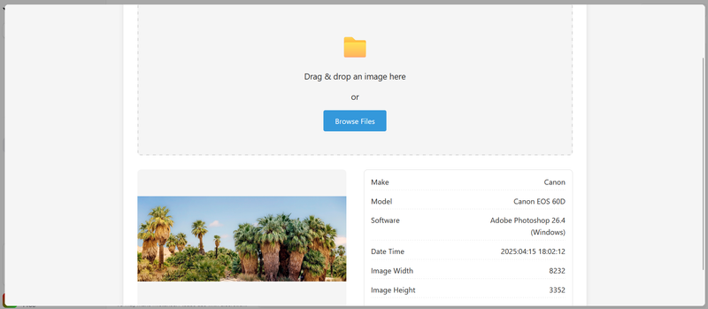

Reading EXIF metadata directly from image files in the browser is a powerful feature — whether you're building a photo uploader, a metadata inspector, or a tool to strip sensitive data before sharing. In this tutorial, you'll build a native JavaScript EXIF parser using no external libraries and organize your code cleanly into **HTML, CSS, and JS files**.

## ✅ What You’ll Learn

- How to structure your project using separate files
- How to parse EXIF metadata from JPEG files
- How to use `FileReader`, `ArrayBuffer`, and `DataView`
- How to extract fields like Camera Model, Date Taken, and Orientation

## 📁 Step 1: Create the Project Structure

Start by creating a new folder, e.g., `js-exif-parser`, and inside it, create the following files:

```bash
js-exif-parser/
├── index.html
├── style.css
└── script.js
```

## 📄 Step 2: Write the HTML (`index.html`)

This file provides the structure: a file input and a placeholder to show the EXIF results.

```html
<!doctype html>
<html lang="en">
  <head>
    <meta charset="UTF-8" />
    <meta name="viewport" content="width=device-width, initial-scale=1.0" />
    <title>EXIF Data Viewer</title>
    <link rel="stylesheet" href="style.css" />
  </head>
  <body>
    <div class="container">
      <h1>EXIF Data Viewer</h1>

      <div class="drop-area" id="dropArea">
        <div class="icon">📁</div>
        <p>Drag & drop an image here</p>
        <p>or</p>
        <div class="file-input-wrapper">
          <span class="browse-button">Browse Files</span>
          <input
            type="file"
            class="file-input"
            id="imageInput"
            accept="image/*"
          />
        </div>
      </div>

      <div class="image-preview hidden" id="imagePreview">
        <div class="preview-container" id="previewContainer">
          <!-- Image preview will be shown here -->
        </div>
        <div class="exif-data hidden" id="exifDataDisplay">
          <!-- EXIF data will be displayed here -->
        </div>
      </div>
    </div>

    <!-- Loader -->
    <div class="loader-container" id="loaderContainer">
      <div class="loader"></div>
      <div class="loader-text">Processing EXIF data...</div>
    </div>

    <script src="script.js"></script>
  </body>
</html>
```

This HTML file sets up a user interface to upload or drag-and-drop an image, preview it, and then display its EXIF metadata using a separate JavaScript file (`script.js`).

## 🎨 Step 3: Add Styling (`style.css`)

```css
:root {
  --primary-color: #3498db;
  --secondary-color: #2980b9;
  --success-color: #2ecc71;
  --danger-color: #e74c3c;
  --text-color: #333;
  --light-bg: #f5f5f5;
  --border-color: #ddd;
}

* {
  box-sizing: border-box;
  margin: 0;
  padding: 0;
}

body {
  font-family: 'Segoe UI', Tahoma, Geneva, Verdana, sans-serif;
  line-height: 1.6;
  color: var(--text-color);
  background-color: var(--light-bg);
  padding: 20px;
}

.container {
  max-width: 1000px;
  margin: 0 auto;
  background-color: white;
  padding: 30px;
  border-radius: 8px;
  box-shadow: 0 2px 10px rgba(0, 0, 0, 0.1);
}

h1 {
  text-align: center;
  margin-bottom: 30px;
  color: var(--primary-color);
}

.drop-area {
  border: 3px dashed var(--border-color);
  border-radius: 8px;
  padding: 50px 20px;
  text-align: center;
  margin-bottom: 30px;
  background-color: var(--light-bg);
  transition: all 0.3s ease;
  cursor: pointer;
}

.drop-area.drag-over {
  border-color: var(--primary-color);
  background-color: rgba(52, 152, 219, 0.1);
}

.drop-area p {
  font-size: 18px;
  margin-bottom: 15px;
}

.drop-area .icon {
  font-size: 48px;
  color: var(--primary-color);
  margin-bottom: 15px;
}

.file-input-wrapper {
  position: relative;
  display: inline-block;
}

.file-input {
  position: absolute;
  left: 0;
  top: 0;
  opacity: 0;
  width: 100%;
  height: 100%;
  cursor: pointer;
}

.browse-button {
  display: inline-block;
  background-color: var(--primary-color);
  color: white;
  padding: 10px 25px;
  border-radius: 4px;
  cursor: pointer;
  font-weight: 500;
  transition: background-color 0.3s;
}

.browse-button:hover {
  background-color: var(--secondary-color);
}

.image-preview {
  display: flex;
  justify-content: space-between;
  margin-bottom: 30px;
  height: 300px;
}

.preview-container {
  flex: 0 0 48%;
  height: 100%;
  border-radius: 8px;
  overflow: hidden;
  background-color: var(--light-bg);
  position: relative;
  display: flex;
  align-items: center;
  justify-content: center;
}

.preview-container img {
  max-width: 100%;
  max-height: 100%;
  object-fit: contain;
}

.exif-data {
  flex: 0 0 48%;
  height: 100%;
  overflow-y: auto;
  padding: 15px;
  border: 1px solid var(--border-color);
  border-radius: 8px;
}

.exif-data.hidden,
.image-preview.hidden {
  display: none;
}

.exif-group {
  margin-bottom: 15px;
}

.exif-group h3 {
  margin-bottom: 8px;
  padding-bottom: 5px;
  border-bottom: 1px solid var(--border-color);
  color: var(--primary-color);
}

.exif-item {
  display: flex;
  justify-content: space-between;
  margin-bottom: 5px;
  padding: 5px 0;
  border-bottom: 1px dashed var(--border-color);
}

.exif-label {
  font-weight: 500;
  flex: 0 0 50%;
}

.exif-value {
  flex: 0 0 50%;
  text-align: right;
  word-break: break-word;
}

/* Loader styles */
.loader-container {
  display: none;
  position: fixed;
  top: 0;
  left: 0;
  width: 100%;
  height: 100%;
  background-color: rgba(255, 255, 255, 0.7);
  z-index: 1000;
  justify-content: center;
  align-items: center;
}

.loader {
  border: 5px solid var(--light-bg);
  border-top: 5px solid var(--primary-color);
  border-radius: 50%;
  width: 50px;
  height: 50px;
  animation: spin 1s linear infinite;
}

.loader-text {
  margin-left: 15px;
  font-size: 18px;
  font-weight: 500;
}

@keyframes spin {
  0% {
    transform: rotate(0deg);
  }
  100% {
    transform: rotate(360deg);
  }
}

.no-exif-message {
  text-align: center;
  padding: 20px;
  color: var(--danger-color);
  font-weight: 500;
}

.gps-map {
  height: 200px;
  margin-top: 20px;
  background-color: var(--light-bg);
  border-radius: 8px;
  display: flex;
  align-items: center;
  justify-content: center;
}

.section-title {
  margin: 30px 0 15px;
  font-size: 20px;
  color: var(--primary-color);
}

@media (max-width: 768px) {
  .image-preview {
    flex-direction: column;
    height: auto;
  }

  .preview-container,
  .exif-data {
    flex: 0 0 100%;
    width: 100%;
    margin-bottom: 20px;
  }

  .preview-container {
    height: 250px;
  }

  .exif-data {
    height: 300px;
  }
}
```

## ⚙️ Step 4: Write the JavaScript (script.js)

```js
class ExifService {
  constructor() {
    this.tiffHeaderOffset = null;
    this.bigEndian = null;
    this.tags = {
      // EXIF tags and their meanings
      0x0100: 'ImageWidth',
      0x0101: 'ImageHeight',
      0x0102: 'BitsPerSample',
      0x0103: 'Compression',
      0x010e: 'ImageDescription',
      0x010f: 'Make',
      0x0110: 'Model',
      0x0112: 'Orientation',
      0x011a: 'XResolution',
      0x011b: 'YResolution',
      0x0128: 'ResolutionUnit',
      0x0131: 'Software',
      0x0132: 'DateTime',
      0x013b: 'Artist',
      0x0213: 'YCbCrPositioning',
      0x8298: 'Copyright',
      0x8769: 'ExifIFDPointer',
      0x8825: 'GPSInfoIFDPointer',

      // EXIF IFD tags
      0x829a: 'ExposureTime',
      0x829d: 'FNumber',
      0x8822: 'ExposureProgram',
      0x8827: 'ISOSpeedRatings',
      0x9000: 'ExifVersion',
      0x9003: 'DateTimeOriginal',
      0x9004: 'DateTimeDigitized',
      0x9201: 'ShutterSpeedValue',
      0x9202: 'ApertureValue',
      0x9203: 'BrightnessValue',
      0x9204: 'ExposureBiasValue',
      0x9205: 'MaxApertureValue',
      0x9206: 'SubjectDistance',
      0x9207: 'MeteringMode',
      0x9208: 'LightSource',
      0x9209: 'Flash',
      0x920a: 'FocalLength',
      0x927c: 'MakerNote',
      0x9286: 'UserComment',
      0xa000: 'FlashpixVersion',
      0xa001: 'ColorSpace',
      0xa002: 'PixelXDimension',
      0xa003: 'PixelYDimension',
      0xa004: 'RelatedSoundFile',
      0xa005: 'InteroperabilityIFDPointer',
      0xa20e: 'FocalPlaneXResolution',
      0xa20f: 'FocalPlaneYResolution',
      0xa210: 'FocalPlaneResolutionUnit',
      0xa217: 'SensingMethod',
      0xa300: 'FileSource',
      0xa301: 'SceneType',
      0xa302: 'CFAPattern',
      0xa401: 'CustomRendered',
      0xa402: 'ExposureMode',
      0xa403: 'WhiteBalance',
      0xa404: 'DigitalZoomRatio',
      0xa405: 'FocalLengthIn35mmFilm',
      0xa406: 'SceneCaptureType',
      0xa407: 'GainControl',
      0xa408: 'Contrast',
      0xa409: 'Saturation',
      0xa40a: 'Sharpness',
      0xa40b: 'DeviceSettingDescription',
      0xa40c: 'SubjectDistanceRange',

      // GPS tags
      0x0000: 'GPSVersionID',
      0x0001: 'GPSLatitudeRef',
      0x0002: 'GPSLatitude',
      0x0003: 'GPSLongitudeRef',
      0x0004: 'GPSLongitude',
      0x0005: 'GPSAltitudeRef',
      0x0006: 'GPSAltitude',
      0x0007: 'GPSTimeStamp',
      0x0008: 'GPSSatellites',
      0x0009: 'GPSStatus',
      0x000a: 'GPSMeasureMode',
      0x000b: 'GPSDOP',
      0x000c: 'GPSSpeedRef',
      0x000d: 'GPSSpeed',
      0x000e: 'GPSTrackRef',
      0x000f: 'GPSTrack',
      0x0010: 'GPSImgDirectionRef',
      0x0011: 'GPSImgDirection',
      0x0012: 'GPSMapDatum',
      0x0013: 'GPSDestLatitudeRef',
      0x0014: 'GPSDestLatitude',
      0x0015: 'GPSDestLongitudeRef',
      0x0016: 'GPSDestLongitude',
      0x0017: 'GPSDestBearingRef',
      0x0018: 'GPSDestBearing',
      0x0019: 'GPSDestDistanceRef',
      0x001a: 'GPSDestDistance',
      0x001b: 'GPSProcessingMethod',
      0x001c: 'GPSAreaInformation',
      0x001d: 'GPSDateStamp',
      0x001e: 'GPSDifferential',
    };

    // Orientation values
    this.orientationDescriptions = {
      1: 'Normal',
      2: 'Mirrored horizontally',
      3: 'Rotated 180°',
      4: 'Mirrored vertically',
      5: 'Mirrored horizontally and rotated 90° CCW',
      6: 'Rotated 90° CW',
      7: 'Mirrored horizontally and rotated 90° CW',
      8: 'Rotated 90° CCW',
    };
  }

  /**
   * Process an image file and extract its EXIF data
   * @param {File|Blob} imageFile - The image file to process
   * @returns {Promise<Object>} - A promise that resolves to an object containing EXIF data
   */
  extractExifData(imageFile) {
    return new Promise((resolve, reject) => {
      if (
        !imageFile ||
        !['image/jpeg', 'image/jpg', 'image/tiff'].includes(imageFile.type)
      ) {
        reject(
          new Error(
            'Unsupported file type. Only JPEG and TIFF formats support EXIF.'
          )
        );
        return;
      }

      const reader = new FileReader();

      reader.onload = e => {
        try {
          const buffer = e.target.result;
          const dataView = new DataView(buffer);

          // Check for JPEG format
          if (dataView.getUint8(0) !== 0xff || dataView.getUint8(1) !== 0xd8) {
            reject(new Error('Not a valid JPEG'));
            return;
          }

          const exifData = this.parseExifData(dataView);
          resolve(exifData);
        } catch (error) {
          reject(new Error(`Error processing EXIF data: ${error.message}`));
        }
      };

      reader.onerror = () => {
        reject(new Error('Error reading file'));
      };

      reader.readAsArrayBuffer(imageFile);
    });
  }

  /**
   * Parse EXIF data from a DataView object
   * @param {DataView} dataView - The DataView containing the image data
   * @returns {Object} - An object containing the parsed EXIF data
   */
  parseExifData(dataView) {
    const length = dataView.byteLength;
    let offset = 2; // Skip the first two bytes (JPEG marker)
    const exifData = {};

    // Search for the EXIF APP1 marker (0xFFE1)
    while (offset < length) {
      if (dataView.getUint8(offset) !== 0xff) {
        offset++;
        continue;
      }

      const marker = dataView.getUint8(offset + 1);

      // If we found the EXIF APP1 marker
      if (marker === 0xe1) {
        const exifOffset = offset + 4; // Skip marker and size
        const exifLength = dataView.getUint16(offset + 2, false);

        // Check for "Exif\0\0" header
        if (
          this.getStringFromCharCodes(dataView, exifOffset, 6) === 'Exif\0\0'
        ) {
          return this.readExifTags(dataView, exifOffset + 6, exifLength - 6);
        }
      } else if (marker === 0xda) {
        // Start of Scan marker - no more metadata
        break;
      }

      // Move to the next marker
      offset += 2 + dataView.getUint16(offset + 2, false);
    }

    return exifData;
  }

  /**
   * Read EXIF tags from the specified offset
   * @param {DataView} dataView - The DataView containing the image data
   * @param {number} start - The offset to start reading from
   * @param {number} length - The length of data to read
   * @returns {Object} - An object containing the parsed EXIF tags
   */
  readExifTags(dataView, start, length) {
    const result = {};

    // Determine endianness
    if (dataView.getUint16(start) === 0x4949) {
      this.bigEndian = false; // Little endian
    } else if (dataView.getUint16(start) === 0x4d4d) {
      this.bigEndian = true; // Big endian
    } else {
      throw new Error('Invalid TIFF data: endianness marker not found');
    }

    // Check for TIFF marker
    if (dataView.getUint16(start + 2, !this.bigEndian) !== 0x002a) {
      throw new Error('Invalid TIFF data: TIFF marker not found');
    }

    // Get offset to first IFD (Image File Directory)
    const firstIFDOffset = dataView.getUint32(start + 4, !this.bigEndian);
    this.tiffHeaderOffset = start;

    // Read the main IFD
    const ifdData = this.readIFD(
      dataView,
      this.tiffHeaderOffset + firstIFDOffset
    );
    Object.assign(result, ifdData);

    // Check for and read Exif sub-IFD if it exists
    if (ifdData.ExifIFDPointer) {
      const exifData = this.readIFD(
        dataView,
        this.tiffHeaderOffset + ifdData.ExifIFDPointer
      );
      result.exif = exifData;
      delete result.ExifIFDPointer;
    }

    // Check for and read GPS sub-IFD if it exists
    if (ifdData.GPSInfoIFDPointer) {
      const gpsData = this.readIFD(
        dataView,
        this.tiffHeaderOffset + ifdData.GPSInfoIFDPointer
      );
      result.gps = gpsData;
      delete result.GPSInfoIFDPointer;
    }

    // Add orientation description if orientation exists
    if (result.Orientation) {
      result.OrientationDescription =
        this.orientationDescriptions[result.Orientation] || 'Unknown';
    }

    return result;
  }

  /**
   * Read an Image File Directory
   * @param {DataView} dataView - The DataView containing the image data
   * @param {number} offset - The offset to start reading from
   * @returns {Object} - An object containing the parsed IFD entries
   */
  readIFD(dataView, offset) {
    const result = {};
    const numEntries = dataView.getUint16(offset, !this.bigEndian);

    for (let i = 0; i < numEntries; i++) {
      const entryOffset = offset + 2 + i * 12; // 12 bytes per entry
      const tagNumber = dataView.getUint16(entryOffset, !this.bigEndian);
      const dataType = dataView.getUint16(entryOffset + 2, !this.bigEndian);
      const numValues = dataView.getUint32(entryOffset + 4, !this.bigEndian);
      const valueOffset = dataView.getUint32(entryOffset + 8, !this.bigEndian);

      // Get tag name if known, otherwise use hex code
      const tagName = this.tags[tagNumber] || `0x${tagNumber.toString(16)}`;

      // Get tag value
      let tagValue;
      const totalSize = this.getDataTypeSize(dataType) * numValues;

      if (totalSize <= 4) {
        // Value is stored in the offset field itself
        tagValue = this.readTagValue(
          dataView,
          entryOffset + 8,
          dataType,
          numValues
        );
      } else {
        // Value is stored at the specified offset
        tagValue = this.readTagValue(
          dataView,
          this.tiffHeaderOffset + valueOffset,
          dataType,
          numValues
        );
      }

      result[tagName] = tagValue;
    }

    return result;
  }

  /**
   * Get the size in bytes of a specific data type
   * @param {number} dataType - The EXIF data type
   * @returns {number} - The size in bytes
   */
  getDataTypeSize(dataType) {
    const sizes = {
      1: 1, // BYTE
      2: 1, // ASCII
      3: 2, // SHORT
      4: 4, // LONG
      5: 8, // RATIONAL
      6: 1, // SBYTE
      7: 1, // UNDEFINED
      8: 2, // SSHORT
      9: 4, // SLONG
      10: 8, // SRATIONAL
      11: 4, // FLOAT
      12: 8, // DOUBLE
    };

    return sizes[dataType] || 0;
  }

  /**
   * Read a tag value based on its data type
   * @param {DataView} dataView - The DataView containing the image data
   * @param {number} offset - The offset to start reading from
   * @param {number} dataType - The data type of the value
   * @param {number} numValues - The number of values to read
   * @returns {*} - The parsed tag value
   */
  readTagValue(dataView, offset, dataType, numValues) {
    let values = [];
    let i, size;

    switch (dataType) {
      case 1: // BYTE
      case 6: // SBYTE
      case 7: // UNDEFINED
        for (i = 0; i < numValues; i++) {
          values.push(dataView.getUint8(offset + i));
        }
        break;

      case 2: // ASCII
        // Read null-terminated ASCII string
        const chars = [];
        for (i = 0; i < numValues; i++) {
          const charCode = dataView.getUint8(offset + i);
          if (charCode === 0) break;
          chars.push(charCode);
        }
        return String.fromCharCode(...chars);

      case 3: // SHORT
        size = 2;
        for (i = 0; i < numValues; i++) {
          values.push(dataView.getUint16(offset + i * size, !this.bigEndian));
        }
        break;

      case 8: // SSHORT
        size = 2;
        for (i = 0; i < numValues; i++) {
          values.push(dataView.getInt16(offset + i * size, !this.bigEndian));
        }
        break;

      case 4: // LONG
        size = 4;
        for (i = 0; i < numValues; i++) {
          values.push(dataView.getUint32(offset + i * size, !this.bigEndian));
        }
        break;

      case 9: // SLONG
        size = 4;
        for (i = 0; i < numValues; i++) {
          values.push(dataView.getInt32(offset + i * size, !this.bigEndian));
        }
        break;

      case 5: // RATIONAL
        size = 8;
        for (i = 0; i < numValues; i++) {
          const numerator = dataView.getUint32(
            offset + i * size,
            !this.bigEndian
          );
          const denominator = dataView.getUint32(
            offset + i * size + 4,
            !this.bigEndian
          );
          values.push(numerator / denominator);
        }
        break;

      case 10: // SRATIONAL
        size = 8;
        for (i = 0; i < numValues; i++) {
          const numerator = dataView.getInt32(
            offset + i * size,
            !this.bigEndian
          );
          const denominator = dataView.getInt32(
            offset + i * size + 4,
            !this.bigEndian
          );
          values.push(numerator / denominator);
        }
        break;

      default:
        values = [dataType, numValues]; // Return the data type and count for unknown types
    }

    // If there's only one value, return it directly instead of an array
    return numValues === 1 ? values[0] : values;
  }

  /**
   * Convert array of character codes to a string
   * @param {DataView} dataView - The DataView containing the data
   * @param {number} start - The start offset
   * @param {number} length - The number of characters to read
   * @returns {string} - The resulting string
   */
  getStringFromCharCodes(dataView, start, length) {
    const chars = [];
    for (let i = 0; i < length; i++) {
      chars.push(dataView.getUint8(start + i));
    }
    return String.fromCharCode(...chars);
  }
}

// DOM Elements
const imageInput = document.getElementById('imageInput');
const dropArea = document.getElementById('dropArea');
const previewContainer = document.getElementById('previewContainer');
const imagePreview = document.getElementById('imagePreview');
const exifDataDisplay = document.getElementById('exifDataDisplay');
const loaderContainer = document.getElementById('loaderContainer');

// Initialize EXIF service
const exifService = new ExifService();

// Format tag names for display (convert camelCase to Title Case with spaces)
function formatTagName(tag) {
  // Handle special cases
  if (tag === 'FNumber') return 'F-Number';
  if (tag === 'ISOSpeedRatings') return 'ISO';

  // Add space before capital letters and capitalize first letter
  return tag
    .replace(/([A-Z])/g, ' $1')
    .replace(/^./, str => str.toUpperCase())
    .trim();
}

// Format tag values based on their type
function formatTagValue(value, tag) {
  if (value === undefined || value === null) return 'Unknown';

  // Handle arrays
  if (Array.isArray(value)) {
    // For GPS coordinates
    if (tag === 'GPSLatitude' || tag === 'GPSLongitude') {
      return value.map(v => v.toFixed(6)).join(', ');
    }
    return value.join(', ');
  }

  // Handle specific tags
  switch (tag) {
    case 'ExposureTime':
      // Format as fraction if less than 1
      if (value < 1) {
        const denominator = Math.round(1 / value);
        return `1/${denominator} sec`;
      }
      return `${value.toFixed(2)} sec`;

    case 'FNumber':
      return `f/${value.toFixed(1)}`;

    case 'FocalLength':
    case 'FocalLengthIn35mmFilm':
      return `${Math.round(value)}mm`;

    case 'ExposureBiasValue':
      const sign = value > 0 ? '+' : '';
      return `${sign}${value.toFixed(1)} EV`;

    default:
      // For numeric values, format with 2 decimal places if needed
      if (typeof value === 'number' && !Number.isInteger(value)) {
        return value.toFixed(2);
      }
      return value.toString();
  }
}

// Convert GPS coordinates to decimal degrees
function convertGPSToDecimal(coordinates, ref) {
  if (!coordinates || coordinates.length !== 3) {
    return null;
  }

  // Calculate decimal degrees: degrees + minutes/60 + seconds/3600
  let decimal = coordinates[0] + coordinates[1] / 60 + coordinates[2] / 3600;

  // If south or west, make negative
  if (ref === 'S' || ref === 'W') {
    decimal = -decimal;
  }

  return decimal;
}

// Process the selected image
async function processImage(file) {
  if (!file || !file.type.startsWith('image/')) {
    alert('Please select a valid image file');
    return;
  }

  // Show loader
  loaderContainer.style.display = 'flex';

  // Display image preview
  const reader = new FileReader();
  reader.onload = e => {
    const img = new Image();
    img.src = e.target.result;
    img.onload = () => {
      // Clear previous image
      previewContainer.innerHTML = '';
      previewContainer.appendChild(img);
      imagePreview.classList.remove('hidden');
    };
  };
  reader.readAsDataURL(file);

  // Process EXIF data
  try {
    const exifData = await exifService.extractExifData(file);
    displayExifData(exifData);
  } catch (error) {
    console.error(error);
    exifDataDisplay.innerHTML = `
                    <div class="no-exif-message">
                        <p>No EXIF data found or error processing the image.</p>
                        <p>Error: ${error.message}</p>
                    </div>
                `;
    exifDataDisplay.classList.remove('hidden');
  } finally {
    // Hide loader
    loaderContainer.style.display = 'none';
  }
}

// Display EXIF data in the UI
function displayExifData(data) {
  // Clear previous data
  exifDataDisplay.innerHTML = '';

  if (!data || Object.keys(data).length === 0) {
    exifDataDisplay.innerHTML = `
              <div class="no-exif-message">
                <p>No EXIF data found in this image.</p>
              </div>
            `;
    exifDataDisplay.classList.remove('hidden');
    return;
  }

  // Basic image information
  let html = '<div class="exif-group">';
  html += '<h3>Basic Information</h3>';

  const basicTags = [
    'Make',
    'Model',
    'Software',
    'DateTime',
    'Artist',
    'Copyright',
    'ImageWidth',
    'ImageHeight',
    'Orientation',
    'OrientationDescription',
  ];

  basicTags.forEach(tag => {
    if (data[tag] !== undefined) {
      html += `
                <div class="exif-item">
                  <div class="exif-label">${formatTagName(tag)}</div>
                  <div class="exif-value">${formatTagValue(data[tag], tag)}</div>
                </div>
              `;
    }
  });

  html += '</div>';

  // EXIF specific data
  if (data.exif && Object.keys(data.exif).length > 0) {
    html += '<div class="exif-group">';
    html += '<h3>Camera Settings</h3>';

    const exifTags = [
      'ExposureTime',
      'FNumber',
      'ExposureProgram',
      'ISOSpeedRatings',
      'DateTimeOriginal',
      'DateTimeDigitized',
      'ShutterSpeedValue',
      'ApertureValue',
      'BrightnessValue',
      'ExposureBiasValue',
      'MaxApertureValue',
      'SubjectDistance',
      'MeteringMode',
      'LightSource',
      'Flash',
      'FocalLength',
      'FocalLengthIn35mmFilm',
      'WhiteBalance',
      'SceneCaptureType',
    ];

    exifTags.forEach(tag => {
      if (data.exif[tag] !== undefined) {
        html += `
                  <div class="exif-item">
                    <div class="exif-label">${formatTagName(tag)}</div>
                    <div class="exif-value">${formatTagValue(data.exif[tag], tag)}</div>
                  </div>
                `;
      }
    });

    html += '</div>';
  }

  // GPS data
  if (data.gps && Object.keys(data.gps).length > 0) {
    html += '<div class="exif-group">';
    html += '<h3>GPS Information</h3>';

    // Process GPS coordinates if available
    let latitude = null;
    let longitude = null;

    if (data.gps.GPSLatitude && data.gps.GPSLatitudeRef) {
      latitude = convertGPSToDecimal(
        data.gps.GPSLatitude,
        data.gps.GPSLatitudeRef
      );
    }

    if (data.gps.GPSLongitude && data.gps.GPSLongitudeRef) {
      longitude = convertGPSToDecimal(
        data.gps.GPSLongitude,
        data.gps.GPSLongitudeRef
      );
    }

    // Display GPS coordinates in a user-friendly format
    if (latitude !== null && longitude !== null) {
      html += `
                <div class="exif-item">
                  <div class="exif-label">Coordinates</div>
                  <div class="exif-value">${latitude.toFixed(6)}, ${longitude.toFixed(6)}</div>
                </div>
              `;
    }

    // Display other GPS information
    for (const [tag, value] of Object.entries(data.gps)) {
      // Skip latitude and longitude as we've already displayed them in a combined format
      if (
        [
          'GPSLatitude',
          'GPSLatitudeRef',
          'GPSLongitude',
          'GPSLongitudeRef',
        ].includes(tag)
      ) {
        continue;
      }

      html += `
                <div class="exif-item">
                  <div class="exif-label">${formatTagName(tag)}</div>
                  <div class="exif-value">${formatTagValue(value, tag)}</div>
                </div>
              `;
    }

    html += '</div>';
  }

  // Set the HTML content and show the display
  exifDataDisplay.innerHTML = html;
  exifDataDisplay.classList.remove('hidden');
}

// Add event listeners
document.addEventListener('DOMContentLoaded', () => {
  // File input change event
  imageInput.addEventListener('change', e => {
    if (e.target.files && e.target.files[0]) {
      processImage(e.target.files[0]);
    }
  });

  // Drag and drop events
  dropArea.addEventListener('dragover', e => {
    e.preventDefault();
    dropArea.classList.add('drag-over');
  });

  dropArea.addEventListener('dragleave', () => {
    dropArea.classList.remove('drag-over');
  });

  dropArea.addEventListener('drop', e => {
    e.preventDefault();
    dropArea.classList.remove('drag-over');

    if (e.dataTransfer.files && e.dataTransfer.files[0]) {
      processImage(e.dataTransfer.files[0]);
    }
  });

  // Click on drop area to trigger file input
  dropArea.addEventListener('click', () => {
    imageInput.click();
  });
});
```

This code is a JavaScript implementation of an EXIF data extraction service for images. EXIF (Exchangeable Image File Format) is metadata embedded in image files like JPEGs and TIFFs that contains information about the camera settings, date/time, location, and other details of when the photo was taken.

Here's a breakdown of how this code works:

**1. ExifService Class**

This is the main class responsible for extracting and parsing EXIF data from image files. It contains:

- A constructor that initializes properties and a comprehensive dictionary of EXIF tags with their meanings
- Methods to extract and parse EXIF data from image files
- Helper functions to read different data types from binary data

**2. DOM Elements and UI Management**

The code defines various DOM elements for the user interface:

- File input for selecting images
- Drop area for drag-and-drop functionality
- Preview container to display the selected image
- Display area for showing the extracted EXIF data
- Loading indicator

**3. Data Processing and Display Functions**

Several helper functions format and display the extracted EXIF data:

- `formatTagName()` - Converts technical tag names to user-friendly display names
- `formatTagValue()` - Formats tag values based on their type (e.g., exposure time as fractions)
- `convertGPSToDecimal()` - Converts GPS coordinates to decimal degrees
- `processImage()` - Main function that handles the selected image
- `displayExifData()` - Creates HTML to show the extracted EXIF data

### How It Works

1. **Loading an Image:** The user can select an image by clicking the drop area (which triggers a file input) or by dragging and dropping an image.
2. **EXIF Extraction Process:**

   - The image file is read as an ArrayBuffer using FileReader
   - The binary data is analyzed to find the EXIF APP1 marker (0xFFE1)
   - The code determines the endianness (byte order) of the data
   - It reads the Image File Directory (IFD) structures containing the EXIF tags
   - Special handling is applied for sub-directories like the EXIF IFD and GPS IFD

3. **Data Display:**
   - The extracted data is organized into sections: Basic Information, Camera Settings, and GPS Information
   - Values are formatted appropriately (e.g., exposure time as fractions, f-numbers with "f/" prefix)
   - GPS coordinates are converted to decimal format for easy readability

### Technical Details

The code handles several complex aspects of EXIF parsing:

- **Endianness Detection**: EXIF data can be in either big-endian (0x4D4D) or little-endian (0x4949) format
- **Data Type Handling**: EXIF uses various data types (BYTE, ASCII, SHORT, LONG, RATIONAL, etc.)
- **IFD Parsing**: Image File Directories contain tag entries with different data types and sizes
- **Value Reading**: Values can be stored directly in the tag or referenced via an offset depending on size

### Usage Flow

1. User selects or drops an image file
2. A preview of the image is displayed
3. The EXIF service extracts metadata from the image
4. The metadata is formatted and displayed in a user-friendly way
5. If no EXIF data is found or an error occurs, an appropriate message is shown

This implementation is entirely in JavaScript and runs in the browser, making it suitable for client-side image analysis without requiring server processing for the EXIF extraction.

## 🧾 Full Code

Below is the complete code for your JavaScript-based EXIF metadata parser.

```html
<!DOCTYPE html>
<html lang="en">
  <head>
    <meta charset="UTF-8" />
    <meta name="viewport" content="width=device-width, initial-scale=1.0" />
    <title>EXIF Data Viewer</title>
    <style>
      :root {
        --primary-color: #3498db;
        --secondary-color: #2980b9;
        --success-color: #2ecc71;
        --danger-color: #e74c3c;
        --text-color: #333;
        --light-bg: #f5f5f5;
        --border-color: #ddd;
      }

      * {
        box-sizing: border-box;
        margin: 0;
        padding: 0;
      }

      body {
        font-family: 'Segoe UI', Tahoma, Geneva, Verdana, sans-serif;
        line-height: 1.6;
        color: var(--text-color);
        background-color: var(--light-bg);
        padding: 20px;
      }

      .container {
        max-width: 1000px;
        margin: 0 auto;
        background-color: white;
        padding: 30px;
        border-radius: 8px;
        box-shadow: 0 2px 10px rgba(0, 0, 0, 0.1);
      }

      h1 {
        text-align: center;
        margin-bottom: 30px;
        color: var(--primary-color);
      }

      .drop-area {
        border: 3px dashed var(--border-color);
        border-radius: 8px;
        padding: 50px 20px;
        text-align: center;
        margin-bottom: 30px;
        background-color: var(--light-bg);
        transition: all 0.3s ease;
        cursor: pointer;
      }

      .drop-area.drag-over {
        border-color: var(--primary-color);
        background-color: rgba(52, 152, 219, 0.1);
      }

      .drop-area p {
        font-size: 18px;
        margin-bottom: 15px;
      }

      .drop-area .icon {
        font-size: 48px;
        color: var(--primary-color);
        margin-bottom: 15px;
      }

      .file-input-wrapper {
        position: relative;
        display: inline-block;
      }

      .file-input {
        position: absolute;
        left: 0;
        top: 0;
        opacity: 0;
        width: 100%;
        height: 100%;
        cursor: pointer;
      }

      .browse-button {
        display: inline-block;
        background-color: var(--primary-color);
        color: white;
        padding: 10px 25px;
        border-radius: 4px;
        cursor: pointer;
        font-weight: 500;
        transition: background-color 0.3s;
      }

      .browse-button:hover {
        background-color: var(--secondary-color);
      }

      .image-preview {
        display: flex;
        justify-content: space-between;
        margin-bottom: 30px;
        height: 300px;
      }

      .preview-container {
        flex: 0 0 48%;
        height: 100%;
        border-radius: 8px;
        overflow: hidden;
        background-color: var(--light-bg);
        position: relative;
        display: flex;
        align-items: center;
        justify-content: center;
      }

      .preview-container img {
        max-width: 100%;
        max-height: 100%;
        object-fit: contain;
      }

      .exif-data {
        flex: 0 0 48%;
        height: 100%;
        overflow-y: auto;
        padding: 15px;
        border: 1px solid var(--border-color);
        border-radius: 8px;
      }

      .exif-data.hidden,
      .image-preview.hidden {
        display: none;
      }

      .exif-group {
        margin-bottom: 15px;
      }

      .exif-group h3 {
        margin-bottom: 8px;
        padding-bottom: 5px;
        border-bottom: 1px solid var(--border-color);
        color: var(--primary-color);
      }

      .exif-item {
        display: flex;
        justify-content: space-between;
        margin-bottom: 5px;
        padding: 5px 0;
        border-bottom: 1px dashed var(--border-color);
      }

      .exif-label {
        font-weight: 500;
        flex: 0 0 50%;
      }

      .exif-value {
        flex: 0 0 50%;
        text-align: right;
        word-break: break-word;
      }

      /* Loader styles */
      .loader-container {
        display: none;
        position: fixed;
        top: 0;
        left: 0;
        width: 100%;
        height: 100%;
        background-color: rgba(255, 255, 255, 0.7);
        z-index: 1000;
        justify-content: center;
        align-items: center;
      }

      .loader {
        border: 5px solid var(--light-bg);
        border-top: 5px solid var(--primary-color);
        border-radius: 50%;
        width: 50px;
        height: 50px;
        animation: spin 1s linear infinite;
      }

      .loader-text {
        margin-left: 15px;
        font-size: 18px;
        font-weight: 500;
      }

      @keyframes spin {
        0% {
          transform: rotate(0deg);
        }
        100% {
          transform: rotate(360deg);
        }
      }

      .no-exif-message {
        text-align: center;
        padding: 20px;
        color: var(--danger-color);
        font-weight: 500;
      }

      .gps-map {
        height: 200px;
        margin-top: 20px;
        background-color: var(--light-bg);
        border-radius: 8px;
        display: flex;
        align-items: center;
        justify-content: center;
      }

      .section-title {
        margin: 30px 0 15px;
        font-size: 20px;
        color: var(--primary-color);
      }

      @media (max-width: 768px) {
        .image-preview {
          flex-direction: column;
          height: auto;
        }

        .preview-container,
        .exif-data {
          flex: 0 0 100%;
          width: 100%;
          margin-bottom: 20px;
        }

        .preview-container {
          height: 250px;
        }

        .exif-data {
          height: 300px;
        }
      }
    </style>
  </head>
  <body>
    <div class="container">
      <h1>EXIF Data Viewer</h1>

      <div class="drop-area" id="dropArea">
        <div class="icon">📁</div>
        <p>Drag & drop an image here</p>
        <p>or</p>
        <div class="file-input-wrapper">
          <span class="browse-button">Browse Files</span>
          <input
            type="file"
            class="file-input"
            id="imageInput"
            accept="image/*"
          />
        </div>
      </div>

      <div class="image-preview hidden" id="imagePreview">
        <div class="preview-container" id="previewContainer">
          <!-- Image preview will be shown here -->
        </div>
        <div class="exif-data hidden" id="exifDataDisplay">
          <!-- EXIF data will be displayed here -->
        </div>
      </div>
    </div>

    <!-- Loader -->
    <div class="loader-container" id="loaderContainer">
      <div class="loader"></div>
      <div class="loader-text">Processing EXIF data...</div>
    </div>

    <script>
      class ExifService {
        constructor() {
          this.tiffHeaderOffset = null;
          this.bigEndian = null;
          this.tags = {
            // EXIF tags and their meanings
            0x0100: 'ImageWidth',
            0x0101: 'ImageHeight',
            0x0102: 'BitsPerSample',
            0x0103: 'Compression',
            0x010e: 'ImageDescription',
            0x010f: 'Make',
            0x0110: 'Model',
            0x0112: 'Orientation',
            0x011a: 'XResolution',
            0x011b: 'YResolution',
            0x0128: 'ResolutionUnit',
            0x0131: 'Software',
            0x0132: 'DateTime',
            0x013b: 'Artist',
            0x0213: 'YCbCrPositioning',
            0x8298: 'Copyright',
            0x8769: 'ExifIFDPointer',
            0x8825: 'GPSInfoIFDPointer',

            // EXIF IFD tags
            0x829a: 'ExposureTime',
            0x829d: 'FNumber',
            0x8822: 'ExposureProgram',
            0x8827: 'ISOSpeedRatings',
            0x9000: 'ExifVersion',
            0x9003: 'DateTimeOriginal',
            0x9004: 'DateTimeDigitized',
            0x9201: 'ShutterSpeedValue',
            0x9202: 'ApertureValue',
            0x9203: 'BrightnessValue',
            0x9204: 'ExposureBiasValue',
            0x9205: 'MaxApertureValue',
            0x9206: 'SubjectDistance',
            0x9207: 'MeteringMode',
            0x9208: 'LightSource',
            0x9209: 'Flash',
            0x920a: 'FocalLength',
            0x927c: 'MakerNote',
            0x9286: 'UserComment',
            0xa000: 'FlashpixVersion',
            0xa001: 'ColorSpace',
            0xa002: 'PixelXDimension',
            0xa003: 'PixelYDimension',
            0xa004: 'RelatedSoundFile',
            0xa005: 'InteroperabilityIFDPointer',
            0xa20e: 'FocalPlaneXResolution',
            0xa20f: 'FocalPlaneYResolution',
            0xa210: 'FocalPlaneResolutionUnit',
            0xa217: 'SensingMethod',
            0xa300: 'FileSource',
            0xa301: 'SceneType',
            0xa302: 'CFAPattern',
            0xa401: 'CustomRendered',
            0xa402: 'ExposureMode',
            0xa403: 'WhiteBalance',
            0xa404: 'DigitalZoomRatio',
            0xa405: 'FocalLengthIn35mmFilm',
            0xa406: 'SceneCaptureType',
            0xa407: 'GainControl',
            0xa408: 'Contrast',
            0xa409: 'Saturation',
            0xa40a: 'Sharpness',
            0xa40b: 'DeviceSettingDescription',
            0xa40c: 'SubjectDistanceRange',

            // GPS tags
            0x0000: 'GPSVersionID',
            0x0001: 'GPSLatitudeRef',
            0x0002: 'GPSLatitude',
            0x0003: 'GPSLongitudeRef',
            0x0004: 'GPSLongitude',
            0x0005: 'GPSAltitudeRef',
            0x0006: 'GPSAltitude',
            0x0007: 'GPSTimeStamp',
            0x0008: 'GPSSatellites',
            0x0009: 'GPSStatus',
            0x000a: 'GPSMeasureMode',
            0x000b: 'GPSDOP',
            0x000c: 'GPSSpeedRef',
            0x000d: 'GPSSpeed',
            0x000e: 'GPSTrackRef',
            0x000f: 'GPSTrack',
            0x0010: 'GPSImgDirectionRef',
            0x0011: 'GPSImgDirection',
            0x0012: 'GPSMapDatum',
            0x0013: 'GPSDestLatitudeRef',
            0x0014: 'GPSDestLatitude',
            0x0015: 'GPSDestLongitudeRef',
            0x0016: 'GPSDestLongitude',
            0x0017: 'GPSDestBearingRef',
            0x0018: 'GPSDestBearing',
            0x0019: 'GPSDestDistanceRef',
            0x001a: 'GPSDestDistance',
            0x001b: 'GPSProcessingMethod',
            0x001c: 'GPSAreaInformation',
            0x001d: 'GPSDateStamp',
            0x001e: 'GPSDifferential',
          };

          // Orientation values
          this.orientationDescriptions = {
            1: 'Normal',
            2: 'Mirrored horizontally',
            3: 'Rotated 180°',
            4: 'Mirrored vertically',
            5: 'Mirrored horizontally and rotated 90° CCW',
            6: 'Rotated 90° CW',
            7: 'Mirrored horizontally and rotated 90° CW',
            8: 'Rotated 90° CCW',
          };
        }

        /**
         * Process an image file and extract its EXIF data
         * @param {File|Blob} imageFile - The image file to process
         * @returns {Promise<Object>} - A promise that resolves to an object containing EXIF data
         */
        extractExifData(imageFile) {
          return new Promise((resolve, reject) => {
            if (
              !imageFile ||
              !['image/jpeg', 'image/jpg', 'image/tiff'].includes(
                imageFile.type
              )
            ) {
              reject(
                new Error(
                  'Unsupported file type. Only JPEG and TIFF formats support EXIF.'
                )
              );
              return;
            }

            const reader = new FileReader();

            reader.onload = e => {
              try {
                const buffer = e.target.result;
                const dataView = new DataView(buffer);

                // Check for JPEG format
                if (
                  dataView.getUint8(0) !== 0xff ||
                  dataView.getUint8(1) !== 0xd8
                ) {
                  reject(new Error('Not a valid JPEG'));
                  return;
                }

                const exifData = this.parseExifData(dataView);
                resolve(exifData);
              } catch (error) {
                reject(
                  new Error(`Error processing EXIF data: ${error.message}`)
                );
              }
            };

            reader.onerror = () => {
              reject(new Error('Error reading file'));
            };

            reader.readAsArrayBuffer(imageFile);
          });
        }

        /**
         * Parse EXIF data from a DataView object
         * @param {DataView} dataView - The DataView containing the image data
         * @returns {Object} - An object containing the parsed EXIF data
         */
        parseExifData(dataView) {
          const length = dataView.byteLength;
          let offset = 2; // Skip the first two bytes (JPEG marker)
          const exifData = {};

          // Search for the EXIF APP1 marker (0xFFE1)
          while (offset < length) {
            if (dataView.getUint8(offset) !== 0xff) {
              offset++;
              continue;
            }

            const marker = dataView.getUint8(offset + 1);

            // If we found the EXIF APP1 marker
            if (marker === 0xe1) {
              const exifOffset = offset + 4; // Skip marker and size
              const exifLength = dataView.getUint16(offset + 2, false);

              // Check for "Exif\0\0" header
              if (
                this.getStringFromCharCodes(dataView, exifOffset, 6) ===
                'Exif\0\0'
              ) {
                return this.readExifTags(
                  dataView,
                  exifOffset + 6,
                  exifLength - 6
                );
              }
            } else if (marker === 0xda) {
              // Start of Scan marker - no more metadata
              break;
            }

            // Move to the next marker
            offset += 2 + dataView.getUint16(offset + 2, false);
          }

          return exifData;
        }

        /**
         * Read EXIF tags from the specified offset
         * @param {DataView} dataView - The DataView containing the image data
         * @param {number} start - The offset to start reading from
         * @param {number} length - The length of data to read
         * @returns {Object} - An object containing the parsed EXIF tags
         */
        readExifTags(dataView, start, length) {
          const result = {};

          // Determine endianness
          if (dataView.getUint16(start) === 0x4949) {
            this.bigEndian = false; // Little endian
          } else if (dataView.getUint16(start) === 0x4d4d) {
            this.bigEndian = true; // Big endian
          } else {
            throw new Error('Invalid TIFF data: endianness marker not found');
          }

          // Check for TIFF marker
          if (dataView.getUint16(start + 2, !this.bigEndian) !== 0x002a) {
            throw new Error('Invalid TIFF data: TIFF marker not found');
          }

          // Get offset to first IFD (Image File Directory)
          const firstIFDOffset = dataView.getUint32(start + 4, !this.bigEndian);
          this.tiffHeaderOffset = start;

          // Read the main IFD
          const ifdData = this.readIFD(
            dataView,
            this.tiffHeaderOffset + firstIFDOffset
          );
          Object.assign(result, ifdData);

          // Check for and read Exif sub-IFD if it exists
          if (ifdData.ExifIFDPointer) {
            const exifData = this.readIFD(
              dataView,
              this.tiffHeaderOffset + ifdData.ExifIFDPointer
            );
            result.exif = exifData;
            delete result.ExifIFDPointer;
          }

          // Check for and read GPS sub-IFD if it exists
          if (ifdData.GPSInfoIFDPointer) {
            const gpsData = this.readIFD(
              dataView,
              this.tiffHeaderOffset + ifdData.GPSInfoIFDPointer
            );
            result.gps = gpsData;
            delete result.GPSInfoIFDPointer;
          }

          // Add orientation description if orientation exists
          if (result.Orientation) {
            result.OrientationDescription =
              this.orientationDescriptions[result.Orientation] || 'Unknown';
          }

          return result;
        }

        /**
         * Read an Image File Directory
         * @param {DataView} dataView - The DataView containing the image data
         * @param {number} offset - The offset to start reading from
         * @returns {Object} - An object containing the parsed IFD entries
         */
        readIFD(dataView, offset) {
          const result = {};
          const numEntries = dataView.getUint16(offset, !this.bigEndian);

          for (let i = 0; i < numEntries; i++) {
            const entryOffset = offset + 2 + i * 12; // 12 bytes per entry
            const tagNumber = dataView.getUint16(entryOffset, !this.bigEndian);
            const dataType = dataView.getUint16(
              entryOffset + 2,
              !this.bigEndian
            );
            const numValues = dataView.getUint32(
              entryOffset + 4,
              !this.bigEndian
            );
            const valueOffset = dataView.getUint32(
              entryOffset + 8,
              !this.bigEndian
            );

            // Get tag name if known, otherwise use hex code
            const tagName =
              this.tags[tagNumber] || `0x${tagNumber.toString(16)}`;

            // Get tag value
            let tagValue;
            const totalSize = this.getDataTypeSize(dataType) * numValues;

            if (totalSize <= 4) {
              // Value is stored in the offset field itself
              tagValue = this.readTagValue(
                dataView,
                entryOffset + 8,
                dataType,
                numValues
              );
            } else {
              // Value is stored at the specified offset
              tagValue = this.readTagValue(
                dataView,
                this.tiffHeaderOffset + valueOffset,
                dataType,
                numValues
              );
            }

            result[tagName] = tagValue;
          }

          return result;
        }

        /**
         * Get the size in bytes of a specific data type
         * @param {number} dataType - The EXIF data type
         * @returns {number} - The size in bytes
         */
        getDataTypeSize(dataType) {
          const sizes = {
            1: 1, // BYTE
            2: 1, // ASCII
            3: 2, // SHORT
            4: 4, // LONG
            5: 8, // RATIONAL
            6: 1, // SBYTE
            7: 1, // UNDEFINED
            8: 2, // SSHORT
            9: 4, // SLONG
            10: 8, // SRATIONAL
            11: 4, // FLOAT
            12: 8, // DOUBLE
          };

          return sizes[dataType] || 0;
        }

        /**
         * Read a tag value based on its data type
         * @param {DataView} dataView - The DataView containing the image data
         * @param {number} offset - The offset to start reading from
         * @param {number} dataType - The data type of the value
         * @param {number} numValues - The number of values to read
         * @returns {*} - The parsed tag value
         */
        readTagValue(dataView, offset, dataType, numValues) {
          let values = [];
          let i, size;

          switch (dataType) {
            case 1: // BYTE
            case 6: // SBYTE
            case 7: // UNDEFINED
              for (i = 0; i < numValues; i++) {
                values.push(dataView.getUint8(offset + i));
              }
              break;

            case 2: // ASCII
              // Read null-terminated ASCII string
              const chars = [];
              for (i = 0; i < numValues; i++) {
                const charCode = dataView.getUint8(offset + i);
                if (charCode === 0) break;
                chars.push(charCode);
              }
              return String.fromCharCode(...chars);

            case 3: // SHORT
              size = 2;
              for (i = 0; i < numValues; i++) {
                values.push(
                  dataView.getUint16(offset + i * size, !this.bigEndian)
                );
              }
              break;

            case 8: // SSHORT
              size = 2;
              for (i = 0; i < numValues; i++) {
                values.push(
                  dataView.getInt16(offset + i * size, !this.bigEndian)
                );
              }
              break;

            case 4: // LONG
              size = 4;
              for (i = 0; i < numValues; i++) {
                values.push(
                  dataView.getUint32(offset + i * size, !this.bigEndian)
                );
              }
              break;

            case 9: // SLONG
              size = 4;
              for (i = 0; i < numValues; i++) {
                values.push(
                  dataView.getInt32(offset + i * size, !this.bigEndian)
                );
              }
              break;

            case 5: // RATIONAL
              size = 8;
              for (i = 0; i < numValues; i++) {
                const numerator = dataView.getUint32(
                  offset + i * size,
                  !this.bigEndian
                );
                const denominator = dataView.getUint32(
                  offset + i * size + 4,
                  !this.bigEndian
                );
                values.push(numerator / denominator);
              }
              break;

            case 10: // SRATIONAL
              size = 8;
              for (i = 0; i < numValues; i++) {
                const numerator = dataView.getInt32(
                  offset + i * size,
                  !this.bigEndian
                );
                const denominator = dataView.getInt32(
                  offset + i * size + 4,
                  !this.bigEndian
                );
                values.push(numerator / denominator);
              }
              break;

            default:
              values = [dataType, numValues]; // Return the data type and count for unknown types
          }

          // If there's only one value, return it directly instead of an array
          return numValues === 1 ? values[0] : values;
        }

        /**
         * Convert array of character codes to a string
         * @param {DataView} dataView - The DataView containing the data
         * @param {number} start - The start offset
         * @param {number} length - The number of characters to read
         * @returns {string} - The resulting string
         */
        getStringFromCharCodes(dataView, start, length) {
          const chars = [];
          for (let i = 0; i < length; i++) {
            chars.push(dataView.getUint8(start + i));
          }
          return String.fromCharCode(...chars);
        }
      }

      // DOM Elements
      const imageInput = document.getElementById('imageInput');
      const dropArea = document.getElementById('dropArea');
      const previewContainer = document.getElementById('previewContainer');
      const imagePreview = document.getElementById('imagePreview');
      const exifDataDisplay = document.getElementById('exifDataDisplay');
      const loaderContainer = document.getElementById('loaderContainer');

      // Initialize EXIF service
      const exifService = new ExifService();

      // Format tag names for display (convert camelCase to Title Case with spaces)
      function formatTagName(tag) {
        // Handle special cases
        if (tag === 'FNumber') return 'F-Number';
        if (tag === 'ISOSpeedRatings') return 'ISO';

        // Add space before capital letters and capitalize first letter
        return tag
          .replace(/([A-Z])/g, ' $1')
          .replace(/^./, str => str.toUpperCase())
          .trim();
      }

      // Format tag values based on their type
      function formatTagValue(value, tag) {
        if (value === undefined || value === null) return 'Unknown';

        // Handle arrays
        if (Array.isArray(value)) {
          // For GPS coordinates
          if (tag === 'GPSLatitude' || tag === 'GPSLongitude') {
            return value.map(v => v.toFixed(6)).join(', ');
          }
          return value.join(', ');
        }

        // Handle specific tags
        switch (tag) {
          case 'ExposureTime':
            // Format as fraction if less than 1
            if (value < 1) {
              const denominator = Math.round(1 / value);
              return `1/${denominator} sec`;
            }
            return `${value.toFixed(2)} sec`;

          case 'FNumber':
            return `f/${value.toFixed(1)}`;

          case 'FocalLength':
          case 'FocalLengthIn35mmFilm':
            return `${Math.round(value)}mm`;

          case 'ExposureBiasValue':
            const sign = value > 0 ? '+' : '';
            return `${sign}${value.toFixed(1)} EV`;

          default:
            // For numeric values, format with 2 decimal places if needed
            if (typeof value === 'number' && !Number.isInteger(value)) {
              return value.toFixed(2);
            }
            return value.toString();
        }
      }

      // Convert GPS coordinates to decimal degrees
      function convertGPSToDecimal(coordinates, ref) {
        if (!coordinates || coordinates.length !== 3) {
          return null;
        }

        // Calculate decimal degrees: degrees + minutes/60 + seconds/3600
        let decimal =
          coordinates[0] + coordinates[1] / 60 + coordinates[2] / 3600;

        // If south or west, make negative
        if (ref === 'S' || ref === 'W') {
          decimal = -decimal;
        }

        return decimal;
      }

      // Process the selected image
      async function processImage(file) {
        if (!file || !file.type.startsWith('image/')) {
          alert('Please select a valid image file');
          return;
        }

        // Show loader
        loaderContainer.style.display = 'flex';

        // Display image preview
        const reader = new FileReader();
        reader.onload = e => {
          const img = new Image();
          img.src = e.target.result;
          img.onload = () => {
            // Clear previous image
            previewContainer.innerHTML = '';
            previewContainer.appendChild(img);
            imagePreview.classList.remove('hidden');
          };
        };
        reader.readAsDataURL(file);

        // Process EXIF data
        try {
          const exifData = await exifService.extractExifData(file);
          displayExifData(exifData);
        } catch (error) {
          console.error(error);
          exifDataDisplay.innerHTML = `
                    <div class="no-exif-message">
                        <p>No EXIF data found or error processing the image.</p>
                        <p>Error: ${error.message}</p>
                    </div>
                `;
          exifDataDisplay.classList.remove('hidden');
        } finally {
          // Hide loader
          loaderContainer.style.display = 'none';
        }
      }

      // Display EXIF data in the UI
      function displayExifData(data) {
        // Clear previous data
        exifDataDisplay.innerHTML = '';

        if (!data || Object.keys(data).length === 0) {
          exifDataDisplay.innerHTML = `
              <div class="no-exif-message">
                <p>No EXIF data found in this image.</p>
              </div>
            `;
          exifDataDisplay.classList.remove('hidden');
          return;
        }

        // Basic image information
        let html = '<div class="exif-group">';
        html += '<h3>Basic Information</h3>';

        const basicTags = [
          'Make',
          'Model',
          'Software',
          'DateTime',
          'Artist',
          'Copyright',
          'ImageWidth',
          'ImageHeight',
          'Orientation',
          'OrientationDescription',
        ];

        basicTags.forEach(tag => {
          if (data[tag] !== undefined) {
            html += `
                <div class="exif-item">
                  <div class="exif-label">${formatTagName(tag)}</div>
                  <div class="exif-value">${formatTagValue(data[tag], tag)}</div>
                </div>
              `;
          }
        });

        html += '</div>';

        // EXIF specific data
        if (data.exif && Object.keys(data.exif).length > 0) {
          html += '<div class="exif-group">';
          html += '<h3>Camera Settings</h3>';

          const exifTags = [
            'ExposureTime',
            'FNumber',
            'ExposureProgram',
            'ISOSpeedRatings',
            'DateTimeOriginal',
            'DateTimeDigitized',
            'ShutterSpeedValue',
            'ApertureValue',
            'BrightnessValue',
            'ExposureBiasValue',
            'MaxApertureValue',
            'SubjectDistance',
            'MeteringMode',
            'LightSource',
            'Flash',
            'FocalLength',
            'FocalLengthIn35mmFilm',
            'WhiteBalance',
            'SceneCaptureType',
          ];

          exifTags.forEach(tag => {
            if (data.exif[tag] !== undefined) {
              html += `
                  <div class="exif-item">
                    <div class="exif-label">${formatTagName(tag)}</div>
                    <div class="exif-value">${formatTagValue(data.exif[tag], tag)}</div>
                  </div>
                `;
            }
          });

          html += '</div>';
        }

        // GPS data
        if (data.gps && Object.keys(data.gps).length > 0) {
          html += '<div class="exif-group">';
          html += '<h3>GPS Information</h3>';

          // Process GPS coordinates if available
          let latitude = null;
          let longitude = null;

          if (data.gps.GPSLatitude && data.gps.GPSLatitudeRef) {
            latitude = convertGPSToDecimal(
              data.gps.GPSLatitude,
              data.gps.GPSLatitudeRef
            );
          }

          if (data.gps.GPSLongitude && data.gps.GPSLongitudeRef) {
            longitude = convertGPSToDecimal(
              data.gps.GPSLongitude,
              data.gps.GPSLongitudeRef
            );
          }

          // Display GPS coordinates in a user-friendly format
          if (latitude !== null && longitude !== null) {
            html += `
                <div class="exif-item">
                  <div class="exif-label">Coordinates</div>
                  <div class="exif-value">${latitude.toFixed(6)}, ${longitude.toFixed(6)}</div>
                </div>
              `;
          }

          // Display other GPS information
          for (const [tag, value] of Object.entries(data.gps)) {
            // Skip latitude and longitude as we've already displayed them in a combined format
            if (
              [
                'GPSLatitude',
                'GPSLatitudeRef',
                'GPSLongitude',
                'GPSLongitudeRef',
              ].includes(tag)
            ) {
              continue;
            }

            html += `
                <div class="exif-item">
                  <div class="exif-label">${formatTagName(tag)}</div>
                  <div class="exif-value">${formatTagValue(value, tag)}</div>
                </div>
              `;
          }

          html += '</div>';
        }

        // Set the HTML content and show the display
        exifDataDisplay.innerHTML = html;
        exifDataDisplay.classList.remove('hidden');
      }

      // Add event listeners
      document.addEventListener('DOMContentLoaded', () => {
        // File input change event
        imageInput.addEventListener('change', e => {
          if (e.target.files && e.target.files[0]) {
            processImage(e.target.files[0]);
          }
        });

        // Drag and drop events
        dropArea.addEventListener('dragover', e => {
          e.preventDefault();
          dropArea.classList.add('drag-over');
        });

        dropArea.addEventListener('dragleave', () => {
          dropArea.classList.remove('drag-over');
        });

        dropArea.addEventListener('drop', e => {
          e.preventDefault();
          dropArea.classList.remove('drag-over');

          if (e.dataTransfer.files && e.dataTransfer.files[0]) {
            processImage(e.dataTransfer.files[0]);
          }
        });

        // Click on drop area to trigger file input
        dropArea.addEventListener('click', () => {
          imageInput.click();
        });
      });
    </script>
  </body>
</html>
```

## ✅ Conclusion

You’ve now built a fully functional EXIF parser in JavaScript that works directly in the browser — with no external libraries. This lightweight approach is ideal for privacy-first apps, offline photo tools, and learning how image metadata works under the hood.
