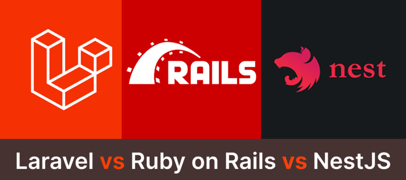

## Introduction

When building a modern backend application, developers often choose between established frameworks like **Laravel** (PHP), **Ruby on Rails**, and **NestJS** (Node.js/TypeScript). Each comes with a distinct philosophy, ecosystem, and developer experience. This article explores their key differences in architecture, productivity, scalability, and performance, helping you decide which tool suits your project.  



## 1. Overview of Frameworks  

### Laravel (PHP)  

- Released in **2011**, built on top of PHP.  
- Follows **MVC** (Model–View–Controller).  
- Rich ecosystem (Eloquent ORM, Blade templates, Laravel Horizon for queues).  
- Excellent for **rapid development** with clean syntax.  

**Example:** Routing in Laravel  
```php
use Illuminate\Support\Facades\Route;

Route::get('/hello', function () {
    return 'Hello from Laravel!';
});
```
---

### Ruby on Rails  

- Released in **2004**, based on **Ruby**.  
- Pioneered **Convention over Configuration (CoC)** and **Don't Repeat Yourself (DRY)** principles.  
- Ecosystem includes ActiveRecord ORM, ActionCable for WebSockets, and Turbo for modern frontend integration.  

**Example:** Routing in Rails  
```ruby
Rails.application.routes.draw do
  get "/hello", to: "welcome#hello"
end
```
---

### NestJS (Node.js + TypeScript)  

- Introduced in **2017**, built on **TypeScript** and Node.js.  
- Inspired by **Angular’s modular architecture**.  
- Out-of-the-box support for **GraphQL, WebSockets, Microservices**.  
- Embraces **Dependency Injection (DI)** and decorators.  

**Example:** Routing in NestJS  
```ts
import { Controller, Get } from '@nestjs/common';

@Controller()
export class AppController {
  @Get('hello')
  getHello(): string {
    return 'Hello from NestJS!';
  }
}
```
---

## 2. Ecosystem and Community  

- **Laravel**: Strong PHP ecosystem, widely used for web apps, CMS, SaaS. Tools like **Forge** and **Nova** enhance deployment and admin dashboards.  
- **Rails**: Mature ecosystem with gems, excellent for startups and MVPs. GitHub, Shopify, and Basecamp were built with Rails.  
- **NestJS**: Growing ecosystem leveraging Node.js libraries. Works well with **Prisma ORM** or **TypeORM**, plus integrations for microservices and event-driven systems.  
---

## 3. Developer Experience  

- **Laravel**: Elegant syntax, rich documentation, and scaffolding commands (`artisan`). Great for full-stack apps with Blade or Vue/React.  
- **Rails**: Excellent for rapid prototyping, minimal boilerplate. Strong community guides.  
- **NestJS**: TypeScript-first design provides type safety. Structure may feel verbose but scales well in enterprise systems.  

---

## 4. Performance and Scalability  

- **Laravel**: PHP 8+ offers good performance, but historically slower than Node.js or compiled languages. Scalability often achieved via horizontal scaling + queues.  
- **Rails**: Solid performance for CRUD apps, but can struggle under heavy real-time workloads. Scaling often requires caching, background jobs, and sharding.  
- **NestJS**: Non-blocking I/O model of Node.js ensures high concurrency. Ideal for **real-time APIs, microservices, and event-driven systems**.  
---

## 5. Use Cases  

- **Laravel**: Best for SaaS products, e-commerce, and CMS-like apps.  
- **Rails**: Ideal for startups, MVPs, and rapid prototyping.  
- **NestJS**: Great for enterprise APIs, microservices, and real-time applications (e.g., chat apps).  
---

## 6. Pros and Cons  

### Laravel 

✅ Great documentation & ecosystem  
✅ Built-in authentication, queues, ORM  
❌ Requires PHP hosting  
❌ Slower performance under heavy load  

### Ruby on Rails  

✅ Mature ecosystem, rapid prototyping  
✅ Convention over Configuration = less boilerplate  
❌ Performance bottlenecks at scale  
❌ Smaller talent pool compared to JS/PHP  

### NestJS  

✅ TypeScript = type safety  
✅ First-class support for microservices & GraphQL  
❌ Verbose for small apps  
❌ Steeper learning curve vs Rails/Laravel  

## Conclusion  

- Choose **Laravel** if you want a battle-tested PHP ecosystem with built-in tooling for SaaS and e-commerce.  
- Choose **Rails** if rapid prototyping and developer happiness are top priorities.  
- Choose **NestJS** if you’re building a **modern, scalable API** with TypeScript, especially for enterprise or real-time workloads.  

Ultimately, the “best” framework depends on your **team expertise, project requirements, and scaling needs**.  
