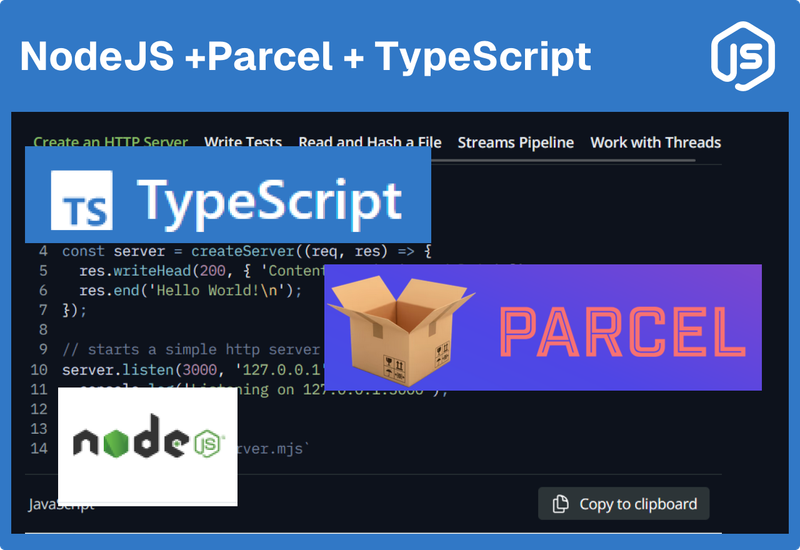

If you're looking to streamline your Node.js development process, [Parcel](https://parceljs.org/)
and [TypeScript](https://www.typescriptlang.org/) are a great combination to ensure fast bundling
and strong type-checking. This guide will walk you through setting up a Node.js project using Parcel
as the bundler and TypeScript for type safety.

## Step 1: Initialize Your Node.js Project

Start by creating a new directory for your project.

<div className='code-cmd'>mkdir parsel-ts && cd parsel-ts</div>

### Initialize npm:

Run the following command to initialize a new Node.js project:

<div className='code-cmd'>npm init -y</div>

This will create a **package.json** file in your project directory.

## Step 2: Install Parcel Bundler

**Parcel** is an easy-to-use bundler that requires minimal configuration.

**Install Parcel:**

To install Parcel as a development dependency, run:

<div className='code-cmd'>npm install -D parcel parcel-bundler</div>

## Step 3: Set Up TypeScript

TypeScript adds static types to JavaScript, helping you catch errors early in development.

### 1. Install TypeScript and Node.js Type Definitions:

Run the following command to install TypeScript along with the Node.js type definitions:

<div className='code-cmd'>npm install typescript @types/node --save-dev</div>

### 2. Initialize TypeScript Configuration:

Create a **tsconfig.json** file by running:

<div className='code-cmd'>npx tsc --init</div>

### 3. Configure tsconfig.json:

Modify your **tsconfig.json** to include the following settings:

```js
{
  "compilerOptions": {
    "target": "es6",
    "module": "commonjs",
    "strict": true,
    "esModuleInterop": true
  },
  "include": ["src/**/*"]
}
```

### Step 4: Create the Source Files

#### 1. Create a src Directory:

Inside your project root, create a **src** folder where your TypeScript files will reside:

<div className='code-cmd'>mkdir src</div>

#### 2. Add Your First TypeScript File:

Inside the **src** directory, create an **index.ts** file with some starter code:

### Step 5: Configure Parcel for TypeScript

Parcel works out-of-the-box with TypeScript, but you need to define an entry point in your
**package.json**.

#### 1. Add Scripts to package.json:

Update the **package.json** file to include the following script:

```js
"scripts": {
  "dev": "parcel src/index.html",
  "build": "parcel build src/index.html"
}
```

If you're not using an HTML file, use parcel src/index.ts as the entry point.

### Step 6: Run the Development Server

**Start the Development Server:**

Run Parcel’s development server with hot-reloading enabled:

<div className='code-cmd'>npm run dev</div>

**Build for Production:**

When you’re ready to bundle your code for production, run:

<div className='code-cmd'>npm run build</div>

## Conclusion

With Parcel and TypeScript set up, your Node.js project is ready for development. Parcel’s minimal
configuration and TypeScript's type safety will make your development process faster and more
efficient.
