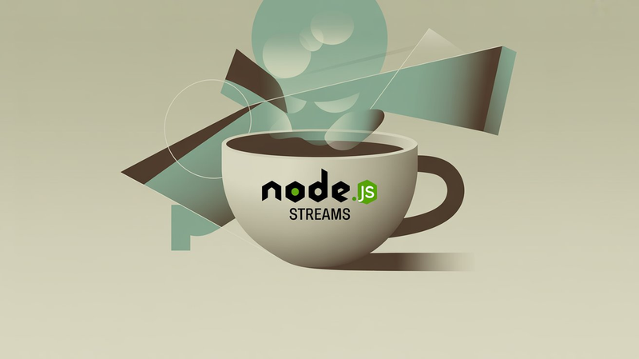

In Node.js, it's common to use `fs.readFile` and `fs.writeFile` for reading and writing files. While these methods are simple and convenient, they have serious limitations when working with large files or needing more granular control.

For example:

- **Memory issues**: These methods load the entire file into memory at once, which is inefficient and risky for large files.
- **No pause/resume control**: You can't stop reading midway to do something else and then resume.
- **No streaming**: You can’t start reading from a specific position or in small chunks

To solve these issues, Node.js provides the `stream` module—a powerful abstraction for reading and writing data in chunks, rather than all at once.

Let’s explore how to use streams effectively.



## Stream Types in Node.js

<table>
  <thead>
    <tr>
      <th>**Stream Type**</th>
      <th>**Name**</th>
      <th>**Purpose**</th>
      <th>**Use Cases**</th>
    </tr>
  </thead>
  <tbody>
    <tr>
      <td>Readable</td>
      <td>Readable Streams</td>
      <td>Read data from a source in chunks</td>
      <td>Reading large files, network responses</td>
    </tr>
    <tr>
      <td>Writable</td>
      <td>Writable Streams</td>
      <td>Write data to a target in chunks</td>
      <td>Writing logs, large exports</td>
    </tr>
    <tr>
      <td>Duplex</td>
      <td>Duplex Streams</td>
      <td>Read and write at the same time</td>
      <td>Network sockets, proxies</td>
    </tr>
    <tr>
      <td>Transform</td>
      <td>Transform Streams</td>
      <td>Modify data as it's read/written</td>
      <td>Compressing, encrypting, transforming</td>
    </tr>
  </tbody>
</table>

## Reading Files with a Stream

To read files efficiently, use `fs.createReadStream`. It lets you read data in chunks, specify start/end byte positions, and control the buffer size via highWaterMark.

### Example: Reading Specific Bytes in Chunks

```js
import fs from 'node:fs';

import fs from 'node:fs';

let fileContent = '';

const fileReader = fs.createReadStream('./assets/users.json', {
  start: 5,
  end: 20,
  highWaterMark: 10, // Read 10 bytes per chunk
});

fileReader.on('open', () => console.log('File opened'));

fileReader.on('data', chunk => {
  fileContent += chunk;
});

fileReader.on('end', () => {
  console.log('Finished reading file:');
  console.log(fileContent);
});

fileReader.on('close', () => console.log('File closed'));

fileReader.on('error', err => console.error('Read error:', err));
```

### Example: Pause and Resume File Reading

```js
import fs from 'node:fs';

import fs from 'node:fs';

const reader = fs.createReadStream('./assets/users.json', {
  start: 0,
  end: 50,
  highWaterMark: 15,
});

reader.on('data', chunk => {
  console.log('Chunk:', chunk.toString());
  reader.pause();
  console.log('Pausing for 1.5 seconds...');
  setTimeout(() => {
    reader.resume();
  }, 1500);
});
```

You can manually stop a stream mid-read using `reader.destroy()`.

## Writing Files with a Stream

Use `fs.createWriteStream` to write large amounts of data efficiently.

### Example: Writing to a File in Chunks

```js
import fs from 'node:fs';

import fs from 'node:fs';

const fileWriter = fs.createWriteStream('./output/log.txt');

fileWriter.write('Event Start\n');
fileWriter.write('Processing...\n');
fileWriter.write('Event Complete\n');

fileWriter.close();

fileWriter.on('open', fd => {
  console.log('Write stream opened, FD:', fd);
});

fileWriter.on('finish', () => {
  console.log('Write completed.');
});

fileWriter.on('close', () => {
  console.log('Write stream closed.');
});

fileWriter.on('error', err => {
  console.error('Write error:', err);
});
```

### `close()` vs `end()`

```js
// These two are equivalent:
writer.end('Final message\n');
// is the same as:
writer.write('Final message\n');
writer.end();
```

### Writing to a Specific Position

```js
import fs from 'node:fs';

import fs from 'node:fs';

const writer = fs.createWriteStream('./output/offset.txt', {
  flags: 'w',
  start: 10,
});

writer.write('OffsetWrite');
writer.end();
```

## Copying Files with pipe()

The `pipe()` method connects a readable stream to a writable one—ideal for file copying.

### Method 1: `Using pipe()`

```js
import fs from 'node:fs';

import fs from 'node:fs';

const source = fs.createReadStream('./data/source.txt');
const destination = fs.createWriteStream('./data/destination.txt');

source.pipe(destination);

source.on('end', () => {
  console.log('File copy completed.');
});
```

### Method 2: Manual Pipe

```js
import fs from 'node:fs';

import fs from 'node:fs';

const reader = fs.createReadStream('./data/source.txt');
const writer = fs.createWriteStream('./data/destination.txt');

reader.on('data', chunk => {
  writer.write(chunk);
});

reader.on('end', () => {
  console.log('File copy done.');
});
```

## Conclusion

Node.js streams are essential for handling large-scale file processing with precision and performance. Whether you're building a log system, video processor, or file transfer tool, mastering streams gives you memory efficiency, speed, and granular control.

Start simple—read and write text files with chunks. Then explore advanced use cases like `Transform` streams for compression or encryption.
