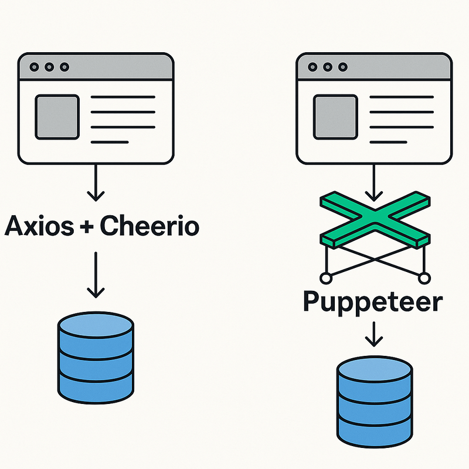

> **Legal note:** Always check a site's Terms of Service and robots.txt, and scrape responsibly (rate limits, headers, no personal data).



## Why two approaches?

- **Cheerio (Axios + Cheerio)** — fastest path for **static** HTML. You download the page and parse it with jQuery-like selectors.
- **Puppeteer** — a headless Chrome for **dynamic** pages (JS-rendered, infinite scroll, protected flows). Heavier but more powerful.

Below we’ll scrape the training site `https://quotes.toscrape.com` (built for learning). You’ll see **exact output** and how to **parse** it.

---

## Project setup

```bash
mkdir quotes-scraper && cd quotes-scraper
npm init -y
```

We’ll create two scripts:

- `quotes-cheerio.mjs` — static HTML scraping
- `quotes-puppeteer.mjs` — dynamic scraping with a browser

> Using ESM (`.mjs`) for simplicity.

---

## 1) Static pages: Axios + Cheerio

Install deps:

```bash
npm i axios cheerio
```

Create **`quotes-cheerio.mjs`**:

```js
import axios from "axios";
import * as cheerio from "cheerio";

const BASE = "https://quotes.toscrape.com/";

async function scrapeQuotes(page = 1) {
  const url = page === 1 ? BASE : `${BASE}page/${page}/`;
  const { data: html } = await axios.get(url, {
    headers: {
      "User-Agent":
        "Mozilla/5.0 (compatible; QuotesScraper/1.0; +https://example.com/bot)"
    },
    timeout: 15000
  });

  const $ = cheerio.load(html);
  const items = [];

  $(".quote").each((_, el) => {
    const text = $(el).find(".text").text().replace(/^“|”$/g, "").trim();
    const author = $(el).find(".author").text().trim();
    const tags = $(el)
      .find(".tags a.tag")
      .map((_, a) => $(a).text().trim())
      .get();

    items.push({ text, author, tags });
  });

  const nextHref = $(".pager .next a").attr("href") || null;
  const hasNext = Boolean(nextHref);

  return { items, hasNext };
}

(async () => {
  try {
    const all = [];
    let page = 1;

    while (true) {
      const { items, hasNext } = await scrapeQuotes(page);
      all.push(...items);
      console.log(`[cheerio] page ${page}: +${items.length} quotes`);
      if (!hasNext) break;
      page += 1;
    }

    // Show first 2 results to keep console readable
    console.log(JSON.stringify(all.slice(0, 2), null, 2));
    console.log(`Total quotes collected: ${all.length}`);
  } catch (err) {
    console.error("Cheerio scrape failed:", err.message);
    process.exit(1);
  }
})();
```

### Expected output (example)

```json
[
  {
    "text": "The world as we have created it is a process of our thinking. It cannot be changed without changing our thinking.",
    "author": "Albert Einstein",
    "tags": ["change", "deep-thoughts", "thinking", "world"]
  },
  {
    "text": "It is our choices, Harry, that show what we truly are, far more than our abilities.",
    "author": "J.K. Rowling",
    "tags": ["abilities", "choices"]
  }
]
```

Run:

```bash
node quotes-cheerio.mjs
```

**How it’s parsed:**  
- `$(".quote")` iterates each quote card.  
- `.find(".text")`, `.find(".author")`, and `.find(".tags a.tag")` extract specific fields.  
- We accumulate into `items` and follow `.pager .next a` to crawl pages.

---

## 2) Dynamic pages: Puppeteer (headless Chrome)

Install:

```bash
npm i puppeteer
```

Create **`quotes-puppeteer.mjs`**:

```js
import puppeteer from "puppeteer";

const BASE = "https://quotes.toscrape.com/";

async function scrapeQuotesWithPuppeteer() {
  const browser = await puppeteer.launch({
    headless: "new", // Chrome headless mode
    args: ["--no-sandbox", "--disable-setuid-sandbox"]
  });

  try {
    const page = await browser.newPage();
    await page.setUserAgent(
      "Mozilla/5.0 (Macintosh; Intel Mac OS X 10_15_7) " +
        "AppleWebKit/537.36 (KHTML, like Gecko) " +
        "Chrome/120.0.0.0 Safari/537.36"
    );

    const all = [];
    let url = BASE;

    while (true) {
      await page.goto(url, { waitUntil: "domcontentloaded", timeout: 30000 });

      // Optionally wait for quotes to be present
      await page.waitForSelector(".quote", { timeout: 10000 });

      // Extract structured data in the browser context
      const items = await page.$$eval(".quote", (cards) =>
        cards.map((el) => {
          const text = el.querySelector(".text")?.textContent || "";
          const author = el.querySelector(".author")?.textContent || "";
          const tags = Array.from(el.querySelectorAll(".tags a.tag")).map((a) =>
            a.textContent.trim()
          );
          return {
            text: text.replace(/^“|”$/g, "").trim(),
            author: author.trim(),
            tags
          };
        })
      );

      all.push(...items);

      const nextHref = await page.$eval(
        ".pager",
        (pager) => pager.querySelector(".next a")?.getAttribute("href") || null
      ).catch(() => null);

      console.log(`[puppeteer] page ${url}: +${items.length} quotes`);

      if (!nextHref) break;
      url = new URL(nextHref, location.origin).href;
    }

    console.log(JSON.stringify(all.slice(0, 2), null, 2));
    console.log(`Total quotes collected: ${all.length}`);
  } catch (err) {
    console.error("Puppeteer scrape failed:", err.message);
  } finally {
    await browser.close();
  }
}

scrapeQuotesWithPuppeteer();
```

Run:

```bash
node quotes-puppeteer.mjs
```

**What’s different vs Cheerio?**  
- We **load** the page in a real browser and run selectors **in-page** (`$$eval`).  
- This works even if content appears **after JS execution**, has **lazy loaders**, or requires **user actions** (logins, clicks, scrolling).

---

## Parsing & post-processing tips

- **Normalize text**: trim whitespace, remove quotes, unify casing if needed.  
- **Validate schemas**: use Zod/Yup to ensure each record has required fields.  
- **Persist**:
  - JSON: `fs.writeFileSync("quotes.json", JSON.stringify(all, null, 2))`
  - DB: insert into Mongo/Postgres (batch writes).  
- **Politeness**:  
  - Random delay between requests `500–1500ms`.  
  - Set `User-Agent`, `Accept-Language`.  
  - Respect pagination and don’t hammer endpoints.

---

## When to pick which?

- **Cheerio**: pages render data in initial HTML, performance matters, minimal overhead.  
- **Puppeteer**: content is loaded via JS/XHR, needs interaction (click, scroll), or anti-bot countermeasures require a real browser.

---

## Minimal JSON save example

Add to the end of either script:

```js
import fs from "fs";

fs.writeFileSync("quotes.json", JSON.stringify(all, null, 2), "utf-8");
console.log("Saved to quotes.json");
```

Now you can feed `quotes.json` into your app, a DB import, or a data pipeline.

---

## Common pitfalls (and fixes)

- **Empty results**: selectors wrong → inspect with DevTools, adjust `.selector`.  
- **Blocked requests**: add headers, slow down, use rotating proxies (only if allowed).  
- **Infinite scroll**: Puppeteer + `page.evaluate` to `window.scrollTo(...)` until no new items.  
- **Login walls**: Puppeteer → type credentials and click; save cookies between runs.

---

## TL;DR

- Use **Cheerio** for fast, static HTML scraping.  
- Use **Puppeteer** when pages are **dynamic**.  
- Always parse into clear, typed objects and **persist** your results.  
- Scrape **respectfully** and **legally**.

Happy scraping!
