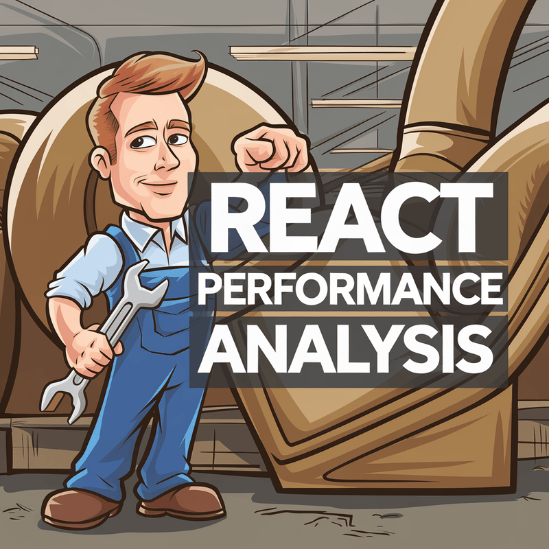
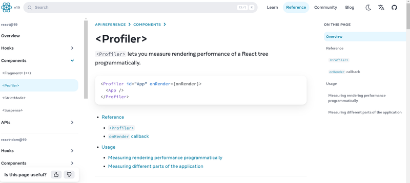

React applications can sometimes experience performance issues due to unnecessary re-renders and inefficient state management. Fortunately, there are several tools to help developers analyze and optimize React component performance. This article will cover three essential tools: [React Profiler](https://react.dev/reference/react/Profiler), [WhyDidYouRender](https://github.com/welldone-software/why-did-you-render), and [useTrackedEffect](https://jsdev.space/snippets/usetrackedeffect/), providing insight into how they work and how to integrate them into your project.

## 1. React Profiler: Measuring Component Rendering Performance



The **React Profiler** is an in-built tool that helps developers measure the performance of React applications. It tracks the rendering time of components, the frequency of re-renders, and the cost associated with rendering, enabling developers to identify performance bottlenecks.

To use the React Profiler, wrap your component tree with the `<Profiler>` component:

```jsx
<Profiler id='App' onRender={onRender}>
  <App />
</Profiler>
```

`onRender` is a callback function that React calls whenever the component tree is updated. It provides the following parameters:

- **id**: Identifies the part of the UI being measured.
- **phase**: Indicates if the component is mounting or updating.
- **actualDuration**: Time taken to render the component.
- **baseDuration**: Estimated time to re-render the subtree without optimizations.
- **startTime**: Timestamp when rendering started.
- **commitTime**: Timestamp when rendering was committed.

Use `actualDuration` to identify when a component takes too long to render. If it exceeds 16ms, it may indicate a performance issue.

## 2. WhyDidYouRender: Understanding Unnecessary Re-Renders


**WhyDidYouRender** is a utility that helps track unnecessary re-renders in React components. It provides detailed information about why a component re-rendered, including which props or state changes triggered the re-render. This tool is especially helpful for optimizing performance when a component is unnecessarily re-rendered.

To integrate WhyDidYouRender into a Vite project:

**1. Install the package:**

<div className='code-cmd'>
  npm install @welldone-software/why-did-you-render -D
</div>

**2. Modify your `vite.config.js`:**

```js
export default defineConfig({
  plugins: [
    react({
      jsxImportSource: '@welldone-software/why-did-you-render',
    }),
  ],
});
```

**3. Create a `wdyr.js` file:**

```js
import React from 'react';

import whyDidYouRender from '@welldone-software/why-did-you-render';

import whyDidYouRender from '@welldone-software/why-did-you-render';

whyDidYouRender(React, {
  trackAllPureComponents: true,
  trackHooks: true,
  collapseGroups: true,
});
```

**4. Import the `wdyr.js` file in `main.jsx`:**

```js
import './wdyr.js';
import './wdyr.js';
```

Key configuration options in WhyDidYouRender:

- `include`: Specifies which components to trace based on a regular expression.
- `trackHooks`: If enabled, tracks all React Hook changes.
- `logOwnerReasons`: Logs the parent component that caused the re-render.

For a component to trigger logging, set `whyDidYouRender` to true:

```jsx
Component.whyDidYouRender = true;
```

## 3. useTrackedEffect: Efficiently Handling State Changes

The useTrackedEffect hook is designed to track state changes and execute side effects only when necessary, improving performance over the standard `useEffect`.

**Example:**

```jsx
import React, { useState } from 'react';

import { useTrackedEffect } from '../hooks';

import { useTrackedEffect } from '../hooks';

export default () => {
  const [count, setCount] = useState(0);
  const [count2, setCount2] = useState(0);

  useTrackedEffect(
    changes => {
      console.log('Changed dependencies: ', changes);
    },
    [count, count2]
  );

  return (
    <div>
      <p>Count: {count}</p>
      <button onClick={() => setCount(count + 1)}>Increment</button>
      <p>Count2: {count2}</p>
      <button onClick={() => setCount2(count2 + 1)}>Increment</button>
    </div>
  );
};
```

In the above example, `useTrackedEffect` detects which dependencies (e.g., `count` or `count2`) have changed and logs the changes, helping avoid unnecessary side effects.

## Conclusion

By utilizing these three tools—React **Profiler**, **WhyDidYouRender**, and **useTrackedEffect**—you can optimize the performance of your React components. React Profiler helps you measure rendering performance, WhyDidYouRender identifies unnecessary re-renders, and `useTrackedEffect` helps efficiently track state changes. Integrating these tools into your development workflow can significantly improve the performance and efficiency of your React applications.
