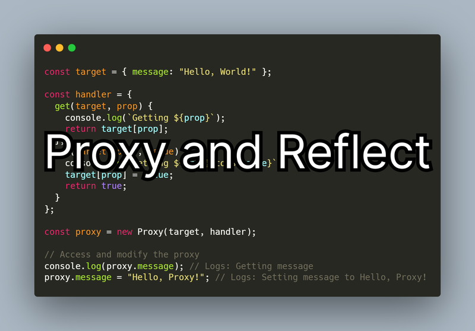

In modern JavaScript, **Proxy** and **Reflect** work together to give you fine‑grained control over how objects behave. These tools allow you to intercept operations, add validation, log changes, and even create reactive systems. This guide explains how both features work and provides clear, practical examples.

## 1. What Is a Proxy?

A **Proxy** wraps an object and intercepts operations performed on it. You decide how the object reacts when something is read, written, deleted, or called.

### Basic syntax

```js
const proxy = new Proxy(target, handler);
```

- **target** – the original object  
- **handler** – defines which operations (“traps”) you want to intercept

### Example: Logging property access

```js
const target = { message: 'Hello, World!' };

const handler = {
  get(target, prop) {
    console.log(`Getting ${prop}`);
    return target[prop];
  },
  set(target, prop, value) {
    console.log(`Setting ${prop} to ${value}`);
    target[prop] = value;
    return true;
  }
};

const proxy = new Proxy(target, handler);

console.log(proxy.message);  // Getting message
proxy.message = 'Hello, Proxy!';  // Setting message to Hello, Proxy!
```

### Common Proxy traps

- `get` — intercepts property access  
- `set` — intercepts assignments  
- `has` — catches the `in` operator  
- `deleteProperty` — intercepts `delete obj.prop`  
- `apply` — intercepts function calls  
- `construct` — intercepts `new`  

## 2. What Is Reflect?

**Reflect** provides built‑in, standardized methods for object operations—similar to what Proxy intercepts. It’s often used inside Proxy traps to perform the original behavior.

### Example: Using Reflect inside a Proxy

```js
const handler = {
  get(target, prop) {
    console.log(`Reading ${prop}`);
    return Reflect.get(target, prop);
  },
  set(target, prop, value) {
    console.log(`Writing ${prop} = ${value}`);
    return Reflect.set(target, prop, value);
  }
};
```

### Common Reflect methods

- `Reflect.get(target, prop)`  
- `Reflect.set(target, prop, value)`  
- `Reflect.has(target, prop)`  
- `Reflect.deleteProperty(target, prop)`  
- `Reflect.apply(func, thisArg, args)`  
- `Reflect.construct(target, args)`  

Using Reflect ensures your Proxy behaves predictably, especially in complex scenarios.

## 3. Real‑World Example: Object Validation

You can create objects that validate data automatically.

```js
const validator = {
  set(target, prop, value) {
    if (typeof value !== 'string') {
      throw new Error(`Property ${prop} must be a string`);
    }
    return Reflect.set(target, prop, value);
  }
};

const user = new Proxy({}, validator);

user.name = 'Margaret';   // OK
user.age = 45;            // Error: Property age must be a string
```

## 4. Another Example: Read‑Only Objects

```js
const readonly = {
  set() {
    console.log('Cannot modify a read‑only object');
    return false;
  }
};

const settings = new Proxy({ theme: 'dark' }, readonly);

settings.theme = 'light'; // Cannot modify a read‑only object
```

## 5. Using Proxies for Reactive Programming (like Vue.js)

```js
const watchers = [];

function reactive(obj) {
  return new Proxy(obj, {
    set(target, prop, value) {
      const updated = Reflect.set(target, prop, value);
      watchers.forEach(fn => fn());
      return updated;
    }
  });
}

const state = reactive({ count: 0 });

watchers.push(() => console.log(`Count changed to: ${state.count}`));

state.count++;  // Count changed to: 1
```

This is a simplified version of how reactive frameworks track changes.

## Conclusion

**Proxy** gives you the power to intercept and customize object behavior, while **Reflect** provides safe, predictable defaults. Together, they enable powerful patterns such as logging, validation, immutability, and even reactivity. By mastering these tools, you gain deeper control over your JavaScript applications and unlock new ways to architect clean, maintainable code.