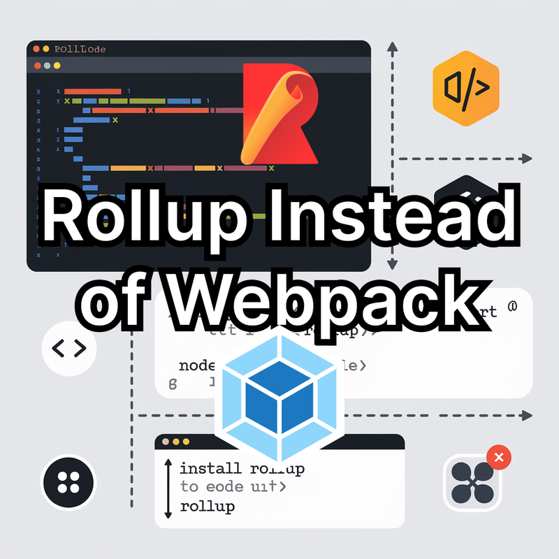

When building component libraries, choosing the right bundler is essential. While Webpack excels at bundling full applications, **Rollup** is often the superior choice for packaging libraries—offering cleaner output, smaller bundles, and better tree‑shaking. This guide explores why Rollup is the ideal tool for library authors and shows how it compares to Webpack in real-world examples.

## Why Rollup for Component Libraries?

[Rollup](https://rollupjs.org/) focuses on generating optimized JavaScript for publishing. Unlike [Webpack](https://webpack.js.org/), which injects runtime code to manage module loading, Rollup relies on ES modules and generates minimal, dependency‑free bundles.

### Key Advantages of Rollup

- **Clean Output** — No extra runtime wrapper code.
- **Multiple Module Formats** — ESM, CommonJS, and UMD out of the box.
- **Superior Tree‑Shaking** — Eliminates unused exports accurately.
- **Powerful Plugin Ecosystem** — Built for extensibility.
- **Modern Toolchain Integration** — Vite and SvelteKit use Rollup internally.

## Rollup vs. Webpack: A Practical Comparison



Below is a simple project structured for demonstration:

```
src/
 ├── index.js
 └── utils.js
```

### `src/index.js`

```js
import { add } from './utils';

function main() {
  console.log(add(1, 2));
}

export default main;
```

### `src/utils.js`

```js
export function add(a, b) {
  return a + b;
}
```

---

# Packaging with Rollup

## Step 1: Install Rollup

```bash
npm install --save-dev rollup
```

## Step 2: Create Rollup Configuration

`rollup.config.js`

```js
/** @type {import('rollup').RollupOptions} */
export default {
  input: 'src/index.js',
  output: [
    { file: 'dist/esm.js', format: 'esm' },
    { file: 'dist/cjs.js', format: 'cjs' },
    { file: 'dist/umd.js', name: 'LibraryName', format: 'umd' },
  ],
};
```

## Step 3: Build

```bash
npx rollup -c
```

### Result

- **esm.js** — Modern module export
- **cjs.js** — Node/CommonJS export
- **umd.js** — Browser-compatible universal bundle  
All with **zero unnecessary runtime**.

---

# Packaging with Webpack

## Step 1: Install Webpack

```bash
npm install --save-dev webpack webpack-cli
```

## Step 2: Create Webpack Config

`webpack.config.mjs`

```js
import path from 'path';

/** @type {import('webpack').Configuration} */
export default {
  entry: './src/index.js',
  mode: 'production',
  output: {
    path: path.resolve(process.cwd(), 'dist'),
    filename: 'bundle.js',
    libraryTarget: 'commonjs2',
  },
};
```

## Step 3: Build

```bash
npx webpack -c webpack.config.mjs
```

### Result

The JS file contains ~100 lines of boilerplate runtime code.

---

# CSS Handling: Rollup vs. Webpack

## Extracting CSS with Rollup

Install plugin:

```bash
npm install --save-dev rollup-plugin-postcss
```

Update config:

```js
import postcss from 'rollup-plugin-postcss';

export default {
  input: 'src/index.js',
  output: [...],
  plugins: [
    postcss({
      extract: 'styles.css',
    }),
  ],
};
```

## Extracting CSS with Webpack

Install loaders:

```bash
npm install --save-dev css-loader style-loader mini-css-extract-plugin
```

Webpack config:

```js
import MiniCssExtractPlugin from 'mini-css-extract-plugin';

export default {
  module: {
    rules: [
      { test: /\.css$/, use: [MiniCssExtractPlugin.loader, 'css-loader'] },
    ],
  },
  plugins: [new MiniCssExtractPlugin({ filename: 'styles.css' })],
};
```

Webpack will still generate runtime code alongside your JS.

---

# When to Choose Rollup

Use Rollup if you need:

- Clean, minimal bundles  
- Libraries targeting ESM/CJS/UMD  
- Great tree-shaking  
- Faster debugging with fewer generated artifacts  

Use Webpack if you need:

- Full web app bundling  
- Asset pipelines (images/fonts)  
- Dev server features  
- Advanced HMR  

---

# Rollup in Modern Build Systems

Modern frameworks depend on Rollup:

- **Vite**: esbuild for dev, Rollup for production  
- **SvelteKit**: Rollup powering builds  
- **Lit** and **Stencil**: Rollup-based packaging  

Rollup continues to be the industry standard for **library authors**.

---

# Conclusion

Rollup is the optimal choice for packaging component libraries, offering minimal, runtime-free bundles and first-class support for multiple module formats. Webpack remains excellent for applications, but Rollup delivers unmatched efficiency for published packages.

Whether you're building a UI library, internal utilities, or exploring Vite and SvelteKit, Rollup provides the cleanest, most reliable bundling path.