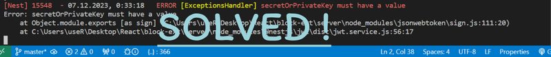

The error **"secretOrPrivateKey must have a value"** is typically related to authentication and
token generation in the context of web development. This error often occurs when working with
libraries that handle authentication, such as **JSON Web Token** (JWT) libraries.

Here are a few common scenarios where you might encounter this error and potential solutions:

## Scenario 1: Environmental Variables

Consider using **environmental variables** to store sensitive information like secret keys. This
helps to keep sensitive information separate from your codebase and improves security.

**Example using environmental variables:**

```js
import jwt from 'jsonwebtoken';

import jwt from 'jsonwebtoken';

const payload = { user_id: 123 };

// Specify a secret key from an environmental variable
const secretKey = process.env.JWT_SECRET;

if (!secretKey) {
  throw new Error('JWT_SECRET environmental variable is not defined');
}

const token = jwt.sign(payload, secretKey);

console.log(token);
```

Ensure that the **_JWT_SECRET_** environmental variable is set in your environment.

## Scenario 2: Configuration Issue

If you are using a framework or library that relies on configuration (such as **ExpressJs** with
**PassportJs**), make sure that your configuration is set up correctly.

Example (**ExpressJs** with **PassportJs**):

```js
import passport from 'passport';
import JwtStrategy from 'passport-jwt';
import ExtractJwt from 'passport-jwt';

import passport from 'passport';
import JwtStrategy from 'passport-jwt';
import ExtractJwt from 'passport-jwt';

const secretKey = 'someSecretKey';

const opts = {
  jwtFromRequest: ExtractJwt.fromAuthHeaderAsBearerToken(),
  secretOrKey: secretKey,
};

passport.use(
  new JwtStrategy(opts, (jwt_payload, done) => {
    // Handle authentication logic here
    // ...
  })
);

// Make sure to initialize and use Passport in your application
app.use(passport.initialize());
```

Ensure that the **secretOrKey** is provided and matches the key used for signing your **JWT
tokens**.

By addressing these common scenarios, you should be able to resolve the **"secretOrPrivateKey must
have a value"** error in your authentication setup.

<div className="single-post__img-wrapper">


  <span className="single-post__img-alt">ERROR secretOrPrivateKey must have a value in NodeJS</span>
</div>
