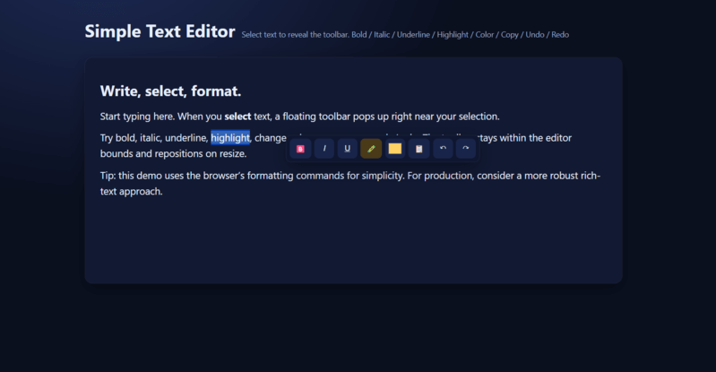

In this guide, we’ll build a lightweight, browser-based text editor with a toolbar that appears when users select text. No frameworks, just HTML, CSS, and JavaScript.



## Introduction

Most web apps rely on heavy editors (Quill, TinyMCE, ProseMirror). But sometimes all you need is a lightweight text area with a few formatting options. In this tutorial, we’ll build a simple text editor using pure JavaScript.

The key idea:

- Use `contenteditable` for editable text
- Detect selections with `window.getSelection()`
- Show a floating toolbar above the selection
- Apply commands like bold, italic, underline, highlight, color change, copy, undo/redo

## Step 1. Create the HTML Structure

We need an editor container, a contenteditable surface, and a hidden toolbar:

```html 
<section class="editor" id="editorBox">
  <div class="toolbar" id="selectionBar">
    <button id="btnBold">B</button>
    <button id="btnItalic">I</button>
    <button id="btnUnderline">U</button>
    <button id="btnHighlight">🖍️</button>
    <input type="color" id="btnColor" value="#ff9900" />
    <button id="btnCopy">📋</button>
    <button id="btnUndo">↶</button>
    <button id="btnRedo">↷</button>
  </div>

  <div class="surface" id="editor" contenteditable="true">
    <h2>Type and select text here...</h2>
    <p>Select some text to reveal the toolbar and try formatting commands.</p>
  </div>
</section>
```

The `.surface` is our editable area, and `.toolbar` is positioned absolutely (hidden until needed).

## Step 2. Style the Toolbar

A bit of CSS makes it float elegantly:
```css 
.editor { position: relative; background: #1e293b; padding: 20px; border-radius: 12px; }
.surface { min-height: 200px; outline: none; color: #fff; }
.toolbar {
  position: absolute;
  display: none;
  background: #0f172a;
  border-radius: 8px;
  padding: 6px;
  gap: 6px;
  box-shadow: 0 4px 16px rgba(0,0,0,.3);
}
.toolbar button, .toolbar input[type="color"] {
  background: #334155;
  color: #fff;
  border: none;
  border-radius: 6px;
  width: 32px; height: 32px;
  cursor: pointer;
}
.toolbar button:hover { background: #475569; }
```

## Step 3. Show Toolbar on Selection

Use `window.getSelection()` to find when text is highlighted, and `getBoundingClientRect()` to calculate toolbar position.

```js 
const editor = document.getElementById("editor");
const toolbar = document.getElementById("selectionBar");

function updateToolbar() {
  const sel = window.getSelection();
  if (!sel || !sel.toString().trim()) {
    toolbar.style.display = "none";
    return;
  }
  const range = sel.getRangeAt(0);
  const rect = range.getBoundingClientRect();

  let top = rect.top + window.scrollY - toolbar.offsetHeight - 8;
  let left = rect.left + window.scrollX + rect.width / 2 - toolbar.offsetWidth / 2;

  toolbar.style.display = "flex";
  toolbar.style.top = `${top}px`;
  toolbar.style.left = `${left}px`;
}

editor.addEventListener("mouseup", updateToolbar);
editor.addEventListener("keyup", updateToolbar);
```

## Step 4. Add Formatting Commands

We’ll use the classic `document.execCommand()` API for simplicity. Although deprecated, it’s still supported in most browsers.

```js 
function run(cmd, value = null) {
  document.execCommand(cmd, false, value);
  editor.focus();
}

document.getElementById("btnBold").onclick = () => run("bold");
document.getElementById("btnItalic").onclick = () => run("italic");
document.getElementById("btnUnderline").onclick = () => run("underline");
document.getElementById("btnHighlight").onclick = () => run("hiliteColor", "#fff176");
document.getElementById("btnColor").oninput = (e) => run("foreColor", e.target.value);
```

## Step 5. Copy, Undo, and Redo

Clipboard and history handling:

```js 
document.getElementById("btnCopy").onclick = () => {
  navigator.clipboard.writeText(window.getSelection().toString());
};

const history = { stack: [], index: -1 };
function saveState() {
  const html = editor.innerHTML;
  if (history.stack[history.index] === html) return;
  history.stack = history.stack.slice(0, history.index + 1);
  history.stack.push(html);
  history.index++;
}
editor.addEventListener("input", saveState);

document.getElementById("btnUndo").onclick = () => {
  if (history.index > 0) {
    history.index--;
    editor.innerHTML = history.stack[history.index];
  }
};
document.getElementById("btnRedo").onclick = () => {
  if (history.index < history.stack.length - 1) {
    history.index++;
    editor.innerHTML = history.stack[history.index];
  }
};
```

## Step 6. Handle Toolbar Hiding

Hide the toolbar when clicking outside or clearing selection:

```js 
document.addEventListener("mousedown", (e) => {
  if (!toolbar.contains(e.target)) {
    if (!window.getSelection().toString()) {
      toolbar.style.display = "none";
    }
  }
});
```

## Full Code 

```html 
<!DOCTYPE html>
<html lang="en">
<head>
  <meta charset="UTF-8" />
  <title>Simple Text Editor — Smart Selection Toolbar</title>
  <meta name="viewport" content="width=device-width, initial-scale=1" />
  <style>
    :root {
      --bg: #0b1020;
      --panel: #121a33;
      --accent: #6ea8fe;
      --text: #e8eefc;
      --muted: #9fb0d0;
      --ok: #6ede8a;
      --warn: #ffd166;
      --shadow: 0 10px 30px rgba(0,0,0,.35);
      --radius: 14px;
    }
    * { box-sizing: border-box }
    html, body { height: 100% }
    body {
      margin: 0;
      background: radial-gradient(1200px 800px at 20% -10%, #1d2a54 0%, #0b1020 55%);
      color: var(--text);
      font: 16px/1.6 system-ui, -apple-system, Segoe UI, Roboto, Inter, sans-serif;
      display: grid;
      place-items: start center;
      padding: 40px 16px;
    }
    .wrap {
      width: min(980px, 100%);
      display: grid;
      gap: 24px;
    }
    .title {
      display: flex;
      gap: 12px;
      align-items: baseline;
      color: var(--muted);
    }
    .title h1 {
      margin: 0;
      font-size: clamp(22px, 3.5vw, 32px);
      color: var(--text);
    }
    .editor {
      position: relative;
      background: var(--panel);
      border-radius: var(--radius);
      box-shadow: var(--shadow);
      padding: clamp(16px, 3vw, 28px);
      outline: 1px solid rgba(255,255,255,.06);
    }
    .surface {
      min-height: 340px;
      outline: none;
      caret-color: var(--accent);
      font-size: 18px;
    }
    .surface :where(h2, h3, p) { margin: .6em 0 }
    .surface h2 { font-size: 26px; line-height: 1.25 }
    .surface mark { background: rgba(255, 245, 157, .4); padding: 0 .2em; border-radius: 6px }
    /* floating toolbar */
    .toolbar {
      position: absolute;
      display: none;
      gap: 6px;
      padding: 6px;
      background: #0f1730;
      border: 1px solid rgba(255,255,255,.06);
      border-radius: 10px;
      box-shadow: var(--shadow);
      transform: translateY(-100%);
      z-index: 1000;
    }
    .tool {
      display: inline-flex;
      align-items: center;
      justify-content: center;
      gap: 6px;
      min-width: 36px;
      height: 36px;
      padding: 0 10px;
      color: var(--text);
      background: #18244a;
      border: none;
      border-radius: 8px;
      cursor: pointer;
      transition: transform .08s ease, background .12s ease, opacity .12s ease;
      user-select: none;
      font-size: 14px;
    }
    .tool:hover { background: #223265 }
    .tool:active { transform: translateY(1px) }
    .tool.ok { background: #17402a }
    .tool.ok:hover { background: #1f5234 }
    .tool.warn { background: #4a3a18 }
    .tool.warn:hover { background: #5a491f }
    .color {
      width: 36px; height: 36px;
      border: none; border-radius: 8px;
      background: #18244a; padding: 4px; cursor: pointer;
    }
    .note {
      color: var(--muted);
      font-size: 14px;
    }
  </style>
</head>
<body>
  <div class="wrap">
    <div class="title">
      <h1>Simple Text Editor</h1>
      <span class="note">Select text to reveal the toolbar. Bold / Italic / Underline / Highlight / Color / Copy / Undo / Redo</span>
    </div>

    <section class="editor" id="editorBox">
      <div class="toolbar" id="selectionBar" role="toolbar" aria-label="Formatting">
        <button class="tool" id="tBold" title="Bold (Ctrl/Cmd+B)">🅱️</button>
        <button class="tool" id="tItalic" title="Italic (Ctrl/Cmd+I)"><span style="font-style:italic">I</span></button>
        <button class="tool" id="tUnderline" title="Underline (Ctrl/Cmd+U)"><span style="text-decoration:underline">U</span></button>
        <button class="tool warn" id="tHighlight" title="Toggle highlight">🖍️</button>
        <input class="color" id="tColor" type="color" value="#ffd166" title="Text color" />
        <button class="tool" id="tCopy" title="Copy selection">📋</button>
        <button class="tool" id="tUndo" title="Undo (Ctrl/Cmd+Z)">↶</button>
        <button class="tool" id="tRedo" title="Redo (Ctrl/Cmd+Y)">↷</button>
      </div>

      <div id="doc" class="surface" contenteditable="true" spellcheck="true">
        <h2>Write, select, format.</h2>
        <p>Start typing here. When you <strong>select</strong> text, a floating toolbar pops up right near your selection.</p>
        <p>Try bold, italic, underline, highlight, change color, copy, or use undo/redo. The toolbar stays within the editor bounds and repositions on resize.</p>
        <p>Tip: this demo uses the browser’s formatting commands for simplicity. For production, consider a more robust rich-text approach.</p>
      </div>
    </section>
  </div>

  <script>
    document.addEventListener("DOMContentLoaded", () => {
      // Elements
      const editorBox   = document.getElementById("editorBox");
      const surface     = document.getElementById("doc");
      const bar         = document.getElementById("selectionBar");
      const btnBold     = document.getElementById("tBold");
      const btnItalic   = document.getElementById("tItalic");
      const btnUnder    = document.getElementById("tUnderline");
      const btnMark     = document.getElementById("tHighlight");
      const inpColor    = document.getElementById("tColor");
      const btnCopy     = document.getElementById("tCopy");
      const btnUndo     = document.getElementById("tUndo");
      const btnRedo     = document.getElementById("tRedo");

      // Simple history (HTML snapshots)
      const history = { stack: [], index: -1 };
      function pushState() {
        const html = surface.innerHTML;
        if (history.stack[history.index] === html) return;
        history.stack = history.stack.slice(0, history.index + 1);
        history.stack.push(html);
        history.index++;
      }
      pushState(); // init snapshot

      // Toolbar positioning
      function positionBar() {
        const sel = window.getSelection();
        if (!sel || !sel.toString().trim() || sel.rangeCount === 0) {
          bar.style.display = "none";
          return;
        }
        const range = sel.getRangeAt(0);
        const rect = range.getBoundingClientRect();
        const box  = editorBox.getBoundingClientRect();

        // Skip zero-size rects (e.g., just caret)
        if (rect.width === 0 && rect.height === 0) {
          bar.style.display = "none";
          return;
        }

        let top  = rect.top + window.scrollY - bar.offsetHeight - 8;
        let left = rect.left + window.scrollX + rect.width/2 - bar.offsetWidth/2;

        // Keep inside editor bounds
        const minLeft = box.left + window.scrollX + 8;
        const maxLeft = box.right + window.scrollX - bar.offsetWidth - 8;

        if (top < window.scrollY) {
          top = rect.bottom + window.scrollY + 8; // place below if not enough room above
        }
        left = Math.max(minLeft, Math.min(left, maxLeft));

        bar.style.display = "flex";
        bar.style.top = `${top}px`;
        bar.style.left = `${left}px`;
      }

      function hideBarIfOutside(e) {
        if (!bar.contains(e.target)) {
          const sel = window.getSelection();
          if (!sel || !sel.toString().trim()) {
            bar.style.display = "none";
          }
        }
      }

      // Formatting helpers (uses execCommand for broad support)
      function run(cmd, value = null) {
        pushState();
        document.execCommand(cmd, false, value);
        surface.focus();
      }
      function toggleHighlight() {
        pushState();
        // If selection already has background, clear it — crude toggle
        document.execCommand("hiliteColor", false, "#fff176"); // soft yellow
        surface.focus();
      }

      // Copy selection
      function copySel() {
        const text = String(window.getSelection());
        if (!text) return;
        navigator.clipboard.writeText(text).then(() => {
          btnCopy.textContent = "✅";
          setTimeout(() => (btnCopy.textContent = "📋"), 1200);
        }).catch(() => {
          btnCopy.textContent = "⚠️";
          setTimeout(() => (btnCopy.textContent = "📋"), 1200);
        });
        surface.focus();
      }

      // Undo/redo
      function undo() {
        if (history.index > 0) {
          history.index--;
          surface.innerHTML = history.stack[history.index];
        }
        surface.focus();
      }
      function redo() {
        if (history.index < history.stack.length - 1) {
          history.index++;
          surface.innerHTML = history.stack[history.index];
        }
        surface.focus();
      }

      // Listeners
      surface.addEventListener("mouseup", positionBar);
      surface.addEventListener("keyup", positionBar);
      surface.addEventListener("input", pushState);
      window.addEventListener("resize", () => {
        if (bar.style.display === "flex") positionBar();
      });
      document.addEventListener("mousedown", hideBarIfOutside);

      btnBold.addEventListener("click",   () => run("bold"));
      btnItalic.addEventListener("click", () => run("italic"));
      btnUnder.addEventListener("click",  () => run("underline"));
      btnMark.addEventListener("click",   toggleHighlight);
      inpColor.addEventListener("input",  (e) => run("foreColor", e.target.value));
      btnCopy.addEventListener("click",   copySel);
      btnUndo.addEventListener("click",   undo);
      btnRedo.addEventListener("click",   redo);
    });
  </script>
</body>
</html>
```


## Final Result

- Select text → toolbar appears above
- Apply bold, italic, underline, highlight, or color
- Copy selection
- Undo/redo with history
- Lightweight, responsive, and pure JavaScript ✨

## Conclusion

You’ve just built a mini text editor with smart selection behavior:

- `contenteditable` → editable surface
- `window.getSelection()` → detect highlighted text
- `execCommand()` → apply formatting
- `clipboard API` → copy text
- Manual stack → undo/redo

This pattern is excellent for lightweight note apps, comment editors, or prototypes without needing a heavy library.