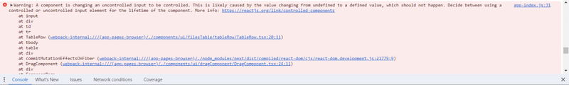

This warning typically occurs in React when you have an input element whose value is initially
`undefined` (or `null`), and then you try to control it by setting its value with state. React warns
about this because it can lead to unexpected behavior.

## How to solve Warning: A component is changing an uncontrolled input to be controlled in React

The warning "A component is changing a controlled input to be uncontrolled" in React typically happens when the input's value is not properly managed through state, leading to inconsistencies in its behavior.

Here's a common scenario where you might encounter this warning:

```js
const Input = ({ isChecked, setIsChecked }) => {
  return (
    <tr
      className={`${
        i % 2 === 0
          ? 'dark:bg-gray-450 dark:border-gray-500 border-b bg-white'
          : 'bg-gray-100 dark:bg-gray-500 dark:border-gray-500 border-b'
      }`}
    >
      <td className='whitespace-nowrap px-6 py-2 dark:text-white'>
        <div className='flex items-center'>
          <input
            type='checkbox'
            checked={isChecked}
            className='bg-gray-100 border-gray-300 dark:ring-offset-gray-800 dark:bg-gray-700 dark:border-gray-600 h-4 w-4 rounded text-blue-600 focus:ring-2 focus:ring-blue-500 dark:focus:ring-blue-600'
            onChange={setIsChecked}
          />
        </div>
      </td>
    </tr>
  );
};
export default Input;
```

In this example, `isChecked` is initially undefined because `useState()` is called without an
initial value. When the component renders, **React** sees that the input has no initial value, and
it considers it an uncontrolled component. Later, when you update the state with `setInputValue()`,
you are attempting to control the input.

To resolve this warning, you can provide a fallback value. For example:

```js
<input
  type='checkbox'
  checked={isChecked || false}
  className='bg-gray-100 order-gray-300 dark:ring-offset-gray-800 dark:bg-gray-700 dark:border-gray-600 h-4 w-4 rounded text-blue-600 focus:ring-2 focus:ring-blue-500 dark:focus:ring-blue-600'
  onChange={setIsChecked}
/>
```

<div className="single-post__img-wrapper">


  <span className="single-post__img-alt">A component is changing an uncontrolled input to be controlled</span>
</div>

## Understanding Controlled vs. Uncontrolled Inputs

- **Controlled Input:** A controlled input is one where the value is set by React state. This means you control the input value through the component’s state, ensuring that the input reflects the current state.

- **Uncontrolled Input:** An uncontrolled input manages its own state internally. The value is accessed via the DOM rather than through React state.

## Common Causes of the Warning

- **Undefined or Null Value**: When you set the input value to `undefined` or `null`, it effectively switches from controlled to uncontrolled.

```js
const [inputValue, setInputValue] = useState('');

return (
  <input
    type='text'
    value={inputValue || ''} // This can lead to the warning
    onChange={e => setInputValue(e.target.value)}
  />
);
```

- **Changing State Management**: If you start managing the input’s value with state but later switch to directly manipulating the input or vice versa.

```js
const [inputValue, setInputValue] = useState('');

// Later in the code, if you set inputValue to undefined or null
setInputValue(undefined); // Causes the warning
```

## How to Fix the Warning

To resolve this warning, ensure that your input remains either controlled or uncontrolled throughout its lifecycle:

- **Default to Empty String**: When initializing your state, always default to an empty string instead of `undefined` or `null`.

```js
const [inputValue, setInputValue] = useState(''); // Always a string

return (
  <input
    type='text'
    value={inputValue}
    onChange={e => setInputValue(e.target.value)}
  />
);
```

- **Conditional Rendering:** If you need to conditionally render an input, ensure it’s always controlled.

```js
return (
  <input
    type='text'
    value={inputValue !== null ? inputValue : ''} // Safe check
    onChange={e => setInputValue(e.target.value)}
  />
);
```

- **Avoid Setting to Null/Undefined**: Make sure not to set the state that controls the input to `null` or `undefined`.

By maintaining consistent management of your input value, you can prevent this warning and ensure that your forms behave as expected in React.
