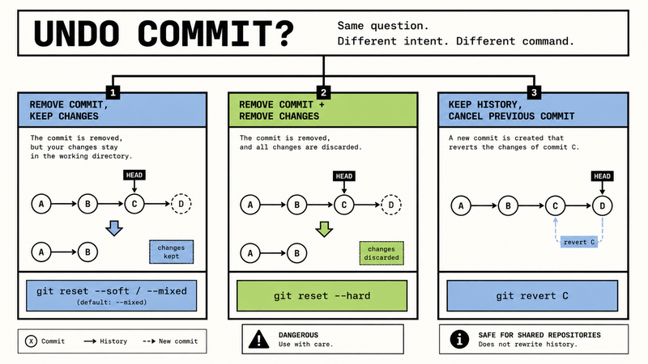

Almost every Git user eventually runs into the same problem.

A commit was created.

Then regret arrived.

Maybe the commit contains broken code. Maybe the wrong file slipped in. Maybe the commit message is terrible. Or maybe the commit was already pushed before anyone noticed the mistake.

At that point, people usually search:

> How do I undo a Git commit?



Then the confusion begins.

Some tutorials recommend `git reset`.

Others say `git revert`.

Someone suggests `checkout`.

Then suddenly `restore`, `amend`, `reflog`, `HEAD~1`, force push, and several unfamiliar Git concepts appear all at once.

The frustrating part is that most of those answers are technically correct.

The real problem is simpler:

“Undoing a commit” can mean several completely different things.

You might want to:

- remove the latest commit
- remove a commit but keep your changes
- undo something already pushed
- restore a file
- rewrite the previous commit
- recover deleted history

Git provides different tools for each situation.

Once you understand that distinction, the command overload becomes much easier to understand.

## What a Commit Actually Is

A Git commit is simply a saved snapshot of your project at a specific point in time.

If you've played video games, think about save points.

You reach a stable point, save progress, and continue experimenting.

Git works in a similar way.

A commit stores:

- project state
- file changes
- author information
- timestamp
- commit message

Commits are then connected together into a history graph.

## Why “Undo Commit” Causes So Much Confusion

This phrase sounds simple, but it hides several very different intentions.

Sometimes you want to remove the commit **without touching your code**.

Sometimes you want to remove **both the commit and the changes**.

Sometimes you should not remove anything at all — you only need to create a new commit that cancels an earlier one.

Different problem.

Different command.

That is why Git offers multiple approaches instead of a single universal "undo" button.

## The Fast Cheat Sheet

If you want the shortest possible version:

| Goal | Command |
|------|------|
| Remove local commit | `git reset` |
| Undo pushed commit safely | `git revert` |
| Restore file | `git restore` |
| Fix last commit | `git commit --amend` |
| Recover deleted history | `git reflog` |

Now let’s break down what each command actually does.

## Remove the Last Local Commit with `git reset`

Suppose you just created a commit:

```bash
git add .
git commit -m "Temporary experiment"
```

A few seconds later you realize:

> That commit should not exist.

Use:

```bash
git reset HEAD~1
```

This removes the commit from history but keeps your file changes.

By default, Git also unstages your files.

### Understanding `HEAD~1`

`HEAD` means:

> the commit you are currently on

`HEAD~1` means:

> one commit earlier

Examples:

```txt
HEAD~1
HEAD~2
HEAD~3
```

move backward through history.

### Soft Reset

If you want to remove the commit but keep staging intact:

```bash
git reset --soft HEAD~1
```

This keeps:

- file changes
- staged files

Useful when you only want to rewrite the commit message or slightly reorganize the commit.

### Hard Reset

The dangerous version:

```bash
git reset --hard HEAD~1
```

This removes:

- the commit
- working directory changes
- staged files

Your repository becomes identical to the previous commit.

Use this command carefully.

## Undo a Pushed Commit with `git revert`

Once code has already been pushed, `reset` becomes risky.

History rewriting can break collaborators.

That is why Git provides:

```bash
git revert <commit-hash>
```

Instead of deleting history, Git creates a new commit that reverses the previous changes.

Example:

Before:

```txt
A → B → C
```

After:

```txt
git revert C
```

Result:

```txt
A → B → C → D
```

Where `D` cancels the changes introduced by `C`.

This makes `revert` the safest option for shared repositories.

## Restore a Single File with `git restore`

Sometimes the entire commit is fine.

Only one file is wrong.

Imagine you broke:

```txt
config.js
```

Restore it:

```bash
git restore config.js
```

Git replaces the file with the version from the latest commit.

You can also restore from a specific commit:

```bash
git restore --source=HEAD~1 config.js
```

or:

```bash
git restore --source=a1b2c3d config.js
```

This is extremely useful when recovering earlier implementations.

## Fix the Last Commit with `git commit --amend`

Sometimes the commit is mostly correct.

You simply forgot something.

Common cases:

- missing file
- bad commit message
- small bug fix
- forgotten config change

Use:

```bash
git commit --amend
```

Git opens the commit editor.

Update the message.

Save.

Done.

If you forgot a file:

```bash
git add missing-file.ts
git commit --amend
```

Git rebuilds the previous commit as if it had originally been created correctly.

### Important Warning

`amend` rewrites history.

If the commit was already pushed, you may need:

```bash
git push --force
```

Use force push carefully.

## Recover Deleted Work with `git reflog`

This command rescues many Git disasters.

Especially after accidental:

```bash
git reset --hard
```

Run:

```bash
git reflog
```

Example:

```txt
7f2a3c1 HEAD@{0}: reset: moving to HEAD~1
3b9d221 HEAD@{1}: commit: Add payment logic
```

Notice something important.

Your "deleted" commit is usually still recoverable.

Grab the hash:

```bash
git reset --hard 3b9d221
```

Repository restored.

Panic avoided.

## Undo `git add`

Technically not a commit operation.

Still useful.

If you staged the wrong file:

```bash
git add .
```

Unstage it:

```bash
git restore --staged package.json
```

The file remains modified.

Git simply removes it from staging.

## Which Command Should You Use?

Use:

```bash
git reset
```

when removing local commits.

Use:

```bash
git revert
```

when undoing pushed commits.

Use:

```bash
git restore
```

for recovering files.

Use:

```bash
git commit --amend
```

for repairing recent commits.

Use:

```bash
git reflog
```

when recovering deleted history.

## Final Thoughts

Git feels complicated mostly because people ask vague questions.

“Undo a commit” sounds simple.

In reality, it can describe several completely different actions.

Once those actions are separated, the command choice becomes much clearer.

The practical takeaway looks like this:

- `reset` rewrites local history
- `revert` safely cancels pushed changes
- `restore` recovers files
- `amend` fixes recent commits
- `reflog` rescues mistakes

You do not need to memorize everything immediately.

Just remember one rule:

Understand what you actually want to undo first.

The correct Git command usually becomes obvious after that.
