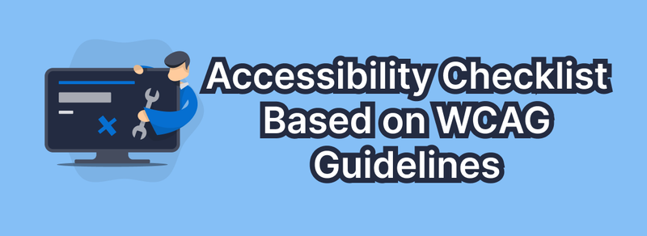

## Accessibility Checklist Based on WCAG Guidelines

This checklist is grounded in the **Web Content Accessibility Guidelines (WCAG)**, which serve as a universal standard for ensuring web content accessibility for individuals, organizations, and governmental bodies.

## WCAG Compliance Levels

There are three levels of compliance with the WCAG accessibility standards, reflecting different priorities:

- **A: Basic Level**
  - If this level is not met, assistive technologies may not correctly read, understand, or fully interact with the page or screen.
- **AA: Optimal Level**
  - Required for most government and public websites. The A11Y project aims to meet AA compliance.
- **AAA: Specialized Level**
  - Typically intended for specific sections of websites and web applications serving specialized audiences.

This checklist covers many, but not all, aspects of levels A and AA. It's important to note that different levels of WCAG support do not necessarily indicate increasing implementation complexity.

### Success Criteria

Each item in this checklist has a corresponding **WCAG success criterion**. Success criteria are specific, testable rules based on WCAG standards, identified by a number and a brief title. For example, the text resizing rule is numbered **1.4.4** and titled **Resize Text**. Some accessibility items may fall under multiple success criteria; we've identified the most relevant criterion for each checklist item

**Will this checklist ensure my website's full accessibility?**

No. However, addressing the issues listed in this checklist will enhance the website's usability for all users. The questions covered by this checklist pertain to a wide range of conditions related to disabilities. There is no concept of "perfect accessibility" or "100% accessible website." Companies and services that promise such results should be approached with caution. If you require professional assistance with accessibility, consider hiring qualified experts.

## Content

Content is the most critical part of a website.

- Use simple language and avoid figurative expressions, idioms, and complex metaphors. Write at an 8th-grade reading level. [Learn more](https://www.w3.org/WAI/WCAG21/quickref/?versions=2.1#readability)
- Ensure that the content of buttons, links, and labels is unique and descriptive. Phrases like "click here" or "read more" provide no context. Some users navigate pages using a list of all buttons or links. In this mode, the text of these elements should indicate what will happen when activated. [Learn more](https://www.w3.org/WAI/WCAG21/quickref/?versions=2.1#info-and-relationships)
- Use left alignment for left-to-right languages (LTR) and right alignment for right-to-left languages (RTL). Centered or justified text is harder to read. [Learn more](https://www.w3.org/WAI/WCAG21/quickref/?versions=2.1#visual-presentation)

## Global Code

Global code affects the entire site or web application.

- Validate your HTML code. Valid HTML helps ensure consistent and expected interactions across all browsers and assistive technologies. [Learn more](https://www.w3.org/WAI/WCAG21/quickref/?versions=2.1#parsing)
- Use the lang attribute in the HTML element. This helps screen readers pronounce the content correctly. [Learn more](https://www.w3.org/WAI/WCAG21/quickref/?versions=2.1#language)
- Provide a unique title for each page or screen. Assistive technologies often announce the `<title>` element found in the `<head>` of the document as the first information. This helps users understand which page or screen they are on. [Learn more](https://www.w3.org/WAI/WCAG21/quickref/?versions=2.1#page-title)
- Ensure that viewport scaling is not disabled. Some users need to increase text size to a comfortable level—do not obstruct this, even if your web application has a native app-like interface. Even native apps should respect operating system settings for text resizing. [Learn more](https://www.w3.org/WAI/WCAG21/quickref/?versions=2.1#resize-text)
- Use semantic elements to denote important content areas. Semantic elements help define the layout and key areas of the page or screen, providing quick access to those areas. For example, use `<nav>` for site navigation and `<main>` for the main content of the page. [Learn more](https://www.w3.org/WAI/WCAG21/quickref/?versions=2.1#name-role-value)
- Ensure a linear order of content. Remove `tabindex` values other than `0` and `-1`. Elements that receive focus by default (links, buttons) do not require `tabindex`. Elements that do not receive focus by default should not contain `tabindex`, except in specific cases. [Learn more](https://www.w3.org/WAI/WCAG21/quickref/?versions=2.1#focus-order)
- Avoid using the `autofocus` attribute. Users with visual impairments may become disoriented when the focus changes without their consent. Additionally, the autofocus attribute can cause difficulties for users with motor impairments, as they may need extra time to leave the `autofocus` area and navigate to other elements on the page or screen. [Learn more](https://www.w3.org/WAI/WCAG21/quickref/?versions=2.1#focus-order)
- Allow session time extension. If you cannot completely disable timeouts, provide users the option to easily disable, change, or extend the session well before it ends. [Learn more](https://www.w3.org/WAI/WCAG21/quickref/?versions=2.1#timing-adjustable)
- Remove title attribute tooltips. The title attribute has numerous issues and should not be used, especially when it is important that the provided information is accessible to all users. An acceptable use of the title attribute might be marking an `<iframe>` element to indicate its content. [Learn more](https://www.w3.org/WAI/WCAG21/quickref/?versions=2.1#name-role-value)

## Keyboard Accessibility

It's essential that the interface and content can be controlled and navigated using a keyboard. Some users cannot use a mouse or may be using other assistive technologies that do not support cursor hovering or precise clicks.

- Ensure that interactive elements navigated via the keyboard have a visible focus style. Can a person using a keyboard, voice control, or screen reader see their current position on the page? [Learn more](https://www.w3.org/WAI/WCAG21/quickref/?versions=2.1#visible-focus)
- Check that the keyboard focus order matches the visual layout. Can a person using a keyboard or screen reader navigate the page predictably? [Learn more](https://www.w3.org/WAI/WCAG21/quickref/?versions=2.1#meaningful-sequence)
- Remove invisible elements that are focusable. Eliminate the ability to focus on elements that should not be visible at the moment—such as inactive dropdowns, off-screen navigation, or modal windows. [Learn more](https://www.w3.org/WAI/WCAG21/quickref/?versions=2.1#focus-order)

## Images

Most websites contain a large number of images—strive to make them accessible to all users. Learn more about all points in [w3.org](https://www.w3.org/WAI/WCAG21/quickref/?versions=2.1#non-text-content).

- Ensure that all `` elements have an `alt` attribute. Alt attributes (alternative text) provide descriptions of images for people who may not be able to see them. If the alt attribute is missing, a screen reader will read out the file name and path instead of its content, which does not convey the meaning of the image.
- Ensure that decorative images use an empty `alt` attribute. An empty `alt` attribute, also known as null alt, is created when there is no information between the opening and closing quotes of the alt attribute. Decorative images do not carry information necessary for understanding the meaning of the page. They were used for decorative elements and separators in the early days of web design, but this is less relevant for modern sites and applications.
- Provide a text alternative for complex images such as diagrams, charts, and maps. Is there a simple text listing points on the map or sections of the diagram? Describe all visible information—axes of charts, data and labels, and the main idea conveyed by the graphics.
- For images containing text, ensure that the alt description includes the text of the image. For example, the image of the FedEx logo should have the alt text "FedEx."

## Headings

Heading elements (h1, h2, h3, etc.) help break content into related chunks of information. They are extremely important for users of assistive technologies, as they help understand the structure and content of a page or screen. Learn more at [w3.org](https://www.w3.org/WAI/WCAG21/quickref/?versions=2.1#headings-and-labels).

- Use heading elements to introduce content. Headings create document structure and should not be used merely for visual presentation.
- Limit the use of h1 elements to one per page or screen. The h1 element should convey the primary purpose of the page or screen. Do not use h1 for titles that remain consistent across different pages or screens (e.g., website name).
- Ensure that heading elements are in logical order. The heading order should be descending based on the content's "depth"—for instance, an h4 element should not appear before the first h3 element. Use tools like headingsMap for assessment.
- Avoid skipping heading levels. For example, do not jump from h2 to h4, bypassing h3. If heading levels are skipped for a specific visual effect, consider using CSS classes instead.

## Lists

List elements (ol, ul, dl) help users understand that a set of items is related, follows a sequence, or consists of a specific number of items.

- Use list elements to present content in a list format. This can include related content sections, items displayed in a grid, or adjacent elements. [Learn more](https://www.w3.org/WAI/WCAG21/quickref/?versions=2.1#info-and-relationships).

## Controls

Controls are interactive elements, such as links and buttons, that allow users to navigate to desired destinations or perform actions.

- Use the `<a>` element for links. Links should always have an `href` attribute, even in single-page applications (SPA). Without an `href`, the link will not be accessible to assistive technologies, particularly if an onclick event is used instead. [Learn more](https://www.w3.org/WAI/WCAG21/quickref/?versions=2.1#info-and-relationships).
- Ensure that links are easily recognized as such. A single color is insufficient to indicate a link. Use styles like underlining, bolding, or contrasting colors to differentiate links from regular text. [Learn more](https://www.w3.org/WAI/WCAG21/quickref/?versions=2.1#links).

This rewritten checklist provides a comprehensive guide to accessibility best practices according to WCAG, along with relevant links for further exploration. If you need more sections or specific details on tables, forms, media, etc., let me know!
