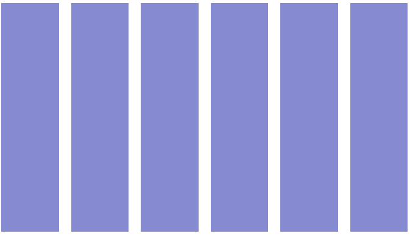
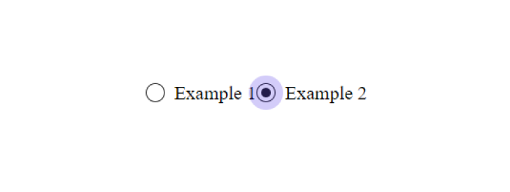

CSS continues to evolve, offering new tools and techniques for web designers and developers to
create visually stunning and highly functional websites. Staying up to date with the latest trends
and best practices is essential. Here are 10 CSS tips you must know about in 2024 to enhance your
web development skills and create cutting-edge designs.

Check also [**10 HTML Tips You Must Know About in 2024**](/10-html-tips).

## 1. The \:has() pseudo-class Selector

The **:has()** pseudo-class selector is a powerful addition to CSS, allowing you to style elements
based on their descendants or other specific conditions within them. This selector enables you to
apply styles to a parent element if it contains certain child elements or meets specific criteria.
For example, you can highlight a div that contains an image or change the background of a list item
that has a link. The **:has()** selector greatly enhances the flexibility and specificity of CSS,
making it easier to create dynamic, conditionally styled layouts.

### Example - Card hover with :not() Selector

1. Create index.html and style.css files:

**index.html**

```html
<!DOCTYPE html>
<html lang="en">
  <head>
    <meta charset="UTF-8" />
    <meta name="viewport" content="width=device-width, initial-scale=1.0" />
    <title>Document</title>
    <link rel="stylesheet" href="style.css" />
  </head>
  <body>
    <div class="cards">
      <div class="card"></div>
      <div class="card"></div>
      <div class="card"></div>
      <div class="card"></div>
      <div class="card"></div>
      <div class="card"></div>
    </div>
  </body>
</html>
```

**style.css** file:

```css
.cards {
  display: flex;
  gap: 1rem;
}
.card {
  width: 100%;
  height: 300px;
  background-color: rgb(12, 22, 164);
  transition: opacity 0.4s ease;
}
.cards:hover > :not(:hover) {
  opacity: 0.5;
}
```

Now we have a six cards inside a flex container


2. Add hover to them

```css
.cards:hover > :not(:hover) {
  opacity: 0.5;
}
```



Now we have a bug. If you hover between the cards, all cards will have an opacity of 0.5, and none
will be selected. To fix it add visibile to the .card selector

```css
.cards {
  display: flex;
  gap: 1rem;
  visibility: hidden;
}
.card {
  visibility: visible;
  width: 100%;
  height: 300px;
  background-color: rgb(12, 22, 164);
  transition: opacity 0.4s ease;
}
.cards:hover > :not(:hover) {
  opacity: 0.5;
}
```

<Codepen id='YzoRLyK' />

## 2. The \:focus-within pseudo-class

The CSS **:focus-within** selector is a powerful tool that allows you to apply styles to a parent
element when any of its child elements receive focus. This is particularly useful for enhancing user
interaction with forms, menus, and interactive components. By using **:focus-within**, you can
highlight or style entire sections of your page when users navigate through them using a keyboard or
mouse, improving accessibility and user experience.

As we know, the traditional method for creating custom radio buttons involved using the adjacent
sibling combinator **(+)**. You’re probably familiar with it. However, modern CSS features now offer
a different and more efficient approach.

### Example: Radio Buttons with :focus-within

1. Create a html and css files:

**index.html**

```html
<!DOCTYPE html>
<html lang="en">
  <head>
    <meta charset="UTF-8" />
    <meta name="viewport" content="width=device-width, initial-scale=1.0" />
    <title>Document</title>
    <link rel="stylesheet" href="style.css" />
  </head>
  <body>
    <div class="radio-button">
      <input
        id="rb-1"
        class="radio-button__input sr-only"
        type="radio"
        name="radio"
        checked
      />
      <label for="rb-1" class="radio-button__label">Example 1</label>
    </div>
    <div class="radio-button">
      <input
        id="rb-2"
        class="radio-button__input sr-only"
        type="radio"
        name="radio"
      />
      <label for="rb-2" class="radio-button__label">Example 2</label>
    </div>
  </body>
</html>
```

**style.css**

```css
body {
  display: flex;
  justify-content: center;
  align-items: center;
  height: 90vh;
}

.sr-only {
  width: 1px;
  height: 1px;
  clip-path: inset(50%);
  overflow: hidden;
  position: absolute;
  white-space: nowrap;
}

.radio-button {
  --radio-button-size: 1rem;
  --radio-button-gap: 1rem;
  --radio-button-dot-size: 0.5rem;

  display: inline-flex;
  align-items: center;
  position: relative;
  isolation: isolate;
}

.radio-button::before {
  content: '';
  box-sizing: border-box;
  width: var(--radio-button-size);
  height: var(--radio-button-size);

  border: 1px solid #242424;
  border-radius: 100%;
  position: absolute;
  z-index: -1;
}

.radio-button__label {
  display: grid;
  padding-left: calc(var(--radio-button-dot-size) + var(--radio-button-gap));
}

.radio-button__label::before,
.radio-button__label::after {
  content: '';
  border-radius: 100%;
  opacity: 0;

  position: absolute;
  align-self: center;
  left: var(--radio-button-dot-size);
  transform: translateX(-50%);
  scale: 0;
  transform-origin: left center;
}

.radio-button__label::before {
  border-top: var(--radio-button-dot-size) solid #242424;
  border-left: var(--radio-button-dot-size) solid #242424;
  transition: 0.3s;
}

.radio-button__label::after {
  width: var(--radio-button-dot-size);
  height: var(--radio-button-dot-size);

  background-color: #2500e0;
  transition: 0.6s;
}
```

We’ve created simple buttons, and now there’s just one final step. We need to write the code for the
states when the radio button is focused or selected. As I mentioned earlier, this will be based on
the adjacent sibling combinator (+).

```css
.radio-button__input:checked + .radio-button__label::before {
  opacity: 1;
  scale: 1;
}

.radio-button__input:focus + .radio-button__label::after {
  scale: 3.6;
  opacity: 0.2;
}
```



What's the issue? If, in the markup, the element with the class .**radio-button\_\_input**
accidentally stops being placed before the .**radio-button\_\_label** element, the styling will
break completely. This is the downside of relying on the adjacent sibling combinator **(+)**.

The modern CSS doesn't have this bug because it relies on the **:has()** and **:focus-within**
pseudo-classes.

2. Add :focus-within selector

```css
.radio-button:has(:checked) .radio-button__label::before {
  opacity: 1;
  scale: 1;
}

.radio-button:focus-within .radio-button__label::after {
  scale: 3.6;
  opacity: 0.2;
}
```

<Codepen id='LYKXraz' />

## 3. The inset Property

Sometimes, elements with the **position** property set to **absolute** are used to stretch an
element across all available space. The most common code for this looks like:

```css
.parent {
  position: relative;
}

.parent::before {
  content: '';
  width: 100%;
  height: 100%;

  position: absolute;
  top: 0;
  left: 0;
}
```

This snippet is outdated because it can be simplified. The **inset** property allows you to set the
coordinates for all four sides of an element at once, replacing the need for **top**, **right**,
**bottom**, and **left**.

To update the example, you can remove the **width** and **height** properties. Since .parent has
position: **absolute**, its size can be determined by the specified offsets.

In this case, we’ll use **inset: 0** to achieve the same effect.

```css
.parent {
  position: relative;
}

.parent::before {
  content: '';
  position: absolute;
  inset: 0;
}
```

## 4. CSS Variables

**CSS Variables**, also known as custom properties, are a powerful feature that allows you to store
and reuse values throughout your stylesheet. They enable you to define values like colors, fonts, or
dimensions in one place, making your code more maintainable and flexible.

When coding a project, it's common to write a lot of rules inside media queries, which can make the
code difficult to navigate. To illustrate this problem, I’ll provide styles for two elements with
the classes **.heading** and **.description**.

```css
.heading {
  font-size: 2rem;
}

.description {
  font-size: 0.75rem;
}

@media (min-width: 641px) {
  .heading {
    font-size: 3rem;
  }

  .description {
    font-size: 1.25rem;
  }
}

@media (min-width: 1025px) {
  .heading {
    font-size: 3.5rem;
  }

  .description {
    font-size: 1.5rem;
  }
}
```

Previously, we had to write separate rules for every property change. For instance, to adjust the
font-size in each media query, we needed two rules for both **.heading** and **.description**. This
approach was inefficient before custom properties came along.

Now, with custom properties, we can set base values and modify them inside media queries using a
parent element. This way, we only need one rule per media query instead of many.

```css
.heading {
  font-size: var(--heading-font-size, 2rem);
}

.description {
  font-size: var(--hint-font-size, 0.75rem);
}

@media (min-width: 648px) {
  .text {
    --heading-font-size: 3rem;
    --hint-font-size: 1.25rem;
  }
}

@media (min-width: 1280px) {
  .text {
    --heading-font-size: 3.5rem;
    --hint-font-size: 1.5rem;
  }
}
```

## 5. place-items property

For a long time, the **transform** property has been the go-to method for centering an element with
position: **absolute**. The technique involves two key steps.

First, move the element 50% away from the top and left edges using the top and left properties.
Then, apply **translate(-50%, -50%)** to shift it back by half of its width and height.

```css
.elem {
  width: 200px;
  height: 200px;
  position: relative;
}

.elem::before {
  width: 22px;
  height: 22px;

  position: absolute;
  top: 50%;
  left: 50%;
  transform: translate(-50%, -50%);
}
```

Today, there's a simpler method available. We can use the **place-items** property.

```css
.elem {
  width: 20rem;
  height: 20rem;

  display: grid;
  place-items: center;
}

.elem::before {
  width: 2rem;
  height: 2rem;
  position: absolute;
}
```

## 6. scrollbar-gutter property

The **scrollbar-gutter** property provides control over the space allocated for scrollbars in your
layout. This property helps manage how scrollbars impact the layout, especially when it comes to
accommodating their width and avoiding layout shifts when they appear or disappear.

It ensures that space is reserved for scrollbars, preventing content from shifting when the
scrollbar appears.

```css
body {
  scrollbar-gutter: stable;
}
```

## 7. system-ui fonts

Now you can change something like this:

```css
body {
  font-family: var(
    --main-font,
    -apple-system,
    BlinkMacSystemFont,
    Segoe UI,
    Roboto,
    Open Sans,
    Ubuntu,
    Fira Sans,
    Helvetica Neue,
    sans-serif
  );
}
```

to:

```css
body {
  font-family: var(--main-font, system-ui);
}
```

## 8. :lang() pseudo class

### How to Use :lang() Pseudo-Class

**Syntax:**

```css
:lang(en) {
  font-style: italic;
}
```

**language** specifies the language code (e.g., en, fr, de).

### Example Usage

```css
:lang(fr) {
  font-family: 'Courier New', monospace;
  text-align: center;
}
```

HTML Example:

```html
<p lang="en">This is an English paragraph.</p>
<p lang="fr">Ceci est un paragraphe en français.</p>
```

### Combine :lang() pseudo class with :not()

```css
:not(:lang(fr)) {
  font-style: italic;
}
```

In the HTML above, the paragraphs will be styled according to their language attribute,
demonstrating how the **:lang()** pseudo-class can be used to handle language-specific styling
effectively.

## 9. aspect-ratio property

The **aspect-ratio** property in CSS is a powerful tool that allows you to control the aspect ratio
of an element, ensuring it maintains a specific ratio between its width and height. This property is
especially useful for responsive design, maintaining the proportion of elements across various
screen sizes.

**Syntax:**

```css
.img {
  aspect-ratio: 1/3;
}
```

### Example Usage

```css
.media {
  aspect-ratio: 12 / 8; /* Width is 12 units for every 8 units of height */
  width: 100%;
  background-color: 'red';
}
```

By using the **aspect-ratio** property, you can create more flexible and responsive designs,
ensuring elements maintain their proportions across different devices and screen sizes.

## 10. :is() pseudo-class

The **:is()** pseudo-class in CSS simplifies applying styles to multiple selectors by allowing you
to group them together in a single rule. This makes your CSS more readable and easier to manage,
especially when you need to apply the same styles to various elements.

### Example Usage

**Syntax:**

```css
:is(h1, h2, h3) {
  text-transform: uppercase;
}
```

In this example, all **h1**, **h2**, and **h3** elements will have uppercase text.

### Combining with Other Selectors

```css
:is(.button, .link) {
  color: white;
  padding: 1rem;
}
```

**:is()** reduces repetition by allowing you to group multiple selectors together.

By mastering these 10 CSS tips, you'll be well-equipped to create modern, responsive, and dynamic
web designs in 2024. Whether you’re building a personal project or working on a client site, these
tips will help you write cleaner, more efficient CSS that stands out.
