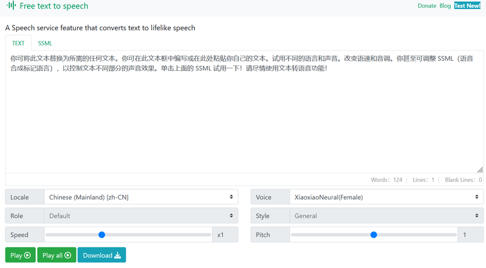
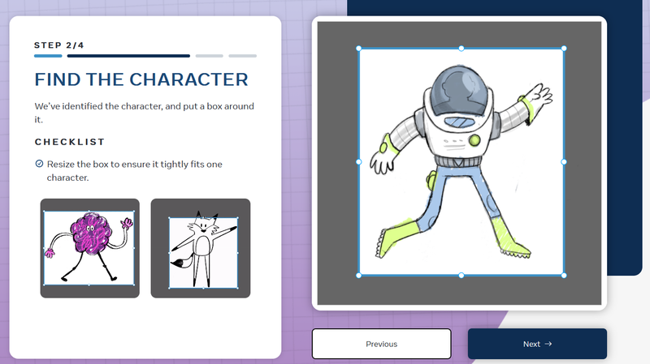
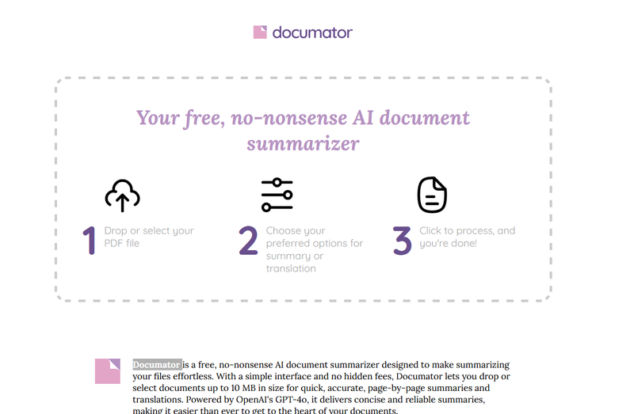
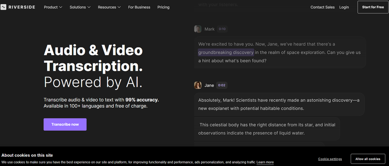
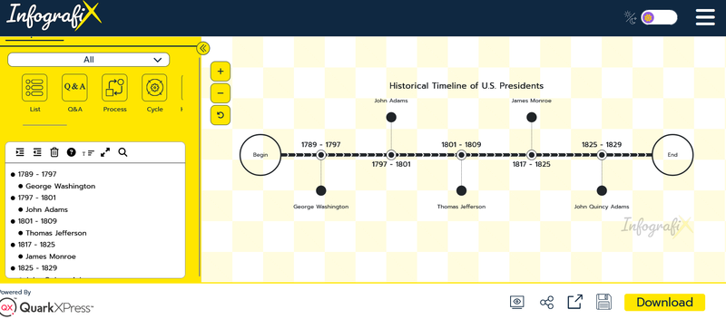
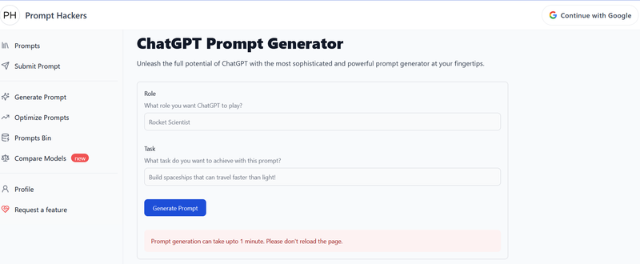
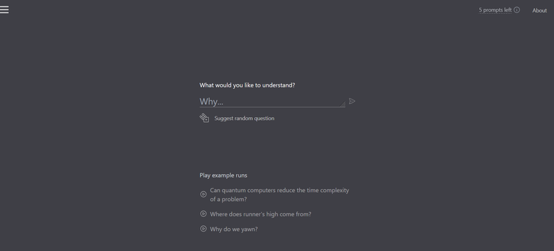
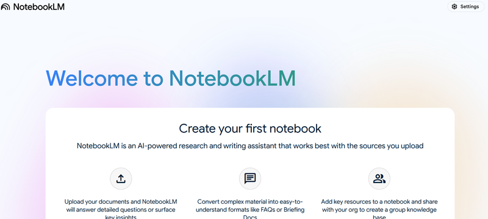
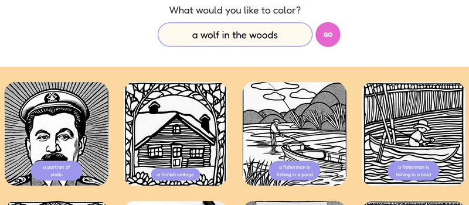

Looking to leverage AI without the hassle of signing up? Here’s a curated list of 10 free AI tools that don’t require registration. Dive in and explore these incredible options while they’re still free!

## 1. Text-to-Speech Generator

[Text-to-Speech Online](https://www.text-to-speech-online.com/) is a powerful tool for converting written content into clear, natural-sounding audio. With support for multiple languages, diverse voice options, and customizable settings like pitch, speed, and volume, it caters to a wide range of users. Whether you’re creating audiobooks, presentations, podcasts, or enhancing accessibility for the visually impaired, this platform offers seamless and efficient solutions. Its user-friendly interface ensures quick and accurate text-to-audio conversion, making it an essential resource for educators, content creators, businesses, and individuals seeking high-quality audio output.

## 2. Animated Drawings

[Sketch](https://sketch.metademolab.com/) by Meta Demo Lab is a cutting-edge, AI-powered platform designed to revolutionize digital sketching. With intuitive tools and advanced AI assistance, it transforms simple drawings into polished artwork effortlessly, making it perfect for artists, designers, and beginners alike. The platform offers real-time feedback, precision tools, and customizable features, ensuring a seamless creative process. While its brush variety and offline functionality could be expanded, Sketch excels in accessibility and efficiency. Whether you're a hobbyist or a professional, it’s an excellent tool for creating high-quality digital artwork with ease.

## 3. Documator

[Documator](https://documator.cc/) is an advanced, cloud-based document automation and management platform designed to streamline workflows and increase efficiency for businesses of all sizes. It offers a comprehensive suite of tools to create, edit, organize, and manage documents with precision and speed. Users can generate documents automatically by integrating Documator with popular tools and systems, including CRMs, ERPs, and databases, eliminating repetitive manual tasks.

The platform’s intuitive interface allows you to design templates, set conditional logic, and customize fields to suit specific business needs. With robust collaboration features, teams can work together seamlessly, tracking changes, sharing files, and ensuring version control in real-time. Security is a top priority, with features such as encryption, role-based access, and compliance with data protection regulations like GDPR and HIPAA.

Documator is ideal for industries like legal, finance, HR, and sales, where precision and speed are critical. From generating contracts, invoices, and reports to managing workflows and approvals, it simplifies complex processes and reduces errors. Whether you’re a small business seeking to improve productivity or a large enterprise aiming for scalable document solutions, Documator provides a reliable, feature-rich environment to meet your goals.

## 4. Supawork.ai

[SupaWork AI Professional Headshot Generator](https://supawork.ai/ai-professional-headshot-generator) is a cutting-edge tool designed to create stunning, high-quality professional headshots effortlessly. Using advanced AI technology, it transforms your uploaded photos into polished, studio-quality images suitable for LinkedIn, resumes, portfolios, and more. Customize your headshot with various styles, backgrounds, and enhancements to suit your personal brand or industry standards. Whether you're updating your professional profile or building an online presence, SupaWork offers a quick and convenient solution to achieve a professional look without the need for expensive photoshoots.

## 5. Riverside

[Riverside.fm Transcription](https://riverside.fm/transcription) is a powerful feature designed to simplify audio and video transcription with unmatched accuracy and speed. Leveraging advanced AI technology, this tool seamlessly converts recorded content into text, making it ideal for podcasters, journalists, educators, and businesses. Whether you're creating captions, summarizing meetings, or preparing interview transcripts, Riverside.fm ensures clear, error-free results.

The transcription tool supports multiple languages and offers features like speaker identification, time-stamped segments, and formatting options for easy readability. Its intuitive interface allows users to upload files or transcribe directly from Riverside’s recording platform, saving time and effort. With real-time transcription capabilities, users can access text immediately after recording, streamlining workflows and improving efficiency.

[Riverside.fm](https://riverside.fm/) also prioritizes data security, ensuring your files remain private and encrypted throughout the transcription process. Designed for collaboration, the platform enables teams to edit, review, and share transcripts seamlessly. Additionally, its integration with popular editing and publishing tools allows for quick export and sharing.

## 6. Infografix

[Infografix](https://infografix.app) is a powerful, user-friendly platform designed to help users create stunning infographics, presentations, and data visualizations with ease. Whether you're a marketer, educator, business professional, or student, Infografix offers the tools you need to turn complex data into visually engaging content that captivates your audience.

The platform provides a vast library of customizable templates, icons, charts, and design elements to suit various themes and industries. Users can effortlessly upload their own data or integrate with external tools to generate accurate and dynamic visuals. With drag-and-drop functionality and intuitive editing tools, creating professional-grade infographics requires no prior design experience.

Infografix also includes advanced features like real-time collaboration, enabling teams to work on projects together seamlessly. Its cloud-based infrastructure ensures your designs are always accessible, while robust export options let you download your work in multiple formats, including PNG, PDF, and SVG, for presentations, social media, or print.

Security and performance are top priorities, with features like data encryption and responsive customer support. Infografix is ideal for simplifying data storytelling, improving communication, and elevating your content creation efforts. Whether crafting reports, marketing materials, or educational tools, Infografix empowers you to create impactful visuals effortlessly.

## 7. Prompt Hackers

[PromptHackers.co](https://www.prompthackers.co/chatgpt-prompt-generator) is a powerful online platform dedicated to helping users generate high-quality, effective prompts for ChatGPT. Whether you’re a content creator, marketer, student, or professional, this tool simplifies the process of crafting prompts that produce accurate, engaging, and contextually relevant responses from AI models. With an intuitive interface, PromptHackers offers a wide range of pre-built templates, customization options, and advanced features to fine-tune your prompts according to your specific needs.

The platform supports various use cases, including creative writing, content generation, coding assistance, brainstorming, and more. By leveraging cutting-edge algorithms, PromptHackers ensures that users can unlock the full potential of ChatGPT, optimizing output efficiency and saving valuable time. Its smart suggestion engine allows you to refine prompts easily, while real-time feedback helps you perfect your queries for the best results.

Additionally, PromptHackers fosters collaboration, enabling teams to share, edit, and improve prompts together. With built-in analytics and usage insights, users can track the effectiveness of their prompts and make data-driven adjustments. Whether you’re looking to streamline content creation, enhance customer support, or boost productivity, PromptHackers.co is your go-to resource for generating precise and impactful prompts effortlessly.

## 8. Whybot

[WhyBot](https://whybot-khaki.vercel.app/) is an intuitive, AI-powered chatbot designed to enhance customer support, automate tasks, and streamline communication for businesses. Built on advanced natural language processing (NLP) technology, WhyBot understands user queries and provides accurate, helpful responses in real-time. It can handle a wide range of inquiries, from answering FAQs to assisting with bookings, troubleshooting issues, and guiding users through workflows.

The platform offers a simple yet customizable interface, making it easy to set up and integrate into your existing systems without requiring extensive technical expertise. WhyBot supports multiple languages and provides seamless handoff options to human agents when more complex issues arise. With built-in analytics and usage tracking, businesses can monitor performance, gather insights, and continuously improve customer service experiences.

Whether you’re looking to reduce response times, improve customer satisfaction, or scale your support operations, WhyBot offers a powerful solution that adapts to your business needs and grows alongside your customer base.

## 9. NotebookLM

[NotebookLM](https://notebooklm.google.com/?pli=1) by Google is an advanced AI-powered tool designed to assist users in creating, organizing, and analyzing documents with ease. Built on cutting-edge machine learning models, it combines natural language processing (NLP) with powerful data insights to enhance productivity across various tasks. Whether you're working on research, drafting reports, or managing notes, NotebookLM provides smart suggestions, contextual understanding, and seamless integration with Google Workspace.

The platform allows you to easily input text, organize information, and collaborate in real-time with others. Its intuitive interface features tools for summarization, question-answering, content generation, and content refinement, making it ideal for students, professionals, and teams looking to streamline their workflow. NotebookLM also supports advanced search functionalities and offers customizable templates to fit different project needs.

With built-in collaboration features, users can share notebooks, provide feedback, and work together on projects efficiently. Additionally, NotebookLM integrates with other Google tools like Docs, Sheets, and Drive, ensuring a smooth and interconnected experience. Whether you're conducting research, creating content, or analyzing data, NotebookLM by Google simplifies complex tasks and boosts productivity through its intelligent, AI-driven capabilities.

## 10. Color anything

[Color Anything](https://color-anything.com/) is an innovative online platform that allows users to transform black-and-white images into vibrant, full-color artwork. Using advanced AI technology, the tool intelligently analyzes grayscale photos and applies realistic colors based on its deep learning models. Whether you’re bringing old photographs to life, enhancing digital images, or creating visually engaging content, Color Anything makes the process simple and accessible for everyone.

The platform offers a user-friendly interface, where users can upload their images, adjust color intensity, and fine-tune the results to achieve the desired effect. With its powerful colorization algorithms, Color Anything ensures highly accurate and natural-looking results, preserving the original details while adding vibrant hues. It supports various image formats and allows for batch processing, making it ideal for both casual users and professionals.

Whether you're a photographer, historian, content creator, or simply looking to add life to old memories, Color Anything offers a seamless and efficient solution to breathe new life into grayscale images.

Try these tools now! AI technology is advancing quickly, so take advantage of these free resources while they last. Enhance your productivity, creativity, and efficiency with these innovative platforms that require no registration. Dive in and explore the possibilities today!
