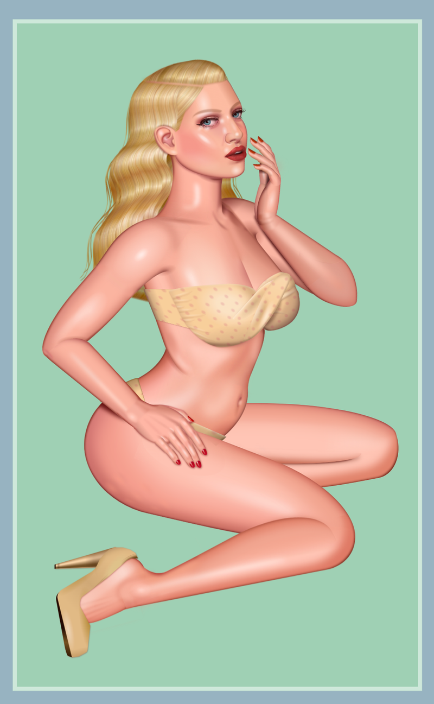
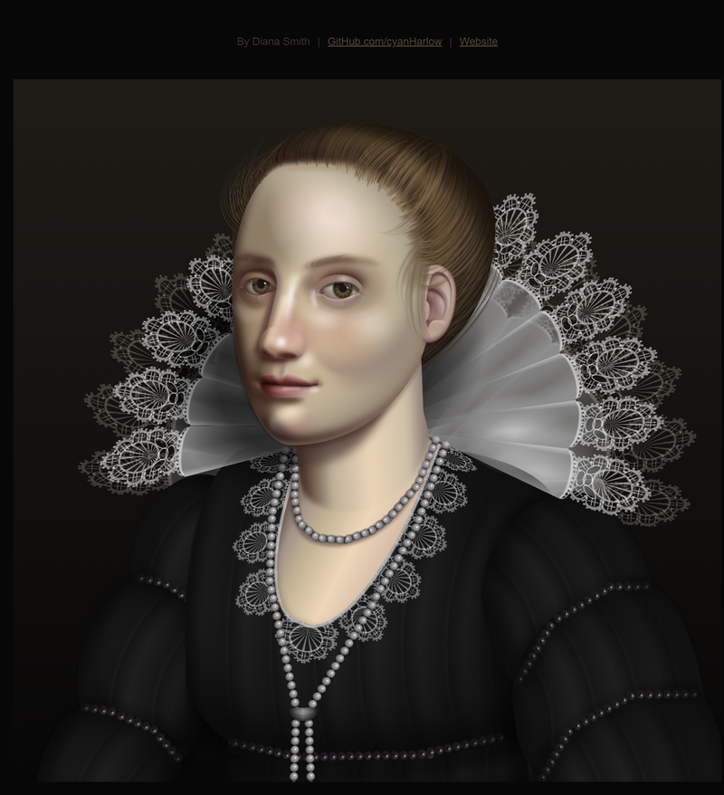
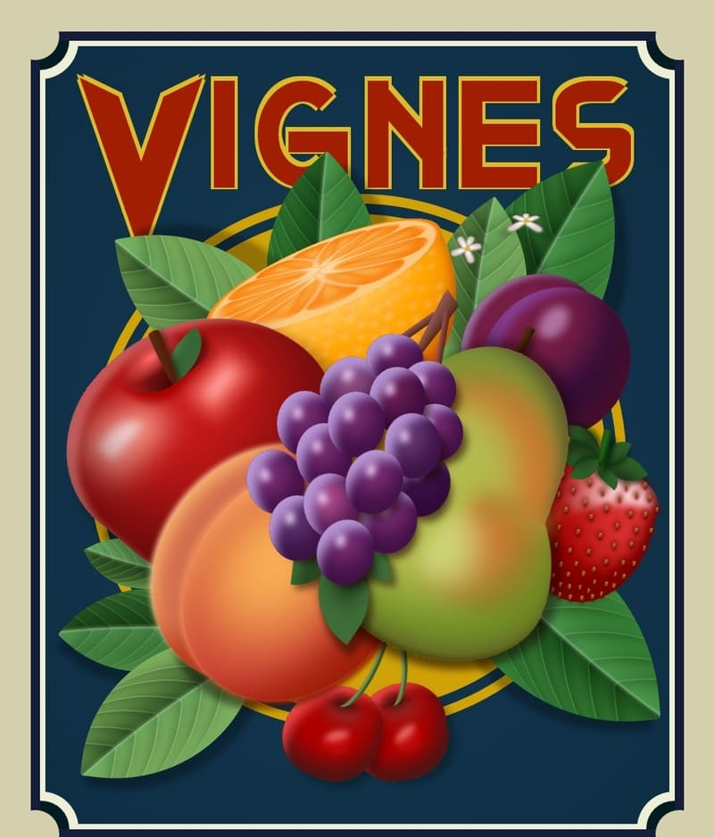
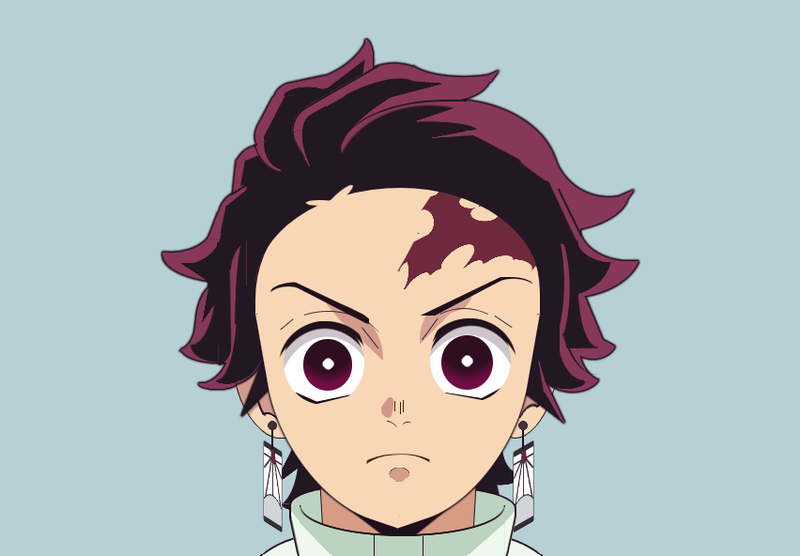
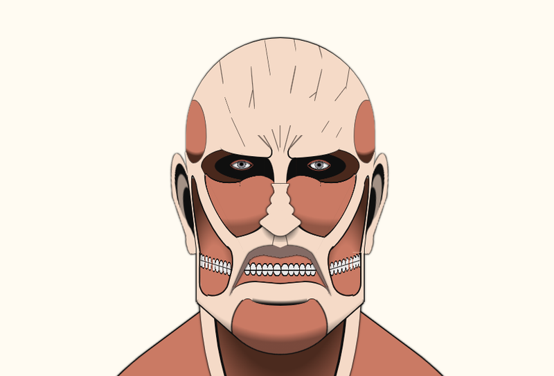
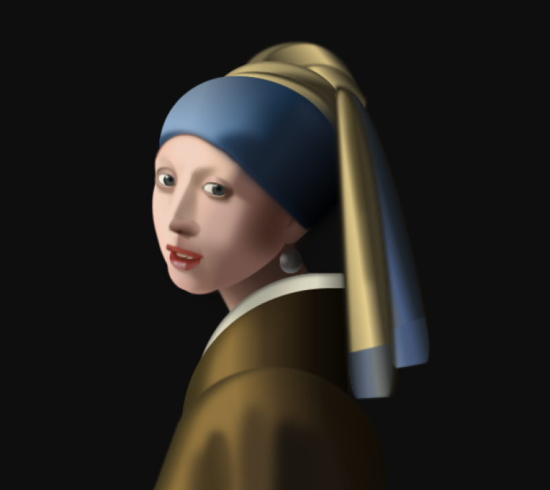
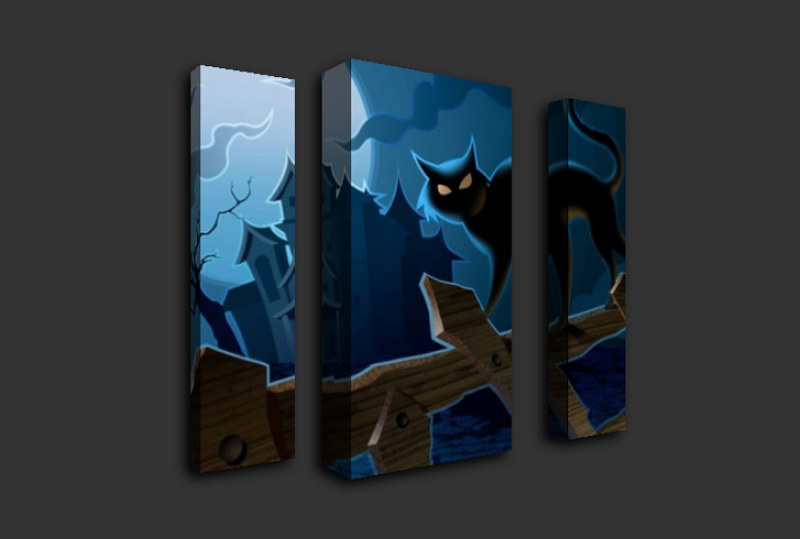
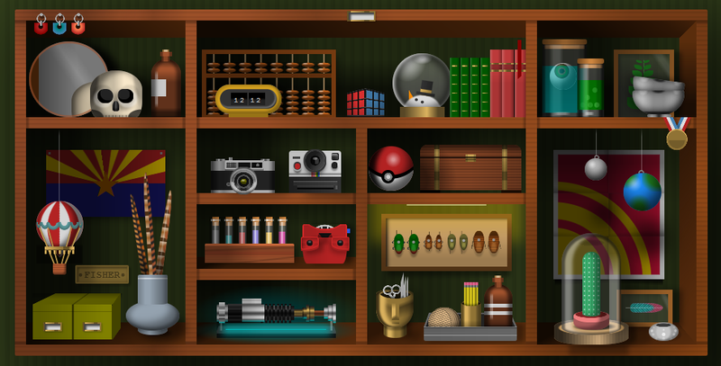
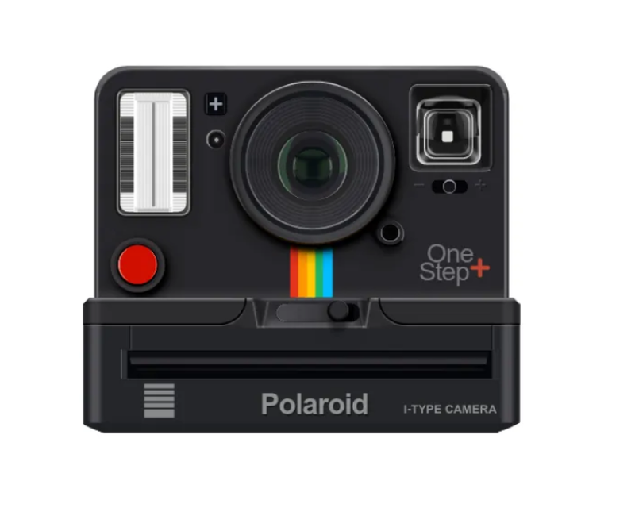
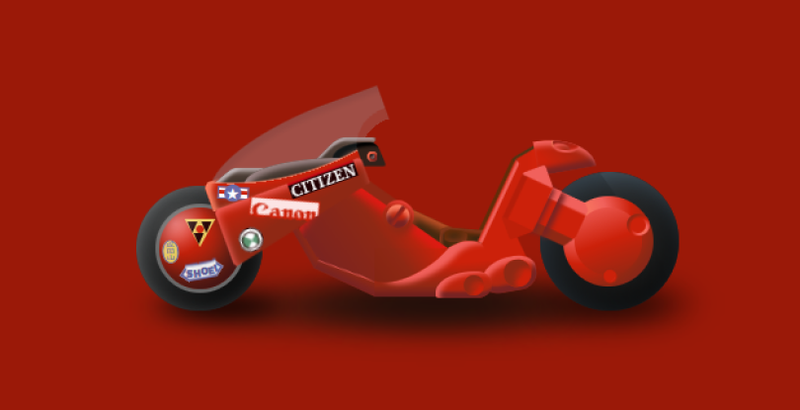

Looking for a dose of inspiration for your next web design project? These 11 CSS artists push the
boundaries of creativity and technical skill, showcasing what’s possible with nothing but code.
Discover the innovators who are transforming the world of front-end development with stunning
animations, layouts, and interactive designs.

While many use CSS to make websites look professional and functional, some artists have taken it to
the next level, creating mind-blowing art and interactive experiences using just **CSS**. These "CSS
artists" push the boundaries of what’s possible on the web, blending creativity with technical
prowess. In this article, we’ll explore 11 CSS artists whose work will leave you inspired and
amazed.

### 1. Diana Smith

**Diana Smith** is arguably the most well-known **CSS artist** today. She gained recognition for her
remarkable ability to recreate classical paintings and portraits using nothing but HTML and CSS. Her
attention to detail and technical mastery is evident in projects like "Pure CSS Pinup", a portrait
done entirely in CSS without any images. Diana’s work is a testament to how far CSS can be stretched
to create realistic, artistic renderings.

Diana’s [website](https://diana-adrianne.com) | [github](https://github.com/cyanharlow)

### 2. Temani Afif

**Temani Afif** is a prominent figure in the world of CSS and front-end web development. Known for
his deep technical knowledge and innovative approaches, Temani has made significant contributions to
the CSS community, particularly through his extensive collection of CSS tips, tricks, and code
snippets. His work often explores the less commonly used, but highly powerful features of CSS, such
as advanced selectors, grid layouts, and complex animations.

Temani frequently shares his insights through
[blog posts](https://www.smashingmagazine.com/author/temani-afif/), tutorials, and on platforms like
[CodePen](https://codepen.io), where his projects often highlight unique ways to solve common
front-end challenges. One of the standout aspects of Temani's work is his ability to solve complex
design problems with minimal or pure CSS, reducing the need for JavaScript in many cases.

Temani's [website](https://css-only.art/)

### 3. Louise Flanagan

**Louise Flanagan** is a talented front-end developer and **CSS artist** known for her expertise in
CSS animations, web design, and interactive elements. She is widely recognized for her creative use
of CSS to craft visually stunning and highly engaging user interfaces. Louise’s work showcases the
artistic side of web development, demonstrating how CSS can be used to create intricate designs and
fluid animations that enhance user experience.

Louise shares her knowledge and innovative techniques through various platforms, often contributing
to the development community with code snippets, blog posts, and tutorials. Her projects often
emphasize the balance between aesthetics and functionality, illustrating how well-executed CSS can
elevate the overall feel of a website. She has also gained attention for her creative experiments
with CSS and SVG, blending these two technologies to create highly interactive and visually
appealing web elements.

<Codepen id='XWXKVbW' />

Louise's [webiste](https://lou-flan.com/) | [codepen](https://codepen.io/louflan)

### 4. Ana Tudor

**Ana Tudor** is famous for combining CSS with complex mathematics to create intricate designs and
animations. Her unique approach often involves using trigonometric functions to generate stunning
geometric art, proving that CSS can be much more than just a styling language. Ana’s work shows how
mathematical principles can lead to artistic creations, making her an innovator in the field.

<Codepen id='LYWeOPP' />
<Codepen id='BWZrwG' />

Ana's [youtube](https://www.youtube.com/anatudor) | [twitter](https://x.com/anatudor)

### 5. Yusuke Nakaya

**Yusuke Nakaya** excels in crafting dynamic and interactive experiences using CSS combined with
JavaScript. His designs often feature fluid simulations and responsive interfaces that showcase his
technical prowess. Yusuke’s ability to seamlessly merge creativity with technical complexity makes
him a key figure in the world of front-end development.

<Codepen id='mdVZLmY' />
<Codepen id='MEpBbB' />

Yusuke’s [codepen](https://codepen.io/YusukeNakaya) | [dribbble](https://dribbble.com/yusukeMX5)

### 6. Lynn Fisher

**Lynn Fisher** is known for her minimalist yet intricate **CSS art**. She runs the project A Single
Div, which features detailed illustrations made entirely from one HTML element—a single div. The
creativity and technical skill required to achieve this minimalistic beauty with such little code
make her a standout in the CSS art world.

<Codepen id='VwwWXwR' />

Lynn's [website](https://lynnandtonic.com/) | [a single div](https://a.singlediv.com/) |
[codepen](https://codepen.io/lynnandtonic)

### 7. Kassandra Sanch

**Kassandra Sanch** is an emerging talent in the world of **CSS art** and front-end development.
Known for her distinctive style and creative approach, Kassandra has made a name for herself by
crafting intricate web designs and animations using CSS and minimal JavaScript. Her work often
emphasizes elegant, minimalist designs with an artistic flair, showing how even simple code can
result in visually captivating web experiences.

Kassandra's projects frequently explore the possibilities of pure CSS for creating visually stunning
effects, from subtle animations to detailed illustrations.

Kassandra's [website](https://www.cssartist.com/) | [codepen](https://codepen.io/kassandrasanch) |
[twitter](https://x.com/KassandraSanch)

### 8. Annie Bombanie

**Annie Bombanie** is a talented and innovative **CSS artist** and front-end developer known for her
playful, vibrant designs and creative approach to web development. Her unique style often combines
bold colors, dynamic animations, and whimsical elements, making her work stand out in the web design
community. Annie's ability to transform ordinary web elements into delightful interactive
experiences has gained her a loyal following among developers and designers alike.

Annie is particularly well-known for her experiments with pure CSS art and animations, showcasing
how CSS can be used to create intricate visuals without the need for heavy JavaScript or external
libraries. Her work often features characters, objects, and scenes that come to life through
carefully crafted CSS keyframes and transitions, demonstrating the potential of CSS as a medium for
creative expression. Annie shares her passion for design through tutorials and blog posts, making
her knowledge accessible to others and inspiring developers to embrace the artistic side of web
development.

<Codepen id='NWGwzzJ' />
<Codepen id='BaKXPaE' />

Annie's [website](https://anniebombanie.com/) | [codepen](https://codepen.io/anniebombanie)

### 9. Mike Mangialardi

**Mike Mangialardi** is a skilled front-end developer and **CSS artist** known for his creative and
technically impressive work in the world of web development. With a deep passion for design and user
experience, Mike specializes in creating visually stunning websites and applications that leverage
the full power of modern CSS. His expertise in CSS animations, responsive design, and interactive UI
components has earned him recognition in the development community.

Mike’s work often explores how CSS can be used to create seamless user experiences with dynamic,
engaging animations and layouts that are both functional and aesthetically pleasing. He is
particularly interested in improving user interactions through design, using CSS to enhance the flow
and feel of web applications. Mike regularly shares his knowledge through tutorials, code snippets,
and talks, making him an influential figure for developers looking to refine their CSS skills.

<Codepen id='pNLELz' />
<Codepen id='zoKaOp' />

Mike's [website](https://www.michaelmang.dev/) | [codepen](https://codepen.io/mikemang)

### 10. Shunya Koide

**Shunya Koide** is a highly innovative front-end developer and **CSS artist** renowned for his
exceptional use of CSS and JavaScript to create visually stunning and interactive web experiences.
His work is often characterized by intricate animations, advanced layouts, and fluid transitions
that push the boundaries of what CSS can achieve. Shunya's creativity and technical skill have made
him a respected figure in the web development community, especially among developers who are
passionate about creative coding.

One of Shunya's defining qualities is his ability to blend technical complexity with aesthetic
beauty. He frequently experiments with new ways to animate and design elements purely with CSS,
often creating designs that feel more like digital art than traditional web layouts. His work
showcases the versatility of CSS, demonstrating how it can be used to build dynamic, interactive
user interfaces without heavy reliance on JavaScript frameworks. Shunya's contributions are a source
of inspiration for developers looking to elevate their design skills and create immersive user
experiences.

 

Shunya's [website](https://www.shunyakoide.com/) | [codepen](https://codepen.io/shunyadezain)

### 11. Lea Verou

**Lea Verou** is a renowned CSS developer and advocate for open web standards. She’s well-known for
her detailed understanding of CSS and her incredible demos. Lea often shares insightful tools and
techniques, such as [CSS3 Patterns Gallery](https://projects.verou.me/css3patterns/) and
[prism.js](https://prismjs.com), a lightweight syntax highlighter. Her artistic approach to CSS
allows developers to create striking visuals with minimal code. Her work isn’t just beautiful but
also practical, making her a standout in the community.

<Codepen id='oNbGzeE' />
<Codepen id='RwrLPer' />

Lea's [website](https://lea.verou.me/) | [dribbble](https://dribbble.com/leaverou)

These 10 **CSS artists** have taken front-end development to new heights, showing us that CSS is
more than just a tool for styling web pages. Through their creativity, innovation, and technical
mastery, they have proven that CSS can be an art form in its own right. Whether you're a seasoned
developer or just starting out, these artists are sure to inspire you to experiment with CSS and
explore its full potential.
