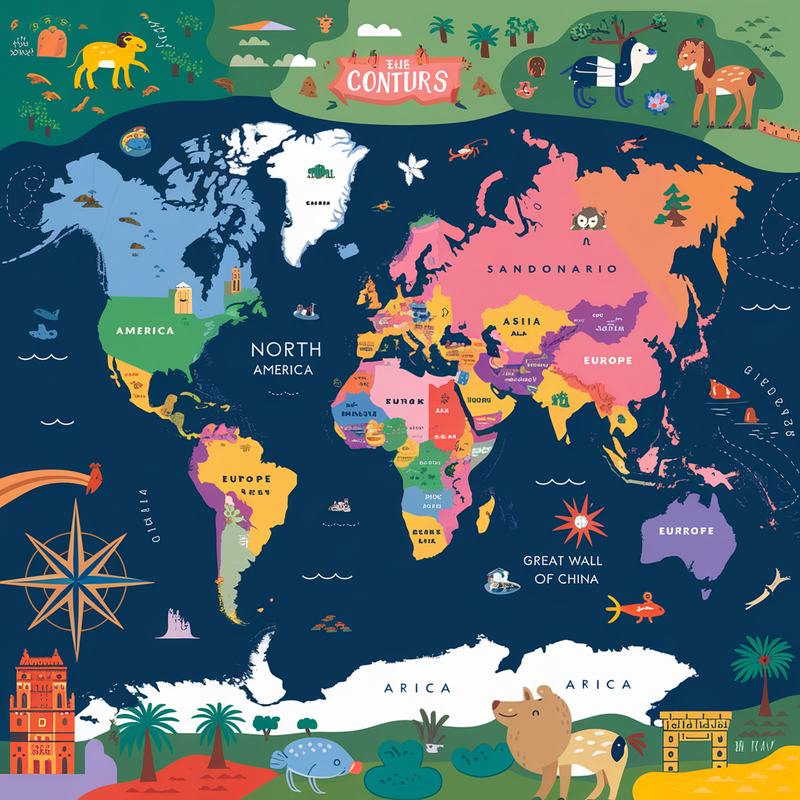

In modern web development, visual interaction is key to capturing user attention. Three.js, as one of the most powerful WebGL libraries, makes complex 3D visualization accessible. This article will detail how to create an interactive 3D earth display using Three.js.

## Preparation: Technologies and Resources

**Technology Stack**

- [Three.js](https://threejs.org/): 3D rendering library
- [Vite](https://vite.dev/): Modern frontend build tool
- JavaScript (ES6+)

**Required Resources**

High-resolution earth texture



## 1. Project Initialization

Quick project setup with Vite:

```bash
npm create vite@latest earth-3d -- --template vanilla
cd earth-3d
npm install three
```

Change the `index.html` file to include the main js file:

```html
<!DOCTYPE html>
<html lang="en">
  <head>
    <meta charset="UTF-8" />
    <link rel="icon" type="image/svg+xml" href="/vite.svg" />
    <meta name="viewport" content="width=device-width, initial-scale=1.0" />
    <title>3D Earth</title>
  </head>
  <body>
    <script type="module" src="/src/main.js"></script>
  </body>
</html>
```

## 2. Create a 3D Scene

In the `main.js` file, set up the Three.js scene:

```js
import * as THREE from 'three';
import './style.css';

import * as THREE from 'three';
import './style.css';

// Create the 3D scene
const scene = new THREE.Scene();

// Get canvas element (optional in this example)
const canvas = document.getElementById('webglcanvas');

// Create perspective camera
const camera = new THREE.PerspectiveCamera(
  75, // Field of View (FOV)
  window.innerWidth / window.innerHeight, // Aspect Ratio
  0.1, // Near clipping plane
  1000 // Far clipping plane
);
camera.position.z = 500; // Position camera away from the scene

// Create WebGL renderer
const renderer = new THREE.WebGLRenderer();
renderer.setSize(window.innerWidth, window.innerHeight);
document.body.appendChild(renderer.domElement);

// Create a group to manage 3D objects
const group = new THREE.Group();
scene.add(group);

// Mouse position tracking variables
let mouseX = 0,
  mouseY = 0;

// Texture loader for earth image
const loader = new THREE.TextureLoader();
loader.load('3d.png', function (texture) {
  // Create sphere geometry
  const geometry = new THREE.SphereGeometry(200, 20, 20);

  // Create material with loaded texture
  const material = new THREE.MeshBasicMaterial({
    map: texture,
  });

  // Create mesh by combining geometry and material
  const mesh = new THREE.Mesh(geometry, material);
  group.add(mesh);

  // Add mouse move event listener
  document.addEventListener('mousemove', onDocumentMouseMove, false);
});

// Mouse move handler
function onDocumentMouseMove(event) {
  // Normalize mouse coordinates
  mouseX = event.clientX - 0.5;
  mouseY = event.clientY - 0.5;
}

// Window resize handler
function onWindowResize() {
  // Update camera aspect ratio
  camera.aspect = window.innerWidth / window.innerHeight;
  camera.updateProjectionMatrix();

  // Resize renderer
  renderer.setSize(window.innerWidth, window.innerHeight);
}

// Render and animation function
function render() {
  // Smoothly move camera based on mouse position
  camera.position.x += (mouseX - camera.position.x) * 0.05;
  camera.position.y += (mouseY - camera.position.y) * 0.05;

  // Ensure camera looks at the scene center
  camera.lookAt(scene.position);

  // Rotate earth slowly
  group.rotation.y += 0.0005;
  group.rotation.x += 0.00001;

  // Render the scene
  renderer.render(scene, camera);
}

// Animation loop
function animate() {
  requestAnimationFrame(animate);
  render();
}

// Start the animation
renderer.setAnimationLoop(animate);
```

### Understanding the Code: A Line-by-Line Breakdown

**1. Scene Setup**

```js
const scene = new THREE.Scene();
```

This line creates the fundamental 3D container. Think of it as a digital stage where all your 3D objects will perform.

**2. Camera Configuration**

```js
const camera = new THREE.PerspectiveCamera(
  75, // Field of View (FOV)
  window.innerWidth / window.innerHeight, // Aspect Ratio
  0.1, // Near clipping plane
  1000 // Far clipping plane
);
```

The camera mimics human vision:

- 75: Viewing angle (degrees)
- Aspect ratio ensures proper scaling
- Clipping planes prevent rendering unnecessary details

**3. Renderer Creation**

```js
const renderer = new THREE.WebGLRenderer();
renderer.setSize(window.innerWidth, window.innerHeight);
document.body.appendChild(renderer.domElement);
```

Translates 3D scene to 2D screen, handling all WebGL complexities automatically.

**4. Texture and Sphere Creation**

```js
const loader = new THREE.TextureLoader();
loader.load('3d.png', function (texture) {
  const geometry = new THREE.SphereGeometry(200, 20, 20);
  const material = new THREE.MeshBasicMaterial({ map: texture });
  const mesh = new THREE.Mesh(geometry, material);
  group.add(mesh);
});
```

Breaks down into:

- Load texture image
- Create sphere geometry
- Apply texture as material
- Combine into a mesh
- Add to scene group

**5. Interactive Elements**

```js
function onDocumentMouseMove(event) {
  mouseX = event.clientX - 0.5;
  mouseY = event.clientY - 0.5;
}
```

Captures mouse movement to enable dynamic camera positioning.

**6. Animation Loop**

```js
function render() {
  camera.position.x += (mouseX - camera.position.x) * 0.05;
  camera.position.y += (mouseY - camera.position.y) * 0.05;
  group.rotation.y += 0.0005;
  renderer.render(scene, camera);
}
```

Continuously updates:

- Camera position based on mouse
- Earth rotation
- Renders each frame

### Key Optimization Techniques

- Smooth camera movement using interpolation
- Minimal rotation speeds for natural effect
- Efficient WebGL rendering

### Performance Considerations

- Use lower polygon count for faster rendering
- Optimize texture sizes
- Implement lazy loading

### Expansion and Improvement Possibilities

- Add cloud layer animation
- Implement country/region highlighting
- Integrate geographic data visualization

## Conclusion

Three.js transforms complex 3D rendering into a straightforward, developer-friendly process. By understanding these fundamental concepts, you can create stunning interactive visualizations.
Happy coding! 🚀🌍
