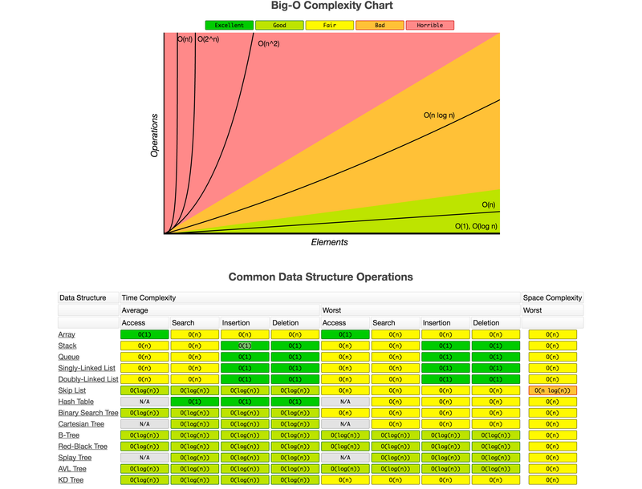

When building software that needs to handle data efficiently, one of the most crucial skills is understanding how different algorithms perform as data grows. This is where algorithm complexity analysis comes in - it helps us predict how our code will behave when faced with increasing amounts of data.

## Why It Matters: A Real-World Example

Imagine you're building a search feature for an e-commerce platform. The platform has thousands of products, and customers need to filter them by price, category, brand and other attributes. You have two approaches:

1. A simple but inefficient approach: Check every single product against the search criteria
2. An optimized approach: Use specialized data structures like hash tables or binary search trees

The first approach might work fine with 100 products, but become painfully slow with 10,000 products. This is where understanding algorithm complexity helps you make better design choices upfront.

## Introducing Big O Notation

Big O notation is our way of describing how an algorithm's performance scales. It answers the question: "As my input grows, how much more time or resources will my algorithm need?"

Here are the most important complexity classes, from fastest to slowest:

### $O(1)$ - Constant Time

- Performance stays the same regardless of input size
- Example: Getting an item from an array using its index
- Perfect for operations that need instant access

### $O(log n)$ - Logarithmic Time

- Performance increases slowly as input grows
- Example: Binary search in a sorted array
- Great for large datasets when applicable

### $O(n)$ - Linear Time

- Performance grows directly with input size
- Example: Reading through an entire array once
- Acceptable for many operations on moderate datasets

### $O(n log n)$ - Linearithmic Time

- Example: Efficient sorting algorithms like mergesort
- Good balance of efficiency for sorting operations

### $O(n²)$ - Quadratic Time

- Performance grows with square of input size
- Example: Basic sorting algorithms like bubble sort
- Can become problematic with larger datasets

### $O(n³)$ - Cubic Time

- Performance grows with cube of input size
- Example: Operations with three nested loops
- Generally should be avoided for large datasets

### $O(n!)$ - Factorial Time

- Performance grows factorially with input size
- Example: Generating all possible permutations
- Only practical for very small inputs

### Practical Application

When developing software, you can use this knowledge to:

1. Choose appropriate data structures for your specific needs
2. Identify potential performance bottlenecks before they become problems
3. Make informed tradeoffs between memory usage and speed
4. Design scalable systems that can handle growth

Remember that while **Big O** isn't the only factor in algorithm selection, it's a powerful tool for predicting how your code will perform as your application grows. For most practical applications, focusing on algorithms with $O(1)$, $O(log n)$, $O(n)$, and $O(n log n)$ complexity will serve you well.
This understanding is especially valuable during technical interviews, where you'll often need to analyze and discuss the efficiency of your proposed solutions.

## Constant Complexity: $O(1)$

Constant complexity, $O(1)$, means an algorithm’s runtime remains unchanged regardless of input size $𝑛$.

In JavaScript, datasets are often stored in arrays, where $𝑛$ represents the array's length. Algorithms with $O(1)$ complexity perform operations that take constant time, irrespective of 𝑛.

**Examples**:

1: Accessing an array element by its index:

```js
function getElementAtIndex(arr, index) {
  return arr[index];
}
```

2: Retrieving the last element in an array:

```js
function getLastElement(arr) {
  return arr[arr.length - 1];
}
```

Both examples consistently perform one operation, making their complexity $O(1)$.

## Linear Complexity: $O(n)$

Linear complexity, $O(n)$, describes algorithms where runtime increases proportionally with input size $𝑛$. This means doubling the input size doubles the runtime.

**Example: Finding the Maximum Value in an Array**

```js
function binarySearch(arr, target) {
  let left = 0;
  let right = arr.length - 1;

  while (left <= right) {
    let mid = Math.floor((left + right) / 2);

    if (arr[mid] === target) {
      return mid; // Element found
    } else if (arr[mid] < target) {
      left = mid + 1; // Search in the right half
    } else {
      right = mid - 1; // Search in the left half
    }
  }

  return -1; // Element not found
}
```

Binary search works on sorted arrays. On each iteration, it halves the search space, making it highly efficient. Doubling the input size requires only one additional step, leading to the logarithmic complexity $𝑂(log 𝑛)$. This makes it ideal for handling large datasets.

## Quadratic Complexity: $O(n²)$

Quadratic complexity, $O(n²)$, describes algorithms where runtime grows proportionally to the square of the input size $𝑛$. This often occurs when nested loops process every combination of input elements.

**Example: Sum of All Pairs in an Array**

```js
function sumOfPairs(arr) {
  let sum = 0;
  for (let i = 0; i < arr.length; i++) {
    for (let j = 0; j < arr.length; j++) {
      sum += arr[i] + arr[j];
    }
  }
  return sum;
}

const myArray = [1, 2, 3, 4];
console.log(sumOfPairs(myArray)); // Output: 40
```

In this example, each element interacts with every other element through nested loops. If 𝑛$ doubles, the number of operations grows fourfold. For large datasets, $O(n²)$ algorithms can become computationally expensive.

## Cubic Complexity $O(n^3)$

Time complexity $O(n^3)$ means that the algorithm's execution time increases cubically with the size of the input data. This often occurs in algorithms with three nested loops or operations, each of which is performed proportionally to the cube of the input size.

Here's an example of an algorithm with cubic complexity that multiplies two matrices:

```js
function multiplyMatrices(matrix1, matrix2) {
  let result = [];
  const m = matrix1.length;
  const n = matrix2[0].length;
  const p = matrix2.length;

  for (let i = 0; i < m; i++) {
    result[i] = [];
    for (let j = 0; j < n; j++) {
      result[i][j] = 0;
      for (let k = 0; k < p; k++) {
        result[i][j] += matrix1[i][k] * matrix2[k][j];
      }
    }
  }
  return result;
}
const matrixA = [
  [1, 2, 3],
  [4, 5, 6],
  [7, 8, 9],
];
const matrixB = [
  [9, 8, 7],
  [6, 5, 4],
  [3, 2, 1],
];

console.log(multiplyMatrices(matrixA, matrixB));
```

This matrix multiplication algorithm has three nested loops: the first iterates through rows of the first matrix, the second through columns of the second matrix, and the third through common elements for multiplication. The number of operations equals $n$ _ $n$ _ $n$, where $n$ is the size of the matrix. This results in cubic complexity $O(n^3)$. Such an approach can become inefficient for large matrices due to the large number of operations required.

## Exponential Complexity $O(2^n)$

Complexity $O(2^n)$ refers to exponential complexity, where the algorithm's execution time increases exponentially as the input size grows. This often occurs in algorithms that solve problems using the "divide and conquer" method or use recursion without optimization.

An example of an algorithm with exponential complexity is the recursive calculation of Fibonacci numbers:

```js
function fibonacci(n) {
  if (n <= 1) {
    return n;
  } else {
    return fibonacci(n - 1) + fibonacci(n - 2);
  }
}
console.log(fibonacci(5)); // Result: 5
console.log(fibonacci(10)); // Result: 55
console.log(fibonacci(20)); // Result: 6765
```

This code uses recursion to calculate Fibonacci numbers. However, each time the `fibonacci` function is called, it spawns two additional calls, leading to an exponential increase in the number of function calls as n increases.

For large values of $n$, this approach becomes very inefficient due to the enormous number of repeated calculations. Exponential complexity is usually not an optimal solution due to its high computational load as input size increases.

## Factorial Complexity $O(n!)$

Complexity $O(n!)$ refers to factorial complexity, where the algorithm's execution time grows proportionally to the factorial of the input size. A factorial is the product of all positive integers from 1 to $n$.

Here's an example of an algorithm with factorial complexity that generates all possible permutations of an array:

```js
function permute(arr) {
  function swap(a, b) {
    const temp = arr[a];
    arr[a] = arr[b];
    arr[b] = temp;
  }

  function generate(n) {
    if (n === 1) {
      console.log(arr);
    } else {
      for (let i = 0; i < n - 1; i++) {
        generate(n - 1);
        if (n % 2 === 0) {
          swap(i, n - 1);
        } else {
          swap(0, n - 1);
        }
      }
      generate(n - 1);
    }
  }

  generate(arr.length);
}

const myArray = [1, 2, 3];
permute(myArray);
```

This code generates all possible permutations of array elements through recursive generation of all possible combinations. The number of operations needed to generate all permutations equals the factorial of the array length. For example, for an array of 3 elements (as in the example above), there will be 3! = 3 _ 2 _ 1 = 6 permutations.

Such an algorithm has extremely high computational complexity and can become practically unusable for large inputs due to the enormous number of operations that need to be performed.

## Big-O Complexity chart



## Time Complexity of JavaScript Built-in Methods

JavaScript's built-in methods have varying time complexity characteristics depending on the specific method and the data type they operate on. Here's a comprehensive analysis:

### Array Operations

When working with arrays, different operations have distinct complexity profiles:
**End-of-Array Operations**:

- `push()` and `pop()`: $O(1)$ - Extremely efficient since they only interact with the last element
- These operations maintain constant time regardless of array size

**Beginning-of-Array Operations**:

- `unshift()` and `shift()`: $O(n)$ - Less efficient
- Higher complexity because all existing elements must be reindexed

**Array Access**:

- Direct index access `(array[i])`: $O(1)$
- Provides immediate element retrieval regardless of array size or position

### String Operations

String manipulation methods have their own complexity considerations:
**String Concatenation**:

- Using `+` operator or `concat()`: $O(n)$
- Creates new string instances and copies characters
- Performance impact increases with string length

### Object Operations

Object methods show different performance characteristics:
**Property Access**:

- Standard object property access `(object.property)`: $O(1)$
- Hash table implementation enables fast lookups
- Special collections like Map may approach $O(log n)$ complexity

**Property Modification**:

- Adding or removing properties: $O(1)$
- Direct hash table modifications

### Important Considerations

Several factors can affect these complexity measurements:

1. Browser implementation differences
2. JavaScript engine optimizations
3. Data size and structure
4. Memory management patterns

Understanding these complexity characteristics is crucial when designing performant applications, especially when dealing with large datasets or performance-critical operations. Developers should consider these factors when choosing appropriate methods for their specific use cases.
