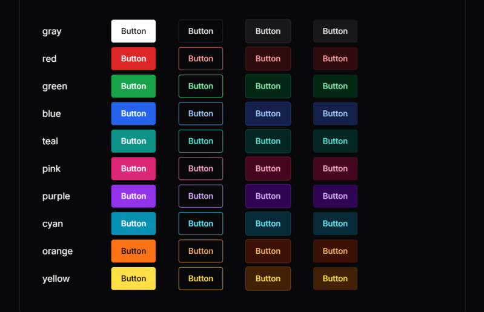
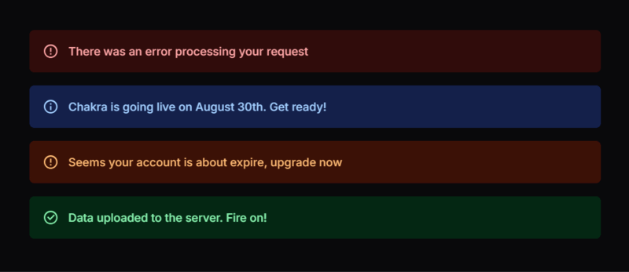
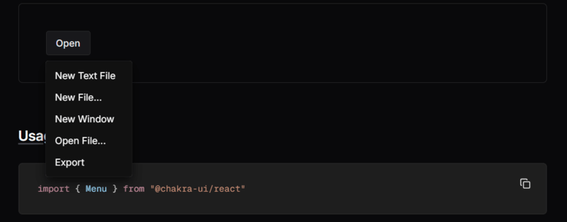

In day‑to‑day frontend work, we keep solving the same problems:

- building consistent buttons, forms, layouts, and modals  
- making everything responsive on phones, tablets, and desktops  
- keeping colors, typography, and spacing uniform across the app  
- implementing accessibility and keyboard navigation correctly  
- fighting with ever‑growing CSS files and design drift

Writing CSS from scratch for every new page quickly turns into a chore. That’s exactly the type of repetitive work **Chakra UI** removes from your life.

In this article, we’ll look at how **Chakra UI v3** paired with **React** helps you:

- stop hand‑writing CSS for every component  
- keep a single source of truth for design tokens  
- ship accessible UI without memorizing every WAI‑ARIA rule  
- build responsive layouts without writing `@media` queries  
- keep performance under control with tree‑shaking and minimal styling runtime  

Along the way we’ll use improved code samples, renamed variables, and modern patterns.

> Official docs: [chakra docs](https://chakra-ui.com/)

---

## Why Styling Libraries Exist at All

Let’s be honest: vanilla CSS is powerful, but it doesn’t scale nicely in large React apps.

Typical problems when you style everything manually:

### 1. Slowness

You might spend **hours** on details like hover states, focus rings, input errors, spacing between elements, and layout quirks.

### 2. Visual Inconsistency

You start with a clean design, but six months later:  
different border radii, slightly different blues, spacing that "almost" matches, and three button variations that should have been one.

### 3. Accessibility Debt

Screen readers, roles, ARIA attributes, focus management, ESC handling, keyboard navigation – all this is crucial, but hard to do correctly and consistently with plain HTML + CSS.

### 4. Bloated CSS

Legacy styles accumulate: old classes, unused helpers, and confusing overrides. Bundle size grows, and nobody wants to delete anything because "it might be used somewhere".

**Component styling libraries** like Chakra UI solve these with:

- ready‑made building blocks (Button, Stack, Modal, Menu, etc.)  
- theme tokens instead of magic values  
- accessibility first approach  
- built‑in responsiveness  

Chakra takes this approach and makes it very ergonomic for React.

---

## 1. Styling with Props Instead of Raw CSS

In Chakra, **style props** are the core idea:  
you describe *what* the component should look like directly in JSX instead of switching between JS and CSS files.

### A basic button, Chakra style

```tsx
import { Button } from "@chakra-ui/react"

export function SendMessageButton() {
  return (
    <Button
      colorScheme="teal"
      size="lg"
      borderRadius="xl"
      boxShadow="md"
      _hover={{
        boxShadow: "xl",
        transform: "translateY(-1px)",
      }}
    >
      Send message
    </Button>
  )
}
```



This one component includes:

- colors  
- size  
- border radius  
- shadow  
- hover state

No separate CSS file, no BEM class names, no `:hover` selectors.

### Equivalent CSS for comparison

```css
.primary-button {
  background-color: #319795;
  color: #fff;
  padding: 0.75rem 1.5rem;
  border-radius: 0.75rem;
  box-shadow: 0 4px 6px rgba(0, 0, 0, .1);
  transition: all 0.15s ease-out;
}

.primary-button:hover {
  box-shadow: 0 10px 15px rgba(0, 0, 0, .15);
  transform: translateY(-1px);
}
```

```tsx
export function SendMessageButtonRaw() {
  return <button className="primary-button">Send message</button>
}
```

Both work, but the Chakra version:

- keeps markup and styles in one place  
- is more discoverable (props are auto‑completed in your IDE)  
- plays nicely with dynamic values coming from state or props  

[Style props reference](https://chakra-ui.com/docs/styling/overview)

---

## 2. A Single Theme Controls the Whole App

Instead of scattering values like `#319795` and `1.5rem` across components, Chakra encourages you to put them into a **theme**.

You can extend the default theme or create your own system.

### Minimal theme setup with design tokens

```tsx
import {
  ChakraProvider,
  createSystem,
  defaultConfig,
  defineConfig,
} from "@chakra-ui/react"

const designConfig = defineConfig({
  theme: {
    tokens: {
      colors: {
        accent: { value: "#6ED209" },
        surface: { value: "#F8FFF2" },
      },
      radii: {
        pill: { value: "999px" },
      },
    },
  },
})

const designSystem = createSystem(defaultConfig, designConfig)

export function RootApp({ children }: { children: React.ReactNode }) {
  return <ChakraProvider value={designSystem}>{children}</ChakraProvider>
}
```

Now you can use `accent` and `surface` anywhere:

```tsx
import { Box, Button } from "@chakra-ui/react"

export function AccentCard() {
  return (
    <Box bg="surface" p={6} borderRadius="lg">
      <Button bg="accent" borderRadius="pill">
        Accent action
      </Button>
    </Box>
  )
}
```

Change `accent` in one place → entire app updates.

[Theming guide](https://chakra-ui.com/docs/theming/overview)

### Extracting theme configuration into its own file

A common pattern is to keep all theme logic in something like `theme/system.ts`:

```ts
// theme/system.ts
import { defineConfig, createSystem, defaultConfig } from "@chakra-ui/react"

const designConfig = defineConfig({
  globalCss: {
    "html, body": {
      margin: 0,
      padding: 0,
      fontFamily: "system-ui, -apple-system, BlinkMacSystemFont, sans-serif",
      scrollBehavior: "smooth",
    },
  },
  theme: {
    tokens: {
      colors: {
        "ink-strong": { value: "#1A202C" },
        "ink-soft": { value: "#718096" },
        "paper": { value: "#F7FAFC" },
      },
    },
    semanticTokens: {
      colors: {
        appBackground: {
          value: {
            base: "{colors.paper}",
            _dark: "#1A202C",
          },
        },
        appText: {
          value: {
            base: "{colors.ink-strong}",
            _dark: "{colors.paper}",
          },
        },
      },
    },
  },
})

export const designSystem = createSystem(defaultConfig, designConfig)
```

Then in your entry point:

```tsx
// app/providers.tsx
import { ChakraProvider } from "@chakra-ui/react"
import { designSystem } from "@/theme/system"

export function Providers({ children }: { children: React.ReactNode }) {
  return <ChakraProvider value={designSystem}>{children}</ChakraProvider>
}
```

This gives you **one place** to tune your entire design language.

---

## 3. Accessibility Built In by Default

Manually making UI accessible means dealing with:

- `role`, `aria-*` attributes  
- focus traps for modals  
- escape handling  
- tab order for menus  
- keyboard navigation for lists and dialogs  
- `aria-live` for announcements  

Chakra UI bakes this into its components.

[WAI‑ARIA specs](https://www.w3.org/WAI/standards-guidelines/aria/)

### Accessible alert message

```tsx
import { Alert, AlertIcon, AlertTitle, AlertDescription } from "@chakra-ui/react"

export function ProfileSavedNotice() {
  return (
    <Alert status="success" borderRadius="md" mb={4}>
      <AlertIcon />
      <AlertTitle mr={2}>Profile updated</AlertTitle>
      <AlertDescription>
        Your changes have been saved successfully.
      </AlertDescription>
    </Alert>
  )
}
```



This alert component already includes:

- correct `role`  
- `aria-live="polite"`  
- semantic structure  

### Accessible dropdown menu with keyboard support

```tsx
import {
  Menu,
  MenuButton,
  MenuItem,
  MenuList,
  Button,
} from "@chakra-ui/react"
import { ChevronDownIcon } from "@chakra-ui/icons"

export function UserActionsMenu() {
  return (
    <Menu>
      <MenuButton
        as={Button}
        rightIcon={<ChevronDownIcon />}
        variant="outline"
      >
        User actions
      </MenuButton>
      <MenuList>
        <MenuItem>View profile</MenuItem>
        <MenuItem>Change password</MenuItem>
        <MenuItem color="red.500">Log out</MenuItem>
      </MenuList>
    </Menu>
  )
}
```



You get:

- Arrow key navigation  
- Esc to close  
- focus return to the button  
- proper ARIA attributes on the menu and items  

No custom JS required.

---

## 4. Responsive UI Without Writing Media Queries

Chakra supports **array syntax** and **object syntax** for responsive values.

### Array syntax (simple breakpoint‑based)

```tsx
import { Box, Text, Button } from "@chakra-ui/react"

export function ResponsivePanel() {
  return (
    <Box
      width={["100%", "90%", "70%", "50%"]}
      p={[3, 4, 6]}
      fontSize={["sm", "md", "lg"]}
      display={["block", "flex"]}
    >
      <Text flex="1" mb={[3, 0]} mr={[0, 4]}>
        This block adapts across breakpoints.
      </Text>
      <Button size={["sm", "md"]}>Try it now</Button>
    </Box>
  )
}
```

Interpretation (with default breakpoints `[base, sm, md, lg, xl]`):

- `width="100%"` on base  
- `width="90%"` on `sm`  
- `width="70%"` on `md`  
- `width="50%"` on `lg`+  

### Object syntax (named breakpoints)

```tsx
export function ResponsiveStack() {
  return (
    <Box
      display={{ base: "block", md: "flex" }}
      gap={{ base: 3, md: 6 }}
      p={{ base: 3, md: 6 }}
    >
      <Box bg="gray.100" p={4} flex="1">
        Left side content
      </Box>
      <Box bg="gray.50" p={4} flex="1">
        Right side content
      </Box>
    </Box>
  )
}
```

Compared to raw CSS, this eliminates:

- multiple `@media` blocks  
- duplicated selectors  
- constant breakpoint lookup  

[Responsive styles docs](https://chakra-ui.com/docs/styling/responsive-design)

---

## 5. Layout Components: Stack, Flex, Grid

Chakra includes layout primitives that replace dozens of custom CSS utilities.

### Vertical spacing with `Stack`

```tsx
import { Stack, Heading, Text, Button } from "@chakra-ui/react"

export function PricingCard() {
  return (
    <Stack
      spacing={4}
      bg="white"
      borderRadius="lg"
      p={6}
      boxShadow="md"
      align="flex-start"
    >
      <Heading size="md">Pro plan</Heading>
      <Text color="gray.600">
        Perfect for teams that ship features every week.
      </Text>
      <Button colorScheme="blue">Choose plan</Button>
    </Stack>
  )
}
```

No manual `margin-bottom` on each child — `Stack` manages spacing.

### Flexible layout with `Flex`

```tsx
import { Flex, Box, Text, Button } from "@chakra-ui/react"

export function HeaderBar() {
  return (
    <Flex
      as="header"
      align="center"
      justify="space-between"
      px={6}
      py={4}
      bg="gray.900"
      color="white"
    >
      <Text fontWeight="bold">Acme Dashboard</Text>

      <Flex align="center" gap={4}>
        <Button variant="ghost" size="sm">
          Docs
        </Button>
        <Button size="sm" colorScheme="teal">
          Sign in
        </Button>
      </Flex>
    </Flex>
  )
}
```

[Layout components](https://chakra-ui.com/docs/components/stack)

---

## 6. Performance: Tree‑Shaking & Minimal Styles

Chakra is built with performance in mind:

### 6.1. Tree‑shaking friendly imports

```tsx
// Good – only these three components are bundled
import { Box, Button, Text } from "@chakra-ui/react"

// Bad – do not import the whole library as a namespace
// import * as Chakra from "@chakra-ui/react"
```

Modern bundlers (Vite, Webpack, Turbopack) can eliminate unused exports, reducing bundle size.

### 6.2. No giant global CSS file

Unlike old CSS frameworks (`@import "framework.css";` with hundreds of unused classes), Chakra:

- generates styles only for used components  
- avoids large global stylesheets  
- keeps CSS close to components


### 6.3. Example: small, focused component

```tsx
export function MinimalCallout() {
  return (
    <Box
      borderWidth="1px"
      borderRadius="md"
      p={4}
      bg="yellow.50"
      borderColor="yellow.300"
    >
      <Text fontWeight="medium">Heads up!</Text>
      <Text fontSize="sm" color="gray.700">
        Changes you make here will affect all team members.
      </Text>
    </Box>
  )
}
```

Only the styles used here are generated; there’s no large, unused utility set.

---

## 7. Putting It All Together: A Small Page

Let’s combine multiple ideas: theme tokens, layout, accessibility, and responsiveness.

```tsx
import {
  Box,
  Button,
  Flex,
  Heading,
  Stack,
  Text,
  useColorMode,
} from "@chakra-ui/react"

export function LandingSection() {
  const { colorMode, toggleColorMode } = useColorMode()

  return (
    <Box
      minH="100vh"
      bg="appBackground"
      color="appText"
      px={{ base: 4, md: 8 }}
      py={{ base: 8, md: 16 }}
    >
      <Flex justify="flex-end">
        <Button size="sm" variant="ghost" onClick={toggleColorMode}>
          Toggle {colorMode === "light" ? "dark" : "light"} mode
        </Button>
      </Flex>

      <Flex
        direction={{ base: "column", md: "row" }}
        align="center"
        mt={{ base: 8, md: 12 }}
        gap={{ base: 10, md: 16 }}
      >
        <Stack spacing={5} flex="1">
          <Heading size="2xl">
            Ship React interfaces without hand‑writing CSS.
          </Heading>
          <Text fontSize="lg" color="ink-soft">
            Chakra UI gives you accessible components, responsive style props,
            and a theme system that keeps your design consistent.
          </Text>

          <Flex gap={4} wrap="wrap">
            <Button colorScheme="teal" size="lg">
              Get started
            </Button>
            <Button variant="outline" size="lg">
              View docs
            </Button>
          </Flex>
        </Stack>

        <Box
          flex="1"
          bg="whiteAlpha.900"
          _dark={{ bg: "whiteAlpha.50" }}
          borderRadius="2xl"
          p={6}
          boxShadow="2xl"
        >
          <Text fontWeight="medium" mb={4}>
            Why teams choose Chakra UI
          </Text>
          <Stack spacing={3} fontSize="sm" color="gray.700" _dark={{ color: "gray.200" }}>
            <Text>• No more switching between JS and CSS files.</Text>
            <Text>• Built‑in dark mode support.</Text>
            <Text>• Fully accessible menu, dialog, popover, and more.</Text>
            <Text>• Theme tokens keep your brand consistent.</Text>
          </Stack>
        </Box>
      </Flex>
    </Box>
  )
}
```

This small section showcases:

- theme tokens (`appBackground`, `appText`)  
- dark mode via `useColorMode`  
- responsive layouts via `direction` + `gap` + `px/py`  
- readable, declarative styling with props  

---

## Conclusion

Chakra UI is not “just another component library”. It’s a **workflow upgrade**:

- You stop hand‑writing repetitive CSS.  
- You gain a centralized theme for colors, typography, and spacing.  
- You ship accessible UI by default.  
- You build responsive layouts without any `@media` queries.  
- You keep bundle size under control thanks to tree‑shaking and style scoping.  

If you’re tired of fighting with CSS from scratch on every project and want a **faster, more consistent way** to build React interfaces, Chakra UI is absolutely worth adopting.

Try replacing one screen in your app with Chakra components. Chances are, you won’t want to go back.
