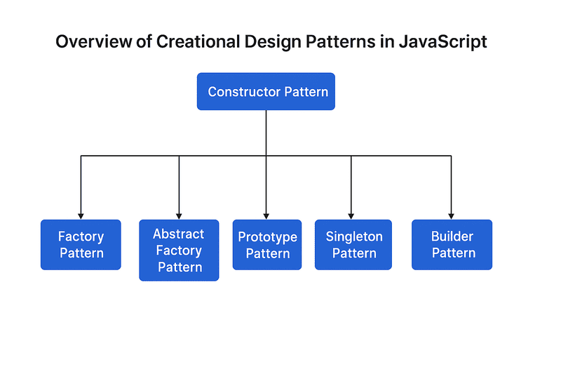

Design patterns are proven solutions to common programming problems. In JavaScript, creational design patterns provide a standardized way to create and manage objects, making code more flexible, reusable, and scalable. Whether you're building a large-scale application or writing modular libraries, understanding these patterns can help you write cleaner and more maintainable code. In this article, we’ll dive into the core creational patterns and how to implement them effectively in JavaScript.

## 1. Singleton Pattern

The Singleton pattern is a creational design pattern that ensures a class has only one instance and provides a global point of access to that instance. In JavaScript, which doesn’t have “classes” in the traditional sense (prior to ES6), Singleton is usually implemented using closures, modules, or static classes.

It’s commonly used when exactly one object is needed to coordinate actions across the system — for example, logging, configuration settings, or database connections.

### ✅ Key Characteristics of the Singleton Pattern

- **Single instance**: Only one object is ever created.
- **Global access**: That instance is globally accessible.
- **Lazy initialization**: Instance is created only when needed (optional but common).

### 🧱 Basic Example of a Singleton in JavaScript

```js 
class Singleton {
  constructor() {
    if (Singleton.instance) {
      return Singleton.instance;
    }
    this.timestamp = Date.now();
    Singleton.instance = this;
  }
}

// Usage
const a = new Singleton();
const b = new Singleton();

console.log(a === b); // true
console.log(a.timestamp === b.timestamp); // true
```

**Explanation:**

- The constructor checks whether an instance already exists.
- If it does, it returns that same instance.
- Otherwise, it creates a new one and stores it as a static property.

### 🔒 Improved Version Using Closures (Module Pattern)

A more idiomatic version in JavaScript uses closures to protect internal state:

```js 
const Singleton = (function () {
  let instance;

  function createInstance() {
    return {
      timestamp: Date.now(),
      log(message) {
        console.log(`[${this.timestamp}] ${message}`);
      },
    };
  }

  return {
    getInstance() {
      if (!instance) {
        instance = createInstance();
      }
      return instance;
    }
  };
})();

// Usage
const logger1 = Singleton.getInstance();
const logger2 = Singleton.getInstance();

logger1.log("Hello from logger1"); // [timestamp] Hello from logger1
logger2.log("Hello from logger2"); // same timestamp

console.log(logger1 === logger2); // true
```

### 🌍 Real-World Use Cases in JavaScript

- **Application configuration**: A central config that should be shared across modules.
- **Logging service**: A logger where you don’t want to initialize multiple outputs or states.
- **Database connection**: Managing a single DB connection instance.
- **Global event bus** in front-end frameworks: Vue or Angular might use a singleton event emitter or store.

**Example: Logger Singleton**

```js 
const Logger = (() => {
  let instance;

  class Logger {
    constructor() {
      if (instance) return instance;
      instance = this;
      this.logs = [];
    }

    log(message) {
      const entry = `[${new Date().toISOString()}] ${message}`;
      this.logs.push(entry);
      console.log(entry);
    }
  }

  return Logger;
})();

const logger1 = new Logger();
const logger2 = new Logger();

logger1.log('User logged in');
logger2.log('User clicked button');

console.log(logger1 === logger2); // true
```

### ✅ Advantages

- **Controlled access**: Centralized instance simplifies coordination.
- **Consistency**: All parts of your code use the same instance state.
- **Memory savings**: You don’t create unnecessary multiple objects.

### ⚠️ Disadvantages

- **Hidden dependencies**: Modules relying on a singleton may become tightly coupled.
- **Difficult to test**: It’s hard to reset the singleton between unit tests.
- **Global state issues**: Shared mutable state can lead to unpredictable behavior.

### 🌐 Real-Life Analogy

Think of a printer spooler in an office. If everyone sent print jobs to different spoolers, things would get chaotic. A singleton spooler ensures all print jobs are queued in a central place, maintaining order and efficiency.

### 🛠️ When to Use the Singleton Pattern

Use a singleton when:

- You want to restrict instantiation of a class to a single object.
- You need a central manager for a resource (e.g., configuration, event bus, cache).
- You want to manage a shared service like a logger or database connector.

Avoid using it when:

- You want loosely coupled modules.
- You need multiple instances in the future (may lead to refactoring headaches).
- Your app is heavily reliant on testability and mocking.

## 2. Prototype Pattern

The Prototype pattern is a creational design pattern that allows you to create new objects by copying existing ones, known as prototypes. This is a natural fit for JavaScript, which uses prototype-based inheritance at its core.

Instead of building each object from scratch or using classes, you clone an existing object to create new instances. This approach is both memory-efficient and performance-friendly when many similar objects are needed.

### 🧠 Key Characteristics of the Prototype Pattern

- **Cloning instead of instantiating**: New objects are created by copying an existing object.
- **Prototype-based delegation**: Shared properties and methods are accessed via the prototype chain.
- **Flexible and dynamic**: Objects can be extended even after creation.

### 🧱 Basic Example of Prototype Pattern in JavaScript

```js 
const vehicle = {
  type: 'vehicle',
  start() {
    console.log(`Starting a ${this.type}`);
  }
};

const car = Object.create(vehicle);
car.type = 'car';
car.start(); // "Starting a car"
```

**Explanation:**

- `Object.create()` creates a new object using `vehicle` as its prototype.
- The `car` object inherits the `start()` method and overrides the `type` property.

### 💡 Improved Example: Cloning with Custom Behavior

```js 
const userPrototype = {
  greet() {
    console.log(`Hello, I’m ${this.name}`);
  },
  clone(name) {
    const clone = Object.create(this);
    clone.name = name;
    return clone;
  }
};

const user1 = userPrototype.clone('Alice');
const user2 = userPrototype.clone('Bob');

user1.greet(); // Hello, I’m Alice
user2.greet(); // Hello, I’m Bob
```

**What’s happening here?**

- `userPrototype` serves as the blueprint.
- The `clone` method creates new users, each with their own `name`, but sharing methods from the prototype.

### 🌍 Real-World Use Cases in JavaScript

- **Performance optimization**: Avoid repeated creation of large object structures.
- **Prototypal inheritance** in frameworks/libraries: Vue.js, React (via context), and DOM manipulation can benefit from prototype-based delegation.
- **Extending built-in types**: Augment Array.prototype, String.prototype, etc.

**Example: Reusable DOM Element Template**

```js 
const buttonTemplate = {
  type: 'button',
  render() {
    const btn = document.createElement('button');
    btn.textContent = this.label || 'Click';
    btn.className = this.className || 'default';
    return btn;
  }
};

const successButton = Object.create(buttonTemplate);
successButton.label = 'Success';
successButton.className = 'btn-success';

const dangerButton = Object.create(buttonTemplate);
dangerButton.label = 'Delete';
dangerButton.className = 'btn-danger';

document.body.appendChild(successButton.render());
document.body.appendChild(dangerButton.render());
```

This example avoids rewriting rendering logic for each button by reusing a shared prototype.

### ✅ Advantages

- **Memory-efficient**: Methods are shared across instances rather than duplicated.
- **Performance**: Fast object creation using `Object.create()`.
- **Flexibility**: You can modify the prototype at runtime, and all objects will reflect the change.

### ⚠️ Disadvantages

- **Less intuitive** for developers used to class-based OOP.
- **Prototype chain bugs**: Mistakes in prototype setup can lead to hard-to-trace issues.
- **Tight coupling**: Objects may become dependent on the shape or structure of the prototype.

### 🌐 Real-Life Analogy

Think of making photocopies of a master document. Instead of rewriting the document every time, you just make a copy and change only the specific parts you need. The original acts as the prototype.

### 🛠️ When to Use the Prototype Pattern

Use it when:

- You need many similar objects that share the same behavior.
- Object creation is expensive, and cloning is cheaper.
- You want to leverage JavaScript’s built-in prototype system for inheritance.

Avoid it when:

- You're working in a strict class-based team or environment.
- The object structure is too complex or dynamic to benefit from shared prototypes.
- Readability and clarity are prioritized over memory optimization.

## 3. Constructor Pattern

The Constructor pattern is one of the most common creational design patterns in JavaScript. It provides a way to create objects with a predefined structure using a constructor function or ES6 class. This pattern allows you to generate multiple instances that share the same properties and behavior.

JavaScript constructors work much like constructors in class-based languages — but under the hood, they leverage prototypes for method sharing and memory efficiency.

### 🧠 Key Characteristics of the Constructor Pattern

- **Used with new keyword**: Invokes a special constructor behavior.
- **Instance-specific properties**: Each instance gets its own properties.
- **Shared methods**: Methods can be attached to the prototype for reuse.

### 🧱 Basic Constructor Function Example

```js 
function Person(name, age) {
  this.name = name;
  this.age = age;
  this.sayHello = function () {
    console.log(`Hi, I'm ${this.name} and I'm ${this.age} years old.`);
  };
}

const alice = new Person('Alice', 30);
const bob = new Person('Bob', 25);

alice.sayHello(); // Hi, I'm Alice and I'm 30 years old.
bob.sayHello();   // Hi, I'm Bob and I'm 25 years old.
```

**Problem:** `sayHello()` is re-created for each instance, wasting memory.

### 🔧 Optimized Version with Prototypes

```js 
function Person(name, age) {
  this.name = name;
  this.age = age;
}

Person.prototype.sayHello = function () {
  console.log(`Hi, I'm ${this.name} and I'm ${this.age} years old.`);
};

const alice = new Person('Alice', 30);
const bob = new Person('Bob', 25);

alice.sayHello(); // Hi, I'm Alice...
```

**Benefits:**

- Only one `sayHello()` method exists in memory.
- All instances share it via the prototype.

### 🎓 ES6 Class Syntax (Modern Approach)

```js
class Person {
  constructor(name, age) {
    this.name = name;
    this.age = age;
  }

  sayHello() {
    console.log(`Hi, I'm ${this.name} and I'm ${this.age} years old.`);
  }
}

const alice = new Person('Alice', 30);
alice.sayHello(); // Hi, I'm Alice...
```

This is syntactic sugar over prototype-based inheritance but makes the pattern more readable.

### 🌍 Real-World Use Cases in JavaScript

- **Creating structured models**: e.g. `User`, `Task`, `Product`, etc.
- **Browser APIs**: Built-in constructors like `Date`, `RegExp`, and `Error`.
- **Custom components**: Reusable and instantiable elements in a UI framework.

**Example: Creating a Product Model**

```js 
class Product {
  constructor(id, name, price) {
    this.id = id;
    this.name = name;
    this.price = price;
  }

  display() {
    console.log(`${this.name} - $${this.price}`);
  }
}

const item = new Product(1, 'Keyboard', 99);
item.display(); // Keyboard - $99
```

### ✅ Advantages

- **Clear structure**: Easy to understand and maintain.
- **Encapsulation**: Can control what gets initialized and exposed.
- **Integration with `instanceof`**: Easy type checking in object-oriented code.

### ⚠️ Disadvantages

- **Memory usage**: If methods are defined inside the constructor, they’re duplicated per instance.
- **No privacy (without closures)**: Properties are public unless closures are used.
- **Less flexible than factories**: Harder to abstract away object creation logic.

### 🌐 Real-Life Analogy

Imagine a blueprint for building houses. The constructor is the blueprint. Every time you call new `House()`, you're building a house that follows the same plan but may have different colors, owners, or sizes.

### 🛠️ When to Use the Constructor Pattern

Use it when:

- You want to define object templates with consistent structure.
- You need multiple instances of similar objects.
- You prefer classical OOP patterns.

Avoid it when:

- You need dynamic or conditional object creation logic (→ use Factory).
- You want full method sharing (→ consider Prototype).
- You need only one instance (→ use Singleton).

## 4. Factory Pattern

The Factory pattern is a creational design pattern that provides an interface for creating objects in a superclass, but allows subclasses or functions to alter the type of objects that will be created.

Instead of using a constructor or `new` directly, the Factory encapsulates the creation logic in a separate function or class. This gives you flexibility and control over what kind of object is returned based on parameters, conditions, or configuration.

### 🧠 Key Characteristics of the Factory Pattern

- **Encapsulates object creation**: Hides the construction details from the caller.
- **Decouples instantiation**: You can change how objects are created without changing client code.
- **Returns different types or subclasses**: Based on logic or input.

### 🧱 Basic Example of a Factory Function

```
function createUser(role) {
  if (role === 'admin') {
    return {
      role: 'admin',
      permissions: ['read', 'write', 'delete']
    };
  } else if (role === 'guest') {
    return {
      role: 'guest',
      permissions: ['read']
    };
  } else {
    return {
      role: 'user',
      permissions: ['read', 'write']
    };
  }
}

const admin = createUser('admin');
const guest = createUser('guest');

console.log(admin); // { role: 'admin', permissions: [...] }
```

Here, the factory function `createUser()` centralizes creation logic and can return different shapes based on input.

### 🎓 Factory with Constructor Delegation

```js
class Car {
  constructor(brand) {
    this.type = 'car';
    this.brand = brand;
  }
}

class Truck {
  constructor(brand) {
    this.type = 'truck';
    this.brand = brand;
  }
}

function vehicleFactory(type, brand) {
  if (type === 'car') return new Car(brand);
  if (type === 'truck') return new Truck(brand);
  throw new Error('Unknown vehicle type');
}

const myCar = vehicleFactory('car', 'Toyota');
const myTruck = vehicleFactory('truck', 'Ford');

console.log(myCar);   // Car { type: 'car', brand: 'Toyota' }
console.log(myTruck); // Truck { type: 'truck', brand: 'Ford' }
```

This pattern lets you abstract object creation from the rest of your application.

### 🌍 Real-World Use Cases in JavaScript

- **UI libraries**: Components are conditionally rendered based on input or configuration (e.g., `createButton(type)`).
- **Database connectors**: A factory selects a strategy (PostgreSQL, MongoDB, etc.) based on environment config.
- **Cross-platform apps**: Return platform-specific objects (mobile vs web).

**Example: Notification Factory**

```js 
function createNotification(type, message) {
  switch (type) {
    case 'success':
      return { type, message, color: 'green' };
    case 'error':
      return { type, message, color: 'red' };
    case 'info':
      return { type, message, color: 'blue' };
    default:
      return { type: 'default', message, color: 'gray' };
  }
}

const toast = createNotification('success', 'Saved!');
console.log(toast); // { type: 'success', message: 'Saved!', color: 'green' }
```

### ✅ Advantages

- **Flexible object creation**: Centralizes logic in one place.
- **Improved code clarity**: Consumers don’t worry about instantiation details.
- **Encapsulation**: Hides complex logic and makes it easy to switch implementations.

### ⚠️ Disadvantages

- **May add complexity**: Indirection can make tracing code harder.
- **Overhead**: Might be overkill for simple object creation.
- **Harder to debug**: When creation logic becomes too dynamic or abstract.

### 🌐 Real-Life Analogy

Think of a coffee machine: you press a button for espresso, latte, or cappuccino, and it gives you the drink. You don’t worry about how it’s made — the machine (factory) takes care of the specifics.

### 🛠️ When to Use the Factory Pattern

Use it when:

- You need to centralize and control how objects are created.
- You want to return different subclasses based on context.
- Object creation logic is complex, dynamic, or varies.

Avoid it when:

- Simple constructors would suffice.
- You don’t need to vary the created object’s type.

## 5. Abstract Factory Pattern

The Abstract Factory pattern is a creational design pattern that provides an interface for creating families of related or dependent objects without specifying their concrete classes.

It’s like having a factory of factories — you define abstract interfaces for groups of related objects, and then implement those interfaces in concrete factories. This is especially useful when the system must be independent of how its objects are created.

### 🧠 Key Characteristics of Abstract Factory

- **Creates families of related objects** without knowing their concrete classes.
- **Encapsulates object creation** across multiple related types.
- **Follows a common interface**, making it easy to switch between different families.

### 🧱 Basic Example: UI Theme Factory

Imagine building a UI library with both Light and Dark themes. Each theme includes a `Button` and `Checkbox`. Instead of checking theme logic throughout your code, you can use an abstract factory to group components by theme.

**🎨 Step-by-Step Implementation**

**1. Define Product Interfaces**

```js
// Button interface
class Button {
  render() {
    throw new Error('Method not implemented');
  }
}

// Checkbox interface
class Checkbox {
  render() {
    throw new Error('Method not implemented');
  }
}
```

**2. Create Concrete Products**

```js 
class LightButton extends Button {
  render() {
    console.log('Rendering light-themed button');
  }
}

class DarkButton extends Button {
  render() {
    console.log('Rendering dark-themed button');
  }
}

class LightCheckbox extends Checkbox {
  render() {
    console.log('Rendering light-themed checkbox');
  }
}

class DarkCheckbox extends Checkbox {
  render() {
    console.log('Rendering dark-themed checkbox');
  }
}
```

**3. Define Abstract Factory**

```js
class UIComponentFactory {
  createButton() {
    throw new Error('Method not implemented');
  }

  createCheckbox() {
    throw new Error('Method not implemented');
  }
}
```

**4. Implement Concrete Factories**

```js 
class LightThemeFactory extends UIComponentFactory {
  createButton() {
    return new LightButton();
  }

  createCheckbox() {
    return new LightCheckbox();
  }
}

class DarkThemeFactory extends UIComponentFactory {
  createButton() {
    return new DarkButton();
  }

  createCheckbox() {
    return new DarkCheckbox();
  }
}
```

**5. Client Code**

```js
function renderUI(factory) {
  const button = factory.createButton();
  const checkbox = factory.createCheckbox();

  button.render();
  checkbox.render();
}

const theme = 'dark';
const factory = theme === 'dark' ? new DarkThemeFactory() : new LightThemeFactory();

renderUI(factory);
// Output: Rendering dark-themed button
//         Rendering dark-themed checkbox
```

### 🌍 Real-World Use Cases in JavaScript

- **Theming systems**: Create light/dark/accessible UI elements.
- **Cross-platform apps**: Generate mobile vs. web UIs from a common API.
- **Game engines**: Instantiate enemy units, terrain, and HUDs for different levels or styles.

### ✅ Advantages

- **Consistency**: All products from one factory are designed to work together.
- **Decoupling**: The client is not dependent on concrete classes.
- **Scalability**: Easy to introduce new families of products without modifying existing code.

### ⚠️ Disadvantages

- **Complexity**: Increases the number of classes and abstraction layers.
- **Boilerplate**: Lots of interfaces and subclasses for small projects.
- **Tight coupling to factory**: Though decoupled from product classes, clients still rely on a specific factory.

### 🌐 Real-Life Analogy

Think of a furniture manufacturer. IKEA might have a “Modern” and “Classic” line. Each includes a chair, sofa, and coffee table. You don’t mix Modern chairs with Classic tables — you choose a style family, and everything fits together.

The abstract factory is IKEA’s “Modern Line” or “Classic Line” — each creates a consistent set of products.

### 🛠️ When to Use the Abstract Factory Pattern

Use it when:

- Your code needs to work with various families of related objects.
- You want to enforce consistency across related components.
- You need to easily switch or extend product families.

Avoid it when:

- You only need one type of object.
- The combinations of objects are not rigid or interdependent.
- The added complexity outweighs the benefits.

## 6. Builder Pattern

The Builder Pattern is a creational design pattern that separates the construction of a complex object from its representation, so that the same construction process can create different representations.

Instead of creating an object in one step using a constructor with many parameters (which can get messy), the builder pattern allows you to construct it step by step using a fluent interface or method chaining.

### 🧠 Key Characteristics of the Builder Pattern

- **Step-by-step construction** of complex objects.
- **Fluent interface** (method chaining) for readability and customization.
- **Separates representation from construction logic**.
- Useful when you have many optional or hierarchical properties.

### 🧱 Basic Example: Building a User Object

Let’s build a customizable `User` object without having to pass a huge constructor full of optional parameters.

```js 
class User {
  constructor(builder) {
    this.name = builder.name;
    this.age = builder.age;
    this.email = builder.email;
    this.phone = builder.phone;
    this.isAdmin = builder.isAdmin || false;
  }
}
```

**Builder Class**

```js
class UserBuilder {
  constructor(name) {
    this.name = name;
  }

  setAge(age) {
    this.age = age;
    return this;
  }

  setEmail(email) {
    this.email = email;
    return this;
  }

  setPhone(phone) {
    this.phone = phone;
    return this;
  }

  setAdmin(isAdmin) {
    this.isAdmin = isAdmin;
    return this;
  }

  build() {
    return new User(this);
  }
}
```

**Usage**

```js
const user = new UserBuilder('Alice')
  .setAge(28)
  .setEmail('alice@example.com')
  .setAdmin(true)
  .build();

console.log(user);
// User { name: 'Alice', age: 28, email: 'alice@example.com', phone: undefined, isAdmin: true }
```

This approach is more readable and manageable than calling something like:

```js 
new User('Alice', 28, null, null, true); // confusing and error-prone
```

### 🌍 Real-World Use Cases in JavaScript

- **Configuration objects**: When you need to build objects with optional or nested properties (e.g., HTTP requests, UI components).
- **Form builders**: Building a dynamic structure based on user input or templates.
- **DOM creation**: Constructing complex HTML structures programmatically.

**Example: Building an HTTP Request**

```js
class HttpRequest {
  constructor(builder) {
    this.method = builder.method;
    this.url = builder.url;
    this.headers = builder.headers;
    this.body = builder.body;
  }
}

class HttpRequestBuilder {
  constructor(url) {
    this.url = url;
    this.method = 'GET';
    this.headers = {};
  }

  setMethod(method) {
    this.method = method;
    return this;
  }

  setHeaders(headers) {
    this.headers = headers;
    return this;
  }

  setBody(body) {
    this.body = body;
    return this;
  }

  build() {
    return new HttpRequest(this);
  }
}

const req = new HttpRequestBuilder('https://api.example.com')
  .setMethod('POST')
  .setHeaders({ 'Content-Type': 'application/json' })
  .setBody(JSON.stringify({ name: 'Builder' }))
  .build();

console.log(req);
```

### ✅ Advantages

- **Readable and expressive**: Great for objects with many parameters.
- **Flexible**: Easy to add or remove parts during construction.
- **Avoids constructor overload**: Especially useful when there are many optional values.

### ⚠️ Disadvantages

- **More code upfront**: You need to write a separate builder class.
- **May be overkill** for simple objects or when only a few properties are needed.
- **Immutability is not enforced by default**, unless explicitly added.

### 🌐 Real-Life Analogy

Think of ordering a custom burger. Instead of one giant constructor like `new Burger("beef", true, false, "cheddar", "lettuce", true)`, you use a builder:

```js 
new BurgerBuilder()
  .addBeef()
  .addCheese('cheddar')
  .addLettuce()
  .addBacon()
  .build();
```

Each ingredient (or method) builds the final product step-by-step.

### 🛠️ When to Use the Builder Pattern

Use it when:

- You’re creating objects with many optional fields.
- You want a clean, fluent interface for configuration.
- You need to enforce specific build steps or order.

Avoid it when:

- Objects are simple and can be created with default constructors.
- The overhead of managing a builder class is unnecessary.

## 🧭 Overview of Creational Design Patterns in JavaScript



The diagram above illustrates the major creational design patterns and how they relate to the foundational **Constructor Pattern**. All other patterns: Factory, Abstract Factory, Prototype, Singleton, and Builder - expand upon or abstract away aspects of constructor-based object creation. Each serves a different use case, from enforcing a single instance (**Singleton**) to building objects step by step (**Builder**) or delegating creation logic to factories (**Factory** and **Abstract Factory**).

### ✅ Conclusion

Creational patterns help you manage object creation logic in a clean, extensible, and scalable way. They are especially useful in JavaScript, where flexibility often leads to inconsistent or error-prone instantiation. Choosing the right pattern depends on your application’s complexity, how much control you need over the creation process, and how much flexibility you want in terms of configuration, extension, or reuse.

With these patterns in your toolbox, you can avoid rigid constructors, promote maintainability, and make your codebase easier to understand and extend.