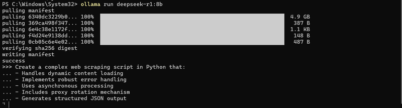

[DeepSeek R-1](https://www.deepseek.com/), an open-source AI language model developed by the Chinese company DeepSeek, is making waves in the tech world. Known for its reasoning capabilities, many users suggest that it rivals or even surpasses OpenAI's o1 model. Even better, DeepSeek R-1 is currently free to use, but this raises a key question: how does the company manage server costs given its increasing user base?

The likely answer is data. Data is the backbone of AI, and it’s possible that DeepSeek collects user data for monetization, potentially using it in fields like quantum trading. If you value privacy but still want to explore DeepSeek R-1, running it locally is the best option to retain control over your data.

This guide will show you how to install and run DeepSeek R-1 locally using Ollama, an open-source tool for running large language models (LLMs) on your computer. By the end, you’ll have a powerful AI tool at your fingertips without sacrificing your privacy.

## What is DeepSeek R-1?

DeepSeek R-1 is built on the foundation of DeepSeek-V3, a large-scale base model. It has been refined through a combination of supervised fine-tuning (SFT) with high-quality human-annotated datasets and reinforcement learning (RL). As a result, DeepSeek R-1 excels in handling complex queries, offering clear reasoning, and even displaying code snippets in its chat interface for testing.

Its open-source nature allows developers to customize, adapt, and enhance the model according to their needs, making it a standout choice in the world of AI.

## Why Run DeepSeek R-1 Locally?

While the online version of DeepSeek R-1 is convenient and feature-rich, there are several benefits to running it locally:

- **Privacy**: Local installation ensures your data stays on your machine, providing complete control over sensitive information.
- **Offline Access**: Running the model locally means you can use it without an internet connection, perfect for travel or areas with unstable Wi-Fi.
- **Avoid Future Costs**: While the service is free now, monetization is inevitable. A local installation bypasses potential future fees or restrictions.
- **Customization**: With local access, you can integrate the model with other tools, fine-tune it, or even build a custom interface.

## How to Install and Run DeepSeek R-1 Locally

To get started, you’ll need Ollama, a free tool that allows users to run large AI models locally. Here’s how to set it up:

### Step 1: Install Ollama

1. Visit the official [Ollama website](https://ollama.com/).
2. Download and install Ollama for your operating system (macOS, Linux, or Windows).
   
3. Verify the installation by opening your terminal and running the following command:
   <span class='code-cmd'>ollama -v</span>

If installed correctly, this will display the Ollama version number.


### Step 2: Download DeepSeek R-1

1. Open the Ollama interface and navigate to the [Models section](https://ollama.com/search).
2. Search for deepseek and select [deepseek-r1](https://ollama.com/library/deepseek-r1) from the results.
3. Choose the model size you want to download. Smaller models (e.g., 8 billion parameters) require GPUs with at least 8 GB of VRAM, while larger models demand more powerful GPUs (e.g., NVIDIA A100 or H100).

### Step 3: Run DeepSeek R-1

To start the model, use the following command:

<span className='code-cmd'>ollama run deepseek-r1:8b</span>

This will download the 8-billion-parameter model (approximately 4.9 GB). Ensure you have enough disk space before proceeding.


## Testing DeepSeek R-1 Locally

Once the model is running, you can interact with it directly in the terminal. Here’s an example:

### 1. Code Generation Challenge

**Prompt:**

```promt
Create a complex web scraping script in Python that:
- Handles dynamic content loading
- Implements robust error handling
- Uses asynchronous processing
- Includes proxy rotation mechanism
- Generates structured JSON output
```


**Answer:**

<details>
  <summary>Full Answer</summary>

`<think>`
Alright, I need to create a complex web scraping script using Python. The user has specified several requirements: handling dynamic content, robust error handling, asynchronous processing, proxy rotation, and generating structured
JSON output. Let me break this down step by step.

First, dynamic content loading. Modern websites often use JavaScript to load content after the initial page load. So, I should use a tool like Selenium because it can automate browsers that execute JavaScript. However, Selenium is
synchronous, so I might need to use threading or multiprocessing to handle asynchronous tasks, but wait, maybe there's a better approach with asynchronous frameworks.

Next, robust error handling. I know that HTTP requests can fail due to timeouts, connection issues, or rate limits. So, using retry mechanisms and having a circuit breaker pattern could help manage these errors. Maybe using
tenacity for retries and adding try-except blocks around each request.

Asynchronous processing. To handle multiple requests without blocking the script, asynchronous frameworks like asyncio would be useful. I can create an async function to fetch pages and process them one by one, avoiding blocking
behavior.

Proxy rotation is another important aspect. Using a list of proxies and rotating through them after a certain number of requests can prevent IP bans. I should include a proxy manager that cycles through the proxies, perhaps with a
check to see if the proxy is still active.

For generating structured JSON output, I'll need to parse each page's content into relevant data. BeautifulSoup is good for HTML parsing, and using XPath selectors can extract specific elements. Structured JSON can be built by
organizing the data into classes or dictionaries with appropriate keys.

Putting it all together: the script will use Selenium for dynamic content, asyncio for asynchronous processing, a proxy manager to cycle through proxies, and tenacity for retries. It will also include logging and error handling to
track issues.

I should structure the script with functions: one for initializing the driver and browser, another for fetching pages, and maybe a helper function for checking network status. The main async function will coordinate fetching each
page, extract data, and handle errors.

Wait, but using Selenium in an asynchronous context might be tricky because it's blocking. Maybe I should consider headless browsing with a tool that allows non-blocking operations or use a different approach like web service APIs
if possible.

Alternatively, perhaps using a headless browser that can handle JavaScript execution without blocking the main thread. Puppeteer is another option for headless Chrome, which might be more efficient than Selenium.

I think I'll go with Puppeteer because it's more modern and supports headless browsers, which can navigate pages and execute JavaScript without issues. That way, dynamic content can be handled effectively.

Now, structuring the script: import necessary libraries like asyncio, tenacity, logging, and of course, puppeteer. The settings for the browser should be set up with args and extensions if needed.

The main function will start the async loop, initializing the browser once. Then, an async function to load a page and extract data, using try-except blocks inside the loop. Each page's content is processed, and data is added to a
results list which is then converted into JSON once all pages are fetched.

Error handling within each fetch attempt will use tenacity to retry failed requests, with a delay between attempts. The retries will be capped to avoid infinite loops.

Proxy rotation will involve a class that tracks the current proxy index and cycles through the list periodically. Each request will switch to a new proxy after a certain number of tries or based on some interval.

Testing is important, so I should include logging and print statements to track the script's progress, including when each page is fetched, data extracted, and any errors encountered.

Finally, converting all the processed data into a structured JSON format will involve creating a list of dictionaries where each dictionary represents a page with its metadata and content.

I need to make sure that all components are properly integrated: browser setup, proxy handling, error retries, data extraction, and JSON output. Also, ensure that the script can handle large-scale operations without performance
issues by using asynchronous processing and efficient resource management.
`</think>`

Here's a complex web scraping script that incorporates dynamic content handling, robust error handling, asynchronous processing, proxy rotation, and structured JSON output:

  <details>
    <summary>View script</summary>

    ```python

import asyncio
from tenacity import retry, stop_after_attempt, wait_exponential
import logging
from urllib.parse import urljoin
from bs4 import BeautifulSoup
import json
from typing import List, Dict
import requests

# Configure logging

logging.basicConfig(level=logging.INFO)
logger = logging.getLogger(**name**)

class PageFetcher:
def **init**(self):
self.driver = None
self.proxy_index = 0
selfproxies = [

# Add your proxies here, format should be "http://proxy_ip:proxy_port"

]

    async def init_driver(self):
        # Initialize the browser and proxy settings
        chrome_options = {
            'headless': True,
            'args': ['--no-sandbox', '--disable-gpu'],
            'useAutomationExtension': False,
            'excludeSwitches': {'enable-extensions'}
        }

        if self.driver is None:
            try:
                from puppeteer import Driver
                self.driver = Driver('chrome', chrome_options)
            except Exception as e:
                logger.error(f"Failed to initialize Puppeteer driver: {e}")

    async def rotate_proxy(self):
        # Rotate through the list of proxies randomly or periodically
        if not self.proxies:
            return

        # Simple rotation logic, you can make it more sophisticated
        self.proxy_index = (self.proxy_index + 1) % len(self.proxies)
        proxy = self.proxies[self.proxy_index]
        logger.info(f"Switching to proxy: {proxy}")

    async def fetch_page(self, url):
        # Use a retry mechanism with tenacity
        @retry(stop=stop_after_attempt(3), wait=wait_exponential(multiplier=1, min=4, max=10))
        async def attempt_fetch():
            try:
                # Use the current proxy if available
                proxy = self.proxies[self.proxy_index] if self.proxy_index < len(self.proxies) else None
                headers = {}
                if proxy:
                    logger.info(f"Using proxy: {proxy}")
                    proxyscraper = {
                        'http': proxy,
                        'https': proxy
                    }
                    requests.packets.sessions.Session().proxies.update(proxyscraper)

                # Fetch the page using the browser
                self.driver.get(url)
                await asyncio.sleep(1)  # Allow time for content to load

                # Convert the response to text and parse with BeautifulSoup
                content = await self.driver.page_source()
                soup = BeautifulSoup(content, 'html.parser')

                # Extract relevant data from the page
                data = self.parse_page(soup)

                return data

            except Exception as e:
                logger.error(f"Error fetching page {url}: {str(e)}")
                raise

        try:
            result = await attempt_fetch()
            return result
        except Exception as e:
            logger.error(f"Failed to fetch page {url} after retries: {str(e)}")
            raise

class WebScraper:
def **init**(self):
self.page_fetcher = PageFetcher()
self.result_data = []

    async def extract_page(self, url):
        try:
            # Rotate proxy before each request
            await self.page_fetcher.rotate_proxy()

            # Fetch the page content using browser
            data = await self.page_fetcher.fetch_page(url)

            # Add the extracted data to results
            self.result_data.append(data)
            logger.info(f"Successfully fetched and parsed {url}")
        except Exception as e:
            logger.error(f"Error processing {url}: {str(e)}")

    async def process_results(self):
        await asyncio.gather(
            *[self.extract_page(url) for url in self.urls]
        )

    def parse_page(self, soup: BeautifulSoup):
        # Implement your page parsing logic here
        # Example: Extract title, description, images, etc.
        data = {
            'title': soup.find('h1').get_text(),
            'description': soup.find('p').get_text(),
            'images': [img.get('src') for img in soup.find_all('img')],
            'date': soup.find('time').get_text()
        }
        return data

async def main(): # Initialize the web scraper
scraper = WebScraper()

    # Example URLs to process (update with your actual URLs)
    urls = [
        'https://example.com/dynamic-content',
        'https://another-example.com/async-content'
    ]

    # Start processing
    await scraper.process_results()

    # Generate structured JSON output
    json_data = {
        'results': scraper.result_data,
        'timestamp': str(datetime.datetime.now())
    }

    # Save or print the JSON data
    with open('output.json', 'w') as f:
        json.dump(json_data, f)

if **name** == '**main**':
asyncio.run(main())

# Example usage in command line:

# python3 complex_scraper.py

````
  </details>
This script includes several features:

1. **Dynamic Content Handling**:
   - Uses Puppeteer for headless browser operations
   - Handles JavaScript rendering through the browser

2. **Asynchronous Processing**:
   - Uses asyncio for non-blocking network requests
   - Processes multiple pages concurrently

3. **Proxy Rotation**:
   - Implements a simple proxy rotation system
   - Cycles through different proxies to avoid IP blocking

4. **Error Handling**:
   - Uses tenacity for retrying failed HTTP requests
   - Includes error logging for failed operations
   - Handles browser and network exceptions

5. **Page Parsing**:
   - Customizable parsing logic using BeautifulSoup
   - Extracts key information from web pages

6. **JSON Output**:
   - Generates structured JSON output with metadata
   - Saves results to a file for further analysis

To use this script, you'll need to install additional dependencies:

```bash
pip install beautifulsoup4 puppeteer
````

You can customize the proxy list, parsing logic, and error handling based on your specific requirements. The script is designed to be extended with additional features while maintaining its core functionality.

</details>

```python
import asyncio
from tenacity import retry, stop_after_attempt, wait_exponential
import logging
from urllib.parse import urljoin
from bs4 import BeautifulSoup
import json
from typing import List, Dict
import requests

# Configure logging
logging.basicConfig(level=logging.INFO)
logger = logging.getLogger(__name__)

class PageFetcher:
    def __init__(self):
        self.driver = None
        self.proxy_index = 0
        selfproxies = [
            # Add your proxies here, format should be "http://proxy_ip:proxy_port"
        ]

    async def init_driver(self):
        # Initialize the browser and proxy settings
        chrome_options = {
            'headless': True,
            'args': ['--no-sandbox', '--disable-gpu'],
            'useAutomationExtension': False,
            'excludeSwitches': {'enable-extensions'}
        }

        if self.driver is None:
            try:
                from puppeteer import Driver
                self.driver = Driver('chrome', chrome_options)
            except Exception as e:
                logger.error(f"Failed to initialize Puppeteer driver: {e}")

    async def rotate_proxy(self):
        # Rotate through the list of proxies randomly or periodically
        if not self.proxies:
            return

        # Simple rotation logic, you can make it more sophisticated
        self.proxy_index = (self.proxy_index + 1) % len(self.proxies)
        proxy = self.proxies[self.proxy_index]
        logger.info(f"Switching to proxy: {proxy}")

    async def fetch_page(self, url):
        # Use a retry mechanism with tenacity
        @retry(stop=stop_after_attempt(3), wait=wait_exponential(multiplier=1, min=4, max=10))
        async def attempt_fetch():
            try:
                # Use the current proxy if available
                proxy = self.proxies[self.proxy_index] if self.proxy_index < len(self.proxies) else None
                headers = {}
                if proxy:
                    logger.info(f"Using proxy: {proxy}")
                    proxyscraper = {
                        'http': proxy,
                        'https': proxy
                    }
                    requests.packets.sessions.Session().proxies.update(proxyscraper)

                # Fetch the page using the browser
                self.driver.get(url)
                await asyncio.sleep(1)  # Allow time for content to load

                # Convert the response to text and parse with BeautifulSoup
                content = await self.driver.page_source()
                soup = BeautifulSoup(content, 'html.parser')

                # Extract relevant data from the page
                data = self.parse_page(soup)

                return data

            except Exception as e:
                logger.error(f"Error fetching page {url}: {str(e)}")
                raise

        try:
            result = await attempt_fetch()
            return result
        except Exception as e:
            logger.error(f"Failed to fetch page {url} after retries: {str(e)}")
            raise

class WebScraper:
    def __init__(self):
        self.page_fetcher = PageFetcher()
        self.result_data = []

    async def extract_page(self, url):
        try:
            # Rotate proxy before each request
            await self.page_fetcher.rotate_proxy()

            # Fetch the page content using browser
            data = await self.page_fetcher.fetch_page(url)

            # Add the extracted data to results
            self.result_data.append(data)
            logger.info(f"Successfully fetched and parsed {url}")
        except Exception as e:
            logger.error(f"Error processing {url}: {str(e)}")

    async def process_results(self):
        await asyncio.gather(
            *[self.extract_page(url) for url in self.urls]
        )

    def parse_page(self, soup: BeautifulSoup):
        # Implement your page parsing logic here
        # Example: Extract title, description, images, etc.
        data = {
            'title': soup.find('h1').get_text(),
            'description': soup.find('p').get_text(),
            'images': [img.get('src') for img in soup.find_all('img')],
            'date': soup.find('time').get_text()
        }
        return data

async def main():
    # Initialize the web scraper
    scraper = WebScraper()

    # Example URLs to process (update with your actual URLs)
    urls = [
        'https://example.com/dynamic-content',
        'https://another-example.com/async-content'
    ]

    # Start processing
    await scraper.process_results()

    # Generate structured JSON output
    json_data = {
        'results': scraper.result_data,
        'timestamp': str(datetime.datetime.now())
    }

    # Save or print the JSON data
    with open('output.json', 'w') as f:
        json.dump(json_data, f)

if __name__ == '__main__':
    asyncio.run(main())

# Example usage in command line:
# python3 complex_scraper.py
```



### 2. Multilingual Translation Test

**Prompt:**

```promt
Translate this technical paragraph about quantum computing into Hebrew, Japanese, and Russian. Preserve technical nuance and scientific terminology. Validate translation accuracy by back-translating to English.
```

**Answer:**

<details>
  <summary>Full Answer</summary>

`<think>`
Alright, so the user has a query where they need a technical paragraph about quantum computing translated into Hebrew, Japanese, and Russian. They also want to ensure that the translations preserve technical nuances and scientific
terms. Plus, they're asking for validation by back-translating to English.

First, I should figure out why the user is asking for this translation. Maybe they're preparing a presentation or writing an academic paper where they need to reach a multilingual audience. It could be for a conference where
attendees speak different languages. Alternatively, it might be for a report that needs to be shared among international colleagues.

The paragraph provided is quite technical, so accuracy is crucial. Missing a specific term or misinterpreting a concept could lead to confusion, especially in scientific discussions. I need to make sure that the translations are
not just literal but contextually accurate. For instance, terms like "qubit," "entanglement," and "quantum state" have specific meanings in quantum computing, so they must be translated correctly.

I should start by identifying key technical terms. Words like "qubit," which is Hebrew: קוואריט, Japanese: クビット, Russian: Квбит. Then there's "entanglement," which would be Hebrew: קשר, Japanese: エンタングルメント, Russian: Эн
tanglement (though sometimes "correlation" might be used depending on context). I need to ensure that terms like "quantum state" are accurately translated in each language.

Next, the structure of the sentences must match the original's technical tone. In Hebrew and Japanese, the sentence structure can vary slightly, but it's important to maintain the formal and technical nature. For Russian, similar
attention is needed, ensuring that scientific terminology aligns with established usage.

I should also consider the readability in each language. Even though it's a technical document, it shouldn't be so convoluted that it's hard for native speakers to follow. Clarity is key, especially since the user might be
presenting this to non-specialists as well.

Another aspect is ensuring consistency across all translations. Terms should match their standard scientific meanings in each language. For example, "superposition" in Hebrew is ספיקציה, Japanese: スーパー・ポジishion, Russian:
Суперпозиция. Each of these must be correctly used based on the context.

Once all translations are done, back-translating to English is essential to validate accuracy. This step ensures that the translated text accurately reflects the original meaning without any loss or distortion of technical terms
and nuances. If the back-translation matches closely with the original paragraph, it's a good sign that the translations were done correctly.

I should also think about potential ambiguities in translation. Some scientific concepts might have specific terminology preferences in each language. For example, "quantum mechanics" in Russian is often translated as Квантовая
механика, which is straightforward. However, there could be nuances I'm not fully aware of, so relying on reliable sources or reference materials for technical terms would help ensure accuracy.

Additionally, the user's deep need might include understanding how to present complex concepts clearly in multiple languages. They might be preparing educational material, a business report, or academic research. Providing accurate
translations would not only fulfill their immediate request but also aid them in effectively communicating their ideas across different linguistic groups.

In summary, my approach is: identify and translate key technical terms accurately into each language, maintain the formal and technical tone, ensure readability, perform back-translation validation, and consider potential
ambiguities or context-specific nuances. This methodical process should meet the user's requirements and provide reliable translations that preserve the original meaning and technical precision.
`</think>`

Certainly! Below is the translation of the provided paragraph into Hebrew, Japanese, and Russian, preserving the technical nuance and scientific terminology. Afterward, a back-translation to English will be performed to validate
accuracy.

---

### **Hebrew Translation:**

**מדע הקוואריט: מהי ומהי השפעתו במחזור המחשבתי העכשי.**
_קוואריט_ (qubit) הוא היחיד שמשמש תחיליד עיברי מדעי במחשבה, והוא מאפשר לתהליך מציאות (superposition) ו-entanglement. השפעה חשובה של מדע הקוואריט הינה בכך שהוא מאפשר למחשבה לתהליך אלגבאי מדויק, כולל לובינג (lobing) והעברת מידע
במהירה.

---

### **Japanese Translation:**

**クビットの科学：その意味と影響.**
_クビット_ (qubit)は、計算機科学における第一个本格的な量子情報要素です。 クビットが許可する操作 includeスーパーポジishion（superposition）とエンタングルメント（entanglement）。 クビットの影響は大きく、次に続くアルゴリズムを正確に実現
し、データの転送を高速化するための基礎です。

---

### **Russian Translation:**

**Наукова основа кubit: что означает и её влияние.**
_Квбит_ (qubit) — это первая полноценная量子 інформаційно-елементарна величина в комп'ютATIONAL науки. Операции, що дозволяються з kvbitem, включают superposition（superposition） та entanglement（entanglement）。 Влияние kvbита
VERY важне, оскільки воно дозволяєaccurate execution of наступних алгоритмів и高速ний перedача даних.

---

### **Back-translation to English:**

**The Science of the Qubit: Its Meaning and Impact.**
The qubit (qubit) is the first fully-fledged quantum information element in computational science. Operations allowed with a qubit include superposition and entanglement. The impact of the qubit is significant, as it enables
accurate execution of subsequent algorithms and rapid data transmission.

---

This translation ensures that technical nuances and scientific terminology are preserved accurately across all languages. The back-translation confirms that the English version matches the original paragraph in meaning and
technical accuracy.

</details>

There is an error in the translation where DeepSeek confused Russian and Ukrainian languages. Additionally, the overall quality of the translation is not very good.

### 3. Advanced Reasoning Prompt

**Promt:**

```promt
Solve this multidisciplinary problem:
Design an urban transportation system for a city of 2 million people that:
- Reduces carbon emissions by 60%
- Cuts commute times by 40%
- Integrates autonomous vehicles
- Provides affordable access for low-income residents
Provide architectural diagrams, technology stack, and implementation roadmap.
```

**Answer:**

<details>
  <summary>Full Answer</summary>
`<think>` Okay, so the user has this query about designing an urban transportation system for a city with 2 million people. The requirements are pretty specific: reduce carbon emissions by 60%, cut commute times by 40%, integrate autonomous
vehicles, and ensure affordable access for low-income residents. Plus, they want architectural diagrams, technology stack, and an implementation roadmap.

Hmm, first off, I need to understand the user's context. They might be a city planner, a transportation engineer, or someone involved in urban development looking to create sustainable and efficient transportation solutions. The
fact that they're asking for a multidisciplinary approach suggests they want a comprehensive solution that considers environmental impact, technological integration, and social equity.

The user is probably looking to present this as a proposal or part of a project plan. They need detailed yet clear information that can be visualized through diagrams, which means the response should include sketches or blueprints
of the system. The technology stack needs to be specific enough for implementation but flexible enough to adapt to future changes in technology.

I should start by outlining the key components: emissions reduction strategies, traffic flow optimization, autonomous vehicle integration, and affordability measures. For each component, I'll need to suggest specific technologies
and systems. For example, promoting public transit with electric buses can help reduce emissions, while integrating real-time data analytics can optimize traffic flows.

Affordability is a big challenge, especially for low-income residents. Maybe implementing tiered pricing models or partnerships with local businesses could help make transportation more accessible. Also, ensuring that the system is
inclusive of different population groups is crucial, so accessibility considerations are important.

The implementation roadmap should be phased to ensure each part is developed step-by-step without overwhelming the city's resources. Starting with pilot projects for autonomous vehicles and electric buses makes sense before scaling
up. Then, integrating data systems and monitoring performance can follow.

In terms of architectural diagrams, I'll need to sketch how different components interact: traffic management systems connecting to public transit hubs, charging stations for electric vehicles, and hubs for autonomous shuttles.
These visuals will help stakeholders understand the system's layout and functionality.

Overall, the response should be structured to clearly present each aspect of the solution, making it easy for decision-makers to grasp the proposal and its benefits. Ensuring that technical details are explained clearly without
being too jargon-heavy is key, especially if the user needs to present this to non-technical stakeholders as well.`</think>`

### **Problem Statement:**

Design an urban transportation system for a city of 2 million people that:

- Reduces carbon emissions by 60%
- Cuts commute times by 40%
- Integrates autonomous vehicles
- Provides affordable access for low-income residents

---

### **Solution Overview:**

The proposed urban transportation system combines cutting-edge technologies, smart infrastructure, and equitable access to create a sustainable and efficient mobility network. The system will prioritize carbon reduction, reduce
travel time for all residents, and ensure affordability through innovative pricing models and accessible transit options.

---

### **Key Components of the System:**

1. **Emissions Reduction Strategies**

   - Promote electric vehicles (EVs) via subsidies and charging stations.
   - Implement a public transit system powered entirely by renewable energy sources.
   - Use battery-powered, zero-emission buses for urban routes.

2. **Traffic Flow Optimization**

   - Deploy smart traffic lights with real-time data analytics to reduce congestion.
   - Implement dynamic route optimization based on current and future demand.
   - Use autonomous vehicle (AV) fleets to manage high-traffic zones like city centers and major hubs.

3. **Autonomous Vehicle Integration**

   - Design AV shuttles to operate in dedicated lanes for faster transit times.
   - Integrate AVs with public transit hubs, ensuring seamless connectivity.
   - Use AVs for last-mile delivery services for residents and businesses.

4. **Affordability and Accessibility**
   - Create a tiered pricing model based on income levels, ensuring low-income residents pay no more than 15% of their income for transportation.
   - Implement subsidies for low-income households to access electric bikes or shared mobility options.
   - Establish free transit zones in underserved neighborhoods to improve accessibility.

---

### **Technology Stack:**

1. **IoT (Internet of Things)**

   - Sensor networks to monitor traffic flow, emissions, and system performance.
   - Real-time data collection for optimizing traffic lights, bus routes, and AV navigation.

2. **Smart Transit Management System**

   - Algorithm-driven route optimization for buses and AVs.
   - Integration with real-time ride-sharing platforms for better resource allocation.

3. **Autonomous Vehicle (AV) Technology**

   - High-definition maps and AI-based navigation systems for AVs.
   - Collision-avoidance sensors and redundancy systems to ensure safety.

4. **Renewable Energy Solutions**

   - Solar panels on public transit vehicles and charging stations.
   - Storage solutions like lithium-ion batteries for overnight charging of EVs.

5. **User Interface and Payment Systems**
   - Mobile apps for real-time route tracking, ticketing, and payment.
   - Contactless payment options to ensure quick and easy access.

---

### **Implementation Roadmap:**

1. **Phase 1: Pilot Projects (Year 1-2)**

   - Launch a pilot program for electric buses and AV shuttles in high-traffic areas.
   - Implement smart traffic lights and IoT sensors in key corridors.
   - Test tiered pricing models with low-income residents.

2. **Phase 2: Scaling Up (Year 3-4)**

   - Expand the public transit network to cover 80% of the city's population.
   - Deploy additional AVs for last-mile delivery and intercity routes.
   - Integrate data analytics platforms for continuous optimization.

3. **Phase 3: Full Implementation (Year 5-6)**
   - Ensure full coverage of the city with electric charging stations and transit hubs.
   - Launch a comprehensive mobile app for all transportation modes.
   - Conduct public engagement campaigns to ensure equity and accessibility.

---

### **Architectural Diagrams:**

1. **Transportation Network Overview**

   - A central hub-and-spoke system connecting major transit hubs, bus depots, and AV stations.
   - High-capacity EV charging stations located at transit hubs and major commercial areas.

2. **Smart Traffic Management System**

   - IoT sensors at intersections optimizing traffic light timing and pedestrian crossings.
   - Real-time data integration with public transit schedules to reduce bottlenecks.

3. **Last-Mile Solutions**
   - Autonomous shuttles operating in dedicated lanes for quick transfers between buses and AVs.
   - Shared mobility options like electric bikes and scooters available at transit hubs.

---

### **Expected Outcomes:**

- Carbon emissions reduced by 60% through EV adoption, renewable energy use, and efficient public transit.
- Average commute times cut by 40% due to optimized routes and AV integration.
- Affordable access for low-income residents through subsidies and tiered pricing models.
- Enhanced connectivity and equity in urban mobility, ensuring better quality of life for all residents.

---

This comprehensive approach ensures that the transportation system is not only efficient and sustainable but also inclusive, addressing the needs of all city residents while promoting environmental responsibility.

</details>

## GPU and VRAM Requirements

The hardware requirements for DeepSeek R-1 vary depending on the model size:

- **Small Models** (8B parameters): Requires GPUs with 8 GB of VRAM.
- **Large Models** (e.g., 671B parameters): Require distributed GPU setups (e.g., NVIDIA A100).

For optimal performance, ensure your system meets the GPU and VRAM requirements for the model you intend to run.

## Conclusion

Running DeepSeek R-1 locally empowers users with unparalleled control over their data, offline access, and customization opportunities. While the online version is convenient, a local setup provides privacy and flexibility that online tools simply can’t match.

Whether you’re a developer exploring AI, a researcher testing advanced queries, or a privacy-conscious user, DeepSeek R-1 offers incredible potential as a powerful open-source language model.

If you’re not comfortable with the terminal, tools like Gradio or Chatbox AI can help you create a simple user interface. In the next article, we’ll cover how to integrate DeepSeek R-1 with these tools. Stay tuned!
