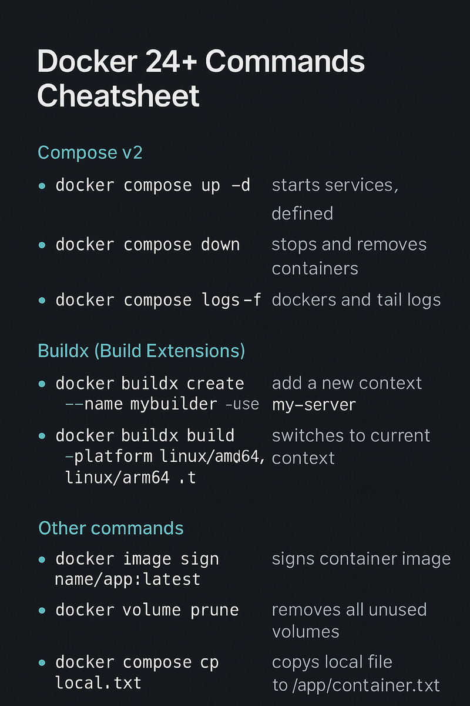

> 📌 This article is a follow-up to the [Docker Commands Cheatsheet](https://jsdev.space/docker-commands-cheatsheet/). If you're just getting started, start there — this article covers advanced features introduced in Docker 24+ and Docker Compose v2.

---

## What's New in Docker 24+

Docker 24+ introduces a range of modern enhancements aimed at improving build flexibility, team collaboration, and compatibility with multi-platform systems.

Key improvements include:

- `docker compose` CLI (Compose v2) — now a first-class citizen
- `docker buildx` — advanced builder with multi-platform support
- `docker context` — easy switching between local and remote environments
- Better image management, trust, and signing
- Improved volume and networking behavior

---

## 🚀 Goodbye `docker-compose`, Hello `docker compose`

In Docker 24+, the legacy `docker-compose` binary is deprecated in favor of `docker compose` (with a space).

✅ New Syntax:

```bash
docker compose up -d
docker compose down
docker compose logs -f
```

This change unifies Compose into the Docker CLI and brings new capabilities like:

- Native Docker Desktop integration
- Better error messages and performance
- Compatibility with docker context

> ⚠️ If you still rely on docker-compose, it’s time to switch — the new command supports all features and more.

## 🧱 Buildx — Multi-Platform Docker Builds

Docker 24+ comes with `buildx` by default — a powerful tool for building images for different CPU architectures (like ARM and x86).

```bash 
docker buildx create --name mybuilder --use
docker buildx build --platform linux/amd64,linux/arm64 -t yourname/app:latest .
```

Perfect for:

- Apple M1/M2 users who need to target x86 servers
- Building universal images for CI/CD pipelines
- Parallelized multi-stage builds

## 🌐 Remote Contexts with `docker context`

Contexts allow you to define multiple Docker environments — local, SSH-based, cloud-based — and easily switch between them.

```bash 
docker context create my-server --docker "host=ssh://user@my-server.com"
docker context use my-server
```

This is incredibly helpful when:

- Deploying remotely from your laptop
- Testing on different Docker hosts
- Automating deployments without Docker Desktop

To list contexts:

```bash 
docker context ls
```

## 🧪 Other Docker 24+ Features You Should Know

- Container image signing: Ensures your image hasn't been tampered with.
- Improved volume management: Better lifecycle handling, especially in Compose setups.
- Advanced docker compose cp: Copy files between local and container directly via Compose.

## 🔧 Should You Upgrade?

Yes — Docker 24+ modernizes the entire CLI experience. You get:

- Unified tooling via docker compose
- Multi-arch builds without hacks
- Seamless remote deployments
- Better performance and native support for M1/M2

### 🧭 What’s Next?

In future articles, we’ll explore:

- docker scan and security tooling
- docker init scaffolding
- Compose profiles for managing complex apps

## ✅ Summary



Docker 24+ is not just a version bump — it’s a shift to a cleaner, unified, and more powerful workflow. If you're still using docker-compose or haven’t tried buildx, now’s the time.

If you found this helpful, check out the [original cheatsheet here](https://jsdev.space/docker-commands-cheatsheet/), or leave a comment with what you'd like covered next.

Happy shipping 🐳