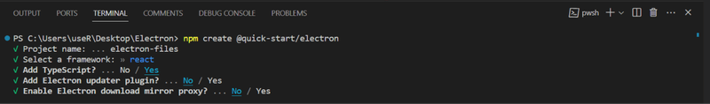

To get a list of all files in a folder and its subfolders using Electron and React, you can use the
Input Event to read the directory and file information. Here's a basic example of how you can
achieve this:

## 1. First, make sure you have Electron and React installed in your project:

<span className='code-cmd'>npm create @quick-start/electron</span>

Then follow the prompts!

```
✔ Project name: … <electron-app>
✔ Select a framework: › react
✔ Add TypeScript? … Yes
✔ Add Electron updater plugin? … No
✔ Enable Electron download mirror proxy? … No

Done.
```

<div className='single-post__img-wrapper'>
  
  <span className='single-post__img-alt'>
    Electron Vite Initialization Options
  </span>
</div>

## 2. Add Tailwind to Electron:

<span className='code-cmd'>npm install -D tailwindcss</span>

then...

<span className='code-cmd'>npx tailwindcss init</span>

### Configure your template paths

Add the paths to all of your template files in your **tailwind.config.js** file.

```js
/** @type {import('tailwindcss').Config} */
module.exports = {
  content: [
    './src/renderer/index.html',
    './src/renderer/src/**/*.{js,ts,jsx,tsx}',
  ],
};
```

### Add the Tailwind directives to your src/renderer/src/assets/index.css files

```
@tailwind base;
@tailwind components;
@tailwind utilities;
```

Now add postcss.config.js file to your root directory.

```js
module.exports = {
  plugins: {
    tailwindcss: {},
  },
};
```

Modify your `src/preload/index.ts` file to set an api route

```js
import { contextBridge } from 'electron';
import { electronAPI } from '@electron-toolkit/preload';
import * as fs from 'fs';

const api = {
  readdirS: async (path: string): Promise<Dirent[]> =>
    await fs.readdirSync(path, { encoding: 'utf-8', withFileTypes: true }),
  isDirectory: (path: string): boolean => fs.lstatSync(path).isDirectory(),
};

if (process.contextIsolated) {
  try {
    contextBridge.exposeInMainWorld('electron', electronAPI);
    contextBridge.exposeInMainWorld('api', api);
  } catch (error) {
    console.error(error);
  }
} else {
  // @ts-ignore (define in dts)
  window.electron = electronAPI;
  // @ts-ignore (define in dts)
  window.api = api;
}
```

Now add this code to App.ts inside the renderer folder

```js
import { useState } from 'react'

function App(): JSX.Element {
  const [files, setFiles] = useState<string[]>([])

  const folderOnChange = async (e: ChangeEvent<HTMLInputElement>) => {
    if (!e.target.files?.length) return
    const files: FileList = e.target.files
    const folderPath = files[0].path
    const dotIdx = folderPath.lastIndexOf('\\')
    let folder
    if (!dotIdx) {
      folder = folderPath
    } else {
      folder = folderPath.substring(0, dotIdx)
    }
    const filesAndFolders = await getFiles(folder)
    setFiles(filesAndFolders)
  }
  async function getFiles(dir, files = []): string[] {
    // Get an array of all files and directories in the passed directory using fs.readdirSync
    const fileList = await api.readdirS(dir)
    // Create the full path of the file/directory by concatenating the passed directory and file/directory name
    for (const file of Array.from(fileList)) {
      const name = `${dir}\\${file.name}`
      // Check if the current file/directory is a directory using fs.statSync
      if (api.isDirectory(name)) {
        // If it is a directory, recursively call the getFiles function with the directory path and the files array
        getFiles(name, files)
      } else {
        // If it is a file, push the full path to the files array
        files.push(name)
      }
    }
    return files
  }
  return (
    <div className="container">
      <div className="flex items-center justify-center w-full mt-5">
        <label
          className="flex items-center justify-center w-[216px] h-[45px] border border-gray-300 border-dashed
        rounded-lg cursor-pointer
        bg-gray-100 hover:bg-gray-250 dark:hover:bg-bray-400 dark:bg-gray-500 dark:hover:bg-gray-250
        hover:shadow-lg dark:hover:shadow-gray-400 hover:rotate-44"
        >
          <svg
            width="24"
            height="24"
            viewBox="0 0 24 24"
            fill="none"
            xmlns="http://www.w3.org/2000/svg"
          >
            <path
              d="M12 10V16M15 13H9M22 10V17C22 19.2091 20.2091 21 18 21H6C3.79086 21 2 19.2091 2 17V7C2 4.79086 3.79086 3 6 3H8.66667C9.53215 3 10.3743 3.28071 11.0667 3.8L12.9333 5.2C13.6257 5.71929 14.4679 6 15.3333 6H18C20.2091 6 22 7.79086 22 10Z"
              stroke="currentColor"
              strokeWidth="1.5"
              strokeLinecap="round"
              strokeLinejoin="round"
              className="stroke-gray-500 dark:stroke-gray-400"
            />
          </svg>

          <p className="mb-1 pl-2 text-sm text-gray-500 dark:text-gray-400">
            <span className="font-semibold">Select a folder</span>
          </p>
          <input
            type="file"
            className="hidden"
            directory=""
            webkitdirectory=""
            onChange={folderOnChange}
          />
        </label>
      </span>

      <div className="relative overflow-x-auto">
        <table className="w-full text-sm text-left rtl:text-right text-gray-500 dark:text-gray-400">
          <thead className="text-xs text-gray-700 uppercase bg-gray-50 dark:bg-gray-700 dark:text-gray-400">
            <tr>
              <th scope="col" className="px-6 py-3">
                File name
              </th>
            </tr>
          </thead>
          <tbody>
            {files.length > 0 &&
              files.map((file) => {
                return (
                  <tr
                    className="bg-white border-b dark:bg-gray-800 dark:border-gray-700"
                    key={file}
                  >
                    <th
                      scope="row"
                      className="px-6 py-4 font-medium text-gray-900 whitespace-nowrap dark:text-white"
                    >
                      {file}
                    </th>
                  </tr>
                )
              })}
          </tbody>
        </table>
      </span>
    </span>
  )
}

export default App
```

Run your app:

<span className='code-cmd'>npm run dev</span>

This example assumes that you have a basic understanding of Electron and React. Also, note that this
example doesn't handle errors, and in a production environment, you should implement error handling
for better robustness.
