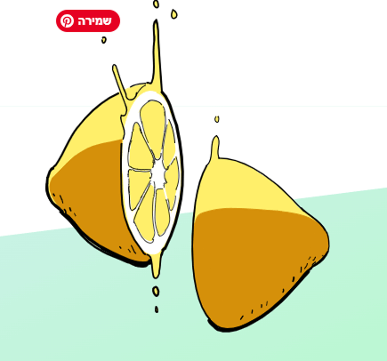
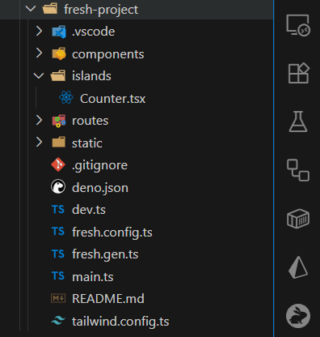

## A New Era of Full-Stack Frameworks  

If you’ve ever been frustrated by:  

- `npm install` taking minutes (or hours) before you can even write code,  
- bloated dependencies weighing hundreds of KB,  
- or the complexity of deploying edge-ready apps to Vercel/Netlify,  

then Fresh 2.0 might be exactly what you’ve been waiting for.  

Fresh is a full-stack framework from the Deno team that promises *fast, zero-config development* and *edge-first deployment*. And with the release of **Fresh 2.0 (beta)**, it now comes with a **Vite-powered build mode** that takes the experience to the next level.  

---

## What is Fresh?  



Fresh is a **Deno-native web framework** that emphasizes simplicity and performance.  

- **Runtime:** Runs directly on Deno (no Node.js), with first-class TypeScript support.  
- **Rendering:** Uses [Preact](https://preactjs.com/) with **Islands Architecture** – only hydrate the parts of the page that need interactivity, leaving the rest as fast, zero-JS HTML.  
- **Deployment:** Officially paired with [Deno Deploy](https://deno.com/deploy), enabling global edge distribution with one command.  

In short: it’s like Next.js, but simpler, faster, and designed from the ground up for modern edge-first applications.  

---

## Fresh 2.0 Beta: What’s New?  

In September 2024, the Deno team announced that **Fresh 2.0** had entered beta (release candidate).  

- The **API is frozen** — backward compatibility is guaranteed.  
- The framework is **production-ready** for trials.  
- A major milestone: **built-in Vite mode**.  

---

## Vite Mode: Three Big Upgrades  

Enabling Vite mode is as simple as tweaking `fresh.config.ts`:  

```ts
// fresh.config.ts
export default {
  build: { target: "vite" }, // Enable Vite mode
};
```

And the payoff is huge:  

1. **⚡ Instant HMR (Hot Module Replacement)**  
   Millisecond-level updates. Save a file and see changes immediately — no full reloads.  

2. **🚀 Lightning-Fast Cold Starts**  
   The dev server launches in milliseconds, even on low-end machines.  

3. **🔌 Vite Plugin Ecosystem**  
   Reuse the rich Vite ecosystem:  
   - [UnoCSS](https://unocss.dev/)  
   - [MDX](https://mdxjs.com/)  
   - [SVG loaders](https://github.com/jpkleemans/vite-svg-loader)  
   - [PWA plugins](https://vite-pwa-org.netlify.app/)  
   …and more. Just install and go.  

---

## Getting Started in 30 Seconds  

```bash
# 1. Create a new Fresh app
deno run -A -r https://fresh.deno.dev my-app

# 2. Move into the project
cd my-app

# 3. Start the dev server (native mode)
deno task start

# Or run in Vite mode (HMR + fast startup)
deno task start:vite
```

Open `http://localhost:8000` and your app is live. 🎉  

---

## Example: Islands Architecture in Action  



Fresh encourages you to think in **islands of interactivity**.  

```tsx
// islands/Counter.tsx
import { useState } from "preact/hooks";

export default function Counter() {
  const [count, setCount] = useState(0);
  return (
    <button onClick={() => setCount(count + 1)}>
      Count: {count}
    </button>
  );
}
```

In your page:  

```tsx
// routes/index.tsx
import Counter from "../islands/Counter.tsx";

export default function Home() {
  return (
    <div>
      <h1>Hello Fresh!</h1>
      <Counter />
    </div>
  );
}
```

- The **heading** renders as pure HTML (zero JS).  
- The **button counter** hydrates only when needed.  

---

## Deployment Options  

### 1. **Deno Deploy (Recommended)**  

```bash
deno deploy
```

One command pushes your app to 30+ global edge nodes.  

### 2. **Cloudflare Pages / Workers (Vite mode only)**  

Push your repo to GitHub, and Cloudflare Pages automatically detects `vite.config.ts`. Within minutes, your app is online.  

---

## When to Choose Fresh 2.0  

- You want **fast prototyping** without endless config.  
- You’re tired of **Node.js dependency hell**.  
- You need **edge-first deployment** for real-time apps.  
- You want **SSR + Islands Architecture** without the overhead of a full SPA.  

---

## Final Thoughts  

Fresh 2.0 with Vite is not just another framework — it’s a **new full-stack paradigm**:  

- **Dev experience:** as refreshing as Vite.  
- **Runtime:** as lightweight as Deno.  
- **Deployment:** as seamless as serverless edge functions.  

The future of full-stack might already be here. 🌍  

👉 Official resources:  
- [Fresh Website](https://fresh.deno.dev/)  
- [Fresh 2.0 Announcement](https://deno.com/blog/fresh-and-vite)  
- [GitHub Repository](https://github.com/denoland/fresh)  