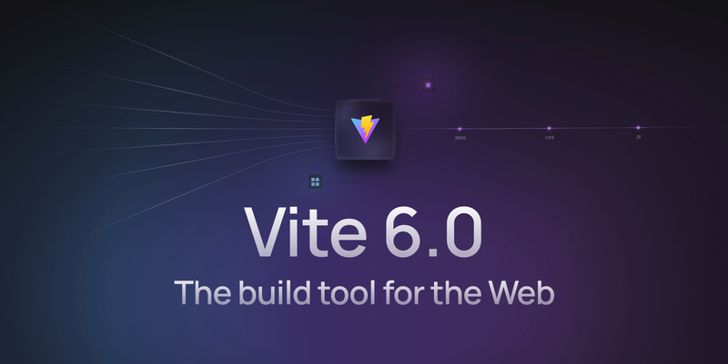

The frontend development landscape is constantly evolving, driven by advancements in frameworks, tools, and user expectations. As we enter 2025, several key trends are set to redefine how developers create modern web applications.

## 1. Framework Innovations

### Signals: A New Approach to Reactivity in Angular

One of Angular's most significant updates is the introduction of [Signals](https://angular.dev/guide/signals), a powerful new primitive for managing reactive data. Signals offer an intuitive, efficient way to handle application state, excelling in scenarios requiring:

- **Synchronous UI updates**: Signals ensure immediate reflection of data changes.
- **Simplified change tracking**: They streamline observing and managing state transitions.
- **Granular performance optimization**: By focusing updates only where necessary.

While ideal for synchronous operations, RxJS remains the go-to for handling complex asynchronous tasks, such as data streams, request cancellations, or error handling.

### RxJS: The Async Workhorse

RxJS continues to dominate asynchronous workflows, excelling in scenarios involving:

- Complex data streams.
- Combining multiple data sources.
- Efficient request cancellation and error processing.

Angular versions 17 and 19 have further refined RxJS, making it an optional dependency. This flexibility reduces bundle sizes and lowers the learning curve for new developers.

### Standalone Components: The New Standard

Starting with Angular 19, all components are now standalone by default. This update eliminates the need to manually define `standalone: true`, simplifying architecture and reducing reliance on the traditional modular structure.

### Functional Dependency Injection (DI)

Angular 19 introduces the `inject()` function for dependency injection, replacing traditional constructors with a cleaner, more flexible approach. Key benefits include:

- **Readable, concise code**.
- **Flexibility**: Dependencies can now be injected anywhere within the application.
- **Enhanced compatibility** with functional components.

Additionally, new control flow syntax and streamlined structural directives bring Angular templates closer to pure JavaScript, making them more intuitive.

### Automatic Migration Tools

To ease the transition to Signals and the new API, Angular 19 includes tools for automatic migration:

- **`@Input()` decorators** are transformed to the `input()` API.
- **`@Output()` decorators** are replaced with the `output()` API.

These changes reduce boilerplate and improve performance, ensuring Angular applications stay modern and efficient.

### React: Exciting Innovations in 2025

React continues to evolve with new features in version 19, aimed at improving performance and simplifying development workflows.

**Key Updates in React 19**

- **Server Components**: Enhanced for better server-side rendering, enabling faster dynamic content loading for enterprise apps.
- **Actions API**: Simplifies handling user interactions and managing state, particularly for forms and interactivity.
- **Resource Optimization**: New preload and preinit directives ensure essential resources load faster, improving app responsiveness.

**New React Hooks**

- **useEvent**: Reduces redundant renders by stabilizing event handlers.
- **useOptimistic**: Supports instant UI updates while awaiting server confirmations.
- **useDeferredValue**: Efficient for handling delayed data updates, ideal for large datasets.

**React Compiler**

This tool optimizes components and hooks during build time, reducing re-renders through automatic memoization. Released in beta, it promises significant performance improvements.

**Ecosystem Enhancements**

- **React Query 5**: Streamlined asynchronous data handling with server component integration.
- **Redux Updates**: RTK Query standardizes state management for server-side interactions.

React’s ecosystem and tools position it as a top choice for scalable, efficient web application development.

### Vue: Enhanced Performance and Versatility

[Vue.js](https://vuejs.org/) remains one of the most popular web development frameworks due to its simplicity, flexibility, and robust ecosystem. In 2025, Vue continues to evolve with innovative tools and features to meet modern development demands.

**Key Highlights of Vue 3**

- **Composition API**: Enables cleaner, scalable architecture, perfect for complex applications.
- **TypeScript Integration**: Improved type support enhances stability and code quality.

**Nuxt 4 Advancements**

[Nuxt 4](https://nuxt.com/) brings speed and flexibility improvements:

- **Turbo Mode**: Accelerates builds up to 10x faster.
- **Native Edge Server**: Reduces latency for global apps.
- **Enhanced SSR/SSG Support**: Integrated with Vue 3.3+ for seamless development.

**Vapor Mode**

This revolutionary feature replaces the virtual DOM with direct real DOM interaction, boosting performance, reducing latency, and enabling faster rendering.

Vue in 2025 is set to empower developers with unmatched tools for creating high-performance applications.

## Next-Gen Build Tools

### Vite 6: Leadership in Project Builds and Versatility

[Vite 6](https://vite.dev/) has strengthened its position as a leading build tool, expanding beyond Vue to support React, Svelte, Angular, and more. This versatility makes it ideal for modern web development.

**Key Features of Vite 6**:

- **Modular Architecture**: New plugin system allows extensive build customization.
- **Multi-Framework Support**: Simplifies hybrid app development across frameworks.
- **WebAssembly and WebGPU Integration**: Enables high-performance 3D rendering and computation in browsers.
- **Improved HMR**: Faster and more reliable hot module replacement for complex projects.

Vite 6 offers enhanced performance, flexibility, and scalability for developers building diverse applications.

### Bun: The Rising Star

[Bun](https://bun.sh/) consolidates package management, bundling, and JavaScript runtime into one high-speed solution. It reduces dependency resolution times and supports TypeScript natively, making it a strong contender against Node.js for server-side development.

**Key Features**:

- **Lightning-Fast Performance**: Built with Zig, Bun offers unmatched speed for dependency installation and code execution.
- **Native TypeScript Support**: Seamlessly runs TypeScript without extra configuration.
- **Unified Tooling**: Replaces Node.js, npm, and other tools with a single efficient system.
- **SSR Optimization**: Optimized for server-side rendering, reducing latency and improving performance.

Bun is a compelling alternative for developers seeking streamlined workflows and high performance.

## Artificial Intelligence in Frontend

The integration of AI tools into frontend workflows is becoming a game-changer. Platforms like GPT-based APIs enable advanced features such as auto-completion, content personalization, and real-time sentiment analysis. Multimodal assistants like Cursor Composer and Windsurf streamline coding and debugging by providing context-aware suggestions directly in development environments.

## Developer-Centric Enhancements

**Optimized Workflows**

Modern frameworks are increasingly prioritizing developer experience. With innovations like [Nuxt DevTools](https://devtools.nuxt.com/) and improved debugging mechanisms, troubleshooting large applications becomes less time-consuming.

**Focus on Performance**

Tools such as **React Compiler** and **Vapor Mode** in Vue tackle performance bottlenecks at the root. Preloading assets using directives like preload and preinit ensures faster loading times, essential for high-traffic websites.

## Broader Trends

- **Universal Compatibility**: Tools like Vite and frameworks like Svelte enhance collaboration across diverse tech stacks.
- **Edge Computing**: Frameworks integrating native edge server support enable faster, localized content delivery.
- **WebGPU Expansion**: High-performance graphics rendering is becoming standard for creating immersive web experiences.

## Conclusion

2025 is poised to be a transformative year for frontend development. Frameworks are becoming faster, more flexible, and easier to use, while AI integration is streamlining workflows. Developers are empowered with tools to deliver scalable, high-performance applications, meeting the growing demands of modern users.

Let me know if you'd like to expand specific sections or add more details!
