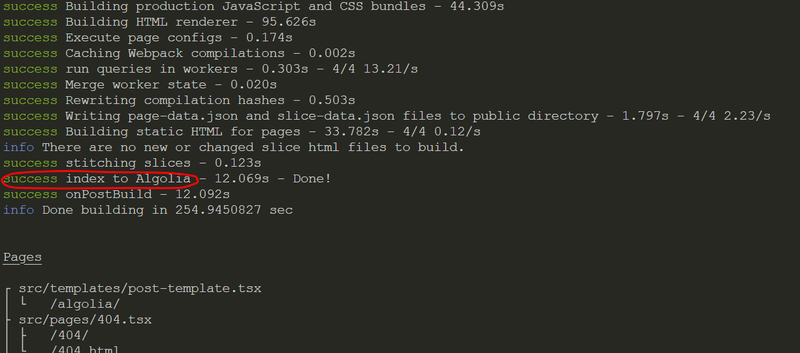

Implementing a powerful, interactive search functionality on your
[**Gatsby**](https://www.gatsbyjs.com/) blog can dramatically improve user experience. In this
guide, we will set up search using Algolia, integrate form handling with
[**React Hook Form**](https://react-hook-form.com/), hashing with
[**zustand**](https://zustand-demo.pmnd.rs/), and style everything with
[**ShadcnUI**](https://ui.shadcn.com/) to give your site a polished look.

## Here is what we want to do:

- Create an empty Gatsby website with some mdx content
- Setup algolia search and receive API keys from it
- Add shadcn UI and create beautiful search panel and trigger
- Add React Hook Form

Let's begin implementing these features step by step.

## Prepare you Gatsby website

### 1. Setup Gatsby

<span className='code-cmd'>gatsby new</span>

```js
What would you like to call your site?
√ · gatsby-algolia
What would you like to name the folder where your site will be created?
√ Gatsby/ gatsby-algolia
√ Will you be using JavaScript or TypeScript?
· TypeScript
√ Will you be using a CMS?
· No (or I\'ll add it later)
√ Would you like to install a styling system?
· Tailwind CSS
√ Would you like to install additional features with other plugins?
· Add responsive images
· Generate a manifest file
```

<span className='code-cmd'>cd gatsby-algolia</span>

### 2. Init ShadcnUI and TailwindCSS

Add this code to your **tsconfig** file

```js
{
  "compilerOptions": {
    // ...
    "baseUrl": ".",
    "paths": {
      "@/*": [
        "./src/*"
      ]
    }
    // ...
  }
}
```

Don't forget to add a comma at the end. You can also follow this instructions by
[shadcn](https://ui.shadcn.com/docs/installation/gatsby)

**Create gatsby-node.ts file:**

```js
import * as path from 'path';

import * as path from 'path';

export const onCreateWebpackConfig = ({ actions }) => {
  actions.setWebpackConfig({
    resolve: {
      alias: {
        '@/components': path.resolve(__dirname, 'src/components'),
        '@/lib/utils': path.resolve(__dirname, 'src/lib/utils'),
      },
    },
  });
};
```

Now run

<span className='code-cmd'>npx shadcn@latest init</span>

Answer the questions

```bash
Would you like to use TypeScript (recommended)? no / yes
Which style would you like to use? › Default
Which color would you like to use as base color? › Slate
Where is your global CSS file? › › ./src/styles/globals.css
Do you want to use CSS variables for colors? › no / yes
Where is your tailwind.config.js located? › tailwind.config.js
Configure the import alias for components: › @/components
Configure the import alias for utils: › @/lib/utils
Are you using React Server Components? › no
```

That's it, now let's test it out. First add button

<span className='code-cmd'>npx shadcn@latest add button</span>

Remove everything from **index.ts** file inside the pages folder. Than add shadcn button to your
**index** page for testing

```js
import * as React from 'react';
import type { HeadFC, PageProps } from 'gatsby';
import { Button } from '../components/ui/button';

const IndexPage: React.FC<PageProps> = () => {
  return (
    <main>
      <Button>Test</Button>
    </main>
  );
};

export default IndexPage;

export const Head: HeadFC = () => <title>Home Page</title>;
```

Run

<span className='code-cmd'>npm run develop</span>

You must to see now test shadcn button.

### 3. Add some content to your site

Create **content** folder in a root of gatsby and file **what-is-algolia.mdx**

Here is the content, thanks to [ChatGPT](https://openai.com/chatgpt/).

```mdx
---
title: What is Algolia?
slug: algolia
permalink: algolia
date: 2024-09-06
author: algolia gatsby
category: gatsby
type: post
tags: ['algolia']
desc:
  Algolia is a powerful search-as-a-service platform that allows developers to easily add fast and
  relevant search functionality to websites and applications.
---

In the digital age, delivering fast, relevant, and user-friendly search experiences has become
crucial for businesses, especially those with large volumes of content, products, or user-generated
data. Algolia, a leading search-as-a-service platform, addresses this need by providing a powerful,
customizable, and scalable solution that enables developers to implement real-time search
functionality with ease. In this article, we'll explore the key features of Algolia, how it works,
its benefits, and how it compares to other search engines.

## What is Algolia?

Algolia is a hosted search engine that allows developers to build and deploy fast, accurate search
experiences into their websites, apps, or e-commerce platforms. Unlike traditional search engines,
Algolia focuses on delivering search results with lightning speed and high relevancy. It's known for
its ability to handle typo-tolerance, instant search, and powerful ranking algorithms that can
prioritize the most relevant results.

With Algolia, developers don’t need to spend time building complex search algorithms from scratch.
Instead, they can leverage Algolia’s pre-built APIs to integrate advanced search functionality into
their applications in just a few steps.

### Key Features of Algolia

1. **Instant Search** Algolia’s flagship feature is instant search, which delivers results as users
   type. This provides a fast and seamless experience, especially useful in scenarios like
   e-commerce where customers expect quick access to relevant products or categories.
2. **Real-time Indexing** With Algolia, any updates to your content are reflected instantly in
   search results. Whether it's adding a new product, modifying an article, or deleting old data,
   Algolia's indexing is performed in real-time, ensuring users always get up-to-date information.
3. **Typo-Tolerance** Algolia is designed to handle user input errors gracefully. It accounts for
   common typos, spelling mistakes, and other variations without sacrificing the relevancy of search
   results. For instance, if a user types "iphon" instead of "iPhone," Algolia still provides
   relevant results.
4. **Custom Ranking** and Relevance Algolia allows developers to customize the ranking of search
   results based on attributes such as popularity, user behavior, or custom business logic. This is
   especially beneficial for e-commerce platforms that want to prioritize in-stock products or
   high-margin items.
5. **Faceted Search** and Filtering Faceted search enables users to filter results by categories,
   tags, or other attributes, improving their ability to find exactly what they’re looking for. This
   feature is critical in content-rich websites, blogs, or e-commerce stores with hundreds of
   products.
6. **Geo-Search** For location-based applications, Algolia offers geo-search capabilities that allow
   users to search for results near their physical location. This feature is commonly used in local
   directories, restaurant finders, and real estate platforms.
7. **Search Analytics** Algolia provides detailed analytics on user search behavior, showing metrics
   like top queries, no-result queries, and conversion rates. These insights can help businesses
   optimize search relevancy and boost engagement.
8. **Multi-language Support** Algolia supports multiple languages, making it a good choice for
   global companies. The platform offers language-specific tools and optimizations to ensure that
   search experiences are tailored to users’ native tongues.

### How Does Algolia Work?

At the heart of Algolia’s service is its index, a data structure optimized for fast searches. Here’s
a breakdown of how Algolia works:

1. **Indexing Your Data** Before users can search, the data needs to be indexed. Algolia allows
   developers to upload their data in various formats (like JSON) and store it in the Algolia cloud.
   Each item in the dataset is indexed as an object with multiple attributes. This might include
   titles, descriptions, prices, tags, categories, or any other relevant data points.
2. **Search Query Execution** When a user enters a search query, Algolia matches the input against
   the indexed data using its highly optimized search algorithms. These algorithms consider factors
   like typo tolerance, partial matches, and synonyms to deliver the most relevant results.
3. **Customization with APIs** Algolia provides easy-to-use APIs for customizing search behavior.
   Developers can fine-tune the ranking formula, implement filters, define sorting orders, and even
   control which attributes should influence the search relevancy. The APIs support popular
   programming languages such as JavaScript, Python, PHP, and Ruby.

4. **Ranking and Sorting** Algolia uses a combination of textual relevance and custom business logic
   to rank and sort search results. For example, an e-commerce site might rank products based on
   availability, while a blog might prioritize the most recent articles.

5. **Search Results Display** Once the search query is processed, Algolia returns the most relevant
   results almost instantaneously. These results can be displayed on the frontend using various UI
   libraries or custom designs, ensuring they blend seamlessly with your application’s look and
   feel.

## Use Cases for Algolia

Algolia's flexibility makes it suitable for various industries and applications. Some of the most
common use cases include:

- **E-commerce Search**: Algolia powers product searches for some of the largest online retailers.
  It ensures customers can find products quickly, even with incomplete or misspelled queries.
  Features like filtering, sorting, and ranking are also easily customizable.
- **Media and Content Websites**: Content-heavy websites, such as news portals or blogs, use Algolia
  to improve their search functionality. Visitors can quickly find articles, videos, or documents,
  sorted by relevancy or other criteria.
- **SaaS Applications**: Many SaaS platforms integrate Algolia to offer users fast, searchable data,
  whether it's customer records, project tasks, or shared files.
- **Mobile Applications**: With SDKs for mobile platforms, Algolia is also a good choice for mobile
  apps that require in-app search functionality.

### Algolia vs. Other Search Engines

Algolia is often compared to other search platforms like Elasticsearch and Solr. Here’s how Algolia
stands out:

- **Speed**: Algolia is designed for speed. It provides results in milliseconds, even for complex
  searches across large datasets.
- **Ease of Use**: Algolia's API and developer tools are designed to be straightforward and
  user-friendly. It doesn’t require deep technical expertise to implement, which reduces time to
  market.
- **Cloud-Based**: Algolia is fully hosted, which means you don’t need to worry about infrastructure
  management or scaling as your data grows.
- **Relevancy**: Algolia is more focused on delivering relevant results compared to competitors,
  offering typo tolerance, customizable ranking algorithms, and real-time indexing.

However, some of the drawbacks include:

- **Cost**: Algolia can be more expensive than self-hosted solutions like Elasticsearch, especially
  as your dataset grows.
- **Customization**: While Algolia provides a lot of customization, some highly specific or advanced
  use cases may still be better suited for an open-source solution where developers can have
  complete control over the search infrastructure.

### Benefits of Using Algolia

- **Fast Implementation**: With pre-built APIs and extensive documentation, integrating Algolia into
  an application takes minutes rather than hours or days.
- **Improved User Experience**: By providing fast, relevant search results, Algolia enhances the
  overall user experience, leading to higher engagement and retention rates.
- **Scalability**: Algolia’s infrastructure can handle massive datasets and heavy search traffic,
  making it suitable for growing businesses.
- **Customization**: Developers have full control over how searches are performed and ranked,
  allowing them to tailor the search experience to their specific business needs.
- **Global Availability**: With multiple data centers across the world, Algolia offers low-latency
  search results regardless of user location.

## Getting Started with Algolia

To start using Algolia, follow these steps:

1. **Sign Up**: Create an account on the Algolia website.
2. **Create an Index**: Upload your data to Algolia and index it.
3. **Integrate the API**: Use Algolia’s API to implement search functionality in your app or
   website.
4. **Customize**: Fine-tune the search behavior with Algolia’s customization options like ranking,
   sorting, and filtering.

## Conclusion

Algolia is a powerful, easy-to-use search-as-a-service platform that enables developers to deliver
fast, accurate, and relevant search experiences. Its wide range of features, such as real-time
indexing, typo-tolerance, faceted search, and geo-search, make it an ideal solution for e-commerce,
content-heavy websites, and mobile apps. While it may come at a cost, the time and resources saved
through its rapid deployment and scalability make it a worthwhile investment for businesses looking
to improve their search functionality.
```

### 4. Provide the content path to Gatsby

Install a **gatsby-source-filesystem** plugin, and provide the path to it

<span className='code-cmd'>npm install gatsby-source-filesystem</span>

then

```js
// gatsby-config.ts

{
  resolve: 'gatsby-source-filesystem',
  options: {
    name: 'pages',
    path: './src/pages/',
  },
  __key: 'pages',
},
{
  resolve: `gatsby-source-filesystem`,
  options: {
    name: 'posts',
    path: `./content`,
  },
},
```

### 5. Create a simple post template

Create a file **post-template.tsx** in **templates** directory:

```tsx
import * as React from 'react';

import { MDXProvider } from '@mdx-js/react';
import { graphql, HeadFC, PageProps } from 'gatsby';

import { MDXProvider } from '@mdx-js/react';
import { graphql, HeadFC, PageProps } from 'gatsby';

const PostTemplate: React.FC<PageProps<Queries.GetSinglePostQuery>> = ({
  data: {
    mdx: {
      frontmatter: { title },
    },
  },
  children,
}) => {
  return (
    <div className='my-16 px-64'>
      <article className='text-lg'>
        <h1 className='my-5 space-y-5 text-4xl font-medium tracking-wide'>
          {title}
        </h1>
        <MDXProvider> {children}</MDXProvider>
      </article>
    </div>
  );
};
export const query = graphql`
  query GetSinglePost($slug: String) {
    mdx(frontmatter: { slug: { eq: $slug } }) {
      frontmatter {
        title
      }
    }
  }
`;

export const Head: HeadFC<Queries.GetSinglePost, unknown> = ({
  data: {
    mdx: {
      frontmatter: { title },
    },
  },
}) => {
  return (
    <>
      <title>{title}</title>
    </>
  );
};

export default PostTemplate;
```

### 6. Setup gatsby-plugin-mdx plugin

<span className='code-cmd'>npm install gatsby-plugin-mdx @mdx-js/react</span>

Add this config to the plugins list, inside a **gatsby-config** file

```js
    {
      resolve: 'gatsby-plugin-mdx',
      options: {
        extensions: ['.md', '.mdx'],
      },
    },
```

### 7. Querying for Content with GraphQL

In Gatsby, querying for content is done using GraphQL, a powerful query language integrated into the
framework. It allows you to fetch data from your sources like Markdown files, CMS systems, or other
APIs. We need just a slug and contentFilePath to create our pages.

```ts
// gatsby-node.ts

export const createPages: GatsbyNode[`createPages`] = async ({
  graphql,
  actions,
  reporter,
}: CreatePagesArgs) => {
  const { createPage } = actions;
  const postTemplate = path.resolve(`src/templates/post-template.tsx`);

  const result = await graphql<Queries.GatsbyNodeCreatePagesQuery>(`
    query GatsbyNodeCreatePages {
      allMdx {
        nodes {
          frontmatter {
            slug
          }
          internal {
            contentFilePath
          }
        }
      }
    }
  `);

  if (result.errors) {
    reporter.panicOnBuild('Error loading MDX result', result.errors);
  }

  const posts = result.data.allMdx.nodes;

  posts.forEach(node => {
    createPage({
      path: `/${node.frontmatter.slug}`,
      component: `${postTemplate}?__contentFilePath=${node.internal.contentFilePath}`,
      context: {
        slug: node.frontmatter.slug,
        category: node.frontmatter.category,
      },
    });
  });
};
```

Let's test it:

<span className='code-cmd'>npm run develop</span>

Now open http://localhost:8000/algolia to see the post.

## Install Dependencies

We need to install the zustand, react-hook-form, algoliasearch, gatsby-plugin-algolia, and some
Shadcn components:

<span className='code-cmd'>
  npm i zustand react-hook-form algoliasearch gatsby-plugin-algolia
  react-instantsearch
</span>

### Create an Algolia account

Sign-up on [Algolia](https://dashboard.algolia.com/users/sign_up) website.


Copy the Application ID, Search-Only API Key, and Admin API Key from your Algolia dashboard. Then,
create a .env file at the root of your project and add these keys for secure access:

```js
ALGOLIA_APP_ID = your_application_id;
ALGOLIA_SEARCH_KEY = your_search_only_key;
ALGOLIA_ADMIN_KEY = your_admin_key;
```

This setup will allow your Gatsby project to securely access Algolia's services without exposing
sensitive credentials in the codebase.

### Create Algolia queries file

Inside a lib directory, add **algolia-queries.ts** file:

```ts
import escapeStringRegexp from 'escape-string-regexp';

import escapeStringRegexp from 'escape-string-regexp';

const pagesIndexName = `Pages`;

export const searchIndices = [{ name: pagesIndexName, title: pagesIndexName }];

const pageQuery = `
{
  pages: allMdx(filter: {frontmatter: {type: {in: "post"}}}) {
    edges {
      node {
        id
        frontmatter {
          title
          permalink
        }
        excerpt(pruneLength: 5000)
      }
    }
    totalCount
  }
}
`;

function pageToAlgoliaRecord({ node: { id, frontmatter, ...rest } }) {
  return {
    objectID: id,
    ...frontmatter,
    ...rest,
  };
}

export const algoliaQueries = [
  {
    query: pageQuery,
    transformer: ({ data }) => data.pages.edges.map(pageToAlgoliaRecord),
    indexName: pagesIndexName,
    settings: { attributesToSnippet: [`excerpt:20`] },
  },
];
```

then add **gatsby-plugin-algolia** to config file:

```js
{
  resolve: `gatsby-plugin-algolia`,
  options: {
    appId: 'YOUR_APP_ID',
    apiKey: 'YOUR_API_KEY',
    queries: algoliaQueries,
    enablePartialUpdates: true,
    matchFields: ['slug', 'date'],
  },
},
```

Run

<span className='code-cmd'>npm run build</span>

This will import the queries we build to algolia search



Now check Algolia dashboard


## Create a search store

We will hash all search queries to show the last searches.

Create a folder **store** in a root directory, and **searchStore.ts file**

```ts
import { create } from 'zustand';

import { create } from 'zustand';

interface SearchTerms {
  searchTerms: Map<number, string>;
  addSearchTerm: (term: string) => void;
}

const useSearchStore = create<SearchTerms>((set, get) => ({
  searchTerms: new Map(),
  addSearchTerm: (searchTerm: string) => {
    set(state => {
      const isSame = Array.from(state.searchTerms.entries()).find(
        ([number, term]) =>
          searchTerm.includes(term) || searchTerm.startsWith(term)
      );
      const isMoveKeys = state.searchTerms.size > 1 && !isSame;

      const clonedMap = new Map<number, string>();
      if (isMoveKeys) {
        state.searchTerms.forEach((val, key) => {
          if (key !== 3) {
            clonedMap.set(key + 1, val);
          }
        });
      }

      return {
        searchTerms: isMoveKeys
          ? clonedMap.set(1, searchTerm)
          : isSame
            ? new Map(state.searchTerms).set(state.searchTerms.size, searchTerm)
            : clonedMap.set(1, searchTerm),
      };
    });
  },
}));

export default useSearchStore;
```

Now, each time a user enters a search query, it will be hashed, and the most recent searches will
appear in our form for easy reference.

## Create Search Component

Add dialog component from Shadcn

<span className='code-cmd'>npx shadcn@latest add dialog</span>

Add input component

<span className='code-cmd'>npx shadcn@latest add input</span>

Install **ScrollArea** and **VisuallyHidden** from @radix-ui

<span className='code-cmd'>
  npm install @radix-ui/react-visually-hidden @radix-ui/react-scroll-area
</span>

Add a form component (ShadcnUI)

<span className='code-cmd'>npx shadcn@latest add form</span>

### Create a search form (trigger)

Make static search queries, for default search block:

Create a file **static-search.queries.ts** inside the lib folder:

```ts
// static-search.queries.ts

type StaticSearchQuery = {
  name: string;
  href: string;
};

export const StaticSearchQueries: StaticSearchQuery[] = [
  {
    name: 'Article #1',
    href: '/1',
  },
  {
    name: 'Article #2',
    href: '/2',
  },
  {
    name: 'Article #3',
    href: '/3',
  },
];
```

Now create a folder **search** inside a components folder. Create also folders **blocks** and
**forms** inside a search.

Let's begin from block...create file **header-search.block.tsx**

```ts
import * as React from 'react';

import { Input } from '../../ui/input';
import { SearchIcon } from 'lucide-react';

type HeaderSearchBlockProps = {
  setIsOpen: (bool: boolean) => void;
};

const HeaderSearchBlock = ({ setIsOpen }: HeaderSearchBlockProps) => {
  return (
    <div
      className='relative'
      onClick={() => {
        console.log('IsOpen', setIsOpen);
        setIsOpen(true);
      }}
    >
      <SearchIcon className='absolute left-2.5 top-2 h-4 w-4 text-muted-foreground' />
      <Input
        type='search'
        placeholder='Search...'
        className='hidden md:inline-block pl-8 h-8 focus-visible:ring-offset-1 focus-visible:ring-1'
      />
    </div>
  );
};
export default HeaderSearchBlock;
```

Now create a **search-form.tsx**, and **search-form.props.tsx** inside the forms directory

```tsx
// **search-form.props.tsx**

import * as React, { DetailedHTMLProps } from 'react';

export interface SearchFormProps
  extends DetailedHTMLProps<HTMLDivElement<HTMLDivElement, unknown>, HTMLDivElement> {
  query: string;
  refine: (string) => void;
}
```

Create also private **\_components** folder inside the forms, with 2 components.

1. Default Search - default screen of your search

```tsx
// default-search-form.tsx
import * as React from 'react';

import { StaticSearchQueries } from '../../../../lib/queries/search/static-search.queries';
import useSearchStore from '../../../../store/searchStore';
import { Link } from 'gatsby';
import { Activity } from 'lucide-react';

import { StaticSearchQueries } from '../../../../lib/queries/search/static-search.queries';
import useSearchStore from '../../../../store/searchStore';
import { Link } from 'gatsby';
import { Activity } from 'lucide-react';

type DefaultSearchFormProps = {
  refine: (string) => void;
};

const DefaultSearchForm = ({ refine }): DefaultSearchFormProps => {
  const searchTerms = useSearchStore(state => state.searchTerms);

  React.useEffect(() => {
    if (!searchTerms) {
      return;
    }
  }, [searchTerms]);

  return (
    <div className='space-y-4 px-2 py-4'>
      <div>
        <div className='mb-2 px-2 text-xs font-semibold uppercase text-slate-600 dark:text-slate-300'>
          Recent
        </div>
        <ul>
          {searchTerms &&
            Array.from(searchTerms.entries())
              .sort((a, b) => a[0] - b[0])
              .map(([number, term]) => {
                return (
                  <li
                    key={term}
                    onClick={e => refine(term)}
                    className='group flex cursor-pointer items-center rounded px-2 py-1 text-sm leading-6 text-black outline-none focus-within:bg-slate-50 hover:bg-slate-50 dark:text-white dark:focus-within:bg-slate-800 dark:hover:bg-slate-800'
                  >
                    <Activity
                      size={12}
                      className='mr-3 fill-slate-400 group-hover:scale-125 group-hover:animate-pulse dark:fill-slate-600'
                    />
                    <span>{term}</span>
                  </li>
                );
              })}
        </ul>
      </div>
      <div>
        <div className='mb-2 px-2 text-xs font-semibold uppercase text-slate-600 dark:text-slate-300'>
          Suggestions
        </div>
        <ul>
          {StaticSearchQueries.map(searchQuery => {
            return (
              <li key={searchQuery.name}>
                <Link
                  className='group flex items-center rounded px-2 py-1 text-sm leading-6 text-black outline-none focus-within:bg-slate-50 hover:bg-slate-50 dark:text-white dark:focus-within:bg-slate-800 dark:hover:bg-slate-800'
                  to={searchQuery.href}
                >
                  <Activity
                    size={12}
                    className='mr-3 fill-slate-400 group-hover:scale-125 group-hover:animate-pulse dark:fill-slate-600'
                  />
                  <span>{searchQuery.name}</span>
                </Link>
              </li>
            );
          })}
        </ul>
      </div>
    </div>
  );
};
export default DefaultSearchForm;
```

And search result component:

**search-result.tsx**

```ts
import * as React from 'react';

import { Link } from 'gatsby';
import { useStats, Index, Hits, Highlight, Snippet } from 'react-instantsearch';
import { Activity } from 'lucide-react';

import { searchIndices } from '../../../../lib/algolia-queries';

const SearchResult = () => {
  const { nbHits } = useStats();

  return (
    <div className='space-y-4 px-2 py-4'>
      <div>
        <ul>
          {searchIndices.map(({ name, title }, idx) => (
            <Index indexName={name} key={name} className='py-0'>
              <div className='flex justify-between my-2'>
                <span className='px-2 font-semibold uppercase text-slate-700 dark:text-slate-200 text-lg'>
                  {title}
                </span>
                {idx == 0 && nbHits > 0 && (
                  <span className='text-slate-600 dark:text-slate-400 flex justify-end text-lg'>
                    {nbHits} post{nbHits !== 1 ? 's' : ''} found
                  </span>
                )}
              </div>
              <Hits
                hitComponent={({ hit }) => (
                  <div>
                    <Link
                      className='group flex items-center rounded px-2 py-1 text-sm leading-6 outline-none focus-within:bg-slate-50 hover:bg-slate-50 dark:focus-within:bg-slate-800 dark:hover:bg-slate-800 text-black dark:text-white'
                      to={`/${hit.permalink}`}
                    >
                      <Activity
                        size={12}
                        className='fill-slate-400 dark:fill-slate-600 mr-3 group-hover:animate-pulse group-hover:scale-125'
                      />
                      <Highlight attribute='title' hit={hit} className='text-xl' />
                    </Link>
                    <Snippet
                      attribute='excerpt'
                      hit={hit}
                      className='text-slate-600 dark:text-slate-400'
                    />
                  </div>
                )}
              />
            </Index>
          ))}
        </ul>
      </div>
    </div>
  );
};
export default SearchResult;
```

Now connect those components in **search-form.tsx**

```tsx
import * as React from 'react';
import { Form, useForm } from 'react-hook-form';
import { useSearchBox } from 'react-instantsearch';

import * as ScrollArea from '@radix-ui/react-scroll-area';
import * as VisuallyHidden from '@radix-ui/react-visually-hidden';
import useSearchStore from '../../../store/searchStore';
import DefaultSearchForm from './_components/default-search-form';
import SearchResult from './_components/search-result';
import { SearchFormProps } from './search-form.props';
import {
  FormControl,
  FormDescription,
  FormField,
  FormItem,
  FormLabel,
  FormMessage,
} from '@/components/ui/form';
import { Input } from '@/components/ui/input';
import { SearchIcon } from 'lucide-react';

import * as ScrollArea from '@radix-ui/react-scroll-area';
import * as VisuallyHidden from '@radix-ui/react-visually-hidden';
import useSearchStore from '../../../store/searchStore';
import DefaultSearchForm from './_components/default-search-form';
import SearchResult from './_components/search-result';
import { SearchFormProps } from './search-form.props';
import {
  FormControl,
  FormDescription,
  FormField,
  FormItem,
  FormLabel,
  FormMessage,
} from '@/components/ui/form';
import { Input } from '@/components/ui/input';
import { SearchIcon } from 'lucide-react';

type SearchInput = {
  searchQuery: string;
};

const SearchForm = () => {
  const { query, refine } = useSearchBox();
  const searchTerms = useSearchStore(state => state.searchTerms);
  const addSearchTerm = useSearchStore(state => state.addSearchTerm);
  const { register, handleSubmit } = useForm<SearchInput>({
    defaultValues: {
      searchQuery: '',
    },
    mode: 'onChange',
  });

  const onChange = ({ searchQuery = '' }: SearchInput) => {
    refine(searchQuery);
    const isSame = Array.from(searchTerms.entries()).find(
      ([number, term]) =>
        term.includes(searchQuery) || term.startsWith(searchQuery)
    );
    if (!isSame && searchQuery?.length > 4) {
      addSearchTerm(searchQuery);
    }
  };

  return (
    <>
      <form
        onChange={handleSubmit(onChange)}
        className='relative flex items-center'
      >
        <VisuallyHidden.Root>
          <label htmlFor='search-modal'>Search</label>
        </VisuallyHidden.Root>
        <SearchIcon className='absolute left-2.5 top-2 h-4 w-4 text-muted-foreground' />
        <Input
          {...register('searchQuery')}
          placeholder='search'
          className='mr-8 h-8 pl-8 focus-visible:ring-1 focus-visible:ring-offset-1'
          type='search'
          placeholder='Search'
          aria-label='Search'
          defaultValue={query}
        />
      </form>
      <ScrollArea.Root className='max-h-[calc(85vh-44px)]'>
        <ScrollArea.Viewport className='h-full w-full'>
          {query && query.length > 1 ? (
            <SearchResult />
          ) : (
            <DefaultSearchForm refine={refine} />
          )}
        </ScrollArea.Viewport>
        <ScrollArea.Scrollbar
          className='flex h-full w-2 touch-none select-none border-l border-l-transparent p-[1px] transition-colors'
          orientation='vertical'
        >
          <ScrollArea.Thumb className='relative flex-1 rounded-full bg-slate-300' />
        </ScrollArea.Scrollbar>
        <ScrollArea.Scrollbar
          className='flex h-2.5 touch-none select-none flex-col border-t border-t-transparent p-[1px] transition-colors'
          orientation='horizontal'
        >
          <ScrollArea.Thumb className='relative flex-1 rounded-full bg-slate-300' />
        </ScrollArea.Scrollbar>
        <ScrollArea.Corner className='bg-blackA5' />
      </ScrollArea.Root>
    </>
  );
};
export default SearchForm;
```

Last one step - create a index in a search dir:

```tsx
// index.tsx
import * as React from 'react';
import { useEffect, useState } from 'react';
import { InstantSearch, useSearchBox } from 'react-instantsearch';

import * as VisuallyHidden from '@radix-ui/react-visually-hidden';
import { searchIndices } from '../../lib/algolia-queries';
import { Button } from '../ui/button';
import {
  Dialog,
  DialogClose,
  DialogContent,
  DialogDescription,
  DialogOverlay,
  DialogPortal,
  DialogTitle,
  DialogTrigger,
} from '../ui/dialog';
import { Input } from '../ui/input';
import HeaderSearchBlock from './blocks/header-search.block';
import SearchForm from './forms/search-form';
import { algoliasearch } from 'algoliasearch';
import { Link } from 'gatsby';
import { Search as SearchIcon } from 'lucide-react';

import * as VisuallyHidden from '@radix-ui/react-visually-hidden';
import { searchIndices } from '../../lib/algolia-queries';
import { Button } from '../ui/button';
import {
  Dialog,
  DialogClose,
  DialogContent,
  DialogDescription,
  DialogOverlay,
  DialogPortal,
  DialogTitle,
  DialogTrigger,
} from '../ui/dialog';
import { Input } from '../ui/input';
import HeaderSearchBlock from './blocks/header-search.block';
import SearchForm from './forms/search-form';
import { algoliasearch } from 'algoliasearch';
import { Link } from 'gatsby';
import { Search as SearchIcon } from 'lucide-react';

type SearchProps = {
  isOpen: boolean;
  setIsOpen: (value: boolean) => void;
};

const Search = ({ isOpen, setIsOpen }: SearchProps) => {
  const searchClient = React.useMemo(
    () => algoliasearch(`ALGOLIA_APP_ID`, `ALGOLIA_API_KEY`),
    []
  );

  useEffect(() => {
    const handleKeyDown = (event: KeyboardEvent) => {
      if (event.key === '/' && !isOpen) {
        event.preventDefault();
        setIsOpen(true);
      }
      if (event.metaKey && event.key === 'k') {
        setIsOpen(true);
      }
    };

    window.addEventListener('keydown', handleKeyDown);

    return () => {
      window.removeEventListener('keydown', handleKeyDown);
    };
  }, [isOpen]);

  return (
    <Dialog open={isOpen} onOpenChange={setIsOpen}>
      <DialogTrigger className='relative'>
        <SearchIcon className='absolute left-2.5 top-2 h-4 w-4 text-muted-foreground' />
        <Input
          type='search'
          placeholder='Search...'
          className='h-8 pl-8 focus-visible:ring-1 focus-visible:ring-offset-1'
        />
      </DialogTrigger>
      <DialogPortal>
        <DialogOverlay className='fixed inset-0 z-50 bg-black/20 data-[state=open]:animate-in data-[state=closed]:animate-out data-[state=closed]:fade-out-0 data-[state=open]:fade-in-0 dark:bg-black/70' />
        <DialogContent className='fixed left-[50%] top-[50%] z-50 grid max-h-[85vh] w-[90vw] max-w-3xl translate-x-[-50%] translate-y-[-50%] overflow-hidden border bg-slate-100 shadow-lg duration-300 data-[state=open]:animate-in data-[state=closed]:animate-out data-[state=closed]:fade-out-0 data-[state=open]:fade-in-0 data-[state=closed]:zoom-out-95 data-[state=open]:zoom-in-95 data-[state=closed]:slide-out-to-left-1/2 data-[state=closed]:slide-out-to-top-[48%] data-[state=open]:slide-in-from-left-1/2 data-[state=open]:slide-in-from-top-[48%] dark:bg-slate-700 sm:rounded'>
          <VisuallyHidden.Root>
            <DialogTitle>Search</DialogTitle>
            <DialogDescription>
              Start typing to search the documentation
            </DialogDescription>
          </VisuallyHidden.Root>
          <React.Suspense
            fallback={
              <div class='h-6 w-6 animate-spin rounded-full border-b-2 border-current' />
            }
          >
            <InstantSearch
              searchClient={searchClient}
              indexName={searchIndices[0].name}
            >
              <SearchForm />
            </InstantSearch>
          </React.Suspense>
        </DialogContent>
      </DialogPortal>
    </Dialog>
  );
};

export default Search;
```

### Connect the search component to index page

Remove button and put **search** component

```tsx
// index.tsx
import * as React from 'react';

import Search from '../components/search';
import { Button } from '../components/ui/button';
import type { HeadFC, PageProps } from 'gatsby';

import Search from '../components/search';
import { Button } from '../components/ui/button';
import type { HeadFC, PageProps } from 'gatsby';

const IndexPage: React.FC<PageProps> = () => {
  return (
    <main>
      <Search />
    </main>
  );
};

export default IndexPage;

export const Head: HeadFC = () => <title>Home Page</title>;
```

Try to search **algolia**


## Conclusion

By combining Algolia's robust search capabilities, React Hook Form's form management, and ShadcnUI's
elegant styling, you can easily implement a powerful, responsive, and user-friendly search
experience for your Gatsby site. This setup offers great scalability and performance, ensuring users
can quickly and efficiently find content.
