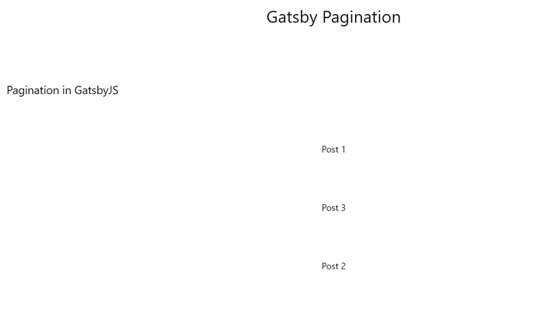
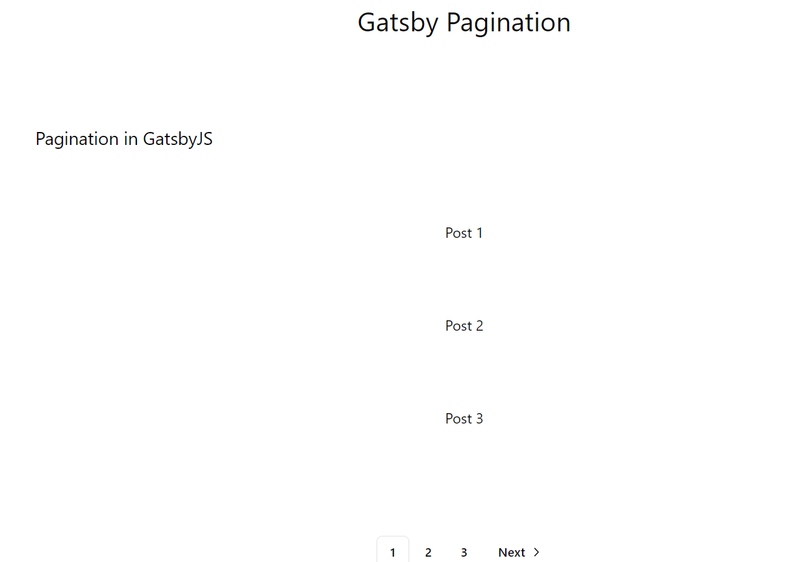

Creating a reusable pagination system in **Gatsby** using **GraphQL** without relying on external
plugins involves leveraging Gatsby's built-in createPages API and writing reusable pagination logic.
Here’s a step-by-step guide to building a simple yet scalable pagination system that can be reused
across multiple content types such as posts, categories, and tags.

## 1. Setup Your Gatsby Website

Before creating a Gatsby website, you need to install the Gatsby CLI (Command Line Interface)
globally on your machine.

### Install Gatsby CLI

<span className='code-cmd'>npm install -g gatsby-cli</span>

This command installs the **Gatsby CLI** globally on your machine so that you can run Gatsby
commands from anywhere.

### Create a New Gatsby Project

After installing the CLI, you can create a new Gatsby project using one of Gatsby’s starter
templates.

Run the following command in your terminal to create a new project:

<span className='code-cmd'>gatsby new</span>

Check for the tailwind and MDX

```bash
What would you like to call your site?
√ · gatsby-pagionation
What would you like to name the folder where your site will be created?
√ NextJS/ gatsby-pagionation
√ Will you be using JavaScript or TypeScript?
· TypeScript
√ Will you be using a CMS?
· No (or I'll add it later)
√ Would you like to install a styling system?
· Tailwind CSS
√ Would you like to install additional features with other plugins?


Thanks! Here's what we'll now do:

    Create a new Gatsby site in the folder gatsby-pagionation
    Get you set up to use Tailwind CSS for styling your site
    Install gatsby-plugin-mdx


√ Shall we do this? (Y/n) · Yes
```

This will create a new Gatsby site in a directory called gatsby-pagination.

<span className='code-cmd'>cd gatsby-pagionation</span>

### 2. Add MDX content

Add some mdx content to your content directory.

### 3. Setup ShadcnUI

Update the **tsconfig.json** file to integrate with Shadcn. Open tsconfig.json and configure it as
follows:

```json
{
  "compilerOptions": {
    // ...
    "baseUrl": ".",
    "paths": {
      "@/*": ["./src/*"]
    }
    // ...
  }
}
```

**Update/create gatsby-node.ts file**

```js
import * as path from 'path';

import * as path from 'path';

export const onCreateWebpackConfig = ({ actions }) => {
  actions.setWebpackConfig({
    resolve: {
      alias: {
        '@/components': path.resolve(__dirname, 'src/components'),
        '@/lib/utils': path.resolve(__dirname, 'src/lib/utils'),
      },
    },
  });
};
```

**Run the Shadcn CLI**

<span className='code-cmd'>npx shadcn@latest init</span>

Answer the questions

```bash
✔ Preflight checks.
✔ Verifying framework. Found Gatsby.
✔ Validating Tailwind CSS.
✔ Validating import alias.
√ Which style would you like to use? » New York
√ Which color would you like to use as the base color? » Neutral
√ Would you like to use CSS variables for theming? ... no / yes
✔ Writing components.json.
✔ Checking registry.
✔ Updating tailwind.config.js
✔ Updating src\styles\global.css
✔ Installing dependencies.
✔ Created 1 file:
  - src\lib\utils.ts

Success! Project initialization completed.
You may now add components.
```

### Enable gatsby-source-filesystem plugin

Modify you **gatsby-config.ts**:

```js
{
  resolve: `gatsby-source-filesystem`,
  options: {
    name: 'posts',
    path: `./content`,
  },
},
```

### Create a post template

Inside **templates** folder create a new file, called **post.tsx**

```js
import * as React from 'react';
import { graphql, HeadFC, PageProps } from 'gatsby';
import { MDXProvider } from '@mdx-js/react';

const PostTemplate: React.FC<PageProps<Queries.GetSinglePostQuery>> = ({
  data: {
    mdx: {
      frontmatter: { title },
    },
  },
  children,
}) => {
  return (
    <div className='my-16 px-64'>
      <article className='text-lg'>
        <h1 className='tracking-wide text-4xl font-medium space-y-5 my-5'>{title}</h1>
        <MDXProvider> {children}</MDXProvider>
      </article>
    </div>
  );
};
export const query = graphql`
  query GetSinglePost($slug: String) {
    mdx(frontmatter: { slug: { eq: $slug } }) {
      frontmatter {
        title
      }
    }
  }
`;

export const Head: HeadFC<Queries.GetSinglePost, unknown> = ({
  data: {
    mdx: {
      frontmatter: { title },
    },
  },
}) => {
  return (
    <>
      <title>{title}</title>
    </>
  );
};

export default PostTemplate;
```

### Create a page template

```js
// page.template.tsx

import React from 'react';
import { graphql, HeadFC, PageProps, useStaticQuery } from 'gatsby';

const PageTemplate: React.FC<PageProps<Queries.GetAllPostsQuery>> = ({
  data: {
    allMdx: { nodes: posts },
  },
  pageContext: { currentPage, numPages, slug = '' },
}) => {
  return (
    <section className='category mt-[60px] mb-[60px] flex flex-col gap-20 items-center'>
      <h1 className='tracking-wide text-4xl font-bold space-y-5 my-5 font-ptSerif'>
        {`Page ${currentPage}`}
      </h1>
      {posts.map((post) => {
        return (
          <div key={post.id}>
            <h2>{post.frontmatter.title}</h2>
          </div>
        );
      })}
    </section>
  );
};

export const query = graphql`
  query GetAllPosts($skip: Int!, $limit: Int!) {
    allMdx(limit: $limit, skip: $skip) {
      nodes {
        frontmatter {
          slug
          title
        }
        id
      }
    }
  }
`;

export default PageTemplate;
```

### Enable MDX plugin

In **gatsby-config.ts** add properties to 'gatsby-plugin-mdx'

```js
{
  resolve: 'gatsby-plugin-mdx',
  options: {
    extensions: ['.md', '.mdx'],
  },
},
```

### Set Up GraphQL Queries

Before implementing pagination, ensure that your data sources are set up and that you can query
posts, categories, and tags through GraphQL.

```js
// gatsby-config.mjs
import * as path from 'path';

import * as path from 'path';

const POSTS_PER_PAGE = 1;

const getNumPages = count => {
  return Math.ceil(count / POSTS_PER_PAGE) || 1;
};

export const onCreateWebpackConfig = ({ actions }) => {
  actions.setWebpackConfig({
    resolve: {
      alias: {
        '@/components': path.resolve('./', 'src/components'),
        '@/lib/utils': path.resolve('./', 'src/lib/utils'),
      },
    },
  });
};

export const createPages = async ({ graphql, actions, reporter }) => {
  const { createPage } = actions;
  const postTemplate = path.resolve(`src/templates/post.template.tsx`);
  const pageTemplate = path.resolve(`src/templates/page.template.tsx`);

  const result = await graphql(`
    query GatsbyNodeCreatePages {
      allMdx {
        nodes {
          frontmatter {
            slug
          }
          internal {
            contentFilePath
          }
        }
      }
    }
  `);

  if (result.errors) {
    reporter.panicOnBuild('Error loading MDX result', result.errors);
  }

  const posts = result.data.allMdx.nodes;

  posts.forEach(node => {
    createPage({
      path: `/${node.frontmatter.slug}`,
      component: `${postTemplate}?__contentFilePath=${node.internal.contentFilePath}`,
      context: {
        slug: node.frontmatter.slug,
      },
    });
  });

  const numPages = getNumPages(posts.length);
  if (numPages > 1) {
    Array.from({ length: numPages }).forEach((_, i) => {
      if (i !== 0) {
        createPage({
          path: `/${i + 1}`,
          component: pageTemplate,
          context: {
            limit: POSTS_PER_PAGE,
            skip: i * POSTS_PER_PAGE,
            numPages,
            currentPage: i + 1,
          },
        });
      }
    });
  }
};
```

It's time to test

<span className='code-cmd'>npm run develop</span>

If everything is working, then let's add small helper function - **getNumPages()** to our
**lib/utils.ts** file:

```js
export const POSTS_PER_PAGE = 1;

export const getNumPages = (count: number): number => {
  return Math.ceil(count / POSTS_PER_PAGE) || 1;
};
```

### Create a index page

Let's fetch all our posts to **index.ts** file:

```js
import React from 'react';
import { graphql, type HeadFC, type PageProps } from 'gatsby';

import { getNumPages } from '../lib/utils';

const IndexPage: React.FC<PageProps<Queries.IndexPageQuery>> = ({
  data: {
    allMdx: { nodes: posts, totalCount },
  },
}) => {
  const numPages = getNumPages(totalCount);

  return (
    <main className='w-full h-full flex items-center flex-col gap-20'>
      <h1 className='text-2xl md:text-3xl my-5 font-ptSerif'>Gatsby Pagination</h1>
      <p className='w-10/12 text-xl'>Pagination in GatsbyJS</p>
      {posts.map((post, idx) => {
        return (
          <div key={post.id}>
            <h2>{post.frontmatter.title}</h2>
          </div>
        );
      })}
    </main>
  );
};

export default IndexPage;

export const query = graphql`
  query IndexPage {
    allMdx {
      nodes {
        frontmatter {
          slug
          title
        }
        id
      }
      totalCount
    }
  }
`;
```

Then run

<span className='code-cmd'>npm run clean && npm run develop</span>

The result



Navigate to http://localhost:8000/2 to check the pages.

## 2. Create a Pagination Component

Before creating the pagination component, you need to setup **Pagination** component from ShadcnUI.

<span className='code-cmd'>npx shadcn@latest add pagination</span>

Last one thing you need to integrate **pagination** component to **Gatsby**.\*:

Find **PaginationLinkProps** and **PaginationLink** inside **ui/pagination.tsx**, and replace it
with:

```js
type PaginationLinkProps = {
  isActive?: boolean,
  to: string,
} & Pick<ButtonProps, 'size'> &
  React.ComponentProps<'a'>;

const PaginationLink = ({
  className,
  isActive,
  to,
  size = 'icon',
  ...props
}: PaginationLinkProps) => (
  <Link
    to={`/${to}`}
    aria-current={isActive ? 'page' : undefined}
    className={cn(
      buttonVariants({
        variant: isActive ? 'outline' : 'ghost',
        size,
      }),
      className,
    )}
    {...props}
  />
);
```

Don't forget to import the **Link** from Gatsby.

Now create file **posts-pagination.tsx** inside your **components** folder.

```js
import React from 'react';

import {
  Pagination,
  PaginationContent,
  PaginationEllipsis,
  PaginationItem,
  PaginationLink,
  PaginationNext,
  PaginationPrevious,
} from './ui/pagination';

type PostsPaginationProps = {
  numPages: number,
  currentPage: number,
  slug?: string,
};

const PostsPagination = ({ numPages, currentPage, slug = '' }: PostsPaginationProps) => {
  return (
    <Pagination className='mt-10'>
      <PaginationContent>
        {currentPage !== 1 && (
          <PaginationItem>
            <PaginationPrevious to={`${slug}${currentPage - 1 === 1 ? '' : currentPage - 1}`} />
          </PaginationItem>
        )}
        {currentPage - 2 > 1 && (
          <PaginationItem>
            <PaginationEllipsis />
          </PaginationItem>
        )}
        {Array.from({ length: numPages }).map((_, i) => {
          const link = slug + '' + (i === 0 ? '' : i + 1);
          if (i > currentPage + 1 || i < currentPage - 3) {
            return;
          }
          return (
            <PaginationItem key={i}>
              <PaginationLink isActive={i + 1 === currentPage} to={link}>
                {i + 1}
              </PaginationLink>
            </PaginationItem>
          );
        })}
        {numPages > 3 && currentPage + 2 < numPages && (
          <PaginationItem>
            <PaginationEllipsis />
          </PaginationItem>
        )}
        {currentPage !== numPages && (
          <PaginationItem>
            <PaginationNext to={slug + (currentPage + 1)} />
          </PaginationItem>
        )}
      </PaginationContent>
    </Pagination>
  );
};
export default PostsPagination;
```

Let's break down each part of the code:

### 1. Imports

```js
import React from 'react';

import {
  Pagination,
  PaginationContent,
  PaginationEllipsis,
  PaginationItem,
  PaginationLink,
  PaginationNext,
  PaginationPrevious,
} from './ui/pagination';

import {
  Pagination,
  PaginationContent,
  PaginationEllipsis,
  PaginationItem,
  PaginationLink,
  PaginationNext,
  PaginationPrevious,
} from './ui/pagination';
```

Several UI components from the **Shadcn Pagination Component** are imported.

### 2. Component Props

```js
type PostsPaginationProps = {
  numPages: number,
  currentPage: number,
  slug?: string,
};
```

- **numPages**: Total number of pages to paginate through.
- **currentPage**: The current page the user is on.
- **slug**: An optional string that is appended to the URL for each page link. It defaults to an
  empty string if not provided. You can provide a string "tag/some-tag" or "category/some-category"
  to specify the path

### 3. Ellipsis Before and After Current Page

```js
{
  currentPage - 2 > 1 && (
    <PaginationItem>
      <PaginationEllipsis />
    </PaginationItem>
  );
}
```

If there are more than two pages between the first page and the current page (i.e., there are
skipped pages), it shows an ellipsis (...).

```js
{
  numPages > 3 && currentPage + 2 < numPages && (
    <PaginationItem>
      <PaginationEllipsis />
    </PaginationItem>
  );
}
```

### 4. Page Number Links

```js
{
  Array.from({ length: numPages }).map((_, i) => {
    const link = slug + '' + (i === 0 ? '' : i + 1);
    if (i > currentPage + 1 || i < currentPage - 3) {
      return;
    }
    return (
      <PaginationItem key={i}>
        <PaginationLink isActive={i + 1 === currentPage} to={link}>
          {i + 1}
        </PaginationLink>
      </PaginationItem>
    );
  });
}
```

This dynamically generates pagination links for each page.

This PostsPagination component is a reusable, well-structured pagination system for Gatsby or any
React project. It efficiently handles pagination UI, showing a limited range of pages around the
current one and allowing navigation via next/previous buttons. The ellipsis keeps the UI clean when
dealing with a large number of pages.

### Connect Pagination to Index and Page Template

```js
const numPages = getNumPages(totalCount);
{
  numPages > 1 && <PostsPagination currentPage={1} numPages={numPages} />;
}
```

<span className='code-cmd'>npm run develop</span>



Now you've created a reusable pagination component in Gatsby. You can use this component to paginate
through posts, categories, or tags. This scalable solution ensures that your content is
well-organized and easy to navigate, especially as your dataset grows.
