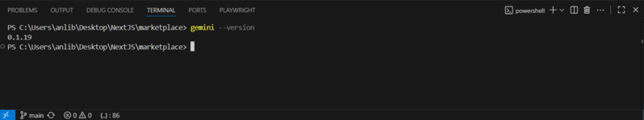
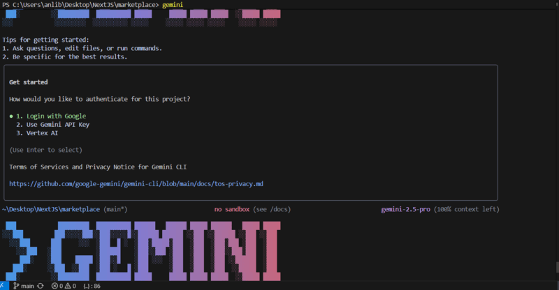
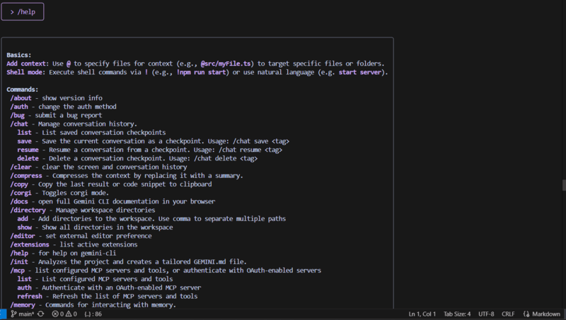
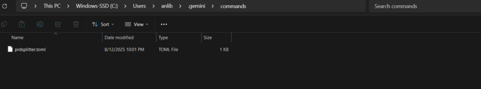
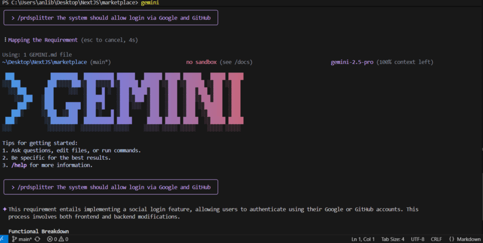

## Introduction

Gemini CLI is a command-line interface from Google that lets developers interact directly with Gemini models.
By default, each project supports only a single `gemini.md` system prompt. If you work across multiple scenarios,
you end up rewriting that prompt again and again — slow and error-prone.

💡 **Tip:** If you want Gemini CLI to better understand your project’s tech stack, goals, and coding style,  
check out this snippet: [GEMINI.md Example for Project Context](https://jsdev.space/snippets/gemini-md-example/).

Good news: Gemini CLI includes a powerful feature called **custom commands**.
With custom commands you can save reusable shortcuts for your most common prompts, scope them globally or per project,
and even inject **shell output** into prompts for dynamic context.

This tutorial covers:

1. Installing Gemini CLI  
2. Creating your first custom command  
3. Global vs. project scopes and command naming  
4. Shell-powered prompts with `!{...}`  
5. Best practices and examples

---

## 1 Install Gemini CLI

> You’ll need Node.js (LTS recommended).

**Install via npm:**
```bash
npm install -g @google/gemini-cli
```

**Verify installation:**
```bash
gemini --version
```
You should see a version number printed.



Log into your Google account:

```bash 
gemini
```



When prompted in the terminal:

1. Select 1. Login with Google
2. Follow the browser link that opens.
3. Approve access to your Google account.

Without logging in, most commands — including custom ones — will fail.

---

## 2 What Are Custom Commands?

Gemini CLI ships with built-ins like:
```text
/help
/clear
/copy
```



It also supports **custom commands** defined in `.toml` files. These commands:

- Can be **global** (usable in every project) or **project-specific**
- Allow **namespaces** like `/git:commit` using folder structure
- Support placeholders like `{{args}}` for free-form user input
- Can run **shell commands** and inject their output into your prompt

---

## 3 File Locations & Naming Rules

| Scope   | Folder location                  | Example → Command |
|---------|----------------------------------|-------------------|
| Global  | `~/.gemini/commands/`            | `~/.gemini/commands/test.toml` → `/test` |
| Project | `<project>/.gemini/commands/`    | `.gemini/commands/git/commit.toml` → `/git:commit` |

**Rules:**
- Command names come from the path **relative** to the `commands` folder.
- Subfolders create **namespaces**; path separators become colons.
- Files **must** be TOML (`.toml`).

> If a project command and a global command share the same name, the **project** one wins.

---

## 4 Create Your First Command (3 Steps)

**Step 1 — Create the directory (global):**

```bash
mkdir -p ~/.gemini/commands
```

**Step 2 — Add a TOML file (example):**

`~/.gemini/commands/prdsplitter.toml`
```toml
description = "Requirement breakdown assistant"
prompt = "Please break down this requirement: {{args}}"
```



**Step 3 — Use your new command:**

```bash
/prdsplitter The system should allow login via Google and GitHub
```

`{{args}}` expands to everything typed after the command name.



---

## 5 Ultimate Move: Shell-Powered Commands

Make prompts **dynamic** by executing shell commands with `!{...}` and injecting their output.

**Example — Generate a commit message from staged changes**  
_File: `<project>/.gemini/commands/git/commit.toml` → Command: `/git:commit`_
````toml
description = "Generates a Git commit message based on staged changes."

prompt = """
Please generate a Conventional Commit message based on the following staged changes:

```diff
!{git diff --staged}
```
"""
````

**How it works:**
1. When you run `/git:commit`, the CLI executes `git diff --staged`.
2. The output replaces the `!{...}` placeholder **inside** the prompt.
3. The final prompt is sent to the model.

**Safety:** The CLI asks for confirmation before running any shell command. You can:
- Run once
- Always allow for this session
- Cancel

> The CLI also respects global `excludeTools` / `coreTools` settings if configured.

---

## 6 Best Practices

- Use **namespaces** for clarity: `/git:commit`, `/api:review`, `/docs:summarize`.
- Keep **project commands** in version control so your team shares them.
- Put **global commands** under `~/.gemini/commands` for personal shortcuts.
- Document commands in your **README** for new contributors.
- Prefer `{{args}}` for simple input; combine with `!{...}` to fetch local context.

---

## 7 Handy Examples

**Summarize the project README**  
_File: `docs/summarize.toml` → `/docs:summarize`_
```toml
description = "Summarize documentation in plain English."
prompt = """
Summarize the following documentation in simple terms:

!{cat README.md}
"""
```

**API review prompt**  
_File: `api/check.toml` → `/api:check`_
```toml
description = "Review API spec for completeness."
prompt = "Please review this API spec and list missing details: {{args}}"
```

---

## Summary

Custom commands in Gemini CLI let you:
- Reuse your best prompts across projects
- Inject real-time shell output for context
- Keep prompts organized with namespaces
- Share project-specific commands via version control

Use them to speed up tasks like commit message generation, API reviews, and documentation summaries — without copy-pasting prompts.
