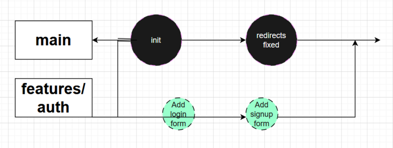

Git is one of the most important tools in modern software development. Nearly every team relies on it to manage source code, collaborate, and track project history.

Yet for beginners, Git often feels intimidating.

Developers create branches with names like test123 or asd. Commits say things like “update”, “fix”, or even “...”. Pull requests contain dozens of unrelated files, temporary changes, and sometimes even accidental edits.

And the worst part? Many developers don’t realize this is a problem.

In a real team environment, sloppy Git usage quickly turns into chaos. Imagine trying to find the commit that broke the build when the history looks like this:

```bash 
fix
update
changes
fix again
```

Good luck.

Git is not just a storage system for code.
It is a communication tool between developers.

In this guide, you'll learn how Git actually works and how to use it in a way that makes collaboration smooth and professional.

## Git Is Not Magic — It’s Just a Graph

Before learning commands, it's important to understand what Git really stores.

Git keeps project history as a graph of commits.

Each commit represents a snapshot of the project at a specific moment in time.

A commit contains:

- file changes
- author information
- timestamp
- a unique hash
- a commit message

A branch is simply a pointer to a commit.

When you create a new commit, the branch pointer moves forward.

A simplified commit graph might look like this:

```
A --- B --- C (main)
       \
        D --- E (feature/auth)
```



In this example:

- `main` contains the stable project history
- `feature/auth` is a separate branch for developing a new feature
- once the feature is complete, it gets merged back into `main`

This isolation is what allows teams to work safely without interfering with each other.

## Types of Git Branches

For small projects, teams often only use one main branch and a few temporary branches.

But larger projects usually follow a structured workflow. One popular example is Git Flow.

Git Flow defines several types of branches.

### Main branches

**main**

The production-ready branch.
Everything here should be stable and deployable.

**develop**

The integration branch where new features are combined before release.

### Temporary branches

**feature/***

Branches used to develop new functionality.

Example:

```
feature/user-authentication
```

**release/***

Used to prepare a new release.

Tasks may include:

- bug fixes
- documentation updates
- version bumps

**hotfix/***

Urgent fixes applied directly to production code.

Example:

```bash
hotfix/security-patch
```

## A simpler workflow for beginners

Most teams teaching Git to newcomers use a simpler model:

```
main
  ├─ feature/add-login
  ├─ feature/create-api
  └─ fix/email-validation
```

Each task gets its own branch.

When the task is done, the branch is merged and deleted.

## Creating Your First Branch

```bash
git clone https://github.com/example/project.git
```

Move into the project directory:

```bash
cd project
```

Make sure your main branch is up to date:

```bash
git switch main
git pull origin main
```

Now create a new branch for your task:

```bash
git switch -c feature/add-user-model
```

This command:

1. creates a new branch
2. switches to it immediately

Older Git versions used:

```bash
git checkout -b feature/add-user-model
```

Both commands do the same thing.

## Naming Branches Correctly

Branch naming conventions matter more than beginners think.

Bad example:

```bash
branch1
new-feature
test
```

Good examples:

```bash
feature/add-user-service
bugfix/login-error
hotfix/token-expiration
```

General rules:

- use lowercase
- avoid spaces
- use hyphens or slashes
- avoid non-ASCII characters

Clear names help the entire team understand what the branch contains.

## Making Meaningful Commits

After writing some code, the next step is creating commits.

Imagine we add a simple JavaScript class:

```js
class User {
  constructor(name, email) {
    this.name = name;
    this.email = email;
  }
}
```

Before committing, Git needs to know which files to include.

Add the file to the staging area:

```bash
git add src/main/project/User.js
```

You can also add all changes:

```bash
git add .
```

But this is risky — temporary files might accidentally be committed.

It is usually safer to add files explicitly.

## Creating the commit

```bash
git commit -m "Add User class"
```

This works, but the message could be better.

A good commit message answers two questions:

1. What changed?
2. Why did it change?

## Writing Good Commit Messages

A commonly used structure is:

```bash
Short summary (max ~50 characters)

Detailed explanation of why the change was needed.
Explain important technical details if necessary.
```

Example:

```bash
Add User class for authentication module
Stores name and email fields used in login flow.
Email must be unique and will be validated by database
constraints in the next task.
```

Good commit messages help future developers understand the reasoning behind code changes.

And often that future developer is you six months later.

## Conventional Commits

Many teams use the Conventional Commits standard.

It adds a prefix describing the type of change.

Examples:

```bash
feat: add password reset endpoint
fix: prevent crash on empty email
docs: update installation guide
refactor: move validation logic to service
test: add login unit tests
chore: update dependencies
```

Common prefixes:

| Prefix   | Meaning                                   |
| -------- | ----------------------------------------- |
| feat     | new feature                               |
| fix      | bug fix                                   |
| docs     | documentation changes                     |
| style    | formatting only                           |
| refactor | code improvements without behavior change |
| test     | new or updated tests                      |
| chore    | tooling or configuration changes          |

Example commit history:

```bash
feat: add User entity
fix: validate email format
refactor: extract email validation utility
test: add negative login tests
```

This makes the project history easy to understand.

It also enables tools that automatically generate changelogs.

## Sending Code to GitHub

Once your work is committed, push it to the remote repository.

```bash
git push origin feature/add-user-model
```

If the branch doesn't exist on the server yet, Git will create it.

After pushing, go to GitHub (or GitLab) and you'll see a button:

**Create Pull Request**

## What Is a Pull Request?

A Pull Request (PR) is a request to merge your changes into another branch.

Usually:

```bash
feature branch → main
```

Pull requests allow teammates to:

- review code
- suggest improvements
- detect bugs early

This process is called **code review**.

## Always Sync Before Opening a PR

Before creating a pull request, update your branch with the latest changes.

```bash
git fetch origin
git rebase origin/main
```

This places your commits on top of the newest main branch.

If conflicts appear, you resolve them locally instead of inside the pull request.

Professional teams strongly prefer this approach.

## Writing a Good Pull Request Description

Never leave a pull request description empty.

A good PR description should include:

### What was done

- Added `User` class
- Implemented email validation

### How to test

```bash
mvn test
```

### Additional notes

- Prepared for upcoming authentication module

This saves reviewers time and speeds up approvals.

## Useful Git Habits

Here are several habits that experienced developers follow.

Always check changes before committing

```bash
git status
```

### Use `.gitignore`

Exclude files like:

```
node_modules/
build/
target/
.idea/
.vscode/
logs/
```

### Keep commits small

Each commit should represent one logical change.

**Write meaningful commit messages**

Future debugging depends on it.

## Git Is a Development Culture

Git is not just a set of commands.

It is a **culture of collaboration**.

Good Git practices make projects easier to maintain, easier to debug, and easier to scale.

They allow teams to:

- understand code history
- safely collaborate
- track changes with confidence

Once these basics become second nature, developers can explore more advanced topics:

- merge conflicts
- rebasing workflows
- interactive rebasing
- multi-remote repositories
- release management

But mastering **branches, commits, and pull requests** is the first and most important step.