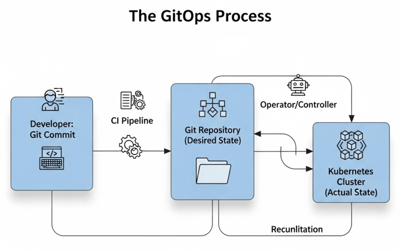
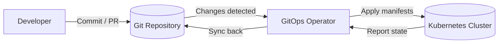

In today’s IT landscape, many methodologies end with *Ops*: DevOps, ChatOps, MLOps, and more. All of them share roots in the DevOps philosophy.  
One of the most impactful of these approaches is **GitOps** — a method of managing infrastructure and application deployments by using Git repositories as the central control system.

GitOps enables teams to define infrastructure and app configurations declaratively, then automatically deploy and reconcile them. The core principle is simple: **Git is the single source of truth** for infrastructure and application state.

---

## Core Idea of GitOps

At its core, GitOps works by storing desired infrastructure configurations in Git. A GitOps operator (like ArgoCD or Flux) continuously monitors these repositories and ensures the running system matches the desired state.

- If manual changes are made, the operator **detects drift** and restores the system back to the declared state.  
- Example: If Git specifies Kubernetes autoscaling between 3–9 pods, and someone changes it manually to 4–12, the operator reverts it back to 3–9.

Key objectives of GitOps include:

- Git as the single source of truth  
- Developer-centric workflows  
- Full traceability of infrastructure changes  
- Standardization and consistency  
- Stronger security practices  

## GitOps in Action

### Git as the Source of Truth
All infrastructure definitions — from Kubernetes manifests to Helm charts — are versioned in Git. This repository (often called an *infrastructure repo*) becomes the single reference for deployments.

### Developer-Oriented Workflows
Infrastructure changes follow the same process as application code: pull requests, reviews, and merges.  
For example:  
1. A DevOps engineer edits `app1-values.yaml`.  
2. A pull request is created, reviewed, and tested (lint, compliance, security checks).  
3. Once merged, ArgoCD automatically applies the changes to Kubernetes.

### Traceability and Auditability
Every change is logged in Git commits and PR discussions. This provides a clear audit trail of *who changed what and why*.

### Consistency Across Environments
Declarative configs ensure environments remain consistent. For example, Helm charts can be reused with different `values.yaml` for staging, testing, and production.

### Enhanced Security
GitOps benefits from Git’s built-in access controls and code reviews. Automated scanners (e.g., Trivy) can check manifests for vulnerabilities before deployment.

---

## GitOps Workflow Diagram

*Diagram: Git is the source of truth → operator (ArgoCD/Flux) applies changes → Kubernetes cluster stays in sync.*

---

## Common Myths About GitOps

- **“It’s just Infrastructure as Code (IaC).”**  
  Not quite — GitOps extends IaC into a full operating model with processes and reconciliation.

- **“It only works with Kubernetes.”**  
  While Kubernetes popularized GitOps, its principles apply to databases, VMs, and networks too.

- **“You need full automation to start.”**  
  Not true. You can begin with partial automation and expand gradually.

- **“It replaces CI/CD.”**  
  GitOps complements CI/CD. CI/CD builds and tests; GitOps handles deployment and state management.

- **“Git is too complex for ops teams.”**  
  Modern Git tools simplify workflows. Most operators only need to know basics like commits and pull requests.

---

## Conclusion

GitOps is more than a buzzword — it’s a powerful model for managing modern infrastructure. By using Git as the single source of truth, teams gain **consistency, reliability, transparency, and security** in their operations.  

Whether you start small or aim for enterprise-wide adoption, GitOps offers a framework that scales with your DevOps practices. It unifies teams, enforces accountability, and helps you ship software faster and safer.