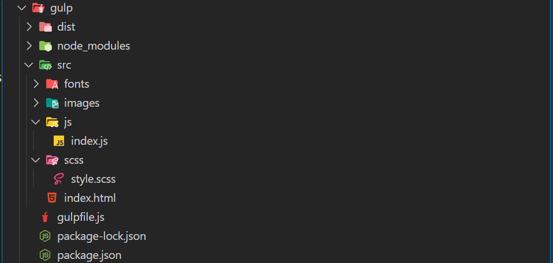

## What is GulpJS?

[GulpJS](https://gulpjs.com/) is an open-source JavaScript-based toolkit that runs on Node.js. It
simplifies and automates a wide range of development tasks, including file concatenation,
minification, transpilation, testing, and more. GulpJS utilizes a streaming approach to efficiently
process files, making it an efficient and powerful tool for managing project assets.

### Key Features and Benefits:

- **1. Task Automation**: GulpJS provides a straightforward and intuitive way to automate tasks in
  the front-end development workflow. By defining tasks using simple JavaScript functions,
  developers can automate repetitive processes, such as compiling Sass to CSS, bundling
  JavaScript modules, or optimizing images. GulpJS excels at reducing manual intervention, saving
  developers valuable time and effort.
- **2. Streaming Build System**: GulpJS leverages the concept of streams, which allows developers to
  process files as streams of data. This approach offers numerous advantages, such as improved
  performance, reduced memory consumption, and faster build times. GulpJS plugins, designed to
  work with streams, can be easily combined and customized to create complex workflows tailored
  to project requirements.
- **3. Extensive Plugin Ecosystem**: GulpJS boasts a vast ecosystem of plugins that extend its
  capabilities. These plugins cover a wide range of tasks, such as CSS preprocessing, JavaScript
  transpilation, image optimization, code linting, and more.
- **4. Customizable Configuration**: GulpJS offers a flexible configuration system, allowing
  developers to tailor their workflows according to project requirements. The configuration is
  typically done through a simple JavaScript file, making it easy to understand and modify.
- **5. Improved Performance and Optimization**: One of the primary goals of GulpJS is to enhance the
  performance of web applications. By leveraging GulpJS tasks such as minification,
  concatenation, and optimization of assets, developers can significantly reduce file sizes,
  improve loading times, and boost overall performance. GulpJS also enables efficient caching and
  ensures that only necessary changes are propagated, resulting in faster development iterations
  and enhanced user experiences.

## Installation

1. Install the gulp globaly
   <span className='code-cmd'>npm install --global gulp-cli</span>
2. Create a new project
   <span className='code-cmd'>mkdir newproj && cd newproj</span>
3. Install the gulp locally
   <span className='code-cmd'>npm install --save-dev gulp</span>
4. Create a file named `gulpfile.js` in the root of your project directory
   This file will contain your Gulp tasks.
5. Create folders `src` and `dist`
   <span className='code-cmd'>mkdir src && mkdir dist</span>
6. Create an `index.html` file inside the src folder

Put a blank HTML code. Just type ! and hit Tab.

Add stylesheet link to `css/style.min.css`

Add script link to `js/index.min.js`

```html
<!DOCTYPE html>
<html lang="en">
  <head>
    <meta charset="UTF-8" />
    <meta name="viewport" content="width=device-width, initial-scale=1.0" />
    <title>Document</title>
    <link rel="stylesheet" href="css/style.min.css" />
  </head>
  <body>
    <script src="js/index.min.js"></script>
  </body>
</html>
```

7 Create folder `scss` inside your `src` folder

<span className='code-cmd'>cd src && mkdir scss</span>8 Create file `style.scss`
inside your `scss` folder 9 Create folder js inside src with file index.js 10
Create also folders `fonts` and `images` inside `src` folder

<div className='single-post__img-wrapper'>
  
  <span className='single-post__img-alt'>Current folders structure</span>
</div>

## What is gulpfile?

A gulpfile is a JavaScript file used in the Gulp task runner, a popular tool for automating tasks in web development. The gulpfile typically contains code that defines a series of tasks to streamline workflows such as compiling Sass or LESS files, minifying JavaScript, optimizing images, running a local server, and more.

### Key Features of a Gulpfile:

- **Task Definitions**: The gulpfile defines tasks using the Gulp API, allowing developers to create custom workflows.
- **Modularity**: You can structure your gulpfile in a modular way, using separate files for different tasks and requiring them in the main gulpfile.
- **Plugins**: Gulp relies heavily on plugins to extend its functionality. Developers can use various plugins to handle different tasks (e.g., gulp-sass for compiling Sass, gulp-uglify for minifying JavaScript).
- **Streaming Build Process**: Gulp uses Node.js streams to process files efficiently, allowing for faster builds compared to other task runners that rely on temporary files.

### Example of a Simple Gulpfile:

```js
const gulp = require('gulp');
const sass = require('gulp-sass')(require('sass'));
const cleanCSS = require('gulp-clean-css');

// Task to compile SCSS to CSS
gulp.task('styles', () => {
  return gulp
    .src('src/scss/**/*.scss') // Source of SCSS files
    .pipe(sass()) // Compile SCSS
    .pipe(cleanCSS()) // Minify CSS
    .pipe(gulp.dest('dist/css')); // Destination folder for CSS
});

// Default task to run when you run `gulp` command
gulp.task('default', gulp.series('styles'));
```

The gulpfile is a critical part of using Gulp effectively, enabling you to automate and optimize your development workflow efficiently.

## Defining Gulp Tasks and Install Plugins:

### 1. Gulp Sass

It enables to automate the compilation of Sass (Syntactically Awesome Style Sheets) files into CSS.
Sass is a powerful preprocessor for CSS that introduces features like variables, nesting, mixins,
and more, making CSS code more modular, maintainable, and efficient.

**Install plugins gulp-sass and sass**

<span className='code-cmd'>npm install sass gulp-sass --save-dev</span>

**Add this code to you gulpfile.js file**

```js
const { src, dest } = require('gulp');
const concat = require('gulp-concat');
const scss = require('gulp-sass')(require('sass'));

function createStyles() {
  return src('./src/scss/**/*.scss')
    .pipe(scss({ outputStyle: 'compressed' }).on('error', scss.logError))
    .pipe(dest('./src/css'));
}

exports.createStyles = createStyles;
```

In this example, it takes SCSS files from the `src/scss` directory, minifies them using the gulp-sass
plugin, and outputs the minified files to the `src/css` directory.

Let's test a plugin.

### Add some scss code to style.scss file

```css
.some {
  padding: 0;
  .something {
    margin: 0;
  }
}
```

Now run in your Terminal.

<span className='code-cmd'>gulp createStyles</span>

Gulp will generate css folder with file `style.css` in the css directory. Inside the `style.css` file we
will find minified css(not scss) styles.

<div className='single-post__img-wrapper'>
  
  <span className='single-post__img-alt'>Gulp generated folder</span>
</div>

To rename it to `style.min.css` we need another plugin - Gulp Concat.

### 2. Gulp Concat

Gulp Concat simplifies the process of concatenating JavaScript files, making your front-end
development workflow more efficient. By combining multiple files into a single bundle, you can
enhance the performance of your web applications and improve code organization and maintainability.

<span className='code-cmd'>npm install gulp-concat --save-dev</span>

After installing add this code before all pipes in your `gulpfile.js`

```js
.pipe(concat('style.min.css'))
```

Now it's `style.min.css` :)

<div className='single-post__img-wrapper'>
  
  <span className='single-post__img-alt'>gulpfile.js</span>
</div>

### 3. gulp-uglify-es

Gulp Uglify-ES is a popular plugin that enables to automate the process of minifying and compressing
JavaScript code. Minification involves removing unnecessary characters like whitespace, comments,
and renaming variables to shorter names, without affecting the functionality of the code. This
process significantly reduces the size of JavaScript files, resulting in faster downloads and
improved performance.

<span className='code-cmd'>npm install gulp-uglify-es --save-dev</span>

Import `gulp-uglify-es` to your gulpfile

```js
const uglify = require('gulp-uglify-es').default;
```

Declare a new function with name createScripts:

```js
function createScripts() {
  return src('./src/js/**/*.js')
    .pipe(concat('index.min.js'))
    .pipe(uglify())
    .pipe(dest('./src/js'));
}
```

Don't forget to export the new function:

```js
exports.createScripts = createScripts;
```

Create some JavaScript file or files to test it.

### 4. Watching Files for Changes:

Gulp 4 provides a convenient way to watch files for changes and automatically trigger tasks. Here's
an example of a watch task that triggers the `createStyles()`, and `createScripts()` functions whenever
a SCSS, or JS file is modified:

Import watch from gulp

```js
const { src, dest, watch } = require('gulp');
```

Add function watching with code:

```js
function watching() {
  watch(['./src/scss/**/*.scss'], createStyles);
  watch(['./src/js/**/*.js'], createScripts);
}
```

Export watching function:

```js
exports.watching = watching;
```

Use the following command:

<span className='code-cmd'>gulp watching</span>

Now, whenever you save changes to a SCSS file in the src/scss directory, or JS files in the `src/js`
directory, Gulp will automatically execute the right function.

### 5. Browsersync

Browsersync is a lightweight development server and synchronization tool that enables simultaneous
testing and live reloading of web pages across multiple devices and browsers. It eliminates the need
for manual refreshing or switching between devices during development. Browsersync injects updated
CSS and reloads the page automatically whenever changes are made, allowing developers to see the
results instantly across all connected devices.

<span className='code-cmd'>npm i browser-sync --save-dev</span>

Import a `browserSync`, create a new function, and export:

```js
const browserSync = require('browser-sync').create();
function sync() {
  browserSync.init({
    server: {
      baseDir: './src',
    },
  });
}
exports.sync = sync;
```

Add a new pipe at the end of the existing functions `createScripts()` and `createStyles()`:

```js
.pipe(browserSync.stream());
```

Add a new watch task in the watching function:

```js
watch(['./src/**/*.html']).on('change', browserSync.reload);
```

### 6. Parallel Task Execution

Parallel task execution in Gulp 4 allows multiple tasks to run concurrently instead of sequentially.
By executing tasks concurrently, time-consuming operations can be completed in parallel, resulting
in faster overall build times. This enhancement is particularly beneficial for larger projects with
complex build pipelines, as it maximizes system resources and reduces the time required to compile,
transpile, minify, or process files.

Import `parallel` from gulp:

```js
const { src, dest, watch, parallel } = require('gulp');
```

Add default export with all functions inside:

```js
exports.default = parallel(createStyles, createScripts, watching, sync);
```

**Run a command:**

<span className='code-cmd'>gulp</span>

### 7. Gulp Autoprefixer

Gulp Autoprefixer simplifies the process of adding vendor prefixes to CSS properties, ensuring
cross-browser compatibility and saving development time.

<span className='code-cmd'>npm install gulp-autoprefixer --save-dev</span>

Now you can to import autoprefixer:

```js
const autoprefixer = require('gulp-autoprefixer');
```

Add this code as a first pipe in a createStyles functions:

```js
.pipe(autoprefixer())
```

Make a `.browserslistrc` file in your working root or workspace directory with those strings in it:

```js
# Supported Browsers
last 2 versions
IE 10
Safari 8
```

### 8. Gulp Build

Create build function:

```js
function build() {
  return src(
    ['./src/css/**/*.min.css', './src/js/**/*.min.js', './src/**/*.html'],
    {
      base: 'src',
    }
  ).pipe(dest('dist'));
}
```

It will take your minified files and copy them into the dist folder.

Export build function:

```js
exports.build = build;
```

Now run the build

<span className='code-cmd'>gulp build</span>

### 9. Gulp Clean

gulp-clean is a plugin that provides a simple and efficient way to delete files and directories
within your project. Clean automates the process of removing unnecessary files or directories from
your project. In our case, we will remove dist folder every time before running the build.

<span className='code-cmd'>npm install gulp-clean --save-dev</span>

Import clean:

```js
const clean = require('gulp-clean');
```

Create function `cleanProject()` and export it:

```js
function cleanProject() {
  return src('dist/**').pipe(clean());
}
exports.cleanProject = cleanProject;
```

### 10. Series

Series is a function provided by Gulp that allows your to define a sequence of tasks to be executed
in a specific order. It ensures that each task is completed before moving on to the next one.

Import series from gulp

```js
const { series } = require('gulp');
```

Change the build export to:

```js
exports.build = series(cleanProject, build);
```

Run the new build:

<span className='code-cmd'>gulp build</span>

## Implementing Image Minification in Gulp:

Optimizing images is a crucial step in improving website performance and user experience. This
optimization technique eliminates unnecessary data from image files, such as metadata, comments, and
color profiles. By minimizing the file size, websites can load faster, reducing bandwidth
consumption and enhancing user experience across various devices and network conditions.

### 1. Install plugins:

- **gulp-avif** - for convertation PNG and JPG images to AVIF.
- **gulp-webp** - for convertation PNG, JPEG, TIFF to WebP.
- **gulp-imagemin** - for compression GIF, JPEG, PNG, and SVG. Version 7.1.0 for using in CommonJS
  modules.

<span className='code-cmd'>
  npm install gulp-avif gulp-webp gulp-imagemin@7.1.0 --save-dev
</span>

Import plugins

```js
const avif = require('gulp-avif');
const webp = require('gulp-webp');
const imagemin = require('gulp-imagemin');
```

Create folder src inside images folder (`/src/images/src`).

### 2. Create images function:

```js
function createImages() {
  return (
    src(['./src/images/src/**/*.*', '!./src/images/src/**/*.svg'])
      // run gulp-avif with 50% quality
      .pipe(avif({ quality: 50 }))
      // back to our source folder
      .pipe(src('./src/images/src/**/*.*'))
      // run webp
      .pipe(webp())
      .pipe(src('./src/images/src/**/*.*'))
      .pipe(imagemin())
      .pipe(dest('./src/images'))
  );
}
```

Gulp will process the images from the specified source directory (`src/images/src/\*`), optimize them
using gulp-imagemin, and save the optimized versions in the destination directory
(`src/images/dist/`).

Put some images inside images/src folder and run images function (of course you need to export it
before). As a result, you can see that every image has been also converted into AVIF and WEBP
formats. Thanks to gulp-webp, and gulp-avif plugins.

### 3. Time-saving:

<span className='code-cmd'>npm install gulp-newer --save-dev</span>

**gulp-newer** is a Gulp plugin that helps minimize task execution time by processing only those
files that have been modified or added since the last execution.

Run the gulp-newer before every plugin in images function:

```js
function images() {
  return (
    src(['./src/images/src/**/*.*', '!./src/images/src/**/*.svg'])
      // avoid loading processed images
      .pipe(newer('./src/images'))
      .pipe(avif({ quality: 50 }))
      .pipe(src('./src/images/src/**/*.*'))
      // ...
      .pipe(newer('./src/images'))
      .pipe(webp())
      .pipe(src('./src/images/src/**/*.*'))
      // ...
      .pipe(newer('./src/images'))
      .pipe(imagemin())
      .pipe(dest('./src/images'))
  );
}
```

Add images to watching function:

```js
watch(['./src/images/src/**/*.*'], images);
```

Add images function to default export, inside a `parallel()` function:

```js
exports.default = parallel(createStyles, createScripts, images, watching, sync);
```

Add another path to building function:

```js
'./src/images/*.*';
```

### 4. Install plugin for svg optimization

<span className='code-cmd'>npm install gulp-svg-sprite --save-dev</span>

**gulp-svg-sprite** is a plugin that automates the creation of SVG spritesheets. It takes a
collection of SVG files and generates a single sprite file that contains all the individual SVG
icons.

Import plugin:

```js
const svgSprite = require('gulp-svg-sprite');
```

Add a new function for the SVG sprite:

```js
function createSvg() {
  return src('./src/images/src/*.svg')
    .pipe(
      svgSprite({
        mode: {
          stack: {
            sprite: '../sprite.svg',
            example: true,
          },
        },
      })
    )
    .pipe(dest('./src/images'));
}
```

## Fonts

**Fonts** play a crucial role in web design, contributing to the overall aesthetics and user
experience of a website. However, using multiple font files can impact page load times and
performance.

**Font optimization** involves reducing the file size of fonts without sacrificing quality.
Optimized fonts contribute to faster page load times, improved website performance, and enhanced
user experience, especially on devices with slower network connections. By minimizing font file
sizes, developers can effectively mitigate the performance impact caused by multiple font files.

### Install plugins

**gulp-fonter** is a plugin that enables developers to convert font files from one format to another
seamlessly. It automates the process of generating web-compatible font files, including formats such
as TrueType **(TTF)**, Web Open Font Format **(WOFF)**, and **WOFF2**.

**gulp-ttf2woff2** is a Gulp plugin that automates the conversion of TrueType fonts **(TTF)** to the
WOFF2 format. **WOFF2** provides better compression and faster load times compared to other font
formats, making it ideal for web usage.

<span className='code-cmd'>
  npm install gulp-fonter gulp-ttf2woff2 --save-dev
</span>

### Import fonts plugins

```js
const fonter = require('gulp-fonter');
const ttf2woff2 = require('gulp-ttf2woff2');
```

Create src forder inside `fonts`.

Add a new `createFonts()` function:

```js
function createFonts() {
  return src('./src/fonts/src/*.*')
    .pipe(fonter({ formats: ['woff', 'ttf'] }))
    .pipe(src('./src/fonts/*.ttf'))
    .pipe(ttf2woff2())
    .pipe(dest('./src/fonts'));
}
```

Add exports and modify the `build()` function:

```js
'./src/fonts/*.*',
```

Our `build()` function method right now looks like this:

```js
function build() {
  return src(
    [
      './src/css/**/*.min.css',
      './src/images/**/*.*',
      '!./src/images/**/*.svg',
      './src/images/sprite.svg',
      './src/js/**/*.min.js',
      './src/fonts/*.*',
      './src/**/*.html',
    ],
    { base: 'src' }
  ).pipe(dest('dist'));
}
```

Now you can download some fonts from Google fonts and test your fonts function.

## Pages and Components: install gulp-include

**gulp-include** is a Gulp plugin that simplifies the process of including partial files in your
project. It provides a straightforward mechanism for splitting code into smaller, manageable pieces
and reusing them across multiple files. The plugin leverages a special syntax to define placeholders
that can be easily replaced with the content of the corresponding partial files during the build
process.

<span className='code-cmd'>npm install gulp-file-include --save-dev</span>

Create folders `pages` and `components` inside `src`, and move `index.html` file to pages.

Move `index.html` to pages folder, and create `header.html` and `footer.html` inside the `components`
directory.

<div className='single-post__img-wrapper'>
  
  <span className='single-post__img-alt'>Current Gulp structure</span>
</div>

Import gulp-include:

```js
const include = require('gulp-include');
```

**Create `includes()` function:**

```js
function includes() {
  return src('./src/pages/**/*.html')
    .pipe(
      include({
        includePath: './src/components/',
      })
    )
    .pipe(dest('./src'))
    .pipe(browserSync.stream());
}
```

Add new directories to your watching method:

```js
watch(['./src/components/**/*.html', './src/pages/**/*.html'], includes);
```

Let&#39;s test it:

Run gulp clean, and decompose the index.html by header and footer inside the components folder.

Our `header.html` example:

```html
<!DOCTYPE html>
<html lang="en">
  <head>
    <meta charset="UTF-8" />
    <meta name="viewport" content="width=device-width, initial-scale=1.0" />
    <title>Document</title>
    <link rel="stylesheet" href="css/style.min.css" />
  </head>
  <body>
    <header>Header</header>
  </body>
</html>
```

Our `footer.html` example

```html
<footer>
 Footer
 <script src="js/index.min.js"></script>
</footer>
</body>
</html>
```

Our `index.html` example (inside `pages` folder)

```html
<!--=include header.html -->
<main>main</main>
<!--=include footer.html -->
```

Run gulp...if everything goes well, Gulp will automatically combine the files into `index.html`.

## Conclusion

In this Gulp 4 crash course, we've walked through the installation, setup, and basic launch of Gulp for automating development tasks. By now, you should have a solid understanding of how to set up Gulp, create tasks, and automate repetitive tasks like file minification, compilation, and live reloading. Gulp's simplicity and flexibility make it a powerful tool in any JavaScript project, streamlining your workflow and improving efficiency. As you continue using Gulp, you can explore more advanced features and customizations to further optimize your development process.

Check this [github repository](https://github.com/jsdevspace/gulp-starter) for full code from the
tutorial.
