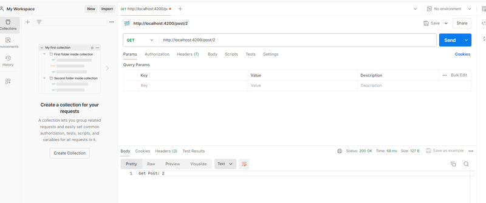
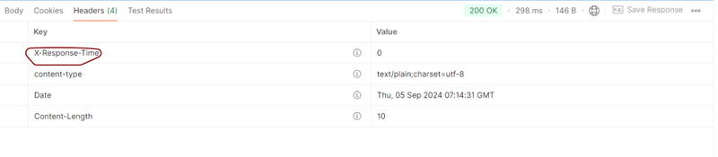

[**Hono**](https://hono.dev) is a cutting-edge, lightweight backend framework designed for
cloud-native applications. Built on Node.js, Hono is optimized for speed and scalability, making it
perfect for building high-performance APIs and services. Its minimalistic design allows developers
to quickly create efficient, scalable solutions for modern cloud environments. Hono also offers
support for edge computing, middleware, and routing, making it an excellent choice for developers
looking to build cloud-native applications with minimal overhead and maximum performance.

## Create a simple Backend

We will use **Bun** - an another JavaScript runtime, and Node.js-compatible package manager. If you
are not familiar with Bun, please read this article - [Getting Started with Bun
](https://jsdev.space/howto/use-bun/).

### 1. Install Hono

<div className='code-cmd'>bun create hono hono-demo</div>

```bash
✔ Using target directory … hono-demo
? Which template do you want to use? bun
? Do you want to install project dependencies? yes
? Which package manager do you want to use? bun
✔ Cloning the template
✔ Installing project dependencies
🎉 Copied project files
Get started with: cd hono-demo
```

Move to hono-demo

<span className='code-cmd'>cd hono-demo</span>

Install dependencies

<span className='code-cmd'>bun install</span>

### 2. Run the Hono app

Change the default port

```js
// index.ts
import { Hono } from 'hono';

import { Hono } from 'hono';

const app = new Hono();

app.get('/', c => {
  return c.text('Hello Hono!');
});

export default {
  port: 4200,
  fetch: app.fetch,
};
```

**Run the app**

<span className='code-cmd'>bun dev</span>

Result:

```bash
$ bun run --hot src/index.ts
Started server http://localhost:4200
```

Now the HTTP requests coming to the **Bun** server will be handled by **Hono** framework, providing
us with a much more convenient API.

### 3. Grouped Routing in Hono.JS

According to the official [Hono documentation](https://hono.dev/docs/), the framework supports
grouped routing, allowing you to organize routes using an instance of Hono and add them to the main
application using the route method.

Let’s create a **post.ts** inside a routes folder. Don’t forget to export posts as the default
export:

```ts
// routes/post.ts
import { Hono } from 'hono';

import { Hono } from 'hono';

const post = new Hono();

post.get('/', c => c.text('List Posts')); // GET /post
post.get('/:id', c => {
  // GET /post/:id
  const id = c.req.param('id');
  return c.text('Get Post: ' + id);
});
post.post('/', c => c.text('Create Book')); // POST /post

export default post;
```

Open [Postman](https://www.postman.com/) and navigate to `http://localhost:4200/post/2` to test it



### 4. So, what exactly is the "c" in the arguments?

However, you might have noticed that c is used instead of req. This c stands for the context object,
as detailed in the Hono.js documentation.

In practice, all incoming and outgoing data is managed by this context object. Hono allows you to
return responses in various formats, not just **JSON** but also others, such as **body**, **text**,
**notFound**, **redirect** and more.

**Hono** is also well-suited for handling and returning small amounts of HTML.

### 5. Rendering TSX/JSX

Although **hono/jsx** is typically used on the client side, it can also be utilized for server-side
content rendering.

In the JSX section, there’s an example of a functional React component. Let’s try rendering it
server-side:

Create a post page inside a pages folder:

```tsx
// pages/post.tsx
import { FC, PropsWithChildren } from 'hono/jsx';

import { FC, PropsWithChildren } from 'hono/jsx';

type PostData = {
  title: string;
  id: string;
};

const Layout: FC = ({ children }: PropsWithChildren) => {
  return (
    <html>
      <body>{children}</body>
    </html>
  );
};

const PostComponent = ({ title, id }: PostData) => {
  return (
    <Layout>
      <h1>Hello {title}</h1>
      <p>Your id is {id}</p>
    </Layout>
  );
};

export default PostComponent;
```

Now Let’s connect it to our post route:

```tsx
// routes/post.tsx

post.get('/:id', c => {
  // GET /book/:id
  const id = c.req.param('id');
  return c.html(<PostComponent id={id} title={' World!'} />);
});
```

Open `http://localhost:4200/post/2` in your browser to test it.

This approach is similar to SSR in **Next.js** or **Remix.js**, but it's much lighter. Hono also
supports other features like asynchronous components, **Suspense**, and more.

### 6. Middleware

**Middleware** is a function that integrates into the routing process and performs various
operations.

You can intercept a request before it's processed or modify a response before it's sent.

**HonoJS** has a lot of built-in middleware, and you can add your own or reuse middleware created by
the community.

Let's take a look at the official example from the documentation.

Add this code to **index.ts** file, before routes initialization

```ts
app.use(async (c, next) => {
  const start = Date.now();
  await next();
  const end = Date.now();
  c.res.headers.set('X-Response-Time', `${end - start}`);
});
```

Check the result in Postman



### 7. Handling redirects

You can create a redirect using the c.redirect() method:

```ts
c.redirect('/go-there');
c.redirect('/go-there', 301);
```

### 8. Handling CORS

To enable our application to work with a frontend framework, we need to implement CORS. Hono offers
a cors middleware for this purpose. Import and configure this middleware in your **index.ts** file:

```ts
import { cors } from 'hono/cors';

import { cors } from 'hono/cors';

app.use('/api/*', cors());
```

### 9. Testing

Create index.test.ts file:

```ts
import { describe, expect, test } from 'bun:test';
import { Hono } from 'hono';
import { testClient } from 'hono/testing';

import { describe, expect, test } from 'bun:test';
import { Hono } from 'hono';
import { testClient } from 'hono/testing';

describe('Example', async () => {
  const app = new Hono().get('/', c => c.json('Hello Hono!'));
  const res = await testClient(app).$get();
  test('GET /post', async () => {
    const res = await app.request('/');
    expect(res.status).toBe(200);
    expect(await res.json()).toEqual('Hello Hono!');
  });
});
```

Now run

<span className='code-cmd'>bun test</span>

```bash
bun test v1.1.26 (0a37423b)

src\index.test.ts:
✓ Example > GET /post

 1 pass
 0 fail
 2 expect() calls
Ran 1 tests across 1 files. [301.00ms]
```

## Conclusion

Creating a simple backend with **Hono** is both straightforward and efficient. With its lightweight
design and built-in features, Hono allows you to quickly set up a server capable of handling a
variety of tasks, from routing to middleware integration. By leveraging Hono's powerful
capabilities, such as built-in support for CORS and flexible response formats, you can build robust
backend solutions with minimal effort. Whether you’re developing a small-scale application or
experimenting with new ideas, Hono provides the tools you need to get your project up and running
smoothly.
