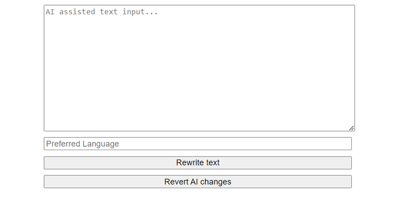

Among the modern HTML standards and specifications, there’s something called
[Custom Elements](https://developer.mozilla.org/en-US/docs/Web/API/Web_components/Using_custom_elements).
For those unfamiliar, it's a way to create your own tags, which the browser automatically
initializes when it encounters them in the markup, executing the specific behavior logic you’ve
defined. Additionally, there’s a way to modify the behavior of standard tags (though the nuances of
this are beyond the scope of this discussion).

In this tutorial, we will create a smart HTML tag—a text field that helps users format the text they
enter. This tag can be used on any website, in any web application built with modern frameworks, or
even in a simple static HTML file.

## Preparatory Steps

First, let's define the technologies we'll be using. We need to initialize a project with
[Parcel](https://jsdev.space/howto/nodejs-parsel-ts/), get familiar with the
[Symbiote.js](https://symbiotejs.org) library, and obtain an API key from
[ChatGPT](https://openai.com/chatgpt/). If you are not familiar with **Custom Elements**, please
read the [howto](https://jsdev.space/howto/custom-html-tag/).

## Install Symbiote.js

**SymbioteJS** is a lightweight JavaScript library designed to simplify the creation of web
components and improve the development experience with custom HTML elements. Built with modern web
standards in mind, it offers a simple and efficient way to structure, style, and manage reusable
components, without the need for heavy frameworks.

<div className='code-cmd'>npm i @symbiotejs/symbiote</div>

## Create a Component

Next, we’ll create our component. Since this project is quite small, we’ll implement it directly in
the **app.ts** file.

```js
import Symbiote, { css, html } from '@symbiotejs/symbiote';

import Symbiote, { css, html } from '@symbiotejs/symbiote';

export class SmartTextarea extends Symbiote {
  // The object that initializes the state and core entities of the component:
  init$ = {};
}

// Styles of component
SmartTextarea.rootStyles = css``;

// Template of component:
SmartTextarea.template = html``;

// Define a custom HTML tag:
SmartTextarea.reg('smart-textarea');
```

Now let's create a **HTML** file

```html
<script type="importmap">
  {
    "imports": {
      "@symbiotejs/symbiote": "https://esm.run/@symbiotejs/symbiote"
    }
  }
</script>
<script type="module" src="./smart-textarea.js"></script>

<smart-textarea model="gpt-4o-mini"></smart-textarea>
```

An important aspect here is the block with the import map. In our example, we will include the
**SymbioteJS** library via CDN, which will allow us to efficiently and repeatedly share a common
dependency among different independent components of the application, without the need for bulky
solutions like Module Federation. Additionally, since we initially installed the dependency through
**NPM**, we will have access to everything necessary for our development environment tools,
including type declarations for TypeScript support, entity definitions, and more.

### Template

Let's create a template

```js
SmartTextarea.template = html`
  <textarea
    ${{ oninput: 'saveSourceText' }}
    placeholder="AI assisted text input..."
    ref="text"
  ></textarea>

  <input type="text" placeholder="Preferred Language" ref="lang" />

  <label>Text style: {{+currentTextStyle}}</label>
  <input
    ${{ onchange: 'onTextStyleChange' }}
    type="range"
    min="1"
    max="${textStyles.length}"
    step="1"
    ref="textStyleRange"
  />

  <button ${{ onclick: 'askAi' }}>Rewrite text</button>
  <button ${{ onclick: 'revertChanges' }}>Revert AI changes</button>
`;
```

The code snippet defines a template for a SmartTextarea component using a template literal. This
template describes the HTML structure of the component, along with some dynamic bindings and event
handlers.

```js
{
  {
    +currentTextStyle;
  }
}
```

The plus sign (+) at the beginning of the name indicates that the property is computed, meaning it
is automatically derived when the state properties change or can be manually triggered using a
special method called **notify**.

### State Entities and Handlers

Now let's describe the properties and methods that we bind to the template.

```js
export class SmartTextarea extends Symbiote {
  // Store the user's original text in a private class property
  #sourceText = '';

  init$ = {
    // LLM name by default
    '@model': 'gpt-4o',

    // The computed property contains the description of the style to which we need to format our text.
    '+currentTextStyle': () => {
      return textStyles[this.ref.textStyleRange.value - 1];
    },

    // Save the user's text for the undo function.
    saveSourceText: () => {
      this.#sourceText = this.ref.text.value;
    },
    // Restore the textarea to the original text.
    revertChanges: () => {
      this.ref.text.value = this.#sourceText;
    },
    // Respond to text style selection.
    onTextStyleChange: e => {
      // Manually trigger the recalculation of the computed property.
      this.notify('+currentTextStyle');
    },

    // ...
  };
}
```

Now we need an array containing descriptions of text styles, which we will create in a separate
module called **textStyles.ts** with the following content:

```js
export const textStyles: string[] = [
  'Free informal speech, jokes, memes, emoji, possibly long',
  'Casual chat, friendly tone, occasional emoji, short and relaxed',
  'Medium formality, soft style, basic set of emoji possible, compact',
  'Neutral tone, clear and direct, minimal slang or emoji',
  'Professional tone, polite and respectful, no emoji, short sentences',
  'Strict business language. Polite and grammatically correct.',
  'Highly formal, authoritative, extensive use of complex vocabulary, long and structured',
];
```

Additionally, in the code above, we can see examples of how to access the elements described in the
template using the **ref** interface, such as:

```js
this.ref.text.value;
```

This is similar to how it works in React and helps avoid manually searching for elements using the
DOM API. Essentially, **this.ref** is a collection of references to DOM elements that have the
corresponding attribute set in the HTML template, such as **ref="text"**.

## Request to the LLM

Now we need to do the most important thing: ask the AI to rewrite our text according to the
specified settings. In this example, I will keep it as simple as possible, without using any
additional libraries or access control layers, by sending a direct request to the API:

```js
export class SmartTextarea extends Symbiote {
  // ...

  init$ = {
    // ...

    askAi: async () => {
      // If the textarea is empty, we cancel everything and display an alert:
      if (!this.ref.text.value.trim()) {
        alert('Your text input is empty');
        return;
      }

      // We send a request to the API endpoint taken from the configuration:
      let aiResponse = await (
        await window.fetch(CFG.apiUrl, {
          method: 'POST',
          headers: {
            'Content-Type': 'application/json',

            // We retrieve the API key from a hidden JavaScript module that is not tracked by git:
            Authorization: `Bearer ${CFG.apiKey}`,
          },
          body: JSON.stringify({
            // Read the name of the required model from the HTML attribute (gpt-4o-mini),
            // or use the default model (gpt-4o):
            model: this.$['@model'],
            messages: [
              {
                role: 'system',

                // Pass the language and tone settings to the model:
                content: JSON.stringify({
                  useLanguage:
                    this.ref.lang.value || 'Same as the initial text language',
                  textStyle: this.$['+currentTextStyle'],
                }),
              },
              {
                role: 'assistant',

                // Describe the role of the AI assistant:
                content:
                  'You are the text writing assistant. Rewrite the input text according to parameters provided.',
              },
              {
                role: 'user',

                // Pass the text that we want to modify:
                content: this.ref.text.value,
              },
            ],
            temperature: 0.7,
          }),
        })
      ).json();

      // Wait for the response and update the text in the input field:
      this.ref.text.value =
        aiResponse?.choices?.[0]?.message.content || this.ref.text.value;
    },
  };
}
```

Now, we need to create a configuration module (secret.ts), which we will hide from prying eyes using
**.gitignore**:

```js
export const CFG = {
  apiUrl: 'https://api.openai.com/v1/chat/completions',
  apiKey: '<YOUR_API_KEY>',
};
```

### Styles

We just need to add styles to our web component.

```js
// ...

SmartTextarea.rootStyles = css`
  smart-textarea {
    display: inline-flex;
    flex-flow: column;
    gap: 10px;
    width: 500px;

    textarea {
      width: 100%;
      height: 200px;
    }
  }
`;

// ...
```

### Full code

```js
import { CFG } from './secret.js';
import { textStyles } from './textStyles.js';
import Symbiote, { css, html } from '@symbiotejs/symbiote';

import { CFG } from './secret.js';
import { textStyles } from './textStyles.js';
import Symbiote, { css, html } from '@symbiotejs/symbiote';

export class SmartTextarea extends Symbiote {
  #sourceText = '';

  init$ = {
    '@model': 'gpt-4o',

    '+currentTextStyle': () => {
      return textStyles[this.ref.textStyleRange.value - 1];
    },

    saveSourceText: () => {
      this.#sourceText = this.ref.text.value;
    },
    revertChanges: () => {
      this.ref.text.value = this.#sourceText;
    },
    onTextStyleChange: e => {
      this.notify('+currentTextStyle');
    },
    askAi: async () => {
      if (!this.ref.text.value.trim()) {
        alert('Your text input is empty');
        return;
      }
      let aiResponse = await (
        await window.fetch(CFG.apiUrl, {
          method: 'POST',
          headers: {
            'Content-Type': 'application/json',
            Authorization: `Bearer ${CFG.apiKey}`,
          },
          body: JSON.stringify({
            model: this.$['@model'],
            messages: [
              {
                role: 'system',
                content: JSON.stringify({
                  useLanguage:
                    this.ref.lang.value || 'Same as the initial text language',
                  textStyle: this.$['+currentTextStyle'],
                }),
              },
              {
                role: 'assistant',
                content:
                  'You are the text writing assistant. Rewrite the input text according to parameters provided.',
              },
              {
                role: 'user',
                content: this.ref.text.value,
              },
            ],
            temperature: 0.7,
          }),
        })
      ).json();

      this.ref.text.value =
        aiResponse?.choices?.[0]?.message.content || this.ref.text.value;
    },
  };
}

SmartTextarea.rootStyles = css`
  smart-textarea {
    display: inline-flex;
    flex-flow: column;
    gap: 10px;
    width: 500px;

    textarea {
      width: 100%;
      height: 200px;
    }
  }
`;

SmartTextarea.template = html`
  <textarea
    ${{ oninput: 'saveSourceText' }}
    placeholder="AI assisted text input..."
    ref="text"
  ></textarea>

  <input type="text" placeholder="Preferred Language" ref="lang" />

  <label>Text style: {{+currentTextStyle}}</label>
  <input
    ${{ onchange: 'onTextStyleChange' }}
    type="range"
    min="1"
    max="${textStyles.length}"
    step="1"
    ref="textStyleRange"
  />

  <button ${{ onclick: 'askAi' }}>Rewrite text</button>
  <button ${{ onclick: 'revertChanges' }}>Revert AI changes</button>
`;

SmartTextarea.reg('smart-textarea');
```

This template sets up a user interface that allows users to input text, specify a preferred
language, adjust the style of the text using a range input, and interact with an AI for rewriting
text. The use of **ref** and **event** bindings provides a way to interact with these elements
programmatically within the SmartTextarea component, making it dynamic and responsive to user
actions.

Now, run:

<div className='code-cmd'>npm run dev</div>



Now we can use the <smart-textarea></smart-textarea> tag in the templates of other components built
with any modern frameworks; in markup generated on the server using any templating engine or static
site generator, in simple HTML files with forms, and so on.

### References

[Docs](https://symbiotejs.org/2x/docs/Get_started/) [Habr](https://habr.com/ru/articles/842044/)
