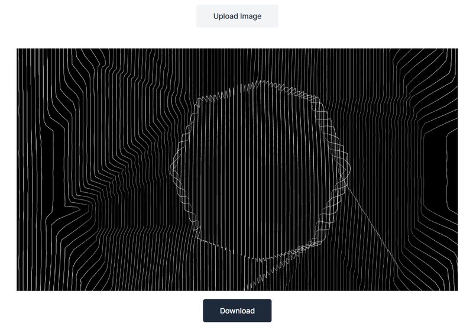

Image vectorization is the process of converting raster images into vector formats like SVG. This is useful for improving scalability without losing quality. In this article, we will explore how to build an image vectorization service using [Three.js](https://threejs.org/), a powerful JavaScript library for working with 3D graphics in the browser.

**Demo**: [image-vectorizer.vercel.app](https://image-vectorizer.vercel.app/)

**Code**: [github.com](https://github.com/jsdevspace/3D-Image-Vectorizer)

## Why Three.js?

Three.js makes it easy to work with WebGL, enabling complex visualizations and image manipulations. We will use it to process images and transform them into vector-based shapes.

**Advantages of Using Three.js for Vectorization:**

✅ WebGL support for fast rendering

✅ Flexible image processing capabilities

✅ Ability to use shaders and post-processing

## 1. Setting Up the Project

First, initialize a Vite project:

<div className='code-cmd'>
  npm create vite@latest image-vectorizer --template vanilla
</div>

<div className='code-cmd'>cd image-vectorizer</div>

<div className='code-cmd'>npm install</div>

Then, install Three.js:

<div className='code-cmd'>npm install three @types/three</div>

### Adding Tailwind CSS to a Vite Project

To integrate Tailwind CSS into your Vite + Three.js image vectorization project, follow these steps:

**1. Install Tailwind CSS**

Run the following command in your project directory:

<div className='code-cmd'>npm install tailwindcss @tailwindcss/vite</div>

**2. Configure Vite**

Open/create `vite.config.ts` and add the `@tailwindcss/vite` plugin:

```ts
import tailwindcss from '@tailwindcss/vite';
import { defineConfig } from 'vite';

import tailwindcss from '@tailwindcss/vite';
import { defineConfig } from 'vite';

export default defineConfig({
  plugins: [tailwindcss()],
});
```

**3. Add Tailwind to CSS**

Replace `style.css` with a new file `src/index.css` and add Tailwind's base styles:

```css
@import 'tailwindcss';

:root {
  font-family: Inter, system-ui, Avenir, Helvetica, Arial, sans-serif;
  line-height: 1.5;
  font-weight: 400;

  color-scheme: light dark;
  color: rgba(255, 255, 255, 0.87);
  background-color: #242424;

  font-synthesis: none;
  text-rendering: optimizeLegibility;
  -webkit-font-smoothing: antialiased;
  -moz-osx-font-smoothing: grayscale;
}

body {
  margin: 0;
  display: flex;
  flex-direction: column;
  place-items: center;
  min-width: 320px;
  min-height: 100vh;
}

h1 {
  font-size: 3.2em;
  line-height: 1.1;
}

#app {
  margin: 0 auto;
  text-align: center;
}

@media (prefers-color-scheme: light) {
  :root {
    color: #213547;
    background-color: #ffffff;
  }
}
```

It contains all the styles for the entire project.

## 2. Project Structure

Your project folder should look like this:

```pqsql
image-vectorizer/
│── public/
│── src/
│── index.html
│── package.json
│── tsconfig.json
```

## 3. HTML Structure

Modify `index.html` to include:

```html
<!DOCTYPE html>
<html lang="en">
  <head>
    <meta charset="UTF-8" />
    <meta
      name="description"
      content="mage Vectirized is an open-source Three.js tool that converts images into scalable 3D vector graphics. Explore real-time vectorization and the power of WebGL for interactive design."
    />
    <meta name="viewport" content="width=device-width, initial-scale=1.0" />
    <link href="/src/style.css" rel="stylesheet" />
    <title>Image Vectirized - Open-Source ThreeJS Tool</title>
  </head>
  <body class="overflow-x-hidden">
    <div id="app"></div>
    <script type="module" src="/src/main.ts"></script>
  </body>
</html>
```

## 4. Create UI Components

**Button Component**

Create `src/ui/button.ts` file:

```ts
type BtnVariant = 'primary' | 'secondary' | 'upload';

export function setupButton(
  element: HTMLButtonElement,
  text: string,
  href: string,
  variant: BtnVariant = 'primary'
) {
  element.innerHTML =
    variant === 'primary'
      ? `
      <a
        class="inline-block rounded-sm px-8 py-3 text-sm font-medium text-white bg-gray-800 transition hover:scale-105 hover:shadow-xl focus:ring-3 focus:outline-hidden cursor-pointer"
        href=${href}
      >
        ${text}
      </a>
  `
      : variant === 'secondary'
        ? `
    <a
    class="inline-block rounded-sm bg-gray-500 px-8 py-3 text-sm font-medium text-white transition hover:scale-105 hover:shadow-xl focus:ring-3 focus:outline-hidden cursor-pointer"
    href=${href}
  >
    ${text}
  </a>
  `
        : `
    <input type="file" id="fileInput" value="Upload Image" style="display: none"
    accept="image/*" />
    <label for="fileInput" class="inline-block rounded-sm px-8 py-3 text-sm font-medium text-gray-800 bg-gray-100 transition hover:scale-105 hover:shadow-xl focus:ring-3 focus:outline-hidden cursor-pointer"> Upload Image </label>
  `;
}
```

- The function sets the `innerHTML` of `a` button based on the provided variant.
- If `'primary'` or `'secondary'`, it creates an `<a>` button linking to `href`.
- If `'upload'`, it creates a file upload input with a styled label.
- Uses **Tailwind CSS** classes for styling and hover effects.

This approach enhances reusability and maintains clean, structured code for different button types. 🚀

**Header component:**

Create a `header.ts` file inside the `src` folder:

```ts
export function setupHeader(header: HTMLElement) {
  header.className = 'bg-white';
  header.innerHTML = `
    <div class="mx-auto px-4 sm:px-6 lg:px-8 w-screen">
      <div class="flex h-16 items-center justify-between">
        <div class="flex-1 md:flex md:items-center md:gap-12">
          <a class="group flex items-center gap-4" href="/"><span class="sr-only">Home</span>
            <svg class="group-hover:stroke-gray-700 stroke-black" width="30px" height="30px" viewBox="0 0 48 48" id="a" xmlns="http://www.w3.org/2000/svg"><defs><style>.b{fill:none;stroke-linecap:round;stroke-linejoin:round;}</style></defs><path class="b" d="M29.4995,12.3739c.7719-.0965,1.5437,.4824,1.5437,1.2543h0l2.5085,23.8312c.0965,.7719-.4824,1.5437-1.2543,1.5437l-23.7347,2.5085c-.7719,.0965-1.5437-.4824-1.5437-1.2543h0l-2.5085-23.7347c-.0965-.7719,.4824-1.5437,1.2543-1.5437l23.7347-2.605Z"/><path class="b" d="M12.9045,18.9347c-1.7367,.193-3.0874,1.7367-2.8945,3.5699,.193,1.7367,1.7367,3.0874,3.5699,2.8945,1.7367-.193,3.0874-1.7367,2.8945-3.5699s-1.8332-3.0874-3.5699-2.8945h0Zm8.7799,5.596l-4.6312,5.6925c-.193,.193-.4824,.2894-.6754,.0965h0l-1.0613-.8683c-.193-.193-.5789-.0965-.6754,.0965l-5.0171,6.1749c-.193,.193-.193,.5789,.0965,.6754-.0965,.0965,.0965,.0965,.193,.0965l19.9719-2.1226c.2894,0,.4824-.2894,.4824-.5789,0-.0965-.0965-.193-.0965-.2894l-7.8151-9.0694c-.2894-.0965-.5789-.0965-.7719,.0965h0Z"/><path class="b" d="M16.2814,13.8211l.6754-6.0784c.0965-.7719,.7719-1.3508,1.5437-1.2543l23.7347,2.5085c.7719,.0965,1.3508,.7719,1.2543,1.5437h0l-2.5085,23.7347c0,.6754-.7719,1.2543-1.5437,1.2543l-6.1749-.6754"/><path class="b" d="M32.7799,29.9337l5.3065,.5789c.2894,0,.4824-.193,.5789-.4824,0-.0965,0-.193-.0965-.2894l-5.789-10.5166c-.0965-.193-.4824-.2894-.6754-.193h0l-.3859,.3859"/></svg>
            <span class="text-black group-hover:text-gray-700">Image Vectorizer</span>
         </a>
      </div>

        <div class="flex items-center gap-4">
          <button id="github__btn"></button>
      </div>
    </div>
  </div>`;
}
```

**Hero component:**

```ts
export function setupHero(element: HTMLElement) {
  element.className = 'mt-10';
  element.innerHTML = `
  <div class="mx-auto max-w-screen-xl px-4 py-8 sm:px-6 lg:px-8">
    <div class="flex flex-col md:flex-row items-center gap-4 md:gap-8 justify-center">
        <div class="max-w-lg md:max-w-none">
          <h1 class="text-3xl font-semibold text-gray-900 sm:text-4xl">
            3D Image Vectorizer
          </h1>

          <p class="mt-4 text-gray-700 max-w-2xl">
            3D Image Vectorizer converts raster images into high-quality 3D vector graphics. It enhances scalability, precision, and editability for 3D modeling, printing, and animation.
          </p>
        </div>
        
      </div>
  </div>
`;
}
```

**Canvas Component:**

`canvas.ts` - the most complicated component in our app:

```ts
import * as THREE from 'three';
import { OrbitControls } from 'three/examples/jsm/controls/OrbitControls.js';

import * as THREE from 'three';
import { OrbitControls } from 'three/examples/jsm/controls/OrbitControls.js';

export function setupCanvas(element: HTMLDivElement): void {
  const canvas = document.querySelector('canvas') as HTMLCanvasElement;
  const width = window.innerWidth / 1.5;
  const height = window.innerHeight / 1.5;

  const renderer = new THREE.WebGLRenderer({
    canvas,
    antialias: true,
    preserveDrawingBuffer: true,
  });
  renderer.setPixelRatio(window.devicePixelRatio > 1 ? 2 : 1);
  renderer.setSize(width, height);
  renderer.setClearColor(0x000000);

  const scene = new THREE.Scene();
  const camera = new THREE.PerspectiveCamera(40, width / height, 0.1, 1000);
  camera.position.set(0, 0, 300);

  const group = new THREE.Group();
  scene.add(group);

  const downloadBtn = document.getElementById(
    'download-btn'
  ) as HTMLButtonElement;
  const fileInput = document.getElementById(
    'fileInput'
  ) as HTMLInputElement | null;

  if (fileInput) {
    fileInput.addEventListener('change', (event: Event) => {
      const uploadEvent = event.target as HTMLInputElement;
      if (!uploadEvent?.files?.length) return;

      const file = uploadEvent.files[0];
      const reader = new FileReader();

      reader.onload = e => {
        const img = new Image();
        img.onload = () => {
          const canvas2d = document.createElement('canvas');
          const ctx = canvas2d.getContext('2d');
          if (!ctx) return;

          const size = 200;
          canvas2d.width = size;
          canvas2d.height = size;
          ctx.drawImage(img, 0, 0, size, size);

          const data = ctx.getImageData(0, 0, size, size).data;
          group.clear();

          for (let i = 0; i < size; ++i) {
            const geometry = new THREE.BufferGeometry();
            const vertices = new Float32Array(size * 3);
            const colors = new Float32Array(size * 3);

            for (let j = 0; j < size; ++j) {
              const colorIndex = (j * size + i) * 4;
              const r = data[colorIndex] / 255;
              const g = data[colorIndex + 1] / 255;
              const b = data[colorIndex + 2] / 255;

              vertices.set([j - 100, i - 100, data[colorIndex] / 10], j * 3);
              colors.set([r, g, b], j * 3);
            }

            geometry.setAttribute(
              'position',
              new THREE.BufferAttribute(vertices, 3)
            );
            geometry.setAttribute(
              'color',
              new THREE.BufferAttribute(colors, 3)
            );

            const material = new THREE.LineBasicMaterial({
              vertexColors: true,
            });
            const line = new THREE.Line(geometry, material);
            group.add(line);
          }

          element.classList.remove('hidden');
          downloadBtn.classList.remove('hidden');
          downloadBtn.disabled = false;
        };
        if (e.target?.result) img.src = e.target.result as string;
      };
      reader.readAsDataURL(file);
    });
  }

  group.rotateZ(-Math.PI / 2);
  const controls = new OrbitControls(camera, renderer.domElement);

  function animate(): void {
    requestAnimationFrame(animate);
    controls.update();
    renderer.render(scene, camera);
  }
  animate();

  downloadBtn.addEventListener('click', () => {
    renderer.render(scene, camera);
    const link = document.createElement('a');
    link.href = canvas.toDataURL('image/png');
    link.download = 'vectorized-image.png';
    link.click();
  });
}
```

**Explanation of the Code**

This TypeScript code defines a function setupCanvas, which sets up a Three.js scene, processes an uploaded image, vectorizes it, and allows users to download the vectorized result as a PNG image.

```ts
export function setupCanvas(element: HTMLDivElement): void {}
```

This function initializes the Three.js scene within the provided HTMLDivElement.

**Creating the WebGL Renderer**

```ts
const canvas = document.querySelector('canvas') as HTMLCanvasElement;
const width = window.innerWidth / 1.5;
const height = window.innerHeight / 1.5;

const renderer = new THREE.WebGLRenderer({
  canvas,
  antialias: true,
  preserveDrawingBuffer: true,
});
```

- Finds an existing `<canvas>` element in the DOM.
- Sets canvas dimensions to ⅔ of the window size.

Creates a WebGL renderer with:

- `antialias: true` for smooth rendering.
- `preserveDrawingBuffer: true` to enable downloading images.

```ts
renderer.setPixelRatio(window.devicePixelRatio > 1 ? 2 : 1);
renderer.setSize(width, height);
renderer.setClearColor(0x000000);
```

- Adjusts pixel ratio for high-resolution screens.
- Sets canvas size.
- Uses a black background (`0x000000`).

**Setting Up Scene, Camera, and Group**

```ts
const scene = new THREE.Scene();
const camera = new THREE.PerspectiveCamera(40, width / height, 0.1, 1000);
camera.position.set(0, 0, 300);

const group = new THREE.Group();
scene.add(group);
```

- Creates a Three.js scene.
- Defines a Perspective Camera (FOV: 40°, aspect ratio based on canvas size).
- Moves the camera back (z = 300) to view the scene.
- Creates an empty group (`group`) to hold objects and adds it to the scene.

**File Upload Handling**

```ts
const fileInput = document.getElementById(
  'fileInput'
) as HTMLInputElement | null;
```

- Finds the file input (`<input type="file">`) for image uploads.

```ts
if (fileInput) {
    fileInput.addEventListener('change', (event: Event) => {
        const uploadEvent = event.target as HTMLInputElement;
        if (!uploadEvent?.files?.length) return;

        const file = uploadEvent.files[0];
        const reader = new FileReader();
```

- Listens for file selection.
- Reads the uploaded file using `FileReader`.

**Processing Image into Vector Format**

```ts
reader.onload = (e) => {
    const img = new Image();
    img.onload = () => {
        const canvas2d = document.createElement('canvas');
        const ctx = canvas2d.getContext('2d');
        if (!ctx) return;
```

- Creates a temporary 2D `<canvas>` to process the image.
- Gets the 2D rendering context (`ctx`).

```ts
const size = 200;
canvas2d.width = size;
canvas2d.height = size;
ctx.drawImage(img, 0, 0, size, size);
```

- Resizes the image to 200×200 pixels for performance.

```ts
const data = ctx.getImageData(0, 0, size, size).data;
group.clear();
```

- Extracts pixel data from the canvas.
- Clears the 3D scene before drawing new content.

**Generating the 3D Vectorized Image**

```ts
for (let i = 0; i < size; ++i) {
    const geometry = new THREE.BufferGeometry();
    const vertices = new Float32Array(size * 3);
    const colors = new Float32Array(size * 3);
```

- Loops over each row (`i`) of the image.
- Creates geometry (`BufferGeometry`) for each row of pixels.

```ts
for (let j = 0; j < size; ++j) {
  const colorIndex = (j * size + i) * 4;
  const r = data[colorIndex] / 255;
  const g = data[colorIndex + 1] / 255;
  const b = data[colorIndex + 2] / 255;

  vertices.set([j - 100, i - 100, data[colorIndex] / 10], j * 3);
  colors.set([r, g, b], j * 3);
}
```

- Reads RGB values from the pixel data.
- Converts pixel positions into 3D coordinates (`x, y, z`).

```ts
geometry.setAttribute('position', new THREE.BufferAttribute(vertices, 3));
geometry.setAttribute('color', new THREE.BufferAttribute(colors, 3));
const material = new THREE.LineBasicMaterial({ vertexColors: true });
const line = new THREE.Line(geometry, material);
group.add(line);
```

- Creates a 3D line from the pixel data.
- Sets vertex positions and colors.
- Adds the line to the scene.

**Making the Canvas and Download Button Visible**

```ts
element.classList.remove('hidden');
downloadBtn.classList.remove('hidden');
downloadBtn.disabled = false;
```

- Unhides the canvas and download button after processing the image.

**Adding Camera Controls**

```ts
group.rotateZ(-Math.PI / 2);
const controls = new OrbitControls(camera, renderer.domElement);
```

- Rotates the group to align correctly.
- Enables mouse-based navigation using `OrbitControls`.

**Animation Loop**

```ts
function animate(): void {
  requestAnimationFrame(animate);
  controls.update();
  renderer.render(scene, camera);
}
animate();
```

- Uses requestAnimationFrame to continuously update the scene.
- Renders the 3D vectorized image.

**Adding Image Download Functionality**

```ts
downloadBtn.addEventListener('click', () => {
  renderer.render(scene, camera);
  const link = document.createElement('a');
  link.href = canvas.toDataURL('image/png');
  link.download = 'vectorized-image.png';
  link.click();
});
```

- Captures the rendered canvas as a PNG.
- Creates a download link and triggers a click event.
- Saves the image as `vectorized-image.png`.

This implementation is a simple yet powerful way to transform raster images into vectorized 3D representations using Three.js! 🚀

## 5. Combine all Component in `main.ts`

Edit `main.ts` file:

```ts
import { setupCanvas } from './canvas';
import { setupHeader } from './header';
import { setupHero } from './hero';
import './style.css';
import { setupButton } from './ui/button';

import { setupCanvas } from './canvas';
import { setupHeader } from './header';
import { setupHero } from './hero';
import './style.css';
import { setupButton } from './ui/button';

document.querySelector<HTMLDivElement>('#app')!.innerHTML = `
	<header></header>
	<section id="hero"></section>
	<section>
		<button id="upload-btn"></button>
	</section>
	<div class="flex flex-col items-center justify-center my-10 hidden" id="content">
		<canvas></canvas>
		<button id="download-btn" class="my-4">Download</button>
	</div>
	<section class="ml-4 mt-28 mb-10 flex flex-col gap-4 justify-center items-center max-w-[90%]">
	<div>
	<h2 class="text-2xl">About</h2>
	<p class="max-w-2xl my-4">
		3D Image Vectorizer is a simple open-source tool designed to showcase the capabilities of Three.js by transforming raster images into scalable 3D vector graphics. Developed as part of an article on JSDev Space, this tool demonstrates real-time image processing, depth mapping, and smooth vectorization using JavaScript and WebGL.
	</p>
	</div>
	</section>
	<footer class="flex items-center justify-center">3D Image Vectorizer -- All Rights Reserved ${new Date(Date.now()).getFullYear()}</footer>
`;
const header = document.querySelector<HTMLDivElement>('header')!;
const sectionHero = document.querySelector<HTMLDivElement>('#hero')!;
const uploadBtn = document.querySelector<HTMLButtonElement>('#upload-btn')!;
const downloadBtn = document.querySelector<HTMLButtonElement>('#download-btn')!;
const content = document.querySelector<HTMLDivElement>('#content');
let githubBtn = document.querySelector<HTMLButtonElement>('#github__btn');

header && setupHeader(header);
sectionHero && setupHero(sectionHero);
uploadBtn && setupButton(uploadBtn, 'Upload Image', '#', 'upload');
downloadBtn && setupButton(downloadBtn, 'Download', '#', 'primary');
content && setupCanvas(content);

if (githubBtn) {
  setupButton(githubBtn, 'github', '#');
} else {
  githubBtn = document.querySelector<HTMLButtonElement>('#github__btn');
  githubBtn && setupButton(githubBtn, 'github', '#');
}
```

This TypeScript code sets up the user interface for a 3D Image Vectorizer using modular components, Tailwind CSS, and Three.js. It structures the page, initializes UI elements, and sets up interactive features like file uploads and downloads.

**Setting Up the Page Structure**

```ts
document.querySelector<HTMLDivElement>('#app')!.innerHTML = `
	<header></header>
	<section id="hero"></section>
	<section>
		<button id="upload-btn"></button>
	</section>
	<div class="flex flex-col items-center justify-center my-10 hidden" id="content">
		<canvas></canvas>
		<button id="download-btn" class="my-4">Download</button>
	</div>
	<section class="ml-4 mt-28 mb-10 flex flex-col gap-4 justify-center items-center max-w-[90%]">
		<div>
			<h2 class="text-2xl">About</h2>
			<p class="max-w-2xl my-4">
				3D Image Vectorizer is a simple open-source tool designed to showcase the capabilities of Three.js by transforming raster images into scalable 3D vector graphics. Developed as part of an article on JSDev Space, this tool demonstrates real-time image processing, depth mapping, and smooth vectorization using JavaScript and WebGL.
			</p>
		</div>
	</section>
	<footer class="flex items-center justify-center">
		3D Image Vectorizer -- All Rights Reserved ${new Date(Date.now()).getFullYear()}
	</footer>
`;
```

- Creates an HTML template dynamically and inserts it into the `#app` `<div>`.
- `<header>` → Placeholder for the site header.
- `<section id="hero">` → The hero section.
- Upload Button (`#upload-btn`) → Users can upload an image.
- #content Section (Hidden by Default)
- "About" Section → Describes the purpose of the tool.
- Footer → Displays current year dynamically using JavaScript.

**Selecting and Configuring Elements**

```ts
const header = document.querySelector<HTMLDivElement>('header')!;
const sectionHero = document.querySelector<HTMLDivElement>('#hero')!;
const uploadBtn = document.querySelector<HTMLButtonElement>('#upload-btn')!;
const downloadBtn = document.querySelector<HTMLButtonElement>('#download-btn')!;
const content = document.querySelector<HTMLDivElement>('#content');
let githubBtn = document.querySelector<HTMLButtonElement>('#github__btn');
```

- Finds and stores references to key elements in the DOM.

**Initializing Components**

```ts
header && setupHeader(header);
sectionHero && setupHero(sectionHero);
uploadBtn && setupButton(uploadBtn, 'Upload Image', '#', 'upload');
downloadBtn && setupButton(downloadBtn, 'Download', '#', 'primary');
content && setupCanvas(content);
```

Safely initializes components if their elements exist:

- `setupHeader(header)` → Calls a function to set up the page header.
- `setupHero(sectionHero)` → Calls a function to set up the hero section.
- `setupButton(uploadBtn, 'Upload Image', '#', 'upload')` → Converts the upload button into a functional upload input.
- `setupButton(downloadBtn, 'Download', '#', 'primary')` → Configures the download button.
- `setupCanvas(content)` → Calls setupCanvas to initialize Three.js rendering.

**Summary**

🔹 What This Code Does

✅ Dynamically builds an HTML structure inside #app.

✅ Sets up key UI components like header, hero section, upload/download buttons.

✅ Uses TypeScript for strong typing and safety.

✅ Integrates Three.js rendering via `setupCanvas()`.

✅ Uses modular functions (`setupButton`, `setupHeader`, `setupHero`) to keep code clean.

## 6. Start the Project

Run Vite’s development server:

<div className='code-cmd'>npm run dev</div>

Vite will launch the local server, and you can test your image vectorization service in the browser.



## 7. Explanation of Key Features

✅ **Three.js Rendering**: Converts pixel data into 3D points and lines.

✅ **OrbitControls**: Allows users to rotate and zoom the 3D view.

✅ **File Upload**: Loads an image and extracts pixel color data.

✅ **Vectorization**: Transforms the image into a 3D point cloud representation.

✅ **Download Option**: Captures the rendered scene and saves it as a PNG.

## 8. Conclusion

Using Three.js and Vite, we created a simple image vectorization service that loads an image, processes its pixels, and displays it in 3D space. You can enhance this by adding:

- **Different vectorization styles** (dots, edges, triangles)
- **More color processing techniques**
- **WebGL performance optimizations**

This is just a foundation—feel free to expand and experiment! 🚀
