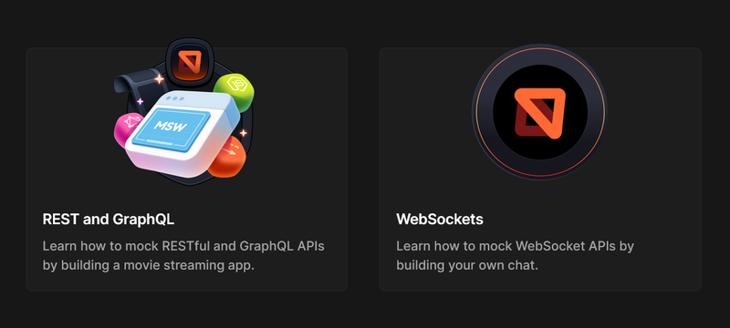

**Mock Service Worker (MSW)** is a powerful technology that enables developers to emulate backend behavior in situations where using a real backend for frontend development is impossible or impractical. This approach is particularly valuable for testing user scenarios in isolation.

MSW proves beneficial in several common development scenarios:

- When frontend development must proceed in parallel with or ahead of backend development based on contracts or specifications
- When technical limitations prevent access to the real backend API during local development, such as in educational platform projects where the backend operates exclusively in production environments
- When writing end-to-end tests to verify critical user scenarios

Mock Service Worker has proven itself as an effective solution for these challenges in production applications. The recent release of a new major version of the MSW library introduces numerous important updates that enhance its functionality.



## API Mocking and Service Workers: The Technical Foundation

API Mocking creates models based on real data for simulating backend responses. Traditionally, this function might be performed by a separate Node.js server running locally to process API requests. However, Mock Service Worker provides an alternative approach that doesn't require a separate server while still effectively emulating network behavior and offering robust tools for testing, isolated development, and debugging network scenarios.
MSW provides a service worker file that registers during application initialization. This service worker listens for XHR request events, intercepting and processing them according to predefined rules for specific endpoints. Importantly, in production environments, the Service Worker remains deactivated, allowing the application to interact with the real API seamlessly.
For detailed information about the underlying technology, developers can consult the [Service Worker API documentation](https://developer.mozilla.org/en-US/docs/Web/API/Service_Worker_API).

A key advantage of MSW is that it enables developers to use familiar services for API requests (such as the built-in fetch API or axios library) while targeting the same endpoints that would communicate with the real backend. This eliminates the need to maintain separate configurations and endpoint sets for development and production environments.

## Getting Started with Mock Service Worker

Setting up Mock Service Worker requires the MSW library, with comprehensive information available on the official website: [https://mswjs.io](https://mswjs.io).

### Installation and Initialization

To install the MSW library, developers should run the following command in their project directory:

<div className='code-cmd'>npm install msw@latest --save-dev</div>

Working with the latest version requires Node.js version 18.0.0 or higher. Projects using TypeScript need version 4.7 or above.

Next, developers must initialize Mock Service Worker and create the necessary operational files using:

<div className='code-cmd'>npx msw init ./public --save</div>

This command generates a worker file `mockServiceWorker.js` in the `./public` folder where static project files are stored. The `--save` parameter saves the folder path in the project's `package.json` for future worker script updates.

### Creating Request Handlers

After initialization, the next step is creating request handlers that intercept calls to the real backend and emulate its behavior.

Early MSW versions used syntax similar to Node.js server route handlers (like Express). Version 2.0 adapted the working logic to the native Fetch API standard, allowing full emulation of requests using modern browser standards.

MSW request processing involves two key concepts:

1. **Request handler** — A handler tied to a specific URL that intercepts requests and triggers a resolver function
2. **Response resolver** — A function with access to request parameters that returns a response mimicking the real backend

Implementing these concepts involves first creating a `src/mocks` directory for mock data, then creating a `handlers.js` file describing all mock request handlers.

The implementation begins by importing the `http` module for REST request handling:

```js
import { http } from 'msw';

import { http } from 'msw';
```

Then, a handler template is defined:

```js
// request handler
const coursesHandler = http.get('/api/courses', coursesResolver);
```

The `http` module can process specific REST methods (GET, POST, PATCH, etc.) or handle all methods on the same URL using `http.all(predicate, resolver)`.

Further information about http module methods is available in the [MSW request handling documentation](https://mswjs.io/docs/basics/request-handler).

MSW also supports GraphQL request emulation through the `graphql` module, as detailed in the [GraphQL API documentation](https://mswjs.io/docs/api/graphql).

The request handler's first parameter, `predicate`, defines rules for checking request URLs. This can be a string or regular expression. The request processing by the resolver function only occurs when the request URL matches the predicate's rules. In this example, the predicate is the relative URL `api/courses`. When a client application with an active Mock Service Worker makes a GET request to this URL, the `coursesHandler` executes.

Comprehensive information about predicate formation rules is available in the [request matching documentation](https://mswjs.io/docs/basics/request-matching).

The resolver function code looks like this:

```js
// response resolver
const coursesResolver = ({ request, params, cookies }) => {
  return new HttpResponse(
    JSON.stringify([
      {
        id: '0',
        title: 'Introduction to Web Development with Modern Frameworks',
        description:
          'Learn the basics of web development using the latest tools and frameworks',
        instructor: '@WebDevMaster',
      },
      {
        id: '1',
        title: 'Mastering CSS Grid and Flexbox',
        description: 'Comprehensive guide to modern CSS layout techniques',
        instructor: '@CSSGuru',
      },
    ]),
    {
      headers: {
        'Content-Type': 'application/json',
      },
    }
  );
};
```

The Response resolver receives an object argument containing intercepted request information:

- The `request` field contains the native Request interface implementation from Fetch API
- The `params` field contains path parameters (like `courseId` in `api/courses/:courseId`)
- The `cookies` field contains request cookies as string key-value pairs

The resolver function must return an instruction for request handling, typically a mock data response. MSW uses the native `Response` class from Fetch API, though developers are encouraged to use MSW's enhanced `HttpResponse` class, which adds cookie setting capabilities and convenient methods for various Content-Type responses.

More details about `HttpResponse` are available in the [response API documentation](https://mswjs.io/docs/api/http-response).

Beyond text data (plain text, JSON, XML, formData), MSW supports returning `ReadableStream` streams, as explained in the [stream response documentation](https://mswjs.io/docs/api/http-response/stream).

This example uses `HttpResponse.json()` to pass a mock data structure—a course collection—to be sent to the client upon successful processing.

The final `handlers.js` file using the newer `HttpResponse.json()` syntax would look like:

```js
// src/mocks/handlers.js
import { http, HttpResponse } from 'msw';

import { http, HttpResponse } from 'msw';

// response resolver
const coursesResolver = () => {
  return HttpResponse.json([
    {
      id: '0',
      title: 'Introduction to Web Development with Modern Frameworks',
      description:
        'Learn the basics of web development using the latest tools and frameworks',
      instructor: '@WebDevMaster',
    },
    {
      id: '1',
      title: 'Mastering CSS Grid and Flexbox',
      description: 'Comprehensive guide to modern CSS layout techniques',
      instructor: '@CSSGuru',
    },
  ]);
};

// request handler
const coursesHandler = http.get('/api/courses', coursesResolver);

export const handlers = [coursesHandler];
```

The file exports a `handlers` variable containing an array of all call handlers.

## Configuring Mock Service Worker for Browser Use

Next, a `browser.js` file must be created in the src/mocks folder to configure the worker with the previously defined call handlers:

```js
// src/mocks/browser.js
import { handlers } from './handlers';
import { setupWorker } from 'msw/browser';

import { handlers } from './handlers';
import { setupWorker } from 'msw/browser';

export const worker = setupWorker(...handlers);
```

The `setupWorker` function accepts a list of handlers and prepares communication between the client and the previously generated `mockServiceWorker.js` worker.

MSW activation occurs by calling the worker's `worker.start()` method. Here's an example of activating the worker at a React application's entry point:

```jsx
// src/index.jsx
import React from 'react';
import ReactDOM from 'react-dom/client';

import { App } from './App';

import { App } from './App';

async function enableMocking() {
  if (process.env.NODE_ENV !== 'production') {
    const { worker } = await import('./mocks/browser');
    // Note: We're now passing options directly to start()
    return worker.start({
      onUnhandledRequest: 'bypass', // Optional: bypass unhandled requests without printing warnings
    });
  }
}

const rootElement = document.getElementById('root');
const root = ReactDOM.createRoot(rootElement);

enableMocking().then(() => {
  root.render(<App />);
});
```

MSW activation should only occur in development mode. The `worker.start()` method returns a promise, and the client application should be rendered upon its resolution. This sequence prevents race conditions between worker registration and application startup requests.

For vanilla JS applications, simply running `worker.start()` during initialization is sufficient.

When configured correctly, starting the application displays the console message:

<div className='code-cmd'>[MSW] Mocking enabled.</div>

MSW works with browser environments, Node.js, and React Native. Integration guidance for these environments is available in the [Node.js integration](https://mswjs.io/docs/integrations/node) and [React Native integration documentation](https://mswjs.io/docs/integrations/react-native).

## Advanced Example Implementation

A more complex example demonstrates parameterized routes and various HTTP methods for a fictional online learning platform API:

```js
// src/mocks/handlers.js (extended)
import { delay, http, HttpResponse } from 'msw';

import { delay, http, HttpResponse } from 'msw';

// Mock data
const educationalCourses = [
  {
    id: '1',
    title: 'Fundamentals of JavaScript',
    description:
      'A comprehensive introduction to JavaScript programming language',
    instructor: 'Sarah Johnson',
    duration: '8 weeks',
    enrollmentStatus: 'Open',
    createdAt: '2025-03-10T10:00:00Z',
  },
  {
    id: '2',
    title: 'Advanced React Patterns',
    description: 'Master advanced React concepts and design patterns',
    instructor: 'Michael Chen',
    duration: '6 weeks',
    enrollmentStatus: 'Closed',
    createdAt: '2025-03-15T14:30:00Z',
  },
];

// GET all courses
const getAllCoursesHandler = http.get('/api/education/courses', async () => {
  // Add artificial delay to simulate network latency
  await delay(500);
  return HttpResponse.json(educationalCourses);
});

// GET single course by ID
const getCourseByIdHandler = http.get(
  '/api/education/courses/:id',
  async ({ params }) => {
    const { id } = params;
    const course = educationalCourses.find(course => course.id === id);

    if (!course) {
      return new HttpResponse(null, { status: 404 });
    }

    await delay(300);
    return HttpResponse.json(course);
  }
);

// POST new course
const createCourseHandler = http.post(
  '/api/education/courses',
  async ({ request }) => {
    const newCourse = await request.json();

    // Validate input
    if (!newCourse.title || !newCourse.description) {
      return new HttpResponse(
        JSON.stringify({ error: 'Title and description are required' }),
        { status: 400, headers: { 'Content-Type': 'application/json' } }
      );
    }

    // Create new course with generated ID
    const course = {
      id: String(educationalCourses.length + 1),
      title: newCourse.title,
      description: newCourse.description,
      instructor: newCourse.instructor || 'Staff Instructor',
      duration: newCourse.duration || '4 weeks',
      enrollmentStatus: 'Open',
      createdAt: new Date().toISOString(),
    };

    educationalCourses.push(course);

    return HttpResponse.json(course, { status: 201 });
  }
);

// DELETE course
const deleteCourseHandler = http.delete(
  '/api/education/courses/:id',
  ({ params }) => {
    const { id } = params;
    const courseIndex = educationalCourses.findIndex(
      course => course.id === id
    );

    if (courseIndex === -1) {
      return new HttpResponse(null, { status: 404 });
    }

    educationalCourses.splice(courseIndex, 1);
    return new HttpResponse(null, { status: 204 });
  }
);

export const handlers = [
  getAllCoursesHandler,
  getCourseByIdHandler,
  createCourseHandler,
  deleteCourseHandler,
];
```

This example demonstrates:

- Different HTTP methods (GET, POST, DELETE)
- URL parameters
- Request body parsing
- Different response statuses
- Network latency simulation with delays

## Testing Request Processing

When a request to `/api/courses` is made from a client application, Mock Service Worker intercepts it and returns the corresponding mock data.

This can be observed in a React application's `Courses` component:

```jsx
// src/components/Courses.jsx
import { useEffect, useState } from 'react';

import { CourseCard } from './CourseCard';

import { CourseCard } from './CourseCard';

export const Courses = () => {
  const [courses, setCourses] = useState([]);
  const [isLoading, setIsLoading] = useState(true);
  const [error, setError] = useState(null);

  useEffect(() => {
    const fetchCourses = async () => {
      try {
        const response = await fetch('/api/courses');

        if (!response.ok) {
          throw new Error(`HTTP error! Status: ${response.status}`);
        }

        const data = await response.json();
        setCourses(data);
      } catch (err) {
        setError(err.message);
      } finally {
        setIsLoading(false);
      }
    };

    fetchCourses();
  }, []);

  if (isLoading) return <p>Loading courses...</p>;
  if (error) return <p>Error loading courses: {error}</p>;

  return (
    <div className='courses-container'>
      {courses.length === 0 ? (
        <p>No courses found</p>
      ) : (
        courses.map(course => <CourseCard key={course.id} course={course} />)
      )}
    </div>
  );
};
```

When this React component loads, the browser's Developer Tools Network tab displays an XHR request to `api/courses` with the mock data response.

MSW intercepts any request with a URL matching the path predicate in the request handler. Each intercepted request displays additional information in the browser console.

## TypeScript Integration

MSW integrates well with TypeScript, providing type safety for mocks. Here's how to configure types for the previous example:

```ts
// src/mocks/handlers.ts
import { Course, CreateCourseRequest } from '../types/education';
import { delay, http, HttpResponse } from 'msw';

import { Course, CreateCourseRequest } from '../types/education';
import { delay, http, HttpResponse } from 'msw';

// src/types/education.ts
export interface Course {
  id: string;
  title: string;
  description: string;
  instructor: string;
  duration: string;
  enrollmentStatus: 'Open' | 'Closed' | 'In Progress';
  createdAt: string;
}

export interface CreateCourseRequest {
  title: string;
  description: string;
  instructor?: string;
  duration?: string;
}

const educationalCourses: Course[] = [
  {
    id: '1',
    title: 'Fundamentals of JavaScript',
    description:
      'A comprehensive introduction to JavaScript programming language',
    instructor: 'Sarah Johnson',
    duration: '8 weeks',
    enrollmentStatus: 'Open',
    createdAt: '2025-03-10T10:00:00Z',
  },
  // ...other courses
];

const getAllCoursesHandler = http.get('/api/education/courses', async () => {
  await delay(500);
  return HttpResponse.json<Course[]>(educationalCourses);
});

const createCourseHandler = http.post<CreateCourseRequest>(
  '/api/education/courses',
  async ({ request }) => {
    const newCourse = await request.json();

    // Type checking is now available
    if (!newCourse.title || !newCourse.description) {
      return new HttpResponse(
        JSON.stringify({ error: 'Title and description are required' }),
        { status: 400, headers: { 'Content-Type': 'application/json' } }
      );
    }

    // Create new course with generated ID
    const course: Course = {
      id: String(educationalCourses.length + 1),
      title: newCourse.title,
      description: newCourse.description,
      instructor: newCourse.instructor || 'Staff Instructor',
      duration: newCourse.duration || '4 weeks',
      enrollmentStatus: 'Open',
      createdAt: new Date().toISOString(),
    };

    educationalCourses.push(course);

    return HttpResponse.json<Course>(course, { status: 201 });
  }
);

// ...other handlers
```

## Testing Framework Integration

MSW proves particularly valuable for testing. Here's how to set it up with Jest:

```js
// src/mocks/server.js
import { setupServer } from 'msw/node';
import { handlers } from './handlers';

// Setup requests interception using the given handlers
export const server = setupServer(...handlers);

// test/setup.js
import { server } from '../src/mocks/server.js';

// Establish API mocking before all tests
beforeAll(() => server.listen({ onUnhandledRequest: 'error' }));

// Reset any request handlers that we may add during the tests,
// so they don't affect other tests
afterEach(() => server.resetHandlers());

// Clean up after the tests are finished
afterAll(() => server.close());

// Example test file
import { render, screen, waitFor } from '@testing-library/react';
import { Courses } from '../src/components/Courses';

test('renders courses when API call succeeds', async () => {
  render(<Courses />);

  // Initially shows loading state
  expect(screen.getByText(/loading courses/i)).toBeInTheDocument();

  // Wait for the courses to load
  await waitFor(() => {
    expect(screen.getByText(/introduction to web development/i)).toBeInTheDocument();
  });
});
```

## Conclusion

Mock Service Worker goes beyond a simple mock data environment; it accurately emulates network behavior without requiring a separate server deployment. The technology enables developers to replicate backend logic on the client, test complex user scenarios, and conduct full-fledged frontend development even when the backend doesn't yet exist. MSW's precise network behavior emulation allows seamless switching to real data and APIs when the application enters production.

The versatility of MSW extends to handling REST requests, GraphQL, and even streaming responses. It integrates with various environments including browsers, Node.js, and React Native. The latest MSW version makes real network behavior emulation more accessible through request handler interfaces that mirror native Fetch API interfaces like Request and Response.

This article has covered the fundamentals of working with, connecting, and configuring Mock Service Worker technology, but its capabilities extend much further. Developers are encouraged to experiment with MSW by following the steps outlined in this guide and exploring the comprehensive documentation available at [https://mswjs.io/docs/getting-started](https://mswjs.io/docs/getting-started).
