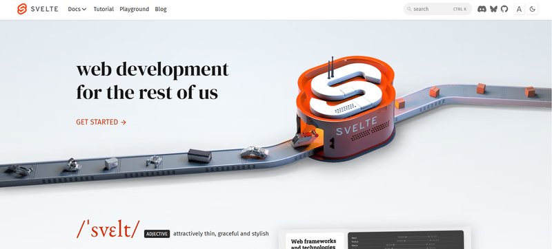
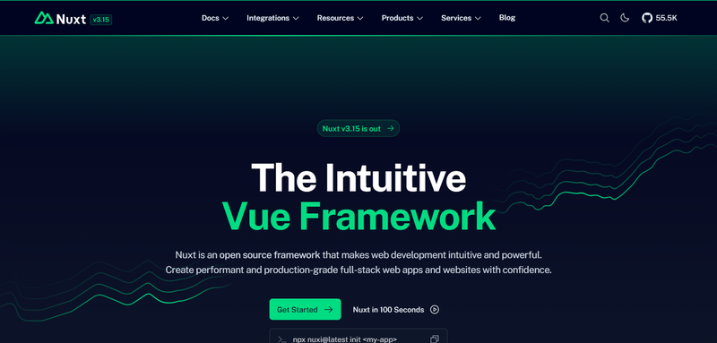
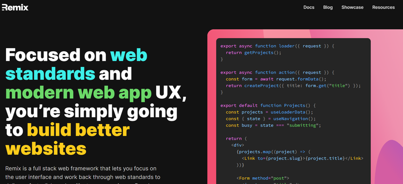
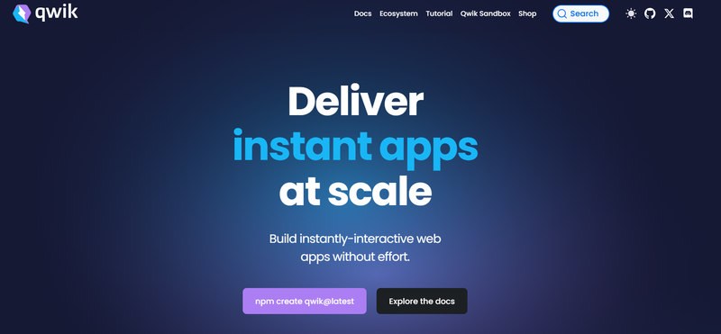
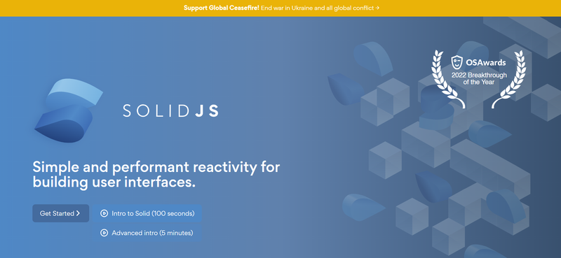

Discover innovative JavaScript tools beyond the well-known React, Vue.js, and Next.js. These lesser-known frameworks and libraries are shaping the future of web development.

## Svelte

[Svelte](https://svelte.dev/), introduced in 2016 by Rich Harris, is a JavaScript framework that compiles components into efficient, framework-less JavaScript code. Unlike traditional frameworks like React or Vue.js, Svelte operates during build time, eliminating the need for a virtual DOM.

### Key Features:

- **Compile-Time Framework**: Converts code into optimized JavaScript, CSS, and HTML during build time.
- **Built-in Reactivity**: Simplifies state management by automatically tracking data changes.
- **No Virtual DOM**: Updates the DOM directly for improved performance.
- **Lightweight Applications**: Produces small bundles with minimal dependencies.
- **TypeScript Support**: Ideal for developers seeking strict type checking.
- **Developer-Friendly Tools**: Includes animations, transitions, and a simple syntax.

### Advantages:

- Faster load times and rendering due to the absence of runtime overhead.
- Easy to learn with minimal syntax complexity.
- Modular approach with isolated components combining logic, styles, and templates.

### Drawbacks:

- Smaller community compared to React or Vue.js, leading to limited third-party libraries and plugins.
- Reduced corporate backing; primarily driven by open-source contributions.

### Use Cases:

- Building fast, lightweight web applications.
- Projects requiring minimal runtime dependencies.
- Applications needing enhanced performance and reactivity.

## Nuxt.js

[Nuxt.js](https://nuxt.com/), launched in 2016 by Sébastien and Alexandre Chopin, is a framework built on top of Vue.js. It simplifies the development of universal (server-side rendered) and static web applications, offering an opinionated structure and preconfigured setup.

### Key Features:

- **Server-Side Rendering (SSR)**: Enhances SEO and improves page load speed by rendering content on the server.
- **Static Site Generation (SSG)**: Creates fast, deployable static websites, ideal for CDNs.
- **Code Splitting**: Automatically optimizes loading by breaking the app into smaller chunks.
- **TypeScript Integration**: Write strongly typed code for better maintainability.
- **Vuex Integration**: Built-in state management for complex applications.
- **Modular Architecture**: Offers over 50 modules for features like authentication, PWA support, and API integration.
- **Automatic Routing**: Routes are generated from the project’s file structure, reducing configuration.
- **Flexible Configuration**: Easily adaptable to diverse project requirements.

### Advantages:

- Boosts development speed with a ready-to-use setup.
- SEO-friendly with SSR and dynamic meta tag handling.
- Simplifies complex projects with modular tools and plugins.

### Drawbacks:

- Steeper learning curve for beginners due to SSR and Vue.js prerequisites.
- Larger application bundles from extensive module usage.
- Slower build times for large projects.

### Use Cases:

- SEO-sensitive applications like blogs, e-commerce, and content platforms.
- Applications requiring server-side features combined with Vue.js flexibility.
- Progressive Web Apps (PWAs) and hybrid server-client applications.

## Remix

[Remix](https://remix.run/) is a modern, React-based framework announced in 2020 and officially released in 2021. Created by Ryan Florence and Michael Jackson, the developers of React Router, Remix focuses on server-rendered applications to optimize performance, enhance SEO, and provide a better user experience.

### Key Features:

- **Server-Centric Architecture**: Data fetching and rendering are performed on the server, ensuring faster load times.
- **Built-in Data Loaders and Actions**: Simplifies server-side data fetching and mutation for better developer productivity.
- **Streaming Support**: Allows streaming data to clients incrementally, speeding up page rendering.
- **Seamless React Integration**: Built entirely around React for compatibility and ease of adoption.
- **Cross-Browser Compatibility**: Leverages modern web standards for consistent performance across browsers.
- **Cloud Deployment Support**: Native integrations with Vercel, Netlify, and Cloudflare Workers.
- **Enhanced SEO**: Server-rendered pages with dynamic meta tag support improve visibility in search engines.
- **Form Handling**: Includes built-in utilities for processing forms and managing errors.
- **Modern Standards**: Uses Fetch, Web Streams, and other contemporary web APIs.

### Advantages:

- Optimized for performance and user experience through server-first design.
- Simplifies handling complex state and data management.
- Flexible deployment options for modern cloud infrastructures.

### Drawbacks:

- Requires familiarity with React and server-side concepts, making it less beginner-friendly.
- Smaller ecosystem compared to more established frameworks.
- Dependency on cloud platforms like Vercel or Netlify may limit deployment choices.

### Use Cases:

- SEO-critical applications like blogs, marketplaces, or SaaS platforms.
- High-performance applications needing fast load times and responsive user interfaces.
- Projects leveraging React with server-side rendering for modern web experiences.

## Qwik

[Qwik](https://qwik.dev/), created by Miško Hevery (the creator of Angular) and the Builder.io team, is a JavaScript framework designed to minimize Time to Interactive (TTI) by leveraging a concept called "Resumability." Instead of hydration, Qwik resumes execution from where the server left off, resulting in instant interactivity.

### Key Features:

- **Resumability**: Eliminates the need for hydration, reducing the initial JavaScript load.
- **Instant Interactivity**: Pages become interactive immediately after loading, even on slow networks.
- **Fine-Grained Code Loading**: Loads JavaScript only when required, improving performance.
- **Server-Side Rendering (SSR)**: Fully supports server rendering for enhanced SEO and performance.
- **Streaming Support**: Delivers content incrementally for faster user interaction.
- **Built-in TypeScript Support**: Ensures code reliability with strict type-checking.
- **Global State Management**: Simple state handling without additional libraries.
- **Modern Standards**: Aligns with current web APIs and development practices.

### Advantages:

- Ultra-fast load times and responsive performance.
- Lightweight framework suitable for modern, performance-focused applications.
- Enhances SEO with server-rendered pages.

### Drawbacks:

- Smaller ecosystem with limited plugins and third-party tools.
- Fewer resources and community support compared to mature frameworks like React or Vue.js.
- Compatibility issues with some established libraries and tools.

### Use Cases:

- Performance-critical applications, especially for users with low-bandwidth connections.
- Projects requiring high SEO performance and fast user interactions.
- Lightweight and modular applications where minimal client-side JavaScript is crucial.

## SolidJS

[Solid.js](https://www.solidjs.com/), introduced by Ryan Carniato in 2018, is a modern JavaScript library designed for building high-performance user interfaces. Unlike React, it avoids the virtual DOM and relies on a fine-grained reactivity system, enabling faster updates and minimal overhead.

### Key Features:

- **Fine-Grained Reactivity**: Automatically tracks state changes at a granular level for efficient updates.
- **Direct DOM Updates**: Eliminates the virtual DOM, updating the real DOM directly.
- **JSX Support**: Familiar syntax for developers transitioning from React.
- **Lightweight**: A tiny library (less than 10KB gzipped), reducing bundle sizes.
- **High Performance**: Outperforms many frameworks in rendering and reactivity benchmarks.
- **Compile-Time Optimization**: Converts templates into optimized DOM instructions.
- **TypeScript Compatibility**: Native support for strongly typed development.

### Advantages:

- Exceptional performance for applications requiring frequent UI updates.
- Compact and efficient, ideal for lightweight applications.
- React-like development experience with JSX support.

### Drawbacks:

- Smaller community and ecosystem compared to frameworks like React or Vue.js.
- Limited resources and tutorials for beginners.
- Less adoption by large-scale enterprises and fewer third-party integrations.

### Use Cases:

- High-performance applications requiring rapid UI updates (e.g., dashboards or data-heavy apps).
- Lightweight projects where minimal overhead is a priority.
- Developers seeking React's simplicity with better performance.

These frameworks push boundaries in performance, scalability, and developer experience, making them essential for 2025.
