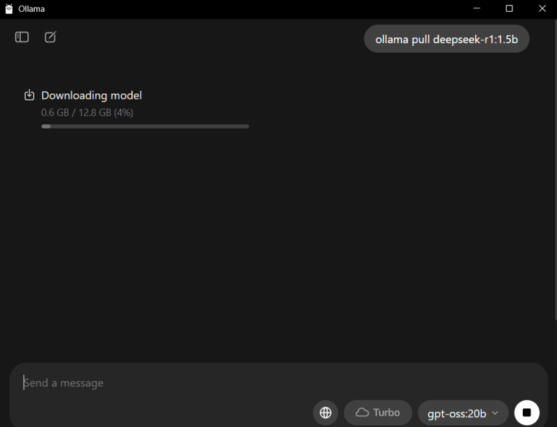
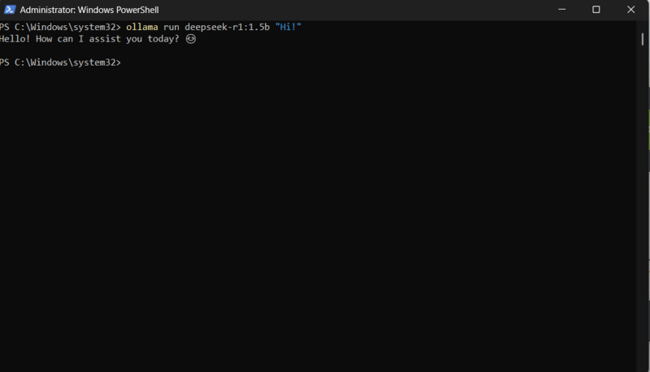
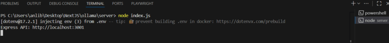
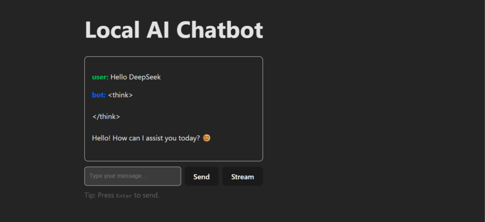

Run powerful models **locally**, keep your data **private**, and pay **$0** in API fees.  
In this tutorial you’ll set up **Ollama**, wire a minimal **Express.js** backend, and build a **React** UI.  
No prior AI experience needed.

---

## 1) Why Local?

- ✅ **Privacy**: data never leaves your machine  
- ✅ **Zero API costs**: no per-token billing  
- ✅ **Low latency**: responses come from `localhost`

**Architecture**

```
[Browser UI] → React (Vite) → Express API → Ollama → DeepSeek-R1 1.5B
     :5173         :3001         :11434
```

**Hardware**  
- Minimum: 8GB RAM + i5 CPU  
- Recommended: 16GB RAM + SSD

---

## 2) Install Ollama

### macOS / Linux (curl)
```bash
curl -fsSL https://ollama.ai/install.sh | sh
```

### Windows
Download and run the installer: [https://ollama.ai/download](https://ollama.ai/download)

### Pull a compact model
We’ll use **DeepSeek-R1 1.5B** (~3GB):
```bash
ollama pull deepseek-r1:1.5b
```



### Start the Ollama service
```bash
ollama serve
```
Keep this terminal open. Ollama runs at **http://localhost:11434**.

Once pulled, test with `ollama run deepseek-r1:1.5b "Hi!"`.



---

## 3) Create the Express.js Backend

> We’ll keep the backend on **port 3001** to avoid clashing with Vite.

```bash
mkdir server && cd server
npm init -y
npm install express cors axios morgan dotenv
```

Create **`server/.env`** (optional, for config):
```env
PORT=3001
OLLAMA_BASE_URL=http://localhost:11434
MODEL=deepseek-r1:1.5b
```

Create **`server/index.js`**:
```js
import express from "express";
import cors from "cors";
import morgan from "morgan";
import axios from "axios";
import dotenv from "dotenv";

dotenv.config();

const app = express();
const PORT = process.env.PORT || 3001;
const OLLAMA_BASE_URL = process.env.OLLAMA_BASE_URL || "http://localhost:11434";
const MODEL = process.env.MODEL || "deepseek-r1:1.5b";

app.use(cors());               // CORS: allow requests from Vite/React
app.use(express.json());       // parse JSON bodies
app.use(morgan("dev"));        // logs

// Health check
app.get("/health", (req, res) => {
  res.json({ ok: true, model: MODEL });
});

// Simple non-streaming chat
app.post("/chat", async (req, res) => {
  try {
    const userMessage = req.body?.content ?? "";
    if (!userMessage) {
      return res.status(400).json({ error: "Missing 'content' in body" });
    }

    // Ollama expects { model, messages, stream }
    const payload = {
      model: MODEL,
      messages: [{ role: "user", content: userMessage }],
      stream: false,
    };

    const { data } = await axios.post(`${OLLAMA_BASE_URL}/api/chat`, payload, {
      timeout: 60_000,
    });

    // data.message.content contains the model reply
    res.json({
      code: 1,
      data: data?.message?.content ?? "",
    });
  } catch (err) {
    console.error(err?.response?.data || err.message);
    res.status(500).json({ error: "AI service error" });
  }
});

// Optional: streaming endpoint (SSE)
app.get("/chat-stream", async (req, res) => {
  try {
    const prompt = req.query.q || "Hello!";
    // Tell the browser this is an event stream:
    res.setHeader("Content-Type", "text/event-stream");
    res.setHeader("Cache-Control", "no-cache, no-transform");
    res.setHeader("Connection", "keep-alive");
    res.flushHeaders?.();

    // Use Node fetch (Node 18+) to stream from Ollama
    const response = await fetch(`${OLLAMA_BASE_URL}/api/chat`, {
      method: "POST",
      headers: { "Content-Type": "application/json" },
      body: JSON.stringify({
        model: MODEL,
        messages: [{ role: "user", content: prompt }],
        stream: true,
      }),
    });

    if (!response.ok || !response.body) {
      res.write(`data: ${JSON.stringify({ error: "Upstream error" })}

`);
      return res.end();
    }

    const reader = response.body.getReader();
    let decoder = new TextDecoder();

    while (true) {
      const { done, value } = await reader.read();
      if (done) break;
      const chunk = decoder.decode(value, { stream: true });
      // Push raw chunks as SSE. You can parse JSON lines if you prefer.
      res.write(`data: ${JSON.stringify({ chunk })}

`);
    }

    res.end();
  } catch (err) {
    console.error(err);
    res.write(`data: ${JSON.stringify({ error: "Stream error" })}

`);
    res.end();
  }
});

app.listen(PORT, () => {
  console.log(`Express API: http://localhost:${PORT}`);
});
```

Add **type: module** to `server/package.json` (so `import` works):
```json
{
  "name": "server",
  "version": "1.0.0",
  "type": "module",
  "dependencies": {
    "axios": "^1.7.0",
    "cors": "^2.8.5",
    "dotenv": "^16.4.5",
    "express": "^4.19.2",
    "morgan": "^1.10.0"
  }
}
```

Run the backend:
```bash
node index.js
```



---

## 4) Create the React Frontend (Vite)

In a **new** terminal:
```bash
npm create vite@latest local-chatbot -- --template react
cd local-chatbot
npm install axios
```

Replace **`src/App.jsx`** with:
```jsx
import { useRef, useState } from "react";
import axios from "axios";

const API_BASE = "http://localhost:3001";

export default function App() {
  const inputRef = useRef(null);
  const [chat, setChat] = useState([]); // [{role, content}]
  const [loading, setLoading] = useState(false);

  const send = async () => {
    const text = inputRef.current.value.trim();
    if (!text) return;

    setChat(prev => [...prev, { role: "user", content: text }]);
    inputRef.current.value = "";
    setLoading(true);

    try {
      const { data } = await axios.post(`${API_BASE}/chat`, { content: text });
      setChat(prev => [...prev, { role: "bot", content: data?.data ?? "" }]);
    } catch (e) {
      setChat(prev => [...prev, { role: "bot", content: "Error: AI service" }]);
    } finally {
      setLoading(false);
    }
  };

  // Optional: Streaming demo with SSE
  const stream = () => {
    const text = inputRef.current.value.trim();
    if (!text) return;

    setChat(prev => [...prev, { role: "user", content: text }, { role: "bot", content: "" }]);
    inputRef.current.value = "";

    const ev = new EventSource(`${API_BASE}/chat-stream?q=${encodeURIComponent(text)}`);
    ev.onmessage = (e) => {
      try {
        const payload = JSON.parse(e.data);
        if (payload?.chunk) {
          setChat(prev => {
            const copy = [...prev];
            const lastIndex = copy.length - 1;
            copy[lastIndex] = {
              role: "bot",
              content: (copy[lastIndex].content || "") + payload.chunk
            };
            return copy;
          });
        }
        if (payload?.error) {
          setChat(prev => [...prev, { role: "bot", content: `Stream error: ${payload.error}` }]);
          ev.close();
        }
      } catch {
        // ignore parse issues
      }
    };
    ev.onerror = () => ev.close();
  };

  return (
    <main style={{ maxWidth: 680, margin: "40px auto", fontFamily: "system-ui, sans-serif" }}>
      <h1>Local AI Chatbot</h1>
      <div style={{ border: "1px solid #ddd", borderRadius: 8, padding: 16, minHeight: 200 }}>
        {chat.map((m, i) => (
          <p key={i}>
            <strong style={{ color: m.role === "user" ? "#0b5" : "#06f" }}>
              {m.role}:
            </strong>{" "}
            <span style={{ whiteSpace: "pre-wrap" }}>{m.content}</span>
          </p>
        ))}
        {loading && <p><em>Thinking…</em></p>}
      </div>

      <div style={{ display: "flex", gap: 8, marginTop: 12 }}>
        <input
          ref={inputRef}
          placeholder="Type your message…"
          style={{ flex: 1, padding: 10, borderRadius: 6, border: "1px solid #ccc" }}
          onKeyDown={(e) => e.key === "Enter" && send()}
        />
        <button onClick={send}>Send</button>
        <button onClick={stream} title="Stream (SSE)">Stream</button>
      </div>
      <p style={{ marginTop: 8, color: "#666" }}>Tip: Press <kbd>Enter</kbd> to send.</p>
    </main>
  );
}
```

Run the frontend:
```bash
npm run dev
```

Open **http://localhost:5173** and chat!



> **Alternative (avoid CORS):** In `local-chatbot/vite.config.js` set a dev proxy to `http://localhost:3001`.

---

## 5) Verification Checklist

1) **Ollama** is running: `ollama serve`  
2) **Model** is pulled: `ollama pull deepseek-r1:1.5b`  
3) **Backend** online: `GET http://localhost:3001/health` → `{ ok: true }`  
4) **Frontend** at `http://localhost:5173` — send “Hello” and get a reply.

---

## 6) Common Issues & Fixes

| Symptom                                 | Fix |
|-----------------------------------------|-----|
| `ERR_CONNECTION_REFUSED` to 11434       | Make sure `ollama serve` is running |
| CORS errors in browser                  | Ensure `app.use(cors())` in Express (or use Vite proxy) |
| Port conflicts                          | Change Express port (`PORT=3002`) or Vite port |
| Slow / OOM                              | Use a smaller or quantized model: `deepseek-r1:1.5b-q4_0` |
| Streaming shows raw JSON chunks         | Parse and accumulate in client; current example appends raw text |

---

## 7) Performance & Quality Tips

- **Streaming**: Set `stream: true` for typewriter effect (use `/chat-stream`).  
- **Multi-turn**: Send the **entire history** to Ollama when you want continuity:
  ```js
  const messages = [
    { role: "system", content: "You are a helpful assistant." },
    { role: "user", content: "Hi" },
    { role: "assistant", content: "Hello! How can I help?" },
    { role: "user", content: "Write a Haiku about local AI" }
  ];
  ```
- **Quantization**: Lower RAM usage with 4-bit models:
  ```bash
  ollama pull deepseek-r1:1.5b-q4_0
  ```
- **Logging**: Keep `morgan("dev")` to debug request flow.

---

## 8) Nice Extensions

- **Persist chats** (SQLite/Prisma)  
- **Auth** (JWT) for team use  
- **Keyboard shortcuts** (Ctrl/⌘ + Enter)  
- **Mobile layout** (Tailwind CSS)  
- **File input** (let users upload docs and summarize locally)  

---

## 9) What You Learned

- Install and run **Ollama** locally  
- Build an **Express** API that talks to Ollama  
- Create a **React** UI with optional **streaming**  
- Ship a **private, zero-cost** chatbot you control

Your next step: swap models (`llama3`, `qwen`, etc.) or connect your own documents for RAG — all fully local.

---
