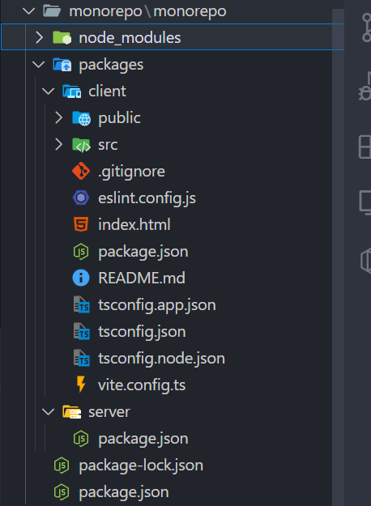

In this guide, we will explore how to set up a **monorepo** that combines **NestJS**(server) and
**ReactJS**(client), leveraging different package managers: **npm**, **yarn**, **pnpm**, and
**bun**. Monorepos offer a way to manage multiple projects in a single repository, enhancing
collaboration and simplifying dependency management. Let's dive into the steps!

## What You Will Learn

- Understanding monorepos and their benefits.
- Setting up a monorepo structure.
- Configuring NestJS and ReactJS within the monorepo.
- Managing dependencies with npm, Yarn, pnpm, and Bun workspaces.

## 1. Understanding Monorepos

Monorepos allow you to manage multiple projects within a single repository, promoting code sharing,
consistent tooling, and streamlined development processes. This structure is especially beneficial
for large applications or organizations with several related projects.

## 2. Setting Up the Monorepo Structure

### Step 1: Create a new folder

Create a new directory for your monorepo and initialize it.

<div className='code-cmd'>mkdir monorepo && cd monorepo</div>

### Step 2: Initialize the Monorepo

<div className='code-cmd'>npm init -y</div>

Next, add **server** and **client** folders, and initialize them.

<div className='code-cmd'>
  npm init -y -w packages/server -w packages/client
</div>

This will create 2 new folders with **package.json** file, and 2 folders: **server** and **client**
inside the **node_modules** directory.

#**pnpm**

<div className='code-cmd'>pnpm init -y</div>

<div className='code-cmd'>
  pnpm init -y -w packages/server -w packages/client
</div>

#**yarn**

<div className='code-cmd'>yarn init</div>

<div className='code-cmd'>
  pnpm init -y workspaces focus packages/server workspaces focus packages/client
</div>

#**Bun**

<div className='code-cmd'>bun init</div>

<div className='code-cmd'>cd packages/server && bun init -y</div>

<div className='code-cmd'>cd packages/client && bun init -y</div>

### Step 3: Installing Workspace Dependencies

Install the dependencies for all packages listed in the workspace configuration.

<div className='code-cmd'>npm install</div>

#**pnpm**

<div className='code-cmd'>pnpm install</div>

#**yarn**

<div className='code-cmd'>yarn install</div>

#**Bun**

<div className='code-cmd'>bun install</div>

### Step 4: Listing Dependencies Across Workspaces

Display the dependencies for all workspaces.

<div className='code-cmd'>npm ls</div>

#**pnpm**

<div className='code-cmd'>pnpm install</div>

<div className='code-cmd'>pnpm list</div>

A pnpm workspace must have a pnpm-workspace.yaml file in its root.

<div className='code-cmd'>touch pnpm-workspace.yaml</div>

Add this code:

```dash packages:

- 'packages/client/*'
- 'packages/server/*'

```

#**yarn**

<div className='code-cmd'>yarn install</div>

<div className='code-cmd'>yarn workspaces list</div>

#**Bun**

Add this code to **package.json**:

```js
 "workspaces": [
    "packages/client",
    "packages/server",
  ]
```

then

<div className='code-cmd'>bun pm ls</div>

## 3. Install the ReactJS as client

We will use [vite](https://vitejs.dev) for creating a new react app with typescript

<div className='code-cmd'>npm create vite@latest . -w packages/client</div>

```bash
√ Current directory is not empty. Please choose how to proceed: » Remove existing files and continue
√ Select a framework: » React
√ Select a variant: » TypeScript + SWC
```

The current structure of your project now looks like this:



**pnpm**

In **pnpm**, you will need to open a specific package

<div className='code-cmd'>cd packages/client</div>

<div className='code-cmd'>pnpm create vite@latest .</div>

**yarn**

<div className='code-cmd'>
  yarn workspace client create vite@latest . -w packages/client
</div>

**Bun**

<div className='code-cmd'>cd packages/client</div>

<div className='code-cmd'>bun create vite@latest .</div>

## 4. Install the NestJS as server

Initialize the NestJS instance

<div className='code-cmd'>
  npm i --save @nestjs/core @nestjs/common rxjs reflect-metadata
  @nestjs/platform-express -w server
</div>

**pnpm**

<div className='code-cmd'>cd packages/server</div>

<div className='code-cmd'>nest new</div>

Don't forget to rename the names of the packages.

**yarn**

<div className='code-cmd'>cd packages/server</div>

<div className='code-cmd'>nest new</div>

**Bun**

<div className='code-cmd'>cd packages/client</div>

<div className='code-cmd'>nest new</div>

## 5. Create separate NestJs project

We need to create a new project to copy the starter files from it.

<div className='code-cmd'>nest new nest-demo</div>

Now copy all files from the root directory as well as the `src` directory.


then run

<div className='code-cmd'>npm install</div>

## 6. Test the backend and frontend

Don't forget to rename the names of **package.json** to server, or client.

Let's test the packages...

**ReactJS test**

<div className='code-cmd'>npm -w client run dev</div>

**NestJS test**

<div className='code-cmd'>npm -w server run start:dev</div>

**pnpm**

<div className='code-cmd'>cd packages/client && pnpm run dev</div>

<div className='code-cmd'>cd packages/server && pnpm start:dev</div>

**yarn**

<div className='code-cmd'>cd packages/client && yarn dev</div>

<div className='code-cmd'>cd packages/server && yarn start:dev</div>

**Bun**

<div className='code-cmd'>cd packages/client && bun run dev</div>

<div className='code-cmd'>cd packages/server && bun run start:dev</div>

## 7. Install server on client side

We will connect to the server by installing the **server** to the client as a dependency

<div className='code-cmd'>npm -w client install server@*</div>

or add the dependency to the **package.json** file

```js
  "dependencies": {
    "react": "^18.3.1",
    "react-dom": "^18.3.1",
    "server": "*"
  },
```

then run again

<div className='code-cmd'>npm run install</div>

This way, you can utilize shared types and interfaces.

**pnpm**

<div className='code-cmd'>cd packages/client && pnpm install server@*</div>

**yarn**

<div className='code-cmd'>cd packages/client && yarn add server@*</div>

**Bun**

<div className='code-cmd'>cd packages/client && bun install server@*</div>

## Connect the frontend to the server

## Enable Cors in NestJS

Add this code to **main.ts** file on NestJS server

```js
async function bootstrap() {
  const app = await NestFactory.create(AppModule);
  app.enableCors();
  await app.listen(3000);
}
```

Now run the backend:

<div className='code-cmd'>npm -w server run start:dev</div>

## Connect client to server

First change the **App.tsx** file

```js
import { useEffect, useState } from 'react';

import './App.css';
import './App.css';

function App() {
  const [data, setData] = useState('');

  useEffect(() => {
    const getData = async () => {
      const response = await fetch('http://localhost:3000');
      const data = await response.text();
      setData(data);
    };
    getData();
  }, []);

  return <>{data}</>;
}

export default App;
```

We use the response.text() method because it returns a string instead of JSON.

Now run

<div className='code-cmd'>npm run dev -w client</div>


### Resources

[npm workspaces](https://docs.npmjs.com/cli/v7/using-npm/workspaces) |
[pnpm workspaces](https://pnpm.io/workspaces) |
[yarn workspaces](https://yarnpkg.com/features/workspaces) |
[bun workspaces](https://bun.sh/docs/install/workspaces)

## Conclusion

By setting up a monorepo with NestJS and ReactJs, you streamline your development process, making it
easier to share code and manage dependencies. This setup can significantly enhance productivity,
especially in larger projects. Explore further by integrating shared libraries or tools to maximize
the benefits of your monorepo structure!

Creating a monorepo using npm, Yarn, pnpm, or Bun workspaces provides an efficient way to manage
multiple projects within a single repository. By centralizing dependencies, simplifying code
sharing, and enhancing collaboration across teams, monorepos streamline development workflows. Each
package manager offers unique strengths, allowing you to choose the tool that best fits your project
needs. Whether you’re working with small or large-scale applications, adopting a monorepo structure
can improve productivity, consistency, and maintainability in your codebase.
