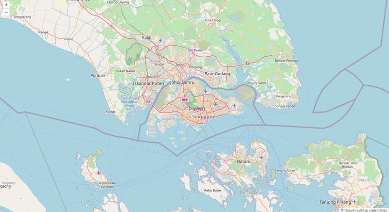
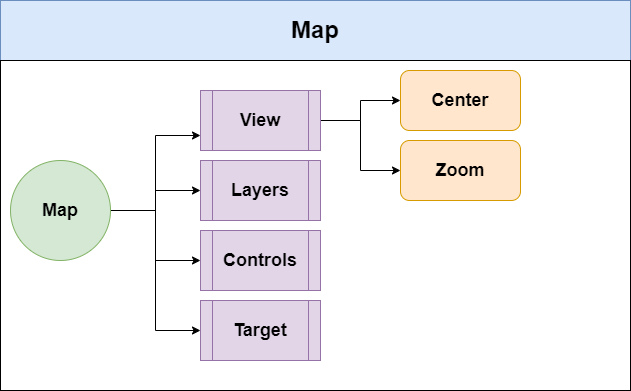
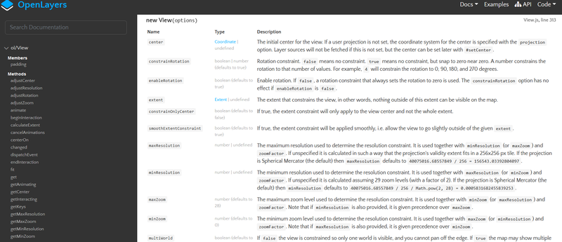
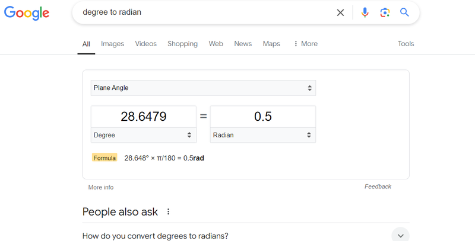
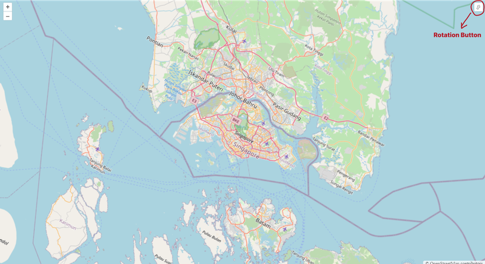
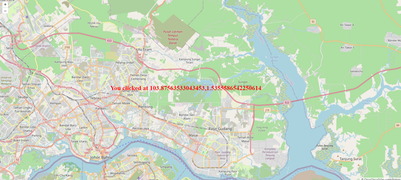
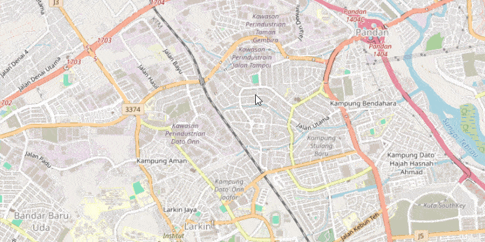
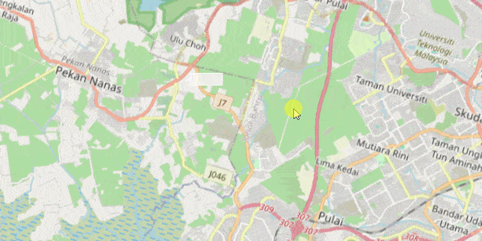
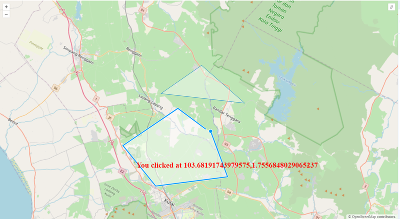
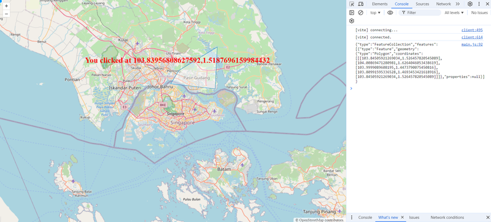

We recently wrote about the [Leaflet library](https://jsdev.space/mastering-react-leaflet/) and its use in React and TypeScript. For this tutorial, we’ll focus solely on JavaScript and HTML, avoiding the use of frameworks or TypeScript. We’ll use [Vite](https://vite.dev/) (without frameworks) for more convenient development.

In an increasingly data-driven world, the demand for robust and flexible mapping solutions has never been greater. From real-time traffic monitoring to environmental data visualization, geospatial tools have become essential in various industries. One such tool that has gained significant traction is OpenLayers, a powerful open-source JavaScript library for creating dynamic, interactive maps. This guide will walk you through the basics and advanced concepts of OpenLayers, giving you the knowledge and confidence to integrate it into your projects.

## What is OpenLayers?

OpenLayers is an open-source library designed for displaying and interacting with geographic data using JavaScript. It allows developers to integrate a wide variety of mapping services and spatial data formats into their web applications. Whether you're creating a simple map or developing a complex GIS system, OpenLayers offers the flexibility to work with raster, vector, and tile-based maps.

The library supports a multitude of popular mapping providers, such as OpenStreetMap (OSM), Bing Maps, Google Maps, and Mapbox. It also includes advanced features like layer styling, spatial data manipulation, and the ability to create custom interactions. The versatility and ease of use of OpenLayers make it one of the go-to choices for developers needing comprehensive mapping solutions.

### Why OpenLayers?

Here’s why developers love OpenLayers:

- **Performance**: It offers WebGL support right out of the box, making it fast and efficient.

- **Rich functionality**: A wide range of built-in features. A small list of them is provided below.

- **Architectural flexibility**: It’s relatively easy to extend, customize for specific needs, and perform unit testing.

- **Excellent browser and device support**: This includes mobile devices and Retina displays.

- **Abundant examples and documentation**: With over 200 [examples available](https://openlayers.org/en/latest/examples/).

- **Support for all OGC protocols**: Including WMF, WFS, WMTS, and WPS.

- **Open-source**: The source code is available and should be explored for a better understanding of what's happening under the hood in your application.

- **Tree Shaking support**: Only the code you import will be included in the bundle, reducing the bundle size.

This combination of performance, flexibility, and robust features makes OpenLayers a powerful tool for mapping solutions.

### How It Works

OpenLayers follows object-oriented design principles, enhanced with an event-driven approach. The library consists of classes that interact through events.

This structure makes it easier for developers to focus on their applications without worrying about internal complexities. Developers can split their code into smaller parts, subscribe to events, and receive the data they need. Testing is also simple with this framework.

### License

OpenLayers is licensed under FreeBSD or the 2-clause BSD license. You can read the full text of the license [here](https://github.com/openlayers/openlayers/blob/main/LICENSE.md). This license allows the software to be used in commercial development, as long as the copyright notice is preserved, with no requirement to disclose the commercial product's source code.

## Getting Started with OpenLayers

Before diving into advanced features, it's important to set up a basic environment to get OpenLayers running.

**Setting up a Project with Vite**

<div className='code-cmd'>npm create vite@latest</div>

```bash
√ Project name: ... openlayers-demo
? Select a framework: » - Use arrow-keys. Return to submit.
>   Vanilla
    Vue
√ Select a framework: » Vanilla
√ Select a variant: » JavaScript

Done. Now run:

  cd openlayers-demo
  npm install
  npm run dev
```

**Installation**

Install the ol package:

<div className='code-cmd'>cd openlayers-demo</div>
<div className='code-cmd'>npm install ol</div>

Once installed, you can start by displaying a basic map.

### Creating a Simple Map

We’ll set up a basic map, centered on Singapore, using [OpenStreetMap](https://www.openstreetmap.org/) tiles for rendering.

**HTML**

```html
<!DOCTYPE html>
<html lang="en">
  <head>
    <link rel="stylesheet" href="/node_modules/ol/ol.css" />
    <link rel="stylesheet" href="./style.css" />
  </head>
  <body>
    <div id="map"></div>
    <script type="module" src="./main.js"></script>
  </body>
</html>
```

**CSS**

```css
html,
body {
  margin: 0;
  padding: 0;
  height: 100%;
}
#map {
  position: absolute;
  top: 0;
  bottom: 0;
  width: 100%;
}
```

**JavaScript**

```js
import './style.css';
import { Map, View } from 'ol';
import TileLayer from 'ol/layer/Tile';
import OSM from 'ol/source/OSM';

import './style.css';
import { Map, View } from 'ol';
import TileLayer from 'ol/layer/Tile';
import OSM from 'ol/source/OSM';

// Create a map instance
const map = new Map({
  // HTML element where the map will be initialized
  target: document.getElementById('map'),

  // List of layers on the map
  layers: [
    // Create a tile layer. The source of the tiles will be OpenStreetMap
    new TileLayer({ source: new OSM() }),
  ],

  // Default map display parameters: center coordinates and zoom level
  view: new View({
    center: [11557167.27, 150529.06],
    zoom: 10,
  }),
});
```

All parameters that have been set can be adjusted at any time while the program is running.

```js
// We can modify the values of any parameters passed
map.setTarget(document.getElementById('#another-mapId'));
map.getView().setZoom(7);
map.getView().setCenter([11557167.27, 150529.06]);
// and so forth...
```

<div className='code-cmd'>npm run dev</div>



### Modifying the Projection

The map is initially created using the [EPSG:3857 (Web Mercator)](https://epsg.io/3857) projection. To switch to a different coordinate system, such as [EPSG:4326 (WGS 84)](https://epsg.io/4326), simply update the View call accordingly.

```js
new View({
   projection: 'EPSG:4326',
   // ...
}),
```

Thus, changing the projection also changes the coordinate system.

For instance, if we want to center the map on Moscow using EPSG:3857, we would use:

```js
new View({
   // Singapore in EPSG:3857 (meters)
   projection: 'EPSG:4326',
   center: [11557167.27, 150529.06],
}),
```

For EPSG:4326, it would be:

```js
new View({
   // Singapore in EPSG:3857 (meters)
   center: [103.81979999766882, 1.35210003952416],
}),
```

By default, OpenLayers supports only the two projections mentioned above.

To convert coordinates from EPSG:3857 (Web Mercator) to EPSG:4326 (WGS 84) in JavaScript, you can use the ol/proj module from the OpenLayers library. Here’s a simple example of how to perform this conversion:

```js
import './style.css';
import { Map, View } from 'ol';
import TileLayer from 'ol/layer/Tile';
import { toLonLat } from 'ol/proj';
import OSM from 'ol/source/OSM';

import './style.css';
import { Map, View } from 'ol';
import TileLayer from 'ol/layer/Tile';
import { toLonLat } from 'ol/proj';
import OSM from 'ol/source/OSM';

// Example EPSG:3857 coordinates (in meters)
const coordsEPSG3857 = [11557167.27, 150529.06];

// Convert EPSG:3857 to EPSG:4326
const coordsEPSG4326 = toLonLat(coordsEPSG3857);
// Create a map instance
const map = new Map({
  // HTML element where the map will be initialized
  target: document.getElementById('map'),

  // List of layers on the map
  layers: [
    // Create a tile layer. The source of the tiles will be OpenStreetMap
    new TileLayer({ source: new OSM() }),
  ],

  // Default map display parameters: center coordinates and zoom level
  view: new View({
    projection: 'EPSG:4326',
    center: coordsEPSG4326,
    zoom: 10,
  }),
});
```

- **fromLonLat()**: This function is used for converting coordinates from EPSG:4326 to EPSG:3857.
- **toLonLat()**: This function is used for converting coordinates from EPSG:3857 to EPSG:4326.

The coordinates will be in the format of `[longitude, latitude]` for EPSG:4326. Make sure to adjust your input accordingly if you're working with different formats.

## Components of OpenLayers



OpenLayers is a powerful JavaScript library for displaying maps and spatial data in web applications. It provides a rich set of components that work together to create interactive and feature-rich mapping experiences. Here’s a breakdown of the core components of OpenLayers:

**1. Map**

The main component that represents the entire map instance. It is responsible for managing layers, views, interactions, and rendering the map on the screen.

```js
import { Map } from 'ol';

import { Map } from 'ol';

const map = new Map({
  target: 'map', // The ID of the HTML element to render the map
  layers: [], // Array of layers to be displayed on the map
  view: null, // The view instance associated with the map
});
```

**2. View**

The View component defines how the map is displayed. It controls the center, zoom level, resolution, and rotation of the map.

```js
import { View } from 'ol';

import { View } from 'ol';

const view = new View({
  projection: 'EPSG:3857',
  center: [0, 0],
  zoom: 2,
});
```

**3. Layer**

Layers are essential for displaying various types of spatial data. OpenLayers supports multiple types of layers, including:

- **Tile Layer**: Displays map tiles (like OpenStreetMap).

```js
import TileLayer from 'ol/layer/Tile';
import OSM from 'ol/source/OSM';

import TileLayer from 'ol/layer/Tile';
import OSM from 'ol/source/OSM';

const osmLayer = new TileLayer({
  source: new OSM(),
});
```

- **Vector Layer**: Displays vector data such as points, lines, and polygons.

```js
import VectorLayer from 'ol/layer/Vector';
import VectorSource from 'ol/source/Vector';

import VectorLayer from 'ol/layer/Vector';
import VectorSource from 'ol/source/Vector';

const vectorLayer = new VectorLayer({
  source: new VectorSource({
    // Your vector data here
  }),
});
```

**4. Source**

The source defines where the data for a layer comes from. Different sources can be used for different layer types, such as raster or vector data sources.

```js
import OSM from 'ol/source/OSM';
import VectorSource from 'ol/source/Vector';

import OSM from 'ol/source/OSM';
import VectorSource from 'ol/source/Vector';

// For tile layers
const osmSource = new OSM();

// For vector layers
const vectorSource = new VectorSource({
  features: [], // Array of features to display
});
```

**5. Feature**

Features are the basic building blocks of vector data. A feature can represent a point, line, polygon, or any other geometrical shape.

```js
import Feature from 'ol/Feature';
import Point from 'ol/geom/Point';

import Feature from 'ol/Feature';
import Point from 'ol/geom/Point';

const pointFeature = new Feature({
  geometry: new Point([0, 0]),
});
```

**6. Geometry**

Geometries represent the shapes of features and include various types like `Point`, `LineString`, and `Polygon`.

```js
import LineString from 'ol/geom/LineString';
import Point from 'ol/geom/Point';
import Polygon from 'ol/geom/Polygon';

import LineString from 'ol/geom/LineString';
import Point from 'ol/geom/Point';
import Polygon from 'ol/geom/Polygon';

// Create geometries
const point = new Point([0, 0]);
const line = new LineString([
  [0, 0],
  [1, 1],
]);
const polygon = new Polygon([
  [
    [0, 0],
    [1, 1],
    [1, 0],
    [0, 0],
  ],
]);
```

**7. Interaction**

Interactions allow users to engage with the map, such as panning, zooming, selecting features, and drawing shapes. OpenLayers provides default interactions and the ability to create custom ones.

```js
import { defaults as defaultInteractions } from 'ol/interaction';

import { defaults as defaultInteractions } from 'ol/interaction';

// Add default interactions to the map
map.addInteraction(defaultInteractions());
```

**8. Control**

Controls are UI elements that provide additional functionalities to the user, like zoom buttons, scale indicators, and layers switchers. OpenLayers comes with several built-in controls.

```js
import { ScaleLine, Zoom } from 'ol/control';

import { ScaleLine, Zoom } from 'ol/control';

const scaleLine = new ScaleLine();
const zoomControl = new Zoom();

map.addControl(scaleLine);
map.addControl(zoomControl);
```

**9. Overlay**

Overlays are used for displaying additional information on the map, such as tooltips or popups. They are typically positioned relative to the map and can be styled accordingly.

```js
import Overlay from 'ol/Overlay';

import Overlay from 'ol/Overlay';

// Create an overlay
const overlay = new Overlay({
  element: document.getElementById('popup'), // Your HTML element for the popup
  positioning: 'bottom-center',
  stopEvent: true,
});

// Add overlay to the map
map.addOverlay(overlay);
```

OpenLayers offers a comprehensive set of components that enable developers to build powerful and interactive mapping applications. By understanding how these components interact, you can create customized mapping solutions tailored to your specific needs.

### Understanding Views

The `Map` class is directly associated with the `View` class, as a map cannot exist without a view. We briefly discussed the View class in the previous section. In this part, we will explore the View class in greater detail.

In OpenLayers, the View class is a critical component that manages the display of maps. It defines how the map is rendered, how users can interact with it, and how the spatial data is represented on the screen. Understanding how to work with views is essential for creating dynamic and interactive web mapping applications.

**Key Concepts of Views**

- Projection

- Center and Zoom Level

- Resolution

- Rotation

Let’s refer to the official OpenLayers [View documentation](https://openlayers.org/en/latest/apidoc/module-ol_View-View.html) for further insights.



When we scroll down, we see a list of options that can be set when creating a **View** class. We have already utilized the **center** option while creating the View object, as well as the **zoom**, and **projection** option.

```js
view: new View({
  projection: 'EPSG:4326',
  center: coordsEPSG4326,
  zoom: 10,
}),
```

Let's go through the other parameters of the **View** class.

- **maxZoom**: The maximum zoom level sets the resolution constraint and works in conjunction with `minZoom` (or `maxResolution`) and `zoomFactor`. Keep in mind that if `minResolution` is specified, it takes priority over `maxZoom`.

- **minZoom**: The minimum zoom level establishes the resolution constraint and is used alongside `maxZoom` (or `minResolution`) and `zoomFactor`. It's important to note that if `maxResolution` is specified, it takes precedence over `minZoom`

**Example**

```js
 view: new View({
  projection: 'EPSG:4326',
  center: coordsEPSG4326,
  zoom: 10,
  maxZoom: 15,
  minZoom: 5
}),
```

- **rotation**: The initial rotation of the view is specified in radians, where a positive value indicates clockwise rotation and a value of 0 represents North.

```js
rotation: 0.5;
```

**What does 0.5 represent in this example?**

Enter "degree to radian" in Google search.



As you might have already figured out, 0.5 is almost 30 degrees.

If we apply this value to our map, it will look like this:



If you click the Rotation button (highlighted in red in the image), the map will return to its normal orientation.

- **extend**: The extent defines the boundaries of the view, meaning that anything outside this area will not be visible on the map.

```js
// Corner{'bottom-left'} {'bottom-right'} {'top-left'} {'top-right'}
extent: [-572513.341856, 5211017.966314, 916327.095083, 6636950.728974],
```

### What Are Layers?

In the context of mapping, layers refer to the different visual elements that can be displayed on the map. Each layer can represent a different type of data, such as raster images, vector data, or even interactive elements. Layers are stacked on top of each other in a specific order, and their visibility can be controlled independently. This allows developers to create complex and informative map interfaces.

**Types of Layers in OpenLayers**

OpenLayers supports several types of layers, each serving different purposes. Here are some of the most commonly used layers:

- **Tile Layers**

Tile layers are used to display raster map tiles. These tiles are pre-rendered images that make up the map view. OpenStreetMap is a popular source for tile layers, but you can use any tile provider.

```js
import TileLayer from 'ol/layer/Tile';
import OSM from 'ol/source/OSM';

import TileLayer from 'ol/layer/Tile';
import OSM from 'ol/source/OSM';

const tileLayer = new TileLayer({
  source: new OSM(),
});
```

- **Vector Layers**

Vector layers are used to display vector data, such as points, lines, and polygons. They are highly customizable and can be styled according to your needs.

```js
import { Feature } from 'ol';
import VectorLayer from 'ol/layer/Vector';
import VectorSource from 'ol/source/Vector';

import { Feature } from 'ol';
import VectorLayer from 'ol/layer/Vector';
import VectorSource from 'ol/source/Vector';

const vectorLayer = new VectorLayer({
  source: new VectorSource({
    features: [new Feature(/* geometry */)],
  }),
});
```

- **Image Layers**

Image layers are used to display single images or rendered graphics over the map. This can be useful for overlaying specific images or icons.

```js
import ImageLayer from 'ol/layer/Image';
import ImageStatic from 'ol/source/ImageStatic';

import ImageLayer from 'ol/layer/Image';
import ImageStatic from 'ol/source/ImageStatic';

const imageLayer = new ImageLayer({
  source: new ImageStatic({
    url: 'path/to/image.png',
    imageExtent: [
      /* extent */
    ],
  }),
});
```

- **WebGL Layers**
  For high-performance rendering of large datasets, OpenLayers offers WebGL layers. These layers leverage the power of the GPU for rendering and can display complex geometries and styles.

```js
import WebGLPointsLayer from 'ol/layer/WebGLPoints';

import WebGLPointsLayer from 'ol/layer/WebGLPoints';

const webGLLayer = new WebGLPointsLayer({
  source: new VectorSource({
    features: [
      /* your features */
    ],
  }),
});
```

### Adding Layers to the Map

Once you have defined your layers, the next step is to add them to your map. This is done during the initialization of the `Map` object:

```js
import Map from 'ol/Map';
import View from 'ol/View';

import Map from 'ol/Map';
import View from 'ol/View';

const map = new Map({
  target: 'map', // The DOM element to render the map
  layers: [tileLayer, vectorLayer, imageLayer], // Add your layers here
  view: new View({
    center: [0, 0],
    zoom: 2,
  }),
});
```

**Layer Management**

OpenLayers allows for easy management of layers. You can add or remove layers dynamically based on user interaction or application logic.

**Adding Layers Dynamically**

```js
map.addLayer(newLayer); // Add a new layer
```

**Removing Layers**

```js
map.removeLayer(layerToRemove); // Remove a specific layer
```

**Layer Visibility**

You can control the visibility of individual layers. This feature is handy when you want to allow users to toggle certain layers on and off.

```js
layer.setVisible(false); // Hide the layer
layer.setVisible(true); // Show the layer
```

### Overlays

[Overlays](https://openlayers.org/en/latest/apidoc/module-ol_Overlay-Overlay.html) in OpenLayers refer to additional elements that can be placed on top of the map, typically used for displaying popups or adding custom HTML elements at specific geographic locations. Unlike layers, which handle map data and rendering (like tile or vector layers), overlays are tied to specific points on the map and provide a way to integrate external content into your map view.

**Key Concepts of Overlays in OpenLayers**

- **Purpose of Overlays**: Overlays are primarily used to display non-map-related content, such as popups, annotations, or any HTML elements, at geographic locations on the map. You can place dynamic content or even form elements at fixed points.

- **Creating an Overlay**: To create an overlay in OpenLayers, you need to define the HTML content and position it on the map using geographic coordinates. The overlay can be dynamically updated based on user interaction, such as when a marker is clicked.

Here's an example of how to add a basic overlay in OpenLayers:

```js
import { Map, View } from 'ol';
import TileLayer from 'ol/layer/Tile';
import Overlay from 'ol/Overlay';
import OSM from 'ol/source/OSM';

import { Map, View } from 'ol';
import TileLayer from 'ol/layer/Tile';
import Overlay from 'ol/Overlay';
import OSM from 'ol/source/OSM';

// Create an overlay
const overlayElement = document.getElementById('popup');
const overlay = new Overlay({
  element: overlayElement,
  positioning: 'bottom-center', // Controls the positioning of the overlay
  stopEvent: false,
});

// Create the map
const map = new Map({
  target: 'map',
  layers: [
    new TileLayer({
      source: new OSM(),
    }),
  ],
  view: new View({
    center: [0, 0],
    zoom: 2,
  }),
  overlays: [overlay],
});

// Set the overlay position (coordinates)
map.on('click', function (event) {
  const coordinates = event.coordinate;
  overlay.setPosition(coordinates);
  overlayElement.innerHTML = 'You clicked at ' + coordinates;
});
```

**styles**

```css
#popup {
  font-size: 24px;
  font-weight: bold;
  color: red;
}
```

**Result**



- **Custom HTML for Overlays**: You can place any custom HTML in the overlay. This makes overlays flexible for adding complex content such as forms, charts, or multimedia elements.

- **Positioning Overlays**: Overlays are positioned using geographic coordinates in the map’s projection. You can adjust the overlay's position dynamically as the map or user actions change.

- **Overlay Positioning Options**: The positioning of overlays can be controlled with options like:
- bottom-center, top-left, bottom-right, etc. These define where the overlay will appear relative to its position on the map.

- **Event Handling**: You can easily integrate overlays with event listeners. For instance, you might want to display an overlay when a user clicks on a map feature, or remove it when they click elsewhere.

- **Updating and Removing Overlays**: OpenLayers allows you to update the content and position of overlays or remove them entirely. You can create interactive and dynamic user experiences by responding to map interactions.

**Use Cases for Overlays:**

- **Popups**: Display information about a clicked feature.

- **Custom Annotations**: Highlight a point of interest with custom text or media.

- **Interactive UI**: Add custom UI elements like forms or buttons that are part of the map but not tied to map data.

By mastering overlays, you can enhance your OpenLayers maps with dynamic content, making your map applications more interactive and informative.

## PointerInteraction in OpenLayers

Pointer interactions in OpenLayers provide a way to handle user input through mouse, touch, or other pointing devices. This allows developers to create rich interactive maps by capturing and responding to events like clicks, drags, and moves. OpenLayers includes several pre-defined pointer interactions, but it also enables custom ones.

### What is a PointerInteraction?

A **PointerInteraction** is a base class in OpenLayers that handles events triggered by pointer devices (such as a mouse or touch) and allows developers to define custom behavior when these events occur. These interactions can be added to the map to handle user actions like dragging, clicking, or hovering over features.

The main class for pointer interactions is [`ol/interaction/Pointer`](https://openlayers.org/en/latest/apidoc/module-ol_interaction_Pointer-PointerInteraction.html), which allows the creation of custom pointer-based interactions by extending its functionality.

### Basic Pointer Interactions in OpenLayers

OpenLayers includes several built-in pointer interactions, including:

- **DragPan**: Enables panning the map by dragging the mouse or touch gestures.
- **DragZoom**: Zooms into a selected area when dragging a box.
- **Select**: Allows selecting features on the map.
- **Modify**: Enables the modification of vector features (lines, polygons, etc.).

**Let's start with DragBox Interaction**

The DragBox interaction in OpenLayers allows users to draw a rectangular box on the map by clicking and dragging the pointer. It is commonly used for selecting features, zooming into a specific area, or performing other operations within a defined region. The interaction is part of the OpenLayers ol/interaction module and can be highly customized to suit various use cases.

### Basic Usage of DragBox

The DragBox interaction can be easily added to an OpenLayers map. By default, it responds to a click-and-drag operation and emits events when the box is drawn. Here’s an example of how to use DragBox to zoom into a selected area of the map.

```js
import { altKeyOnly } from 'ol/events/condition';
import DragBox from 'ol/interaction/DragBox.js';

import { altKeyOnly } from 'ol/events/condition';
import DragBox from 'ol/interaction/DragBox.js';

const dragBoxInteraction = new DragBox({
  condition: altKeyOnly,
});
map.addInteraction(dragBoxInteraction);

dragBoxInteraction.on('boxend', () => {
  const extent = dragBoxInteraction.getGeometry().getExtent();
  map.getView().fit(extent, { duration: 500 });
});
```

**In this example:**

- DragBox is set to only activate when the platform's modifier key (Alt on Windows, Option on macOS) is held down.
- When the box is drawn and the mouse is released (boxend event), the map zooms into the extent of the box.



### DragRotate Interaction

The [DragRotate interaction](https://openlayers.org/en/latest/apidoc/module-ol_interaction_DragRotate-DragRotate.html) in OpenLayers allows users to rotate the map by clicking and dragging the mouse. This feature is useful for changing the orientation of the map for better visualization or analysis, particularly in scenarios like navigation, 3D terrain visualization, or other map-based applications that benefit from changing perspective.

### Basic Usage of DragRotate

By default, the DragRotate interaction in OpenLayers is activated when the user holds down the "Alt" key and drags the mouse. Here's an example of how to add the DragRotate interaction to your OpenLayers map:

```js
import './style.css';
import { Map, View } from 'ol';
import { altKeyOnly, shiftKeyOnly } from 'ol/events/condition';
import DragBox from 'ol/interaction/DragBox.js';
import DragRotate from 'ol/interaction/DragRotate';
import TileLayer from 'ol/layer/Tile';
import Overlay from 'ol/Overlay';
import { toLonLat } from 'ol/proj';
import OSM from 'ol/source/OSM';

import './style.css';
import { Map, View } from 'ol';
import { altKeyOnly, shiftKeyOnly } from 'ol/events/condition';
import DragBox from 'ol/interaction/DragBox.js';
import DragRotate from 'ol/interaction/DragRotate';
import TileLayer from 'ol/layer/Tile';
import Overlay from 'ol/Overlay';
import { toLonLat } from 'ol/proj';
import OSM from 'ol/source/OSM';

// Example EPSG:3857 coordinates (in meters)
const coordsEPSG3857 = [11557167.27, 150529.06];

// Convert EPSG:3857 to EPSG:4326
const coordsEPSG4326 = toLonLat(coordsEPSG3857);

const overlayElement = document.getElementById('popup');
const overlay = new Overlay({
  element: overlayElement,
  positioning: 'bottom-center', // Controls the positioning of the overlay
  stopEvent: false,
});

// Create a map instance
const map = new Map({
  // HTML element where the map will be initialized
  target: document.getElementById('map'),
  // List of layers on the map
  layers: [
    // Create a tile layer. The source of the tiles will be OpenStreetMap
    new TileLayer({ source: new OSM() }),
  ],

  // Default map display parameters: center coordinates and zoom level
  view: new View({
    projection: 'EPSG:4326',
    center: coordsEPSG4326,
    zoom: 10,
    maxZoom: 15,
    minZoom: 5,
    rotation: 0.5,
  }),
  overlays: [overlay],
});

map.on('click', function (event) {
  const coordinates = event.coordinate;
  overlay.setPosition(coordinates);
  overlayElement.innerHTML = 'You clicked at ' + coordinates;
});

const dragBoxInteraction = new DragBox({
  condition: altKeyOnly,
});
map.addInteraction(dragBoxInteraction);

dragBoxInteraction.on('boxend', () => {
  const extent = dragBoxInteraction.getGeometry().getExtent();
  map.getView().fit(extent, { duration: 500 });
});

const dragRotateInteraction = new DragRotate({
  condition: shiftKeyOnly, // Rotates when the Shift key is pressed
});

map.addInteraction(dragRotateInteraction);
```



**In this example:**

- The DragRotate interaction is added to the map.
- It is set to be triggered when the user holds down the Alt key while dragging the mouse.

Or to enable rotation without requiring any modifier key, allowing drag-and-rotate functionality by default:

```js
const dragRotateInteraction = new DragRotate({
  condition: always, // Rotates with any drag, no key required
});
```

### Combining DragRotate with Other Interactions

n real-world applications, map interactions often need to work together. The **DragRotate** interaction can be used in combination with others, like **Zoom** or **Pan**, for a fully interactive mapping experience.

Here’s an example of combining **DragRotate** with **DragPan** and **MouseWheelZoom** interactions:

```js
import DragPan from 'ol/interaction/DragPan';
import MouseWheelZoom from 'ol/interaction/MouseWheelZoom';

import DragPan from 'ol/interaction/DragPan';
import MouseWheelZoom from 'ol/interaction/MouseWheelZoom';

// Add DragPan and MouseWheelZoom to the map alongside DragRotate
map.addInteraction(new DragPan());
map.addInteraction(new MouseWheelZoom());
map.addInteraction(dragRotate);
```

### Handling Rotation Programmatically

You can also control the map's rotation programmatically using the View class. For example, if you want to set a specific rotation (in radians):

```js
map.getView().setRotation(Math.PI / 4); // Rotate the map by 45 degrees (π/4 radians)
```

Or if you want to reset the rotation back to North (no rotation):

```js
map.getView().setRotation(0);
```

### Draw Interaction

The [Draw Interaction](https://openlayers.org/en/latest/apidoc/module-ol_interaction_Draw-Draw.html) is a powerful tool that enables users to interactively draw geometries on a map. Whether it's points, lines, polygons, or more complex shapes, this feature allows for easy and flexible user input. This makes it ideal for applications like geographic data collection, mapping tools, and visualizing spatial data.

**How Draw Interaction Works**

The `Draw` interaction is added to a map to let users sketch directly on the map canvas. By defining the geometry type (such as `Point`, `LineString`, `Polygon`), users can draw shapes that are immediately rendered on the map.

**Basic Example**

```js
import { Draw } from 'ol/interaction';
import { Vector as VectorLayer } from 'ol/layer';
import { Vector as VectorSource } from 'ol/source';

import { Draw } from 'ol/interaction';
import { Vector as VectorLayer } from 'ol/layer';
import { Vector as VectorSource } from 'ol/source';

// Vector source to store drawn features
const source = new VectorSource();

// Add vector layer for rendering
const vectorLayer = new VectorLayer({
  source: source,
});
map.addLayer(vectorLayer);

// Add draw interaction for polygons
const draw = new Draw({
  source: source, // Features are stored in this source
  type: 'Polygon', // Geometry type to draw
});
map.addInteraction(draw);
```



**Geometry Types**

The Draw interaction supports several geometry types:

- `Point`
- `LineString`
- `Polygon`
- `Circle`
- `MultiPoint`, `MultiLineString`, `MultiPolygon`
- Custom geometry types can also be supported with additional configurations.

**Customizing the Interaction**

You can customize the interaction further by specifying snapping behavior, limiting the number of points for certain geometries, or modifying the styling of drawn features.

```js
const draw = new Draw({
  source: source,
  type: 'Polygon',
  maxPoints: 5, // Limits polygons to 5 vertices
});
```

**DrawEnd Event**

Let's show the coordinates of our figure

```js
draw.on('drawend', e => {
  const geoJSONFormat = new GeoJSON();
  const drawFeature = geoJSONFormat.writeFeatures([e.feature]);
  console.log(drawFeature);
});
```



**Summary**

- The code listens for the completion of a drawing action ('drawend').
- It converts the drawn feature into GeoJSON format using OpenLayers' GeoJSON utility.
- The GeoJSON string is then logged to the console for inspection or further use.

**Use Cases**

- **Geospatial data collection**: Allow users to sketch boundaries, routes, or points of interest.
- **Custom annotations**: Draw notes, mark locations, or highlight areas on the map.
- **Interactive mapping tools**: Enhance user interactivity by providing drawing capabilities for various mapping applications.

The Draw Interaction in OpenLayers provides a flexible and powerful way to enrich map-based applications with user-generated geometries.

## Navigating Map Controls

Controls are interactive elements that allow users to manipulate the map interface and its features. They enhance user experience by providing functionalities like zooming, panning, changing the map view, toggling layers, and more. Controls can be added, customized, and removed to tailor the map interface to specific needs.

A default set of controls is included in maps. Unless otherwise configured, this set contains instances of the following controls:

- Zoom
- Rotate
- Attribution

according to [openlayers docs](https://openlayers.org/en/latest/apidoc/module-ol_control_defaults.html)

### Built-in Controls in OpenLayers

OpenLayers offers several built-in controls that can be easily integrated into a map. Some common ones include:

**Zoom Control**

- Adds zoom in and zoom out buttons to the map.
- This is one of the most common controls, providing users with easy access to change the zoom level.

Example:

```js
import Zoom from 'ol/control/Zoom';

import Zoom from 'ol/control/Zoom';

const zoomControl = new Zoom();
map.addControl(zoomControl);
```

**FullScreen Control**

- Allows the map to be displayed in full-screen mode.

Example:

```js
import FullScreen from 'ol/control/FullScreen';

import FullScreen from 'ol/control/FullScreen';

const fullScreenControl = new FullScreen();
map.addControl(fullScreenControl);
```

**Scale Line Control**

- Displays a scale bar on the map to show the relationship between map distance and real-world distance.

Example:

```js
import ScaleLine from 'ol/control/ScaleLine';

import ScaleLine from 'ol/control/ScaleLine';

const scaleLineControl = new ScaleLine();
map.addControl(scaleLineControl);
```

**OverviewMap Control**

- Provides an overview map that shows the current extent of the main map within a smaller map.

Example:

```js
import OverviewMap from 'ol/control/OverviewMap';

import OverviewMap from 'ol/control/OverviewMap';

const overviewMapControl = new OverviewMap();
map.addControl(overviewMapControl);
```

**MousePosition Control**

- Displays the coordinates of the mouse pointer in the map view.

Example:

```js
import MousePosition from 'ol/control/MousePosition';
import { createStringXY } from 'ol/coordinate';

import MousePosition from 'ol/control/MousePosition';
import { createStringXY } from 'ol/coordinate';

const mousePositionControl = new MousePosition({
  coordinateFormat: createStringXY(4), // Displays up to 4 decimal places
  projection: 'EPSG:4326', // WGS 84 projection
});
map.addControl(mousePositionControl);
```

**Attribution Control**

- Displays map attribution data, usually crediting data sources like OpenStreetMap.

Example:

```js
import Attribution from 'ol/control/Attribution';

import Attribution from 'ol/control/Attribution';

const attributionControl = new Attribution();
map.addControl(attributionControl);
```

**Rotate Control**

- Adds a button to reset the rotation of the map to the default (north-facing).

Example:

```js
import Rotate from 'ol/control/Rotate';

import Rotate from 'ol/control/Rotate';

const rotateControl = new Rotate();
map.addControl(rotateControl);
```

### Customizing and Removing Controls

By default, OpenLayers adds a few controls (such as zoom and attribution) when a map is created. You can customize this behavior by adding or removing controls as needed.

**Removing All Default Controls**

You can remove all default controls by setting the `controls` option to `null` when creating the map:

```js
import { Map, View } from 'ol';

import { Map, View } from 'ol';

const map = new Map({
  target: 'map',
  view: new View({
    center: [0, 0],
    zoom: 2,
  }),
  controls: null, // Disable default controls
});
```

**Adding Custom Controls**

Custom controls can also be added by extending the `ol.control.Control` class. For example, you could create a custom button to fit your specific requirements.

```js
import Control from 'ol/control/Control';

import Control from 'ol/control/Control';

// Create a custom control
class MyCustomControl extends Control {
  constructor() {
    const button = document.createElement('button');
    button.innerHTML = 'Click Me';
    button.addEventListener('click', () => {
      alert('Custom control clicked!');
    });

    const element = document.createElement('div');
    element.className = 'my-custom-control ol-unselectable ol-control';
    element.appendChild(button);

    super({
      element: element,
    });
  }
}

const myControl = new MyCustomControl();
map.addControl(myControl);
```

## Tiled and Untiled Layers

Layers are essential components that define how geographic data is rendered on the map. These layers can be categorized into **Tiled** and **Untiled** layers, each serving different purposes and providing specific advantages.

### Tiled Layers

Tiled layers break down the map into multiple smaller tiles that are individually requested from the server. These tiles are pre-rendered or dynamically generated and then stitched together to form a complete map.

**Advantages of Tiled Layers:**

- **Performance**: Tiled layers load incrementally, which means users see part of the map quickly as the rest continues loading.
- **Efficient Caching**: Since tiles are pre-rendered or stored on the server, they can be cached efficiently, reducing server load.
- **Smooth Panning and Zooming**: Maps rendered using tiles tend to handle panning and zooming smoothly, providing a better user experience.
- **Popular Usage**: Tiled layers are used by services like OpenStreetMap, Google Maps, and other map providers.

Example:

```js
import TileLayer from 'ol/layer/Tile';
import OSM from 'ol/source/OSM';

import TileLayer from 'ol/layer/Tile';
import OSM from 'ol/source/OSM';

const tileLayer = new TileLayer({
  source: new OSM(), // OpenStreetMap as the tile source
});
```

### Untiled Layers

Untiled layers, also known as single image layers, load the entire map as a single image, rather than breaking it down into tiles. These layers are typically used for rendering data where tiles don't make sense, such as images or specific types of geospatial data.

**Advantages of Untiled Layers:**

- **Less Server Requests**: Since the map is loaded as a single image, only one request is made to the server.
- **Simple to Use**: Untiled layers are straightforward when rendering static data.
- **High-Resolution Data**: These layers are great for high-resolution images or specialized geospatial data that doesn't need to be tiled.

Example:

```js
import ImageLayer from 'ol/layer/Image';
import ImageWMS from 'ol/source/ImageWMS';

import ImageLayer from 'ol/layer/Image';
import ImageWMS from 'ol/source/ImageWMS';

const untiledLayer = new ImageLayer({
  source: new ImageWMS({
    url: 'https://example.com/wms', // WMS service as a source
    params: { LAYERS: 'exampleLayer' },
  }),
});
```

**Key Differences:**

- **Loading Method:** Tiled layers load in small chunks (tiles), while untiled layers load as a single image.
- **Performance**: Tiled layers are generally faster and more efficient for large datasets, while untiled layers are suitable for smaller, static datasets.
- **Server Load**: Tiled layers involve multiple requests, whereas untiled layers require just one.

Both tiled and untiled layers are important for different mapping needs, and OpenLayers provides flexibility in choosing the appropriate layer type for your application.

## Best Practices for OpenLayers Development

When developing with OpenLayers, there are several best practices to keep in mind:

- **Optimize Performance**: Use techniques like tile caching and vector simplification to ensure maps load efficiently.
- **Keep Map Layers Manageable**: Use layer groups to organize your layers, especially when dealing with large datasets.
- **Cross-browser Compatibility**: Ensure that your maps work across different browsers, as OpenLayers is designed to be cross-platform.

### Conclusion

OpenLayers is a versatile and feature-rich library that can handle everything from basic map display to advanced GIS applications. Whether you're building a real-time mapping dashboard, an environmental data visualization tool, or a simple interactive map, OpenLayers provides the tools you need to bring your geospatial projects to life.

By mastering OpenLayers, you can create custom, interactive maps that offer both beauty and functionality, ensuring that your mapping solutions stand out in a crowded landscape. So start experimenting, push the limits of what’s possible, and elevate your mapping projects with OpenLayers!
