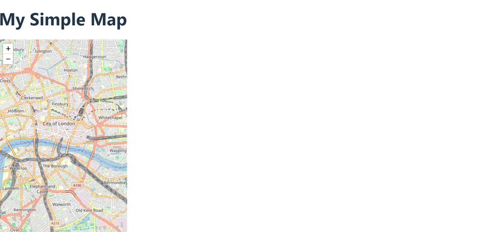
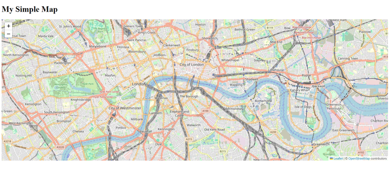
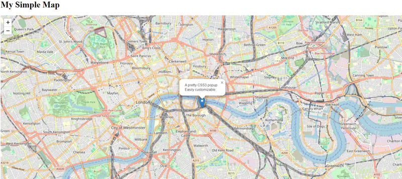
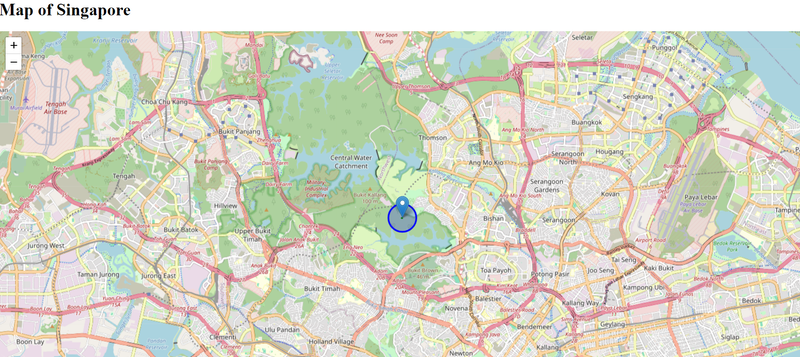
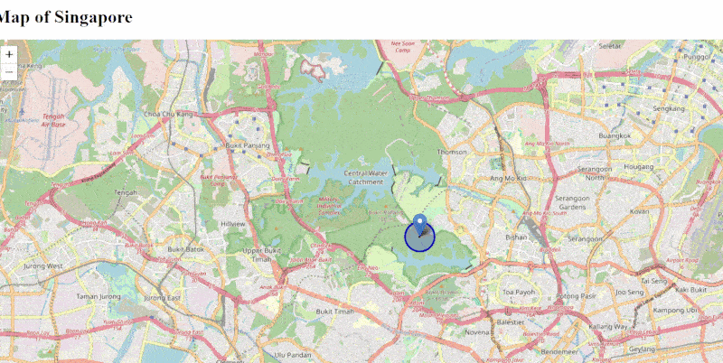
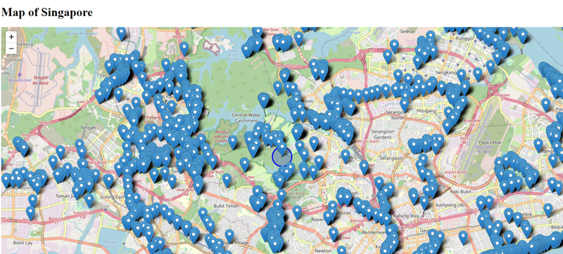
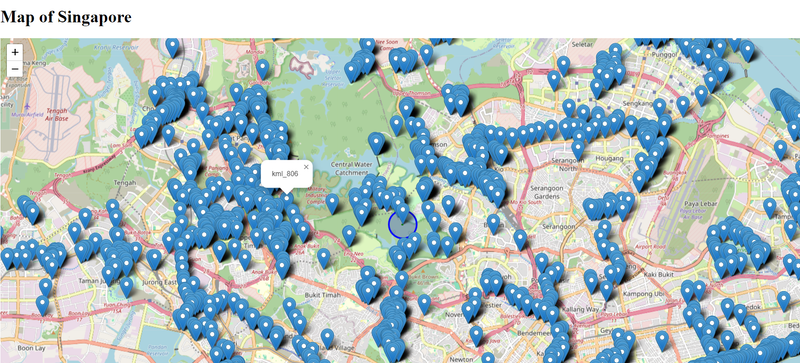
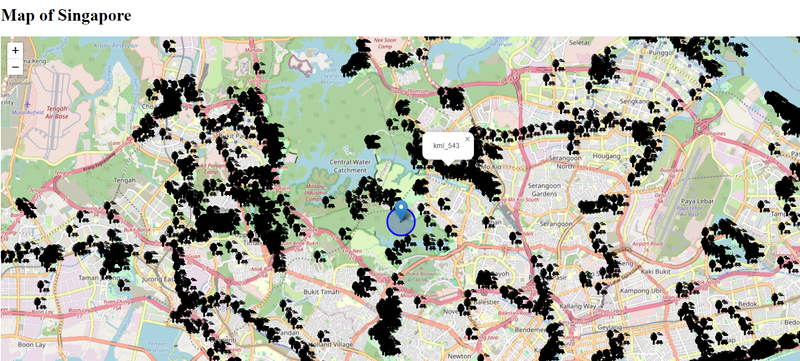
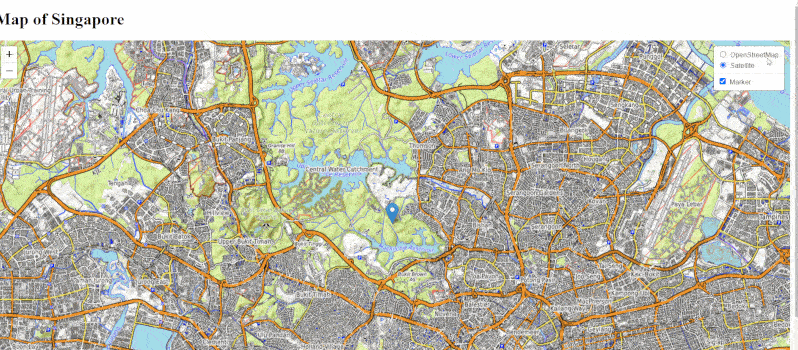

In today’s web development landscape, integrating maps into applications has become increasingly
popular. Whether you’re building a location-based service, a travel app, or a simple data
visualization project, having a reliable mapping library is essential. This article will guide you
through creating a simple map using **React**, **TypeScript**, and **LeafletJS**. By the end, you'll
have a functional map application and a solid understanding of how to leverage React Leaflet for
your projects.

## What is React Leaflet?

[React Leaflet](https://react-leaflet.js.org/) is a powerful library that provides React components
for Leaflet, a popular open-source JavaScript library for interactive maps. It allows developers to
easily integrate and customize maps in React applications while taking advantage of the flexibility
and capabilities of LeafletJS. With React Leaflet, you can create responsive, interactive maps that
can display various geographic data layers and user interactions.

## Setting Up Your Project

### 1. Create a New React Project

First, create a new React project using Vite with TypeScript template:

<div className='code-cmd'>
  npm create vite@latest react-leaflet --template react-ts
</div>
<div className='code-cmd'>cd react-leaflet</div>
<div className='code-cmd'>npm install</div>

### 2. Install Required Packages

Next, install the necessary packages, including React Leaflet and Leaflet:

<div className='code-cmd'>npm install react-leaflet leaflet</div>

Also, you will need to install the types for Leaflet:

<div className='code-cmd'>npm install -D @types/leaflet</div>

### 3. Include Leaflet CSS

To properly display the map, you need to include Leaflet’s CSS. Open the **src/App.tsx** file and
add the following line:

```js
import 'leaflet/dist/leaflet.css';
import 'leaflet/dist/leaflet.css';
```

## Creating Your First Map

### 1. Set Up the Map Component

Now, let’s create a simple map component. Create a new file called **MapComponent.tsx** in the src
directory:

```tsx
// src/MapComponent.tsx
import React from 'react';
import { MapContainer, TileLayer } from 'react-leaflet';

import 'leaflet/dist/leaflet.css';
import 'leaflet/dist/leaflet.css';

const MapComponent: React.FC = () => {
  return (
    <MapContainer
      center={[1.3521, 103.8198]}
      zoom={13}
      style={{ height: '100vh', width: '100%' }}
    >
      <TileLayer
        url='https://{s}.tile.openstreetmap.org/{z}/{x}/{y}.png'
        attribution='&copy; <a href="https://www.openstreetmap.org/copyright">OpenStreetMap</a> contributors'
      />
    </MapContainer>
  );
};

export default MapComponent;
```

### 2. Update Your App Component

Next, import the **MapComponent** into your main **App.tsx** file and render it:

```tsx
// src/App.tsx
import React from 'react';

import MapComponent from './MapComponent';

import MapComponent from './MapComponent';

const App: React.FC = () => {
  return (
    <div>
      <h1>My Simple Map</h1>
      <MapComponent />
    </div>
  );
};

export default App;
```

3. Run Your Application

Now, you can run your application to see the map:

<div className='code-cmd'>npm run dev</div>

Open your browser and navigate to http://localhost:5173/. You should see a simple map centered on
Singapore!



Let’s style the map. Open **index.css**, clear its contents, and add the following class for
**.leaflet-container**:

```css
.leaflet-container {
  width: 100vw;
  height: 80vh;
}
```



## Adding Markers and Popups

### 1. Install Marker Component

To add markers and popups, you will need the **Marker** and **Popup** components from React Leaflet.
Modify your **MapComponent** as follows:

```tsx
// src/MapComponent.tsx
import React from 'react';
import { MapContainer, Marker, Popup, TileLayer } from 'react-leaflet';

import L from 'leaflet';
import markerIcon2x from 'leaflet/dist/images/marker-icon-2x.png';
import markerIcon from 'leaflet/dist/images/marker-icon.png';
import markerShadow from 'leaflet/dist/images/marker-shadow.png';
import 'leaflet/dist/leaflet.css';

import L from 'leaflet';
import markerIcon2x from 'leaflet/dist/images/marker-icon-2x.png';
import markerIcon from 'leaflet/dist/images/marker-icon.png';
import markerShadow from 'leaflet/dist/images/marker-shadow.png';
import 'leaflet/dist/leaflet.css';

// Default marker icon
delete L.Icon.Default.prototype._getIconUrl;
L.Icon.Default.mergeOptions({
  iconRetinaUrl: markerIcon2x,
  iconUrl: markerIcon,
  shadowUrl: markerShadow,
});

const MapComponent: React.FC = () => {
  return (
    <MapContainer
      center={[1.3521, 103.8198]}
      zoom={13}
      style={{ height: '100vh', width: '100%' }}
    >
      <TileLayer
        url='https://{s}.tile.openstreetmap.org/{z}/{x}/{y}.png'
        attribution='&copy; <a href="https://www.openstreetmap.org/copyright">OpenStreetMap</a> contributors'
      />
      <Marker position={[1.3521, 103.8198]}>
        <Popup>
          A pretty CSS3 popup. <br /> Easily customizable.
        </Popup>
      </Marker>
    </MapContainer>
  );
};

export default MapComponent;
```

### 2. Test Your Markers

Run your application again. You should now see a marker on the map, and clicking it will open a
popup.



## Add Shapes to the Map

Here’s how to add different shapes like polygons, circles, and rectangles to your map. Modify your
**MapComponent.tsx**:

```tsx
// src/MapWithShapes.tsx
import React from 'react';
import {
  Circle,
  MapContainer,
  Polygon,
  Rectangle,
  TileLayer,
} from 'react-leaflet';

import 'leaflet/dist/leaflet.css';
import 'leaflet/dist/leaflet.css';

const MapWithShapes: React.FC = () => {
  // Define positions for Polygon, Circle, and Rectangle
  const polygonPositions = [
    [51.51, -0.12],
    [51.51, -0.1],
    [51.52, -0.1],
  ];

  const circleCenter = [51.505, -0.09];
  const rectangleBounds = [
    [51.49, -0.08],
    [51.5, -0.06],
  ];

  return (
    <MapContainer
      center={[51.505, -0.09]}
      zoom={13}
      style={{ height: '100vh', width: '100%' }}
    >
      <TileLayer
        url='https://{s}.tile.openstreetmap.org/{z}/{x}/{y}.png'
        attribution='&copy; <a href="https://www.openstreetmap.org/copyright">OpenStreetMap</a> contributors'
      />

      {/* Add Polygon */}
      <Polygon positions={polygonPositions} color='purple' />

      {/* Add Circle */}
      <Circle center={circleCenter} radius={500} color='blue' />

      {/* Add Rectangle */}
      <Rectangle bounds={rectangleBounds} color='green' />
    </MapContainer>
  );
};

export default MapWithShapes;
```

1. Explanation of the Code

Polygon:

- A polygon is drawn by specifying an array of latitude and longitude points in the **positions**
  prop.
- In the example above, a triangle-shaped polygon is created with three sets of coordinates.
- You can change the color property to any valid CSS color.

Circle:

- A circle is drawn by providing a **center** prop with a latitude and longitude and a **radius**
  (in meters).
- In this case, a blue circle with a 500-meter radius is drawn.

Rectangle:

- A rectangle is defined by two opposite corners using the **bounds** prop.
- The rectangle is rendered as a green box on the map.

2. Run Your Application

To see the shapes on your map, run the application:

<div className='code-cmd'>npm run dev</div>



3. Customizing Shapes

You can further customize the shapes by adjusting properties like:

- **Color**: Modify the color prop to change the border color of the shape.
- **Fill color**: Use the fillColor prop to set the inside color of the shape.
- **Stroke weight**: Adjust the border thickness with the weight prop.
- **Opacity**: Use fillOpacity and opacity to control transparency.

**Example:**

```tsx
<Circle
  center={circleCenter}
  radius={500}
  color='red'
  fillColor='pink'
  fillOpacity={0.5}
  weight={2}
/>
```

With React Leaflet, adding shapes such as polygons, circles, and rectangles to your maps is simple
and efficient.

## Common React Leaflet Events

Let’s explore how you can use React Leaflet events in your project, including how to listen for and
respond to events like map clicks, marker drags, and zoom changes.

Here are some of the most commonly used events in React Leaflet:

- **Map Events**: `onClick`, `onZoom`, `onMove`, `onLoad`
- **Marker Events**: `onClick`, `onDragEnd`, `onMouseOver`, `onPopupOpen`
- **Layer Events**: `onAdd`, `onRemove`, `onPopupOpen`

Each component (such as `MapContainer`, `Marker`, `Polygon`) can listen for different events
depending on its type. You can pass event handlers directly to these components as props.

Example: Handling Map Click and Marker Events

Let’s create an example where we listen to map clicks and move markers to the changes.

Create **MapWithEvents.tsx** component:

```tsx
import { useState } from 'react';
import { Marker, Popup, useMapEvents } from 'react-leaflet';

const MapWithEvents = () => {
  const [position, setPosition] = useState([1.3521, 103.8198]);
  const map = useMapEvents({
    click(e) {
      setPosition(e.latlng);
      map.flyTo(e.latlng, map.getZoom());
    },
  });

  return position === null ? null : (
    <Marker position={position}>
      <Popup>You are here</Popup>
    </Marker>
  );
};

export default MapWithEvents;
```

**Explanation:**

- **onClick Event**: Captures the latitude and longitude of the point where the user clicks on the
  map and updates the state with that information.

### Display the Map

Finally, you need to render the **MapWithShapes** component in your main **MapComponent.tsx** file:

```tsx
import React, { useState } from 'react';
import {
  Circle,
  MapContainer,
  Marker,
  Polygon,
  Popup,
  Rectangle,
  TileLayer,
} from 'react-leaflet';

import MapWithEvents from './MapWithEvents';
import L from 'leaflet';
import markerIcon2x from 'leaflet/dist/images/marker-icon-2x.png';
import markerIcon from 'leaflet/dist/images/marker-icon.png';
import markerShadow from 'leaflet/dist/images/marker-shadow.png';
import 'leaflet/dist/leaflet.css';

import MapWithEvents from './MapWithEvents';
import L from 'leaflet';
import markerIcon2x from 'leaflet/dist/images/marker-icon-2x.png';
import markerIcon from 'leaflet/dist/images/marker-icon.png';
import markerShadow from 'leaflet/dist/images/marker-shadow.png';
import 'leaflet/dist/leaflet.css';

// Default marker icon
delete L.Icon.Default.prototype._getIconUrl;
L.Icon.Default.mergeOptions({
  iconRetinaUrl: markerIcon2x,
  iconUrl: markerIcon,
  shadowUrl: markerShadow,
});

// Define positions for Polygon, Circle, and Rectangle
const polygonPositions = [
  [1.3521, 103.8198],
  [1.3521, 103.8197],
  [1.3521, 103.8196],
];

const circleCenter = [1.3521, 103.8198];
const rectangleBounds = [
  [1.3521, 103.8197],
  [1.3521, 103.8196],
];

const MapComponent: React.FC = () => {
  const [mapClickPosition, setMapClickPosition] = useState<string | null>(null);
  const [zoomLevel, setZoomLevel] = useState<number>(13);

  // Handler for map click
  const handleMapClick = event => {
    const { lat, lng } = event.latlng;
    console.log('handleMapClick');
    setMapClickPosition(`Latitude: ${lat}, Longitude: ${lng}`);
  };

  // Handler for zoom change
  const handleZoomEnd = event => {
    console.log('handleZoomEnd', event);
    setZoomLevel(event.target.getZoom());
  };

  return (
    <MapContainer
      center={[1.3521, 103.8198]}
      style={{ height: '100vh', width: '100%' }}
      zoom={zoomLevel}
      onClick={e => handleMapClick(e)} // Map click event
      onZoomEnd={handleZoomEnd} // Zoom end event
    >
      <TileLayer
        url='https://{s}.tile.openstreetmap.org/{z}/{x}/{y}.png'
        attribution='&copy; <a href="https://www.openstreetmap.org/copyright">OpenStreetMap</a> contributors'
      />
      <Marker position={[1.3521, 103.8198]}>
        <Popup>
          A pretty CSS3 popup. <br /> Easily customizable.
        </Popup>
      </Marker>

      {/* Add Polygon */}
      <Polygon positions={polygonPositions} color='purple' />

      {/* Add Circle */}
      <Circle center={circleCenter} radius={500} color='blue' />

      {/* Add Rectangle */}
      <Rectangle bounds={rectangleBounds} color='green' />
      <MapWithEvents />
    </MapContainer>
  );
};

export default MapComponent;
```



## List GeoJSON Location Data in the Map

Let’s display a list of all the parks in Singapore using GeoJSON location data. You can download or
copy the list from here -
[https://data.gov.sg/datasets/d_14d807e20158338fd578c2913953516e/view](https://data.gov.sg/datasets/d_14d807e20158338fd578c2913953516e/view).
If you choose to download it, rename the file to **Park-Facilities.json**.

Now, let’s create the **Parks.tsx** component and render it inside the **MapComponent.tsx**

```tsx
// Parks.tsx
import { useEffect } from 'react';
import { useMap } from 'react-leaflet';

import SingaporesParks from './Park-Facilities.json';

import SingaporesParks from './Park-Facilities.json';

const Parks = () => {
  const map = useMap();
  useEffect(() => {
    console.log('map', map);
    if (!map) {
      return;
    }
    const parksInSingaporeGeoJson = new L.GeoJSON(SingaporesParks);
    parksInSingaporeGeoJson.addTo(map);
  }, [map]);
  return <></>;
};
export default Parks;
```

Connect it to MapComponent

```tsx
import React, { useState } from 'react';
import {
  Circle,
  MapContainer,
  Marker,
  Polygon,
  Popup,
  Rectangle,
  TileLayer,
} from 'react-leaflet';

import MapWithEvents from './MapWithEvents';
import Parks from './Parks';
import L from 'leaflet';
import markerIcon2x from 'leaflet/dist/images/marker-icon-2x.png';
import markerIcon from 'leaflet/dist/images/marker-icon.png';
import markerShadow from 'leaflet/dist/images/marker-shadow.png';
import 'leaflet/dist/leaflet.css';

import MapWithEvents from './MapWithEvents';
import Parks from './Parks';
import L from 'leaflet';
import markerIcon2x from 'leaflet/dist/images/marker-icon-2x.png';
import markerIcon from 'leaflet/dist/images/marker-icon.png';
import markerShadow from 'leaflet/dist/images/marker-shadow.png';
import 'leaflet/dist/leaflet.css';

// Default marker icon
delete L.Icon.Default.prototype._getIconUrl;
L.Icon.Default.mergeOptions({
  iconRetinaUrl: markerIcon2x,
  iconUrl: markerIcon,
  shadowUrl: markerShadow,
});

// Define positions for Polygon, Circle, and Rectangle
const polygonPositions = [
  [1.3521, 103.8198],
  [1.3521, 103.8197],
  [1.3521, 103.8196],
];

const circleCenter = [1.3521, 103.8198];
const rectangleBounds = [
  [1.3521, 103.8197],
  [1.3521, 103.8196],
];

const MapComponent: React.FC = () => {
  const [mapClickPosition, setMapClickPosition] = useState<string | null>(null);
  const [zoomLevel, setZoomLevel] = useState<number>(13);

  // Handler for map click
  const handleMapClick = event => {
    const { lat, lng } = event.latlng;
    console.log('handleMapClick');
    setMapClickPosition(`Latitude: ${lat}, Longitude: ${lng}`);
  };

  // Handler for zoom change
  const handleZoomEnd = event => {
    setZoomLevel(event.target.getZoom());
  };

  return (
    <MapContainer
      center={[1.3521, 103.8198]}
      style={{ height: '100vh', width: '100%' }}
      zoom={zoomLevel}
      onClick={e => handleMapClick(e)} // Map click event
      onZoomEnd={handleZoomEnd} // Zoom end event
    >
      <TileLayer
        url='https://{s}.tile.openstreetmap.org/{z}/{x}/{y}.png'
        attribution='&copy; <a href="https://www.openstreetmap.org/copyright">OpenStreetMap</a> contributors'
      />
      <Marker position={[1.3521, 103.8198]}>
        <Popup>
          A pretty CSS3 popup. <br /> Easily customizable.
        </Popup>
      </Marker>

      {/* Add Polygon */}
      <Polygon positions={polygonPositions} color='purple' />

      {/* Add Circle */}
      <Circle center={circleCenter} radius={500} color='blue' />

      {/* Add Rectangle */}
      <Rectangle bounds={rectangleBounds} color='green' />
      <MapWithEvents />
      <Parks />
    </MapContainer>
  );
};

export default MapComponent;
```



Loading all of these markers took quite some time because Singapore has a large number of parks 🤩

### Render names on Markers

To render the names on the parks we need to modify the **GeoJSON** function:

```tsx
const parksInSingaporeGeoJson = new L.GeoJSON(SingaporesParks, {
  onEachFeature: (feature = {}, layer) => {
    const { properties = {} } = feature;
    const { Name } = properties;
    if (!Name) {
      return;
    }
    layer.bindPopup(`<p>${Name}</p>`);
  },
});
```

Now when we click on the marker, we can see the name of the park, or his id number



## Costumize the Markers With Custom Icons

You can create a custom icon by using **L.icon()**. This function allows you to set the URL for the
icon image, size, anchor points, and more.

Download the icon:


Modify the **Parks.tsx** component:

```tsx
import { useEffect } from 'react';
import { useMap } from 'react-leaflet';

import SingaporesParks from './Park-Facilities.json';
import ParkIcon from './park-icon.png';

import SingaporesParks from './Park-Facilities.json';
import ParkIcon from './park-icon.png';

const Parks = () => {
  const map = useMap();

  useEffect(() => {
    if (!map) {
      return;
    }

    const parkIcon = L.icon({
      iconUrl: ParkIcon, // URL to your custom icon
      iconSize: [24, 24], // Size of the icon [width, height]
      iconAnchor: [16, 32], // Point of the icon that will correspond to marker's location
      popupAnchor: [0, -32], // Point from which the popup should open relative to the iconAnchor
    });

    const parksInSingaporeGeoJson = new L.GeoJSON(SingaporesParks, {
      pointToLayer: (feature = {}, latlng) => {
        return L.marker(latlng, {
          icon: parkIcon,
        });
      },
      onEachFeature: (feature = {}, layer) => {
        const { properties = {} } = feature;
        const { Name } = properties;
        if (!Name) {
          return;
        }
        layer.bindPopup(`<p>${Name}</p>`);
      },
    });
    parksInSingaporeGeoJson.addTo(map);
  }, [map]);
  return <></>;
};
export default Parks;
```



**The Explanation:**

1. `L.icon()`: This method is used to define a custom Leaflet icon.

- **iconUrl**: The URL or path to the image file for the custom icon.
- **iconSize**: Defines the width and height of the icon.
- **iconAnchor**: Specifies which point of the icon image corresponds to the exact geographical
  location (usually the bottom center of the image).
- **popupAnchor**: Determines the position of the popup relative to the icon.

2. `pointToLayer`: A function that is called for each point feature in the GeoJSON file. It converts
   each park location (latlng) into a marker with the custom parkIcon.

## Toggle Between Different Lyers With LayersControl

To add a Layers Control to a React Leaflet map, you can use the **LayersControl** component provided
by React Leaflet. This allows you to toggle between different layers on the map.

### Setup the Layers Control

Now, let’s set up different tile layers (like a satellite view, street view, etc.) and markers as
layers that can be toggled using **LayersControl**.

Import Required Components

You will need **LayersControl**, **LayerGroup**, and optionally Marker or any other components for
different layers.

```js
import { LayerGroup, LayersControl } from 'react-leaflet';
```

```tsx
// MapComponent.tsx
import React, { useState } from 'react';
import {
  Circle,
  LayerGroup,
  LayersControl,
  MapContainer,
  Marker,
  Polygon,
  Popup,
  Rectangle,
  TileLayer,
} from 'react-leaflet';

import MapWithEvents from './MapWithEvents';
import Parks from './Parks';
import L from 'leaflet';
import markerIcon2x from 'leaflet/dist/images/marker-icon-2x.png';
import markerIcon from 'leaflet/dist/images/marker-icon.png';
import markerShadow from 'leaflet/dist/images/marker-shadow.png';
import 'leaflet/dist/leaflet.css';

import MapWithEvents from './MapWithEvents';
import Parks from './Parks';
import L from 'leaflet';
import markerIcon2x from 'leaflet/dist/images/marker-icon-2x.png';
import markerIcon from 'leaflet/dist/images/marker-icon.png';
import markerShadow from 'leaflet/dist/images/marker-shadow.png';
import 'leaflet/dist/leaflet.css';

// Default marker icon
delete L.Icon.Default.prototype._getIconUrl;
L.Icon.Default.mergeOptions({
  iconRetinaUrl: markerIcon2x,
  iconUrl: markerIcon,
  shadowUrl: markerShadow,
});

// Define positions for Polygon, Circle, and Rectangle
const polygonPositions = [
  [1.3521, 103.8198],
  [1.3521, 103.8197],
  [1.3521, 103.8196],
];

const circleCenter = [1.3521, 103.8198];
const rectangleBounds = [
  [1.3521, 103.8197],
  [1.3521, 103.8196],
];

const MapComponent: React.FC = () => {
  const [mapClickPosition, setMapClickPosition] = useState<string | null>(null);
  const [zoomLevel, setZoomLevel] = useState<number>(13);

  // Handler for map click
  const handleMapClick = event => {
    const { lat, lng } = event.latlng;
    console.log('handleMapClick');
    setMapClickPosition(`Latitude: ${lat}, Longitude: ${lng}`);
  };

  // Handler for zoom change
  const handleZoomEnd = event => {
    setZoomLevel(event.target.getZoom());
  };

  const { BaseLayer, Overlay } = LayersControl;

  return (
    <MapContainer
      center={[1.3521, 103.8198]}
      style={{ height: '100vh', width: '100%' }}
      zoom={zoomLevel}
      onClick={e => handleMapClick(e)} // Map click event
      onZoomEnd={handleZoomEnd} // Zoom end event
    >
      <LayersControl position='topright'>
        {/* Base Layers */}
        <BaseLayer checked name='OpenStreetMap'>
          <LayerGroup>
            <TileLayer
              url='https://{s}.tile.openstreetmap.org/{z}/{x}/{y}.png'
              attribution='&copy; <a href="https://www.openstreetmap.org/copyright">OpenStreetMap</a> contributors'
            />
            <Marker position={[1.3521, 103.8198]}>
              <Popup>
                A pretty CSS3 popup. <br /> Easily customizable.
              </Popup>
            </Marker>

            {/* Add Polygon */}
            <Polygon positions={polygonPositions} color='purple' />

            {/* Add Circle */}
            <Circle center={circleCenter} radius={500} color='blue' />

            {/* Add Rectangle */}
            <Rectangle bounds={rectangleBounds} color='green' />
            <MapWithEvents />
            {/* <Parks /> */}
          </LayerGroup>
        </BaseLayer>
        <BaseLayer name='Satellite'>
          <TileLayer
            url='https://{s}.tile.opentopomap.org/{z}/{x}/{y}.png'
            attribution='&copy; <a href="https://opentopomap.org/">OpenTopoMap</a> contributors'
          />
        </BaseLayer>
        <Overlay checked name='Marker'>
          <Marker position={[1.3521, 103.8198]} />
        </Overlay>
      </LayersControl>
    </MapContainer>
  );
};

export default MapComponent;
```

Explanation of LayersControl:

**LayersControl**: This component wraps all layers you want to control. You can switch between base
layers and toggle overlays on or off.

- **BaseLayer**: Represents layers that switch between each other. Only one base layer can be active
  at a time.
- **Overlay**: Represents layers that can be turned on or off independently from the base layers.

**Base Layers:**

- We define two base layers: one using OpenStreetMap tiles, and another using a satellite view. Only
  one of these can be visible at a time.
- The **checked** attribute on a BaseLayer makes it the default layer when the map loads.

**Overlays:**

- The Overlay layer is for additional features that can be toggled on and off independently of the
  base layers.
- In this case, we add a marker as an overlay.

**LayerGroup:**

- Groups multiple layers together.
- Inside the LayerGroup, we have a several markers, each at different coordinates. These markers
  will be treated as one group.
- The Overlay component here wraps the LayerGroup, allowing you to toggle the visibility of the
  grouped markers via the control or a button.



You can find the code from the article on the
[github](https://github.com/jsdevspace/mastering-react-leaflet).

## Conclusion

In this article, we covered how to create a simple map using **React**, **TypeScript**, and
**LeafletJS**. You learned how to set up your project, create a map component, add markers and
popups, and customize your map’s appearance. With these skills, you can further expand your
application by integrating additional features like user location tracking, clustering, or
displaying geographic data.

By mastering **React Leaflet**, you’re well on your way to building engaging and interactive
map-based applications that enhance user experiences. Happy coding!
