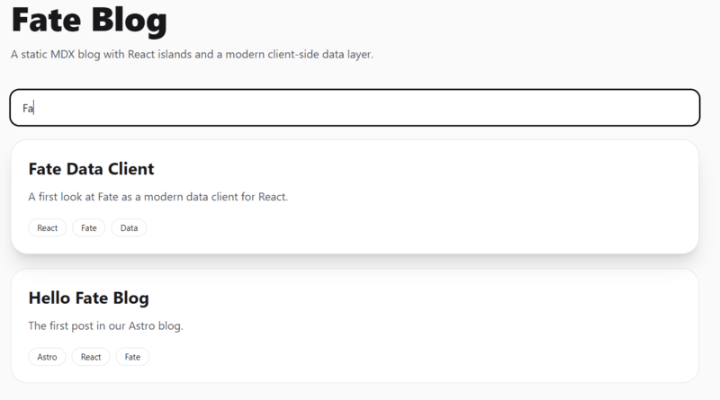
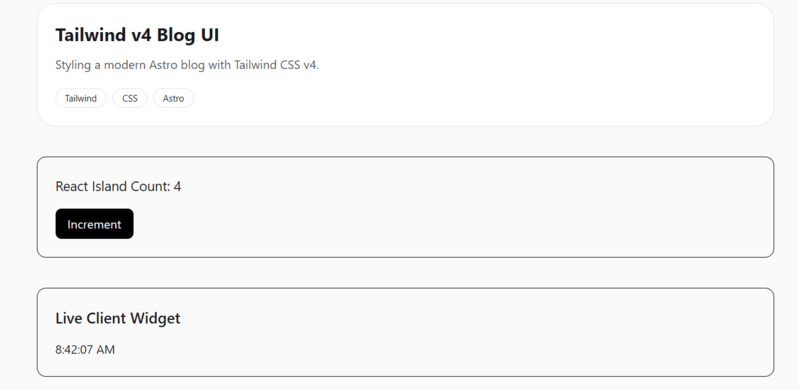
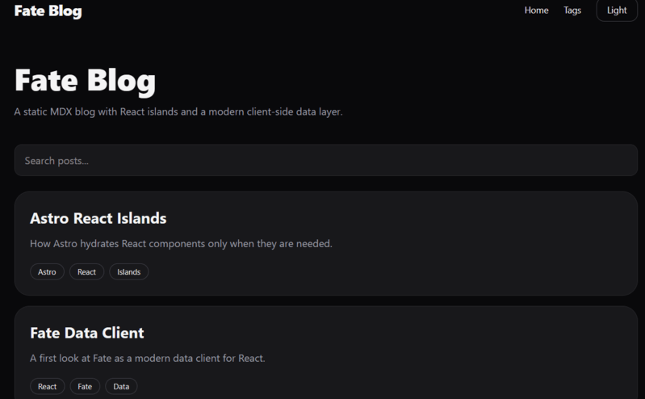

React solved UI a long time ago.
Data, however, is still where many applications quietly accumulate complexity.

Between `fetch()`, `useEffect()`, loading states, caching layers, duplicated requests, and client synchronization, modern React applications often end up inventing their own mini data framework.

[Fate](https://fate.technology/) takes a different approach.

It is a modern React data client built around composable data views, normalized caching, and structured client data access.

Although Fate can power much larger systems — dashboards, realtime applications, complex authenticated interfaces — this article explores it in a smaller and perhaps less expected environment:

**an Astro 6 static blog** with React islands.

[Astro](https://astro.build/) is designed around static generation. Blogs are primarily content-driven. Many projects can be built using Astro alone, without React, without a client data layer, and often without any client-side JavaScript at all.

That is true.

But modern Astro applications frequently mix static rendering with selective interactivity:

- React islands
- dynamic search widgets
- authenticated UI sections
- personalized dashboards
- API-driven components
- client-side stateful interfaces

Once React islands enter the picture, questions about data access eventually follow.

Instead of building an abstract enterprise dashboard, we will explore Fate through something smaller, concrete, and easier to reason about.

By the end of this article, we will build a modern Astro 6 blog featuring:

- MDX content collections
- dynamic blog routes
- React islands
- Tailwind v4 styling
- client-side search
- dark mode
- tag pages
- API routes
- a minimal working Fate integration

Along the way, we will also answer a more practical question:

**Do you actually need Fate for an Astro blog?**

Usually, no.

But understanding where it fits can tell us a lot about modern React data architecture.

## What Is Fate?

Before touching Astro, it is worth understanding what Fate actually is.

Fate is not a state manager.

It is not another `useState()` replacement.

It is not React Query with slightly different naming.

Instead, Fate positions itself as a modern React data client.

Its API revolves around concepts like views, requests, transports, and structured client data access.

One of the most recognizable pieces of the API is `view()`:

```ts 
import { view } from "react-fate";

type Post = {
  id: string;
  title: string;
  description: string;
};

const PostView = view<Post>()({
  id: true,
  title: true,
  description: true,
});
```

Instead of thinking primarily in terms of raw network requests, Fate encourages components to declare which pieces of data they actually care about.

If this feels somewhat familiar to GraphQL fragments, Relay, or normalized client architectures, that is not accidental.

The idea is not simply *"fetch some JSON"*.

The idea is structured client-side data composition.

That distinction becomes much more interesting once applications begin growing beyond a few isolated components.

## Why Use Fate in an Astro Project?

At this point, a reasonable question appears.

**Why Astro? And why Fate inside Astro?**

After all, Astro was built around a static-first philosophy.

A typical Astro blog can happily exist without React, without client-side state, and without a dedicated data layer.

In many cases, that is exactly what makes Astro attractive.

You write content.

Astro generates HTML.

The browser receives mostly static pages.

Everything stays fast.

A minimal blog can often be implemented using:

- Markdown or MDX content
- static routes
- server-side content collections
- zero client JavaScript

For a large percentage of publishing websites, this is already enough.

So introducing React — and especially a specialized React data client — might initially sound like unnecessary complexity.

That concern is fair.

However, modern Astro projects frequently extend beyond purely static pages.

Consider a few examples.

An otherwise static blog might eventually gain:

- client-side search
- bookmarks
- reading history
- personalized recommendations
- authenticated dashboards
- realtime counters
- notification panels
- interactive filtering systems

This is where **Astro islands architecture** becomes interesting.

Astro allows us to selectively introduce interactivity only where it is needed.

Instead of hydrating an entire application, we can hydrate isolated components.

A search widget can become interactive.

A theme toggle can manage client state.

A live dashboard card can fetch dynamic data.

Everything else remains static.

That balance is one of Astro's strongest design choices.

For example, a React search component can be hydrated independently:

```astro
<BlogSearch
  posts={searchPosts}
  client:load
/>
```

Only this island becomes interactive.

The rest of the page remains static HTML.

This approach gives us a useful playground for exploring Fate.

We do not need a massive enterprise application to understand a data client.

We simply need a project where static content and client-side interactivity coexist.

An Astro blog happens to be a surprisingly practical environment for exactly that.

## Creating the Project

We will begin with a minimal Astro 6 setup.

Create a new project:

```bash
npm create astro@latest fate-blog
```

Choose the following options during initialization:

```bash
Template: Empty
TypeScript: Yes
Install dependencies: Yes
Initialize Git: Yes
```

Move into the project directory:

```bash
cd fate-blog
```

Then add the pieces we will use throughout the article.

React integration:

```bash
npx astro add react
```

MDX support:

```bash
npx astro add mdx
```

Tailwind v4:

```bash
npx astro add tailwind
```

And finally, install Fate:

```bash
npm install react-fate
```

Our dependency list will look roughly like this:

```json
"dependencies": {
  "@astrojs/mdx": "^5.0.6",
  "@astrojs/react": "^5.0.5",
  "@tailwindcss/vite": "^4.3.0",
  "@types/react": "^19.2.15",
  "@types/react-dom": "^19.2.3",
  "astro": "^6.3.6",
  "react": "^19.2.6",
  "react-dom": "^19.2.6",
  "react-fate": "^1.0.3",
  "tailwindcss": "^4.3.0"
}
```

### Configuring Content Collections in Astro 6

Astro 6 uses the newer content loader approach.

Create:

```
src/content.config.ts
```

Add the following configuration:

```ts
import { defineCollection, z } from "astro:content";
import { glob } from "astro/loaders";

const posts = defineCollection({
  loader: glob({
    pattern: "**/*.{md,mdx}",
    base: "./src/content/posts",
  }),

  schema: z.object({
    title: z.string(),
    description: z.string(),
    date: z.coerce.date(),
    category: z.string(),
    tags: z.array(z.string()).default([]),
  }),
});

export const collections = {
  posts,
};
```

This configuration defines a typed content collection named `posts`.

Every post must now provide:

- title
- description
- publication date
- category
- tags

Type safety becomes surprisingly useful once content collections begin scaling.

Now create the content directory:

```
src/
  content/
    posts/
```

Our first post:

`src/content/posts/hello-fate-blog.mdx`

```mdx
---
title: "Hello Fate Blog"
description: "The first post in our Astro blog."
date: 2026-05-21
category: "Astro"
tags: ["Astro", "React", "Fate"]
---

Welcome to the project.

This is our first MDX post.
```

With this in place, Astro can now query blog content using `getCollection()`.

### Building Dynamic Blog Routes

Our content collection is ready.

Now we need a way to actually render posts.

The blog will consist of two main pieces:

- a homepage that lists articles
- dynamic post pages generated from MDX files

We will start with a shared layout.

Create:

`src/layouts/BaseLayout.astro`

Nothing complicated yet.

Just a reusable layout with a clean container and some Tailwind styling.

Because we are using Tailwind v4, create a global stylesheet:

`src/styles/global.css`

```css
@import "tailwindcss";

@custom-variant dark (&:where(.dark, .dark *));
```

With the layout in place, we can build the homepage.

### Creating the Homepage

Create:

`src/pages/index.astro`

```astro
---
import { getCollection } from "astro:content";
import BaseLayout from "../layouts/BaseLayout.astro";

const posts = await getCollection("posts");
---

<BaseLayout
  title="Fate Blog"
  description="Astro + React + Fate blog"
>

  <h1 class="mb-8 text-5xl font-black">
    Fate Blog
  </h1>

  <div class="space-y-6">

    {posts.map((post) => (

      <article
        class="
          rounded-3xl
          border
          border-zinc-200
          bg-white
          p-6
          dark:border-zinc-800
          dark:bg-zinc-900
        "
      >

        <a
          href={`/blog/${post.id}/`}
          class="text-2xl font-bold"
        >
          {post.data.title}
        </a>

        <p class="mt-3 text-zinc-600">
          {post.data.description}
        </p>

      </article>

    ))}

  </div>

</BaseLayout>
```

This page queries the posts collection and renders a simple article list.

Because Astro executes this code during build time, the content is generated statically.

No client-side fetching is required.

No React yet.

No data layer yet.

Just static content generation.

### Creating Dynamic Blog Pages

Now we need actual post pages.

Create:

`src/pages/blog/[slug].astro`

```astro
---
import {
  getCollection,
  render,
} from "astro:content";

import BaseLayout
from "../../layouts/BaseLayout.astro";

export async function getStaticPaths() {

  const posts =
    await getCollection("posts");

  return posts.map((post) => ({
    params: {
      slug: post.id,
    },

    props: {
      post,
    },
  }));
}

const { post } = Astro.props;

const { Content } =
  await render(post);
---

<BaseLayout
  title={post.data.title}
  description={post.data.description}
>

  <a
    href="/"
    class="mb-10 inline-block text-sm"
  >
    ← Back to home
  </a>

  <article
    class="
      prose
      max-w-none
      dark:prose-invert
    "
  >

    <h1>
      {post.data.title}
    </h1>

    <Content />

  </article>

</BaseLayout>
```

There are several important things happening here.

First, `getStaticPaths()` generates every blog route during build time.

If your content folder contains:

```
hello-fate-blog.mdx
astro-react-islands.mdx
fate-data-client.mdx
```

Astro will automatically generate:

```
/blog/hello-fate-blog/
/blog/astro-react-islands/
/blog/fate-data-client/
```

Second, we use:

```ts 
render(post)
```

to transform the MDX file into a renderable Astro component.

That is what powers:

```astro
<Content />
```

At this point, we already have a fully functioning static blog:

- typed content collections
- MDX posts
- static homepage
- dynamic routes
- generated article pages

And we still have not introduced React.

That detail is important.

Because it demonstrates one of Astro's biggest strengths:

**you can build a surprisingly capable blog without shipping client JavaScript at all.**

So where does React — and eventually Fate — actually enter the picture?

That is where **React islands** become useful.

### Adding React Islands to the Blog

Static content is excellent.

But some features naturally benefit from client-side interactivity.

For example:

- search
- theme switching
- personalized UI
- live widgets
- dynamic filtering

Rather than hydrating the entire application, Astro allows us to selectively hydrate isolated components.

This is the islands model.

Our first React island will be a searchable blog index.

## Building a Client-Side Search Component with React Islands

The homepage currently renders posts directly in Astro.

That works, but it is static.

Now we will move the post list into a React island so users can search through posts in the browser.

Create:

`src/components/BlogSearch.tsx`

```tsx
import { useMemo, useState } from "react";

type Post = {
  id: string;
  title: string;
  description: string;
  tags?: string[];
};

type BlogSearchProps = {
  posts: Post[];
};

export default function BlogSearch({ posts }: BlogSearchProps) {
  const [query, setQuery] = useState("");

  const filteredPosts = useMemo(() => {
    const value = query.toLowerCase().trim();

    if (!value) {
      return posts;
    }

    return posts.filter((post) => {
      const title = post.title.toLowerCase();
      const description = post.description.toLowerCase();
      const tags = post.tags?.join(" ").toLowerCase() ?? "";

      return (
        title.includes(value) ||
        description.includes(value) ||
        tags.includes(value)
      );
    });
  }, [posts, query]);

  return (
    <section className="mt-10">
      <input
        value={query}
        onChange={(event) => setQuery(event.target.value)}
        placeholder="Search posts..."
        className="
          w-full
          rounded-xl
          border
          border-zinc-200
          bg-white
          px-4
          py-3
          text-base
          outline-none
          transition
          focus:ring-2
          focus:ring-black
          dark:border-zinc-800
          dark:bg-zinc-900
          dark:focus:ring-white
        "
      />

      <div className="mt-6 space-y-4">
        {filteredPosts.map((post) => (
          <article
            key={post.id}
            className="
              rounded-3xl
              border
              border-zinc-200
              bg-white
              p-6
              transition
              hover:-translate-y-1
              hover:shadow-xl
              dark:border-zinc-800
              dark:bg-zinc-900
            "
          >
            <a
              href={`/blog/${post.id}/`}
              className="text-2xl font-bold"
            >
              {post.title}
            </a>

            <p className="mt-3 text-zinc-600 dark:text-zinc-400">
              {post.description}
            </p>

            {post.tags?.length ? (
              <div className="mt-5 flex flex-wrap gap-2">
                {post.tags.map((tag) => (
                  <a
                    key={tag}
                    href={`/tags/${tag}/`}
                    className="
                      rounded-full
                      border
                      border-zinc-200
                      px-3
                      py-1
                      text-xs
                      transition
                      hover:bg-black
                      hover:text-white
                      dark:border-zinc-700
                      dark:hover:bg-white
                      dark:hover:text-black
                    "
                  >
                    {tag}
                  </a>
                ))}
              </div>
            ) : null}
          </article>
        ))}
      </div>
    </section>
  );
}
```

Now update the homepage.

`src/pages/index.astro`

```astro
---
import { getCollection } from "astro:content";
import BaseLayout from "../layouts/BaseLayout.astro";
import BlogSearch from "../components/BlogSearch";

const posts = await getCollection("posts");

const searchPosts = posts.map((post) => ({
  id: post.id,
  title: post.data.title,
  description: post.data.description,
  tags: post.data.tags,
}));
---

<BaseLayout
  title="Fate Blog"
  description="Astro + React + Fate blog"
>
  <h1 class="mb-4 text-5xl font-black">
    Fate Blog
  </h1>

  <p class="max-w-2xl text-zinc-600 dark:text-zinc-400">
    A static MDX blog with React islands and a modern client-side data layer.
  </p>

  <BlogSearch posts={searchPosts} client:load />
</BaseLayout>
```

The important part is this:

```astro
<BlogSearch posts={searchPosts} client:load />
```

Astro renders the page statically, but hydrates this specific React component in the browser.

The result is a hybrid page:

```
Static Astro shell
+
Interactive React search island
```

This is exactly the kind of boundary where a tool like Fate becomes interesting.

### Adding More Content to Test the Search System

Our search component technically works already.

However, searching through a single blog post is not particularly interesting.

Before moving deeper into interactivity, let’s populate the project with a few additional articles so we can properly test filtering behavior.

Create several MDX posts inside:

`src/content/posts/`

#### Astro React Islands

`astro-react-islands.mdx`

```mdx
---
title: "Astro React Islands"
description: "How Astro hydrates React components only when they are needed."
date: 2026-05-21
category: "Astro"
tags: ["Astro", "React", "Islands"]
---

Astro lets you build mostly static pages while adding React only where interactivity is needed.

This pattern is commonly known as islands architecture.
```

#### MDX Content Blog

`mdx-content-blog.mdx`

```mdx
---
title: "MDX Content Blog"
description: "Using MDX files as typed blog content in Astro."
date: 2026-05-20
category: "Astro"
tags: ["Astro", "MDX", "Content"]
---

MDX combines Markdown and components into a single authoring experience.

Astro content collections make MDX content typed, queryable, and easy to scale.
```

#### Fate Data Client

`fate-data-client.mdx`

```mdx
---
title: "Fate Data Client"
description: "A first look at Fate as a modern data client for React."
date: 2026-05-19
category: "React"
tags: ["React", "Fate", "Data"]
---

Fate is a modern React data client focused on structured client-side data access.

In this project, we explore it inside an Astro environment.
```

#### Tailwind v4 Blog UI

`tailwind-v4-blog-ui.mdx`

```mdx 
---
title: "Tailwind v4 Blog UI"
description: "Styling a modern Astro blog with Tailwind CSS v4."
date: 2026-05-18
category: "CSS"
tags: ["Tailwind", "CSS", "Astro"]
---

Tailwind v4 provides a lightweight styling workflow for modern frontend projects.

We use it here for layout, typography, cards, and dark mode styling.
```

After restarting the development server:

```bash
npm run dev
```

you should be able to test the search component with queries such as:

```
Astro
React
Fate
MDX
Tailwind
CSS
Islands
Data
```



The filtering logic should immediately update the rendered post list.

At this point, our Astro homepage has evolved from a static content index into a small interactive client experience.

And that naturally raises another question:

why stop at search?

## Adding Small React Islands Before Introducing Fate

Before discussing Fate itself, it is useful to build a few intentionally small interactive widgets.

Not because Astro requires them.

Quite the opposite.

These examples help demonstrate where Astro remains static, where React becomes useful, and where a dedicated data client might eventually start making sense.

We will add two tiny islands:

- a counter widget
- a live clock widget

Neither of them needs Fate.

That detail matters.

Because Fate is not a replacement for ordinary component state.

### Counter Island

Create:

`src/components/Counter.tsx`

```tsx
import { useState } from "react";

export default function Counter() {
  const [count, setCount] = useState(0);

  return (
    <div className="mt-10 rounded-xl border p-6">
      <p className="mb-4 text-lg">
        React Island Count: {count}
      </p>

      <button
        onClick={() => setCount((value) => value + 1)}
        className="
          rounded-lg
          bg-black
          px-4
          py-2
          text-white
        "
      >
        Increment
      </button>
    </div>
  );
}
```

Then add it to the homepage:

```astro
<Counter client:load />
```

The important part is the hydration directive:

```astro
client:load
```

Astro renders the page statically.

React hydrates this island on the client.

Only this component becomes interactive.

### Time Widget Island

Next, create a live clock.

`src/components/TimeWidget.tsx`

```tsx
import { useEffect, useState } from "react";

export default function TimeWidget() {
  const [time, setTime] = useState("");

  useEffect(() => {
    function update() {
      setTime(
        new Date().toLocaleTimeString()
      );
    }

    update();

    const timer =
      setInterval(update, 1000);

    return () => clearInterval(timer);
  }, []);

  return (
    <div className="mt-10 rounded-xl border p-6">
      <h2 className="mb-4 text-xl font-semibold">
        Live Client Widget
      </h2>

      <p>{time}</p>
    </div>
  );
}
```

Add it to the homepage:

```astro
<TimeWidget client:visible />
```

This example introduces a different hydration strategy:

```astro
client:visible
```

Unlike `client:load`, Astro waits until the component becomes visible before hydrating it.

This is one of Astro's strongest optimization features.

Different islands can use different hydration strategies depending on runtime requirements.

By this point, the project contains:

- static MDX content
- React search
- browser theme state
- local component state
- timer-based UI updates

And yet, we still have not used Fate for anything.

That is intentional.



## Adding Dark Mode

The search island gives us our first interactive React component.

Now let’s add another small client-side feature: dark mode.

This is a good example of something that does not belong in MDX or static Astro content. The selected theme lives in the browser, needs localStorage, and changes the `<html>` element at runtime.

Create:

`src/components/ThemeToggle.tsx`

```tsx
import { useEffect, useState } from "react";

type Theme = "light" | "dark";

export default function ThemeToggle() {
  const [theme, setTheme] = useState<Theme>("light");

  useEffect(() => {
    const savedTheme = localStorage.getItem("theme") as Theme | null;
    const initialTheme = savedTheme ?? "light";

    setTheme(initialTheme);

    document.documentElement.classList.toggle(
      "dark",
      initialTheme === "dark"
    );
  }, []);

  function toggleTheme() {
    const nextTheme = theme === "light" ? "dark" : "light";

    setTheme(nextTheme);
    localStorage.setItem("theme", nextTheme);

    document.documentElement.classList.toggle(
      "dark",
      nextTheme === "dark"
    );
  }

  return (
    <button
      onClick={toggleTheme}
      className="
        rounded-xl
        border
        border-zinc-200
        px-4
        py-2
        text-sm
        transition
        hover:bg-zinc-100
        dark:border-zinc-700
        dark:hover:bg-zinc-800
      "
    >
      {theme === "light" ? "Dark" : "Light"}
    </button>
  );
}
```

Now update `BaseLayout.astro:`

```astro
---
import "../styles/global.css";
import ThemeToggle from "../components/ThemeToggle";

const { title, description } = Astro.props;
---

<!doctype html>
<html lang="en">
<head>
  <meta charset="UTF-8" />

  <meta
    name="viewport"
    content="width=device-width"
  />

  <meta
    name="description"
    content={description}
  />

  <title>{title}</title>
</head>

<body
  class="
    bg-zinc-50
    text-zinc-900
    dark:bg-zinc-950
    dark:text-zinc-100
    transition-colors
  "
>
  <main class="mx-auto min-h-screen max-w-5xl px-6 py-12">
    <header class="mb-16 flex items-center justify-between">
      <a href="/" class="text-2xl font-black tracking-tight">
        Fate Blog
      </a>

      <nav class="flex items-center gap-6 text-sm">
        <a href="/">Home</a>
        <a href="/tags/Astro">Tags</a>
        <ThemeToggle client:load />
      </nav>
    </header>

    <slot />
  </main>
</body>
</html>
```

Now the blog has two React islands:

```
BlogSearch    -> interactive filtering
ThemeToggle   -> browser theme state
```

This is still not a large application. But it demonstrates the architecture nicely:

```
Astro renders the page
React powers specific islands
Client-side state stays isolated
```



## Building Tag Pages

At this point, the blog already supports:

- MDX content collections
- dynamic post pages
- React search
- interactive widgets
- dark mode

But our navigation contains a small lie.

We added a Tags link to the header earlier:

```astro
<nav class="flex items-center gap-6 text-sm">
  <a href="/">
    Home
  </a>
  <a href="/tags/Astro">
    Tags
  </a>
  <ThemeToggle client:load />
</nav>
```

The UI is ready.

The route is not.

Let's fix that.

### Creating Dynamic Tag Pages

Create:

`src/pages/tags/[tag].astro`

```astro
---
import { getCollection }
from "astro:content";

import BaseLayout
from "../../layouts/BaseLayout.astro";

export async function getStaticPaths() {

  const posts =
    await getCollection("posts");

  const tags = [
    ...new Set(
      posts.flatMap(
        (post) => post.data.tags
      )
    ),
  ];

  return tags.map((tag) => ({
    params: { tag },
  }));
}

const { tag } = Astro.params;

const posts =
  (await getCollection("posts"))
    .filter((post) =>
      post.data.tags.includes(tag!)
    );
---

<BaseLayout
  title={`Tag: ${tag}`}
  description={`Posts tagged ${tag}`}
>

  <h1 class="mb-8 text-5xl font-black">

    #{tag}

  </h1>

  <div class="space-y-6">

    {posts.map((post) => (

      <article
        class="
          rounded-3xl
          border
          border-zinc-200
          bg-white
          p-6
          dark:border-zinc-800
          dark:bg-zinc-900
        "
      >

        <a
          href={`/blog/${post.id}/`}
          class="text-2xl font-bold"
        >
          {post.data.title}
        </a>

        <p
          class="
            mt-3
            text-zinc-600
            dark:text-zinc-400
          "
        >
          {post.data.description}
        </p>

      </article>

    ))}

  </div>

</BaseLayout>
```

Several things are happening here.

First, we query the posts collection:

```astro
await getCollection("posts")
```

Then we extract every tag across the entire content set:

```ts
posts.flatMap(
  (post) => post.data.tags
)
```

Because multiple posts may share the same tag, we remove duplicates using Set:

```
new Set(...)
```

Finally, `getStaticPaths()` generates a static page for every unique tag.

Suppose our content contains:

```
Astro
React
Fate
MDX
CSS
Tailwind
```

Astro will automatically generate:

```
/tags/Astro/
/tags/React/
/tags/Fate/
/tags/MDX/
/tags/CSS/
/tags/Tailwind/
```

Again, no runtime database queries.

No client fetching.

Pure static generation.

### Making Tags Clickable

The tag pages exist now.

We should connect them to the UI.

Update the tag rendering inside BlogSearch.tsx.

Find:

```ts
<span>
  {tag}
</span>
```

Replace it with:

```ts
<a
  key={tag}
  href={`/tags/${tag}/`}
  className="
    rounded-full
    border
    border-zinc-200
    px-3
    py-1
    text-xs
    transition
    hover:bg-black
    hover:text-white
    dark:border-zinc-700
    dark:hover:bg-white
    dark:hover:text-black
  "
>
  {tag}
</a>
```

Now every tag inside the search results becomes a working navigation link.

Try clicking:

```
Astro
React
Fate
```

You should land on fully generated static tag pages.

## So Where Does Fate Actually Fit?

By this point, the project already feels fairly complete.

We have:

```
Astro content collections
Dynamic blog routes
Static pages
React search
Dark mode
Interactive widgets
Tag navigation
```

And the application works perfectly fine.

Without Fate.

Without React Query.

Without GraphQL.

Without a complex client data layer.

That observation is important.

Because Fate is not meant to replace everything we already built.

It solves a different category of problems.

To understand that distinction, compare the widgets we currently have.

Our counter component uses ordinary React state:

```tsx
const [count, setCount] = useState(0);
```

The clock widget updates browser time:

```tsx
useEffect(() => {
  const timer =
    setInterval(update, 1000);

  return () => clearInterval(timer);
}, []);
```

The search component filters local data:

```ts
const filteredPosts =
  posts.filter(...);
```

These are all component-level concerns.

They live entirely inside the browser.

No shared data graph.

No server synchronization.

No cache coordination.

No normalized client data.

Plain React is exactly the right tool here.

Now imagine the blog grows.

Suddenly we add:

- authenticated users
- bookmarks
- personalized feeds
- reading history
- notifications
- comment systems
- live view counters
- saved searches
- dashboard widgets

The data picture changes dramatically.

A single blog card might now depend on:

```
post
author
bookmark status
reaction counts
comment counts
viewer permissions
recommendation state
```

Several components may need overlapping slices of the same data.

Different parts of the UI may request related entities.

Client synchronization becomes harder.

Caching becomes harder.

Data ownership becomes harder.

This is where dedicated client data tools start becoming interesting.

And this is the environment Fate was designed for.

## Adding Fate to the Project

Let’s introduce the first real piece of Fate.

Install the package:

```bash
npm install react-fate
```

The package exports several APIs:

```ts
[
  "FateClient",
  "createClient",
  "createHTTPTransport",
  "mutation",
  "useRequest",
  "useView",
  "useLiveView",
  "view"
]
```

One of the most recognizable concepts is `view()`.

Create:

`src/components/FateDemo.tsx`

```tsx
import { view } from "react-fate";

type Post = {
  id: string;
  title: string;
  description: string;
};

const PostView = view<Post>()({
  id: true,
  title: true,
  description: true,
});

export default function FateDemo() {
  console.log(
    "Fate PostView:",
    PostView
  );

  return (
    <div className="mt-10 rounded-xl border p-6">
      <h2 className="mb-4 text-xl font-bold">
        Fate View Demo
      </h2>

      <p>
        Fate is installed and the
        view API is active.
      </p>
    </div>
  );
}
```

Add it to the homepage:

```astro
<FateDemo client:load />
```

At first glance, this might look unusual.

Nothing is being fetched.

No request is happening.

That is because `view()` represents something different.

Rather than describing how to fetch, it describes which data shape a component cares about.

In our example:

```ts
const PostView = view<Post>()({
  id: true,
  title: true,
  description: true,
});
```

we are declaring a structured data selection.

This idea starts becoming powerful once applications grow beyond isolated components.

Instead of scattering ad-hoc fetch logic throughout the UI, components can describe their required data explicitly.

If you have experience with:

- GraphQL fragments
- Relay
- normalized client architectures
- typed view composition

the mental model will likely feel familiar.

### A Small API Route for Dynamic Data

Our blog is primarily static.

But Astro also supports API endpoints.

Create:

`src/pages/api/posts.ts`

```ts
import type { APIRoute } from "astro";

export const GET: APIRoute = async () => {

  return new Response(
    JSON.stringify([
      {
        id: "1",
        title: "Hello Fate",
        description:
          "First API post",
      },

      {
        id: "2",
        title: "Astro + React",
        description:
          "Modern SSG stack",
      },
    ]),

    {
      headers: {
        "Content-Type":
          "application/json",
      },
    }
  );
};
```

Open:

`http://localhost:4321/api/posts`

You should see JSON returned from the Astro endpoint.

```json
[{"id":"1","title":"Hello Fate","description":"First API post"},{"id":"2","title":"Astro + React","description":"Modern SSG stack"}]
```

For our demo, we will keep things intentionally simple.

The purpose here is not to build a full Fate server integration.

The goal is to illustrate where Astro content ends and client data concerns begin.

Static content collections solve one class of problems.

Interactive client data solves another.

Fate belongs primarily to the second category.

## Do You Actually Need Fate for an Astro Blog?

Probably not.

For a normal blog, Astro alone is often enough.

Even our current project could comfortably ship without Fate.

And that honesty matters.

Tools become easier to evaluate once we stop forcing them into problems they were not designed to solve.

However, once an Astro project evolves toward:

- authenticated interfaces
- dashboards
- complex client-side state
- live data
- overlapping UI data requirements
- structured client caching

the conversation changes.

That is where exploring Fate becomes much more compelling.

And perhaps that is the most useful takeaway from this experiment.

Not that every Astro blog needs a modern React data client.

But that understanding where a data client belongs can make architectural decisions much clearer.

## What We Built

By the end of this project, we have a small but realistic Astro blog:

```
src/
  components/
    BlogSearch.tsx
    Counter.tsx
    FateDemo.tsx
    ThemeToggle.tsx
    TimeWidget.tsx
  content/
    posts/
      astro-react-islands.mdx
      fate-data-client.mdx
      hello-fate-blog.mdx
      mdx-content-blog.mdx
      tailwind-v4-blog-ui.mdx
  layouts/
    BaseLayout.astro
  pages/
    api/
      posts.ts
    blog/
      [slug].astro
    tags/
      [tag].astro
    index.astro
  styles/
    global.css
```

The architecture is intentionally layered.

Astro handles the static parts:

```
MDX content
Static pages
Blog routes
Tag routes
Layout
SEO metadata
```

React handles isolated interactivity:

```
Search
Theme toggle
Counter
Live time widget
```

Fate enters as the modern React data client layer:

```
Typed views
Structured data selection
Future client-side data architecture
```

That separation is the important lesson.

We are not replacing Astro with React.

We are not replacing React state with Fate.

We are using each tool where it makes sense.

### Astro, React, and Fate: The Mental Model

A useful way to think about the stack is this:

```
Astro = content and static pages
React = interactive UI islands
Fate = structured client data
```

For a blog post page, Astro is enough.

For a search input, React is enough.

For a complex authenticated dashboard with overlapping data requirements, Fate becomes much more interesting.

This is why the combination can work well:

```
Astro gives us performance.
React gives us interactivity.
Fate gives us a path toward scalable client data.
```

The mistake would be using all three everywhere.

A better approach is to keep the default static and only add complexity when the feature needs it.

## Final Thoughts

Fate is not something every Astro blog needs.

That is probably the most honest conclusion.

If you are building a simple content site, Astro content collections, MDX, and a few static routes may already be enough. Even client-side search and dark mode can be handled with small React islands and ordinary component state.

But Fate becomes interesting when the React side of the project starts growing.

Once your Astro site includes authenticated areas, dashboards, bookmarks, live data, user-specific feeds, or complex reusable data views, a dedicated client data layer starts to make more sense.

That is why this experiment is useful.

We did not build a huge application.

We built a small blog and used it to understand the boundary between static content, interactive islands, and modern React data management.

That boundary is where Fate becomes worth watching.

### Source Code

The complete demo project used throughout this article is available on GitHub:

[**GitHub Repository**](https://github.com/jsdevspace/fate-react-astro)