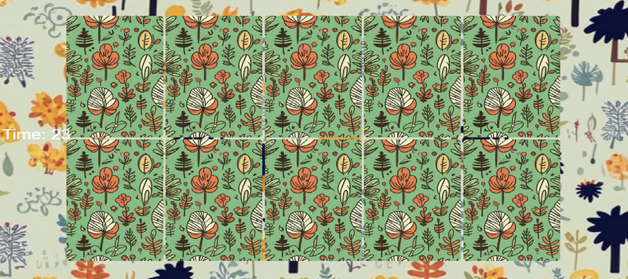
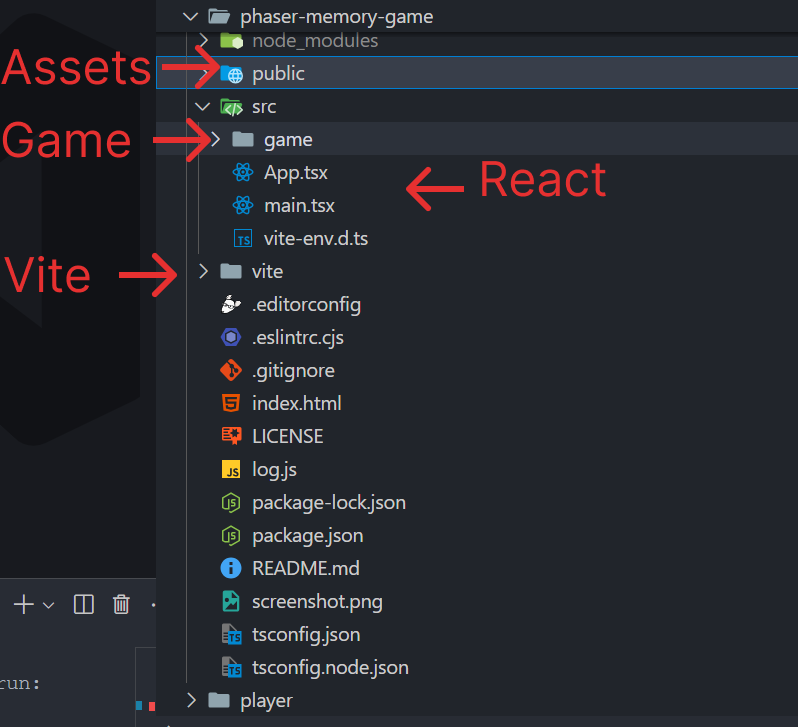
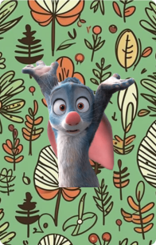
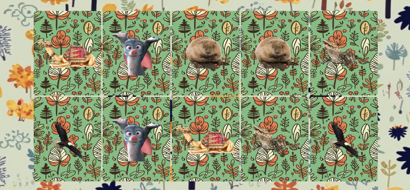

Today, we’ll create a simple game using PhaserJS and ReactJS. Despite the simplicity of the game, we
will cover all the key aspects of game development with PhaserJS. We’ll explore concepts like
scenes, prefabs, how to integrate PhaserJS with ReactJS, how to add third-party libraries and
components, and how to use tweens for animations.

## What is the PhaserJS ?

[PhaserJS](https://phaser.io/) is a fast, open-source HTML5 game framework used for building 2D
games for desktop and mobile platforms. It provides a robust set of tools for game development,
including physics engines, sprite handling, animations, input handling, and more. Developers can
create games using JavaScript or TypeScript, with support for WebGL and Canvas rendering.

## What are we going to build?

We’ll create a simple game where 10 cards are displayed, and the goal is to open them one by one
within 30 seconds. You’ll be able to adjust the time limit and the number of cards as needed.



## 1. Setup the Game

We will use the official [PhaserJS starter template](https://github.com/phaserjs/template-react-ts)
integrated with React. This will save us time by providing pre-built EventEmitter and Scenes,
allowing us to focus on the core game logic.

### Clone the template

<div className='code-cmd'>
  git clone https://github.com/phaserjs/template-react-ts phaser-memory-game
</div>

We've copied the template, now let's install all the necessary dependencies.

<div className='code-cmd'>cd phaser-memory-game && npm install</div>

Once that’s done, let’s go through the template's structure before we clean it up.



Let's quickly go over the purpose of the folders. We won't be reviewing the configuration files, as
it's assumed you're already familiar with React and Vite.

**Project structure**

- **public**: Contains assets and CSS.
- **game**: The main folder for the game.
- **App.tsx**: Connects PhaserJS with React.
- **vite**: Vite configuration folder.

**Inside the game folder:**

- **scenes**: Holds game scene files.
- **EventBus**: Manages events between Phaser and React.
- **PhaserGame.tsx**: React component that includes the game.
- **main.ts**: The main configuration for PhaserJS.

### Clean the template files

Remove everything from **App.tsx** except the following code:

```tsx
import { useRef } from 'react';

import { IRefPhaserGame, PhaserGame } from './game/PhaserGame';

import { IRefPhaserGame, PhaserGame } from './game/PhaserGame';

function App() {
  //  References to the PhaserGame component (game and scene are exposed)
  const phaserRef = useRef<IRefPhaserGame | null>(null);

  return (
    <div id='app'>
      <PhaserGame ref={phaserRef} />
    </div>
  );
}

export default App;
```

Here, we pass a ref to our game component, and that’s all.

Now, remove everything from **PhaserGame.tsx** except this code:

```tsx
import { forwardRef, useLayoutEffect, useRef } from 'react';

import StartGame from './main';

import StartGame from './main';

export interface IRefPhaserGame {
  game: Phaser.Game | null;
  scene: Phaser.Scene | null;
}

export const PhaserGame = forwardRef<IRefPhaserGame>(function PhaserGame(
  { currentActiveScene },
  ref
) {
  const game = useRef<Phaser.Game | null>(null!);

  useLayoutEffect(() => {
    if (game.current === null) {
      game.current = StartGame('game-container');

      if (typeof ref === 'function') {
        ref({ game: game.current, scene: null });
      } else if (ref) {
        ref.current = { game: game.current, scene: null };
      }
    }

    return () => {
      if (game.current) {
        game.current.destroy(true);
        if (game.current !== null) {
          game.current = null;
        }
      }
    };
  }, [ref]);

  return <div id='game-container'></div>;
});
```

Next, delete the files: **EventBus.ts**, **scenes/MainMenu.ts** and **scenes/GameOver.ts**, as they
are not needed for our project.

Modify **game/main.ts** file

```ts
import { Boot } from './scenes/Boot';
import { Game as MainGame } from './scenes/Game';
import { Preloader } from './scenes/Preloader';
import { AUTO, Game } from 'phaser';

import { Boot } from './scenes/Boot';
import { Game as MainGame } from './scenes/Game';
import { Preloader } from './scenes/Preloader';
import { AUTO, Game } from 'phaser';

//  Find out more information about the Game Config at:
//  https://newdocs.phaser.io/docs/3.70.0/Phaser.Types.Core.GameConfig
const config: Phaser.Types.Core.GameConfig = {
  type: AUTO,
  width: 1280,
  height: 720,
  parent: 'game-container',
  backgroundColor: '#ffffff',
  scale: {
    width: 1280,
    height: 720,
  },
  physics: {
    default: 'arcade',
    arcade: {
      debug: false,
    },
  },
  render: {
    antialiasGL: false,
    pixelArt: true,
  },
  canvasStyle: `display: block; width: 100%; height: 100%;`,
  autoFocus: true,
  audio: {
    disableWebAudio: false,
  },
  scene: [Boot, Preloader, MainGame],
};

const StartGame = (parent: string) => {
  const game = new Game({ ...config, parent });

  return game;
};

export default StartGame;
```

This is the standard configuration where we set the game’s width and height, canvas styles, and
more. While the final configuration file is quite important, everything here is fairly intuitive.

Our template still contains unnecessary assets and code, but we will clean those up as we progress
through the development.

## 2. Starting Game Development

Let’s begin developing our game.

### Display the background.


Save this image as **assets/bg.png**.

### Add the Background in Boot.ts

The boot scene is specifically designed to load assets that will be used in the game. This way, when
we access to the next scene, our background will already be loaded.

```ts
// Boot.ts
import { Scene } from 'phaser';

import { Scene } from 'phaser';

export class Boot extends Scene {
  constructor() {
    super('Boot');
  }

  preload() {
    //  The Boot Scene is typically used to load in any assets you require for your Preloader, such as a game logo or background.
    //  The smaller the file size of the assets, the better, as the Boot Scene itself has no preloader.

    this.load.image('background', 'assets/bg.png');
  }

  create() {
    this.scene.start('Preloader');
  }
}
```

We have loaded the image, so now we can display it in any of our scenes using the identifier
**background**.

Now, let's show our background in the other scenes.

**Preload.ts**

```ts
import { Scene } from 'phaser';

import { Scene } from 'phaser';

export class Preloader extends Scene {
  constructor() {
    super('Preloader');
  }

  init() {
    //  We loaded this image in our Boot Scene, so we can display it here
    this.add.image(window.innerWidth / 2, window.innerHeight / 2, 'background');
  }

  create() {
    this.scene.start('MainMenu');
  }
}
```

In the preloader, we display our background at the center of the screen by calculating the center
using window DOM.

**Game.ts**

```ts
import { Scene } from 'phaser';

import { Scene } from 'phaser';

export class Game extends Scene {
  background: Phaser.GameObjects.Image;

  constructor() {
    super('Game');
  }

  create() {
    this.background = this.add.image(0, 0, 'background').setOrigin(0, 0);
  }
}
```

Here's a breakdown:

**this.background** adds a background image at coordinates (0, 0) and sets its origin to the
top-left corner (setOrigin(0, 0)).

Run

<div className='code-cmd'>npm run dev</div>


Everything is set; we've displayed our background. Now, let's move on and add the cards.

## 3. Adding the cards

Upload the card assets to the **public/assets** folder.

  
  

**P.S.** This is demo graphics created with AI. The quality is not great, but it will suffice for
showcasing the capabilities of PhaserJS.

Next, we need to load these assets into the game using our **Preloader** scene.

```ts
preload() {
  //  Load the assets for the game - Replace with your own assets
  this.load.setPath("assets");

  this.load.image("card", "card.png");
  this.load.image("card1", "card1.png");
  this.load.image("card2", "card2.png");
  this.load.image("card3", "card3.png");
  this.load.image("card4", "card4.png");
  this.load.image("card5", "card5.png");
}
```

We've set up the **assets** folder and loaded the card assets.

Now, let's test it... we'll try displaying a card in the top-left corner. To do this, add the
following code to the **Game** scene.


We can see the card in the top-left corner. Now, we need to distribute 10 such cards. To achieve
this, we'll create the **getCardsPositions** function.

But first, we need **CONSTANTS**. Let's create a **utils** folder inside the **src** directory and
add a **constants.ts** file.

```ts
export const ROWS = 2;
export const COLS = 5;
export const CARDS = [1, 2, 3, 4, 5];
export const TIMEOUT = 30;
```

These are all the constants we need for the game. You'll understand the purpose of each one a bit
later. Now, let's return to our **getCardsPositions** function.

```ts
 getCardsPosition(): { x: number; y: number }[] {
        const cardWidth = 196 + 5;
        const cardHeight = 306 + 5;
        const positions = [];
        const offsetX =
            (+this.sys.game.config.width - cardWidth * COLS) / 2 +
            cardWidth / 2;
        const offsetY =
            (+this.sys.game.config.height - cardHeight * ROWS) / 2 +
            cardHeight / 2;

        let id = 0;
        for (let r = 0; r < ROWS; r++) {
            for (let c = 0; c < COLS; c++) {
                positions.push({
                    x: offsetX + c * cardWidth,
                    y: offsetY + r * cardHeight,
                    delay: ++id * 100,
                });
            }
        }
        Phaser.Utils.Array.Shuffle(positions);
        return positions;
    }
```

This function calculates the positions of cards on the game board and returns an array of objects,
each containing the x and y coordinates of a card.

**Card Dimensions:**

**cardWidth**: The width of each card is set to 196 plus 5 pixels of padding (total: 201).
**cardHeight**: The height of each card is set to 306 plus 5 pixels of padding (total: 311).

**Offset Calculation:**

**offsetX**: The horizontal offset centers the cards on the screen. It subtracts the total width of
the card grid from the total game width, divides it by 2 to center it, and adds half a card width to
ensure proper positioning. **offsetY**: Similarly, the vertical offset centers the cards on the
screen using the total height of the card grid and game height.

**Loop through Rows and Columns:**

- The function loops through **ROWS** and **COLS** (presumably constants representing the number of
  rows and columns on the grid).
- For each **row** (r) and **column** (c), it calculates the position of a card and pushes it into
  the positions array.
- The **x** position is calculated using the offset plus the column index multiplied by the card
  width.
- The **y** position is calculated similarly using the row index multiplied by the card height.
- **delay** is an optional property that adds a unique delay to each card's animation, incrementing
  by 100ms with each card.

**Shuffle**:

The **Phaser.Utils.Array.Shuffle** method randomly shuffles the positions array to ensure the cards
are distributed randomly.

**Purpose:**

This function sets up the grid of cards in random positions, ensuring they are evenly distributed
and properly centered on the game board.

Now we'll get the positions in the **create** method and generate the cards in a loop.

```ts
    create() {
        this.background = this.add.image(0, 0, "background").setOrigin(0, 0);

        const positions = this.getCardsPosition();

        for (const pos of positions) {
            this.add.sprite(pos.x, pos.y, "card").setOrigin(0.5, 0.5);
        }
    }
```

We have displayed the cards on the screen. The next step is to create a separate **prefab**, which
will help us move all the necessary code into the Card class. This way, we can organize our code
better and clean up the Game scene.

## Create prefab card

In Phaser, **prefabs** (classes) are reusable game objects that encapsulate both functionality and
appearance, allowing developers to create instances of objects with predefined properties and
behaviors.

### Key Features of Prefabs in Phaser:

- **Encapsulation**: A prefab can include properties (like position, size, or appearance) and
  methods (like actions or behaviors) that define how an object should behave in the game.

- **Reusability**: Once a prefab is defined, you can create multiple instances of it throughout your
  game without duplicating code. This promotes DRY (Don't Repeat Yourself) principles and simplifies
  maintenance.

- **Composition**: Prefabs can be composed of other prefabs or game objects. This allows developers
  to build complex objects using simpler, reusable components.

- **Ease of Modification**: Changes made to the prefab will automatically be reflected in all
  instances, making it easy to update behavior or appearance across the entire game.

- **Scene Management**: Prefabs help organize game scenes by grouping related functionality and
  assets into cohesive units, making the codebase cleaner and easier to navigate.

Create file **prefabs/Card.ts**

```ts
class Card extends Phaser.GameObjects.Sprite {
  isOpened: boolean = false;
  positionX = 0;
  positionY = 0;
  delay = 0;

  constructor(scene: Phaser.Scene, value: number) {
    super(scene, 0, 0, 'card');
    this.scene = scene;
    this.value = value;
    this.setOrigin(0.5, 0.5);
    this.scene.add.existing(this);
    this.setInteractive();
  }

  init(x: number, y: number, delay: number) {
    this.positionX = x;
    this.positionY = y;
    this.delay = delay;
    this.setPosition(-this.width, -this.height);
  }
}

export default Card;
```

The code here may seem a bit odd, but we actually need it for future animations. You'll understand
why we defined the variables **positionX** and this.**positionY** a bit later.

This code defines a Card class that extends Phaser.GameObjects.Sprite. The class includes properties
to track the card's state and methods for initialization and interaction.

The **init** function is called automatically by **Phaser**, so we don't need to call it ourselves
anywhere.

We just need to connect everything in the **Game.ts** file. We'll do this in a separate method
called **createCards** and call it from the create function.

```
// Game.ts

cards: Card[] = [];

create() {
    this.background = this.add.image(0, 0, "background").setOrigin(0, 0);

    this.createCards();
}

createCards() {
    for (const card of CARDS) {
        for (let i = 0; i < ROWS; i++) {
            this.cards.push(new Card(this, card));
        }
    }
}
```

Now create method init to initialize the cards

```ts
initCards() {
    const positions = this.getCardsPosition();

    this.cards.forEach((card) => {
        const position = positions.pop();
        card.init(position?.x, position?.y, position?.delay);
        card.setPosition(card.positionX, card.positionY);
    });
}
```

Don't forget to call it from the **create** method.

And voilà, we see the cards again!

## 4. Displaying the Cards on the Screen

So far, we have only displayed one card, which is the backside of all the cards. Now, we need to
show all the cards. We have five cards: **card1**, **card2**, ..., **card5**, and we already have a
constant named **CARDS**, which is an array containing the numbers from 1 to 5. We just need to put
it all together.

For now, we'll simply sort the array of cards and display their numbers in the prefab; we have
already prepared everything for this.

In the **initCards** method, add the following code:

```js
Phaser.Utils.Array.Shuffle(positions);
```

**Phaser** provides utility classes, including one for working with arrays, which we will use for
"sorting".

Then, let's return to the **Card** class and add the value to our sprite.

```js
super(scene, 0, 0, 'card' + value);
```

Now we can see all the cards opened.



## 5. Handling Input Events

We need the cards to flip open on click, rather than being open all the time.

Remove the recent changes in **Card.ts**, where we added the value just for testing. The cards will
only be flipped open when clicked.

```js
// Card.ts

super(scene, 0, 0, 'card');
```

### Creating the First Animation

We need to implement four simple methods for complete control of the card: **openCard**,
**closeCard**, **flipCard**, and **showCard**. Let's get started!

**openCard:**

```js
openCard() {
  this.isOpened = true;
  this.flipCard();
}
```

**closeCard: **

```js
closeCard() {
  if (this.isOpened) {
      this.isOpened = false;
      this.flipCard();
  }
}
```

The property **isOpened** is a boolean that indicates whether the card is open or not. Finally, the
method calls **flipCard()** to trigger the animation or logic responsible for visually flipping the
card back to its closed state.

**flipCard**:

```js
flipCard() {
this.scene.tweens.add({
    targets: this,
    scaleX: 0,
    ease: "Linear",
    duration: 150,
    onComplete: () => {
        this.showCard();
    },
});
}
```

This method adds a **tween animation** to the scene. A tween is used to change a property of an
object over time in a smooth, animated way. This reduces the horizontal scale of the card to 0,
making it appear as if the card is flipping horizontally and disappearing from view. Once the card
finishes the flip (scaleX reaches 0), the onComplete function is triggered. It calls the
**showCard** method.

**showCard**:

```js
showCard() {
  // This line determines which texture (image) to show on the card.
  const texture = this.isOpened ? `card${this.value}` : "card";
  this.setTexture(texture);
  // This adds another tween animation, just like in the flipCard method, to animate the card's horizontal scaling.
  this.scene.tweens.add({
      targets: this,
      scaleX: 1,
      ease: "Linear",
      duration: 150,
  });
}
```

After flipping (where scaleX was set to 0), this sets the horizontal scale back to 1, making the
card appear at its full width again.

We just need to introduce the **openedCard** field in the **Game** class. This field will either be
**null** or of type **Card**. When one of the cards is opened, we will store it in this variable,
and we will reset it to **null** when the card is closed.

```js
openedCard: null | Card = null;
```

Now we can create a handler function

Let's call it **onCardClicked**

```js
onCardClicked(pointer: { x: number; y: number }, card: Card) {
  // The first condition checks if the clicked card (card) is already open (card.isOpened). If so, the function returns false to prevent any further actions.

  if (card.isOpened) {
      return false;
  }
  if (this.openedCard) {
      if (this.openedCard.value === card.value) {
          this.openedCard = null;
          this.openCardCount++;
      } else {
        // If the cards don’t match, the previous card (this.openedCard) is closed by calling this.openedCard.closeCard(), and openedCard is updated to reference the newly clicked card.
          this.openedCard.closeCard();
          this.openedCard = card;
      }
  } else {
    // If no card is currently open (this.openedCard is null), the clicked card is set as openedCard.
      this.openedCard = card;
  }
  card.openCard();

  if (this.openCardCount === this.cards.length / 2) {
      this.start();
  }
}
```

This function controls the card-flipping logic. It handles card clicks, checks for matches, tracks
the opened card, and manages the game's progress.

Now we just need to connect this function in the **createCards** method.

```js
this.input.on('gameobjectdown', this.onCardClicked, this);
```

The last argument(this) is the context of the card.

Our game is almost ready; we've implemented the core game mechanics. The cards flip with an
animation along the X-axis, and matching cards are remembered in sequence. The next step is to
create the animation where the cards fly into position.

## 6. Card Flying Animation

We need to position the cards above the screen so that they appear to fly in from outside. We'll
place all the cards in the top left corner, outside the screen boundaries, and then move them one by
one. This is where the **delay** value we calculated earlier comes into play.

**Add move function to the Card prefab:**

```js
move() {
  this.scene.tweens.add({
      targets: this,
      x: this.positionX,
      y: this.positionY,
      ease: "Linear",
      delay: this.delay,
      duration: 250,
      onComplete: () => {
          this.showCard();
      },
  });
}
```

The **move()** method animates the card to its designated position using the PhaserJS tween system.

After the animation is complete, it calls the **showCard()** method to reveal the card by flipping
it or showing its texture.

Let's create two new functions in the **Game** class: **showCards()** to move the cards positioned
off-screen, and **start()** to begin the game with the card movement animation.

- **showCards()** will loop through all the cards and call their move method to animate them onto
  the screen.
- **start()** will serve as the trigger to initiate this animation at the beginning of the game.

**showCards**:

```js
showCards() {
  this.cards.forEach((card) => {
      card.move();
  });
}
```

**start**:

```js
start() {
    this.openCardCount = 0;
    this.timeout = TIMEOUT;
    this.initCards();
    this.showCards();
    this.cards.forEach((card) => {
      card.closeCard();
    });
}
```

Don’t forget to import **TIMEOUT** constant from the **utils/constants.ts**.

Call it from the **create** method:

```js
this.start();
```

Remove the **setPosition** call from the **initCards** method

```js

initCards() {
  const positions = this.getCardsPosition();
  Phaser.Utils.Array.Shuffle(positions);

  this.cards.forEach((card) => {
      const position = positions.pop();
      card.init(position?.x, position?.y, position?.delay);
      //   card.setPosition(card.positionX, card.positionY);
  });
}
```

Run the test

<div className='code-cmd'>npm run dev</div>


We’ve completed the Card prefab. Here’s the full code for the class:

```ts
class Card extends Phaser.GameObjects.Sprite {
  isOpened: boolean = false;
  positionX = 0;
  positionY = 0;
  delay = 0;

  constructor(scene: Phaser.Scene, value: number) {
    super(scene, 0, 0, 'card');
    this.scene = scene;
    this.value = value;
    this.setOrigin(0.5, 0.5);
    this.scene.add.existing(this);
    this.setInteractive();
  }

  init(x: number, y: number, delay: number) {
    this.positionX = x;
    this.positionY = y;
    this.delay = delay;
    this.setPosition(-this.width, -this.height);
  }

  move() {
    this.scene.tweens.add({
      targets: this,
      x: this.positionX,
      y: this.positionY,
      ease: 'Linear',
      delay: this.delay,
      duration: 250,
      onComplete: () => {
        this.showCard();
      },
    });
  }

  openCard() {
    this.isOpened = true;
    this.flipCard();
  }

  closeCard() {
    if (this.isOpened) {
      this.isOpened = false;
      this.flipCard();
    }
  }

  flipCard() {
    this.scene.tweens.add({
      targets: this,
      scaleX: 0,
      ease: 'Linear',
      duration: 150,
      onComplete: () => {
        this.showCard();
      },
    });
  }

  showCard() {
    const texture = this.isOpened ? `card${this.value}` : 'card';
    this.setTexture(texture);
    this.scene.tweens.add({
      targets: this,
      scaleX: 1,
      ease: 'Linear',
      duration: 150,
    });
  }
}

export default Card;
```

## Conclusion

We’ve successfully built a game using **PhaserJS**, integrating core mechanics such as flipping
cards, animating movements, and handling user input. This project showcases how **PhaserJS** can be
a powerful framework for creating dynamic and interactive games with rich visual experiences. From
loading assets to handling game logic, PhaserJS provides an intuitive API that simplifies game
development while offering robust features for animations and user interactions.

Through this game, we've learned how to:

- Organize game logic into scenes and prefabs.
- Animate objects with tweens for smooth transitions.
- Manage game assets and ensure efficient loading through preloader scenes.
- Implement custom events and interactive elements like card flipping.
- Integrate PhaserJS into a broader development environment, like React, to create responsive,
  cross-functional applications.

This foundation sets the stage for building more complex games, adding multiplayer functionality, or
incorporating additional physics and AI components.
