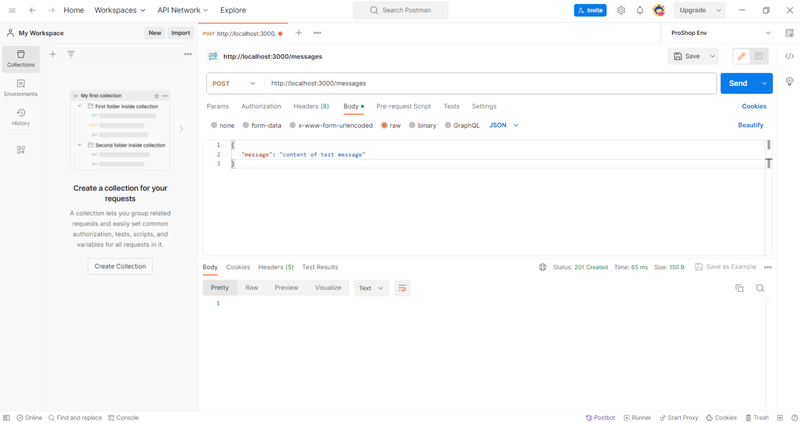
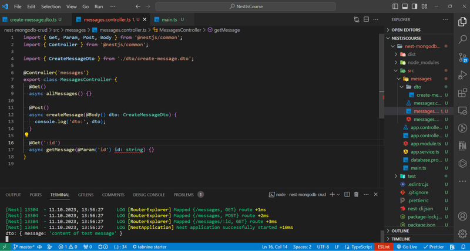

## What is NestJS?

[**NestJS**](https://nestjs.com/), a progressive Node.js framework, has gained popularity for its
ability to simplify the development of server-side applications. MongoDB, a NoSQL database, is known
for its flexibility and scalability. Combining **NestJS** with **MongoDB** using **Mongoose**, a
popular MongoDB object modeling library, allows developers to build powerful CRUD (Create, Read,
Update, Delete) APIs quickly and efficiently. In this tutorial, we will walk you through the process
of creating a **CRUD API** using **NestJS** and **MongoDB** (Mongoose).

### Prerequisites:

Before we begin, ensure that you have Node.js and npm (Node Package Manager) installed on your
system. Additionally, you should have **NestJS CLI** installed globally. You can install it with the
following command:

<span className='code-cmd'>npm install -g @nestjs/cli</span>

## Creating a CRUD API

### Installation

1. Setting Up the Project:

<span className='code-cmd'>nest new nest-mongodb-crud</span>

2. Install MongoDB and Mongoose:

<span className='code-cmd'>npm install @nestjs/mongoose mongoose</span>

3. Set Up MongoDB:

Ensure that you have **MongoDB** installed and running locally. If not, you can download it from the
official MongoDB website

[https://www.mongodb.com/try/download/community](https://www.mongodb.com/try/download/community) and
follow the installation instructions.

4. Create a MongoDB Database:

Create a MongoDB database for our application. You can do this through the MongoDB shell or a
graphical tool like MongoDB Compass.

5. Connect the main NestJS module with Mongo:

```js
import { AppController } from './app.controller';
import { AppService } from './app.service';
import { MessagesModule } from './messages/messages.module';
import { Module } from '@nestjs/common';
import { MongooseModule } from '@nestjs/mongoose';

import { AppController } from './app.controller';
import { AppService } from './app.service';
import { MessagesModule } from './messages/messages.module';
import { Module } from '@nestjs/common';
import { MongooseModule } from '@nestjs/mongoose';

@Module({
  imports: [
    MongooseModule.forRoot('mongodb://localhost/nest-mongodb-crud'),
    MessagesModule,
  ],
  controllers: [AppController],
  providers: [AppService],
})
export class AppModule {}
```

If you have a **MongoServerSelectionError connect ECONNREFUSED** error - check this
[solution](/howto/listen-eacces/).

6. Create a new Module using NestJS CLI:

<span className='code-cmd'>nest generate module messages</span>

### Adding Routing Logic:

7. Create a new Controller:

<span className='code-cmd'>
  nest generate controller messages/messages --flat
</span>

```js
import { Get, Post, Delete, Put } from '@nestjs/common';
import { Controller } from '@nestjs/common';

import { CreateMessageDto } from './dto/create-message.dto';
import { MessagesService } from './messages.service';

@Controller('messages')
export class MessagesController {
  constructor(private readonly messagesService: MessagesService) {}
  @Get()
  async allMessages() {}

  @Post()
  async createMessage() {}

  @Get(':id')
  async getMessage() {}

  @Delete(':id')
  async deleteMessage() {}

  @Put(':id')
  async updateMessage() {}
}
```

8. Install class-validator and class-transformer libraries

<span className='code-cmd'>npm install class-validator class-transformer</span>

With **class-validator** and **class-transformer**, you can easily handle data validation and
transformation in your NestJS application, making your API more robust and secure.

9. Add auto-validation in main.ts

```js
import { AppModule } from './app.module';
import { ValidationPipe } from '@nestjs/common';
import { NestFactory } from '@nestjs/core';

import { AppModule } from './app.module';
import { ValidationPipe } from '@nestjs/common';
import { NestFactory } from '@nestjs/core';

async function bootstrap() {
  const app = await NestFactory.create(AppModule);
  app.useGlobalPipes(new ValidationPipe());
  await app.listen(3000);
}
bootstrap();
```

10. Create a DTO (Data Transfer Object):

**DTOs** are used to define the structure of the data you expect to receive or send in your **API**.
They are also where you define validation rules.

For example, let's create a CreateMessageDto for a Message object:

1. Create **dto** folder inside a messages module.

2. Create file **create-message.dto.ts**

```js
export class CreateMessageDto {
  message: string;
}
```

11. Add a validation to DTO:

```js
import { IsString } from 'class-validator';

export class CreateMessageDto {
  @IsString()
  message: string;
}
```

12. Use DTO in Controller:

In your controller, import the **DTO** and use it to validate incoming data. You can use the
**ValidationPipe** provided by NestJS to automatically validate the request body against your DTO.

```js
import { Get, Param, Post, Body, Delete } from '@nestjs/common';
import { Controller } from '@nestjs/common';

import { CreateMessageDto } from './dto/create-message.dto';

@Controller('messages')
export class MessagesController {
  @Get()
  async allMessages() {}

  @Post()
  async createMessage(@Body() dto: CreateMessageDto) {
    console.log('dto:', dto);
  }

  @Get(':id')
  async getMessage(@Param('id') id: string) {}

  @Delete(':id')
  async deleteMessage(@Param('id') id: string) {}

  @Put(':id')
  async updateMessage(@Param('id') id: string, @Body() dto: CreateMessageDto) {}
}
```

Now let's check it with Postman:

<div className='single-post__img-wrapper'>
  
  <span className='single-post__img-alt'>Postman</span>
</div>

In VsCode you will see your message in console

<div className='single-post__img-wrapper'>
  
  <span className='single-post__img-alt'>VsCode</span>
</div>

13. Create a new Model:

Create folder **models** and add the **messages.model.ts** file inside:

```js
import { Prop, Schema, SchemaFactory } from '@nestjs/mongoose';
import { Document } from 'mongoose';

export type MessageDocument = Message & Document;

@Schema()
export class Message {
  @Prop({ required: true })
  message: string;
}
export const MessageSchema = SchemaFactory.createForClass(Message);
```

14. Connect mongodb in messages model:

```js
import { MessagesController } from './messages.controller';
import { MessagesService } from './messages.service';
import { Message, MessageSchema } from './models/messages.model';
import { Module } from '@nestjs/common';
import { MongooseModule } from '@nestjs/mongoose';

import { MessagesController } from './messages.controller';
import { MessagesService } from './messages.service';
import { Message, MessageSchema } from './models/messages.model';
import { Module } from '@nestjs/common';
import { MongooseModule } from '@nestjs/mongoose';

@Module({
  controllers: [MessagesController],
  providers: [MessagesService],
  imports: [
    MongooseModule.forFeature([{ name: Message.name, schema: MessageSchema }]),
  ],
})
export class MessagesModule {}
```

15. Create a new Service:

<span className='code-cmd'>nest generate service messages --flat</span>

```js
import { Model } from 'mongoose';
import { InjectModel } from '@nestjs/mongoose';
import { Injectable } from '@nestjs/common';

import { CreateMessageDto } from './dto/create-message.dto';
import { Message } from './models/messages.model';

@Injectable()
export class MessagesService {
  async getAll(): Promise<Message[]> {}
  async getById(id: string): Promise<Message | null> {}
  async add(message: CreateMessageDto): Promise<Message | null> {
    return await new this.messageModel(message).save();
  }
  async delete(id: string): Promise<Message | null> {}
  async update(id: string, dto): Promise<Message | null> {}
}
```

### Inject the mongodb Model in NestJS Module

```js
constructor(@InjectModel(Message.name) private readonly messageModel: Model<Message>) {}
```

Finally, fill the methods inside a service:

```js
import { Model } from 'mongoose';
import { InjectModel } from '@nestjs/mongoose';
import { Injectable } from '@nestjs/common';

import { CreateMessageDto } from './dto/create-message.dto';
import { Message } from './models/messages.model';

@Injectable()
export class MessagesService {
  constructor(@InjectModel(Message.name) private readonly messageModel: Model<Message>) {}
  async getAll(): Promise<Message[]> {
    return await this.messageModel.find().exec();
  }
  async getById(id: string): Promise<Message | null> {
    return await this.messageModel.findById(id).exec();
  }
  async add(message: CreateMessageDto): Promise<Message | null> {
    return await new this.messageModel(message).save();
  }
  async delete(id: string) {
    return await this.messageModel.findByIdAndDelete(id).exec();
  }
  async update(id: string, dto): Promise<Message | null> {
    return await this.messageModel.findByIdAndUpdate(id, dto).exec();
  }
}
```

16. Inject a service inside the controller

```js
import { Get, Param, Post, Body, Delete } from '@nestjs/common';
import { Controller } from '@nestjs/common';

import { CreateMessageDto } from './dto/create-message.dto';
import { MessagesService } from './messages.service';

@Controller('messages')
export class MessagesController {
  constructor(private readonly messagesService: MessagesService) {}
  @Get()
  async allMessages() {
    return this.messagesService.getAll();
  }

  @Post()
  async createMessage(@Body() dto: CreateMessageDto) {
    return this.messagesService.add(dto);
  }

  @Get(':id')
  async getMessage(@Param('id') id: string) {
    return this.messagesService.getById(id);
  }

  @Delete(':id')
  async deleteMessage(@Param('id') id: string) {
    return this.messagesService.delete(id);
  }

  @Put(':id')
  async updateMessage(@Param('id') id: string, @Body() dto: CreateMessageDto) {
    return this.messagesService.update(id, dto);
  }
}
```

### Testing the API:

Start your NestJS application by running:

<span className='code-cmd'>npm run start</span>

You can now test your CRUD API using tools like Postman or by making HTTP requests from your
frontend application.

**Here are some sample HTTP requests:**

1. Create a Message: POST

   `http://localhost:3000/messages`

2. Get All Messages: GET `http://localhost:3000/messages`

3. Get a Message by ID: GET

   `http://localhost:3000/messages/:id`

4. Update a Message: PUT

   `http://localhost:3000/messages/:id`

5. Delete a Message: DELETE `http://localhost:3000/messages/:id`

[Github repository](https://github.com/jsdevspace/nestjs-crud)

### Conclusion:

In this tutorial, we've explored how to create a **CRUD API** using **NestJS** and **MongoDB** with
**Mongoose**. You learned how to set up a NestJS project, define a model, create a service and
controller, connect to a MongoDB database, and test your API. With this foundation, you can expand
and customize your API to suit your specific application requirements and build robust backend
services efficiently. NestJS, combined with MongoDB and Mongoose, provides a powerful stack for
building scalable and performant applications. Happy coding!
