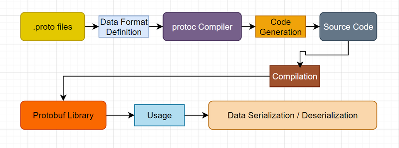

In today’s digital world, the need for efficient data serialization and communication between systems is paramount. Protocol Buffers (often referred to as Protobuf) is a method developed by Google for serializing structured data, similar to XML or JSON, but designed to be more efficient and faster. This article delves into how Protocol Buffers can be effectively used in JavaScript, exploring its benefits, implementation, and practical use cases.

## What are Protocol Buffers?

[Protocol Buffers](https://protobuf.dev/) are a language-agnostic binary serialization format. Unlike JSON and XML, which are text-based and can be verbose, Protobuf provides a compact binary format that is both smaller in size and faster to serialize and deserialize. This efficiency makes it ideal for performance-sensitive applications, especially those involving network communications or storage.



## Key Features of Protocol Buffers

- **Compactness**: Protobuf messages are much smaller than their JSON or XML counterparts, which saves bandwidth and storage.
- **Performance**: The binary format is faster to parse compared to text formats, leading to quicker data processing.
- **Strongly Typed**: Protobuf uses a schema (defined in .proto files) that enforces types, helping to catch errors at compile time rather than runtime.
- **Versioning**: Protocol Buffers support backward and forward compatibility, allowing developers to evolve their data structures over time without breaking existing systems.

## Why Use Protocol Buffers in JavaScript?

While JavaScript has built-in support for JSON, which is widely used for data interchange, Protocol Buffers offer significant advantages, particularly in scenarios where performance and data size are critical.

1. **Efficiency in Data Transmission**: In applications that handle large amounts of data (e.g., microservices, APIs), reducing the payload size can lead to faster transmission times and reduced costs.
2. **Data Integrity**: With a defined schema, Protocol Buffers help ensure that the data structure remains consistent, which is particularly useful in large applications or when multiple teams are involved.
3. **Interoperability**: Protocol Buffers are supported across various programming languages (Java, Python, Go, C++, etc.), making it easier to integrate different systems that may be written in different languages.

## Setting Up Protocol Buffers in a JavaScript Environment

### Step 1: Install the Required Packages

To get started with Protocol Buffers in a JavaScript project, you'll need to install the [protobufjs](https://github.com/protobufjs/protobuf.js/) library, which allows you to work with Protobuf in JavaScript.

<div className='code-cmd'>npm install protobufjs</div>

### Step 2: Define Your Schema

Create a `.proto` file to define the structure of your messages. For example, let’s create a file called `message.proto`:

```protobuf
syntax = "proto3";

package tutorial;

// Define the message structure
message Person {
    required string name = 1;
    optional int32 id = 2;
    repeated string email = 3;
}
```

In this example, we define a `Person` message with three fields: `name`, `id`, and `email`. The numbers assigned to each field (1, 2, and 3) are unique identifiers used in the binary serialization.

- `required`: This indicates that the field must be provided when the message is created. If this field is not set, the message is considered invalid.
- `optional`: This indicates that the field may or may not be present in the message. If it is not set, it will not cause an error.
- `repeated`: This indicates that the field can have zero or more occurrences. In this case, a person can have multiple email addresses.

Protocol Buffers use these definitions to serialize and deserialize data efficiently, making it suitable for network communication and storage.

### Step 3: Compile the Protocol Buffer

You need to compile your `.proto` file to generate the JavaScript code. You can use the pbjs command from the `protobufjs` library to do this:

<div className='code-cmd'>
  npx pbjs -t static-module -w commonjs -o compiled.js message.proto
</div>

This command generates a JavaScript file (`compiled.js`) that contains the necessary code to work with your Protocol Buffers.

### Step 4: Using Protocol Buffers in Your JavaScript Code

Now, you can use the generated code to serialize and deserialize your data. Here’s an example of how to use the compiled Protocol Buffers in a JavaScript file:

```js
const protobuf = require('protobufjs');
const root = require('./compiled');

const Person = root.lookupType('tutorial.Person');

// Create a new Person message
const personMessage = Person.create({
  name: 'John Doe',
  id: 123,
  email: 'john.doe@example.com',
});

// Serialize to a buffer
const buffer = Person.encode(personMessage).finish();
console.log('Serialized buffer:', buffer);

// Deserialize from the buffer
const decodedMessage = Person.decode(buffer);
console.log('Decoded message:', decodedMessage);
```

In this example, we create a `Person` message, serialize it to a binary format, and then deserialize it back to a JavaScript object.

### Step 5: Error Handling

When working with Protocol Buffers, it’s essential to handle potential errors, especially during serialization and deserialization. Always check for errors and validate your data against the defined schema.

```js
try {
  const decodedMessage = Person.decode(buffer);
  console.log('Decoded message:', decodedMessage);
} catch (error) {
  console.error('Error decoding message:', error);
}
```

## Use Cases for Protocol Buffers in JavaScript

### 1. API Development

When building APIs, using Protocol Buffers can improve the performance of your service by minimizing payload sizes and speeding up serialization/deserialization processes.

### 2. Microservices Communication

In microservices architectures, services often need to communicate with one another. Using Protobuf as the serialization format ensures that data remains compact and consistent across different services.

### 3. Data Storage

For applications that need to store structured data efficiently (e.g., NoSQL databases), Protocol Buffers can be used to serialize the data before storage, saving space and improving access times.

### 4. Version Compatibility

One of the key advantages of Protocol Buffers (Protobuf) is its support for schema evolution without breaking compatibility between old and new versions of code. This means that legacy code can read messages created by newer code, and vice versa. Compatibility is achieved by assigning a unique tag to each field in the .proto file. When data is serialized, Protobuf uses these tags to identify the fields, ensuring compatibility in the following ways:

- **Adding a Field**: If you add a new field, older code will simply ignore it.
- **Removing a Field**: New code will still be able to work with data created by the older code.

## Conclusion

Protocol Buffers provide an efficient binary format for data serialization that is particularly beneficial in performance-sensitive JavaScript applications. By reducing data size, enhancing transmission speed, and enforcing data integrity through a defined schema, Protobuf offers a robust alternative to traditional text-based formats like JSON. Whether you’re developing APIs, building microservices, or optimizing data storage, Protocol Buffers can play a critical role in improving your application’s performance. Embrace the power of Protobuf and enhance your JavaScript applications today!
