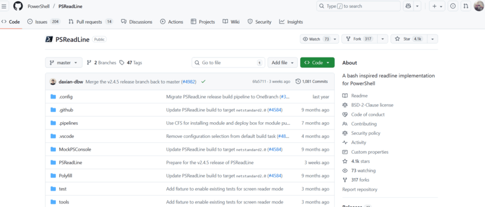
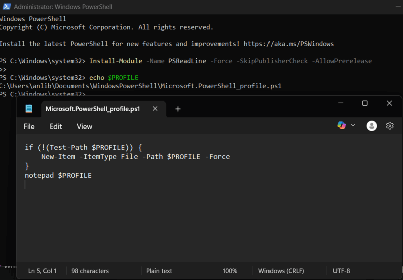
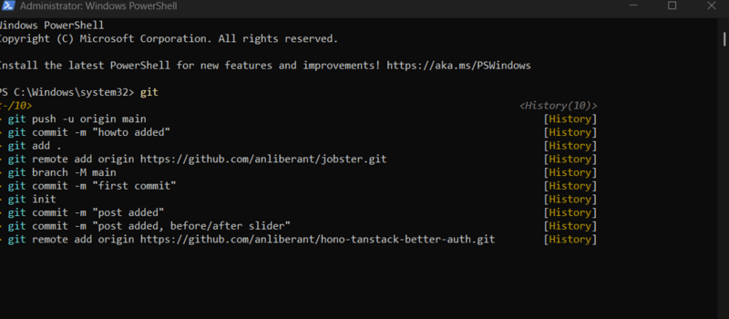
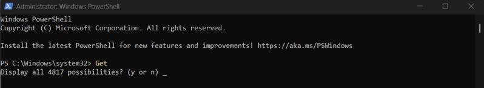

Many Windows users rely on PowerShell every day, but out of the box the experience can feel primitive: endless tapping of the Up arrow to find a command, missed typos in long paths, unreliable history search, and awkward navigation. Modern terminals on Linux or macOS offer far more convenience.

Fortunately, PowerShell can be upgraded with [**PSReadLine**](https://github.com/PowerShell/PSReadLine), a module that enhances input handling, adds predictive suggestions, improves navigation, and turns the console into a more capable tool. This guide explains how to install and update PSReadLine correctly, why the built-in version may be outdated, and how to apply a full working configuration that improves everyday workflows.

The goal is simple: by the end, you will have a ready-to-use `Microsoft.PowerShell_profile.ps1` and a faster, more pleasant terminal experience.

## 1. Understanding PSReadLine (and Why the Built-In Version May Not Work)



PowerShell ships with PSReadLine built in — but the version included can be **old** or **inconsistent across systems**. This leads to multiple problems noted by users:

- Some systems still run **PSReadLine v2.0**, which does *not* support `-PredictionSource`, `-PredictionViewStyle`, or other modern options.
- Updating the module may fail (`Module 'PSReadLine' was not installed`).
- PowerShell 5.1 on Windows 11 may not load the updated version at all.
- In some cases, the built-in version must be removed before updates will apply.

Because of this, installing the latest version manually is often easier.

## 2. Installing or Updating PSReadLine Correctly

The most reliable installation command is:

```powershell
Install-Module -Name PSReadLine -Force -SkipPublisherCheck -AllowPrerelease
```

Explanation:

- `-Force` — overrides old module copies  
- `-SkipPublisherCheck` — fixes signature mismatches  
- `-AllowPrerelease` — enables newest features  
- `-AllowClobber` — sometimes required if the built-in version blocks updates  

If PowerShell claims the module is already installed or refuses to update, remove it:

```powershell
Remove-Module PSReadLine -Force
```

Then install again.

Check which versions are available:

```powershell
Get-Module PSReadLine -ListAvailable
```

If prediction options are unavailable, you are still on v2.0.

## 3. Creating or Editing the PowerShell Profile

The PowerShell profile loads custom PSReadLine settings every time a new session opens.

Find the profile path:

```powershell
echo $PROFILE
```

Create it if missing:

```powershell
if (!(Test-Path $PROFILE)) {
    New-Item -ItemType File -Path $PROFILE -Force
}
notepad $PROFILE
```

Everything below goes in that file.



## 4. A Practical PSReadLine Configuration

This setup provides:

- Command predictions based on history  
- Bash-style reverse search (`Ctrl+R`)  
- A structured completion menu  
- Intuitive keybindings  
- Improved color scheme  
- A quick command validator (`F2`)  
- A more modern, editor-like feel  

```powershell
# PSReadLine Configuration
Import-Module PSReadLine

# Prediction and Useful UI Elements
Set-PSReadLineOption -PredictionSource History
Set-PSReadLineOption -PredictionViewStyle ListView
Set-PSReadLineOption -ShowToolTips

# Color Scheme
Set-PSReadLineOption -Colors @{
    Command         = 'Yellow'
    Parameter       = 'Green'
    String          = 'DarkCyan'
    InlinePrediction = 'DarkGray'
}

# Enhanced Key Bindings
Set-PSReadLineKeyHandler -Key Ctrl+r        -Function ReverseSearchHistory
Set-PSReadLineKeyHandler -Key Ctrl+Spacebar -Function MenuComplete
Set-PSReadLineKeyHandler -Key Tab           -Function Complete
Set-PSReadLineKeyHandler -Key Ctrl+c        -Function Copy
Set-PSReadLineKeyHandler -Key Ctrl+v        -Function Paste
Set-PSReadLineKeyHandler -Key Ctrl+LeftArrow -Function BackwardWord
Set-PSReadLineKeyHandler -Key Ctrl+RightArrow -Function NextWord
Set-PSReadLineKeyHandler -Key Home          -Function BeginningOfLine
Set-PSReadLineKeyHandler -Key End           -Function EndOfLine

# Quick Command Existence Check (F2)
Set-PSReadLineKeyHandler -Key F2 -ScriptBlock {
    $line = $null
    $cursor = $null
    [Microsoft.PowerShell.PSConsoleReadLine]::GetBufferState([ref]$line, [ref]$cursor)

    $firstWord = ($line -split '\s+')[0]

    if ($firstWord -and (Get-Command $firstWord -ErrorAction SilentlyContinue)) {
        Write-Host " Command exists" -ForegroundColor Green -NoNewline
    } elseif ($firstWord) {
        Write-Host " Command NOT FOUND" -ForegroundColor Red -NoNewline
    }

    [Microsoft.PowerShell.PSConsoleReadLine]::RedrawLine()
}
```

## 5. Testing the Improvements

After restarting PowerShell, the enhancements should be easy to notice:

### Command Predictions
Type `git sta` → see prediction like `git status`.



### Reverse Search
Press **Ctrl+R** → type part of a past command → fuzzy matches appear.

### Completion Menu
Type `Get-` → press **Ctrl+Space** → view all matching commands.



### Quick Command Check
Type a typo (`Get-ChilItem`) → press **F2** → get immediate feedback.

### Editor-Like Navigation
- `Ctrl+Left/Right` moves by words  
- `Home/End` jumps to line boundaries  
- `Ctrl+C`/`Ctrl+V` behave normally  

These changes significantly speed up command-line workflows.

## 6. Notes from Community Feedback

User discussions highlight several important points:

### • The built-in PSReadLine often loads an outdated version.  
This explains why some users cannot access prediction features.

### • Installation and updating can fail.  
Removing the module first usually resolves the problem.

### • PowerShell 5.1 remains problematic on Windows 11.  
Users may need additional steps.

### • Alternatives exist.  
Some prefer `oh-my-posh`, `starship`, or Git Bash tools.

### • Even skeptics agree the upgraded experience is far better.  
PSReadLine dramatically reduces repetitive effort and errors.

## Conclusion

PowerShell can be frustrating in its default state, but PSReadLine transforms it into a much more efficient environment. With prediction, intuitive navigation, improved history search, and a modern editing feel, the console becomes faster and easier to use.

Whether you rarely use PowerShell or rely on it heavily, this configuration acts like an integrated cheat sheet—reducing friction and boosting productivity.