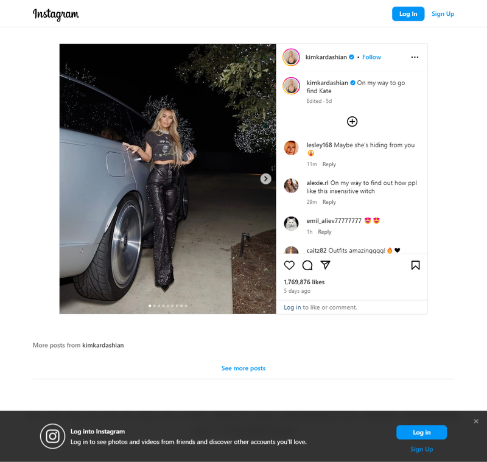

This article explain how to use **Google Puppeteer** and download images from a Instagram using
Puppeteer.

Downloading images from Instagram using **Node.js** and **Puppeteer** involves automating the
process of navigating to Instagram, accessing the desired images, and saving them to your local
machine. Here's a basic example of how you can achieve this:

Let's download images from Instagram of Kim Kardashian (@kimkardashian).

## What is Puppeteer?

[Puppeteer](https://developer.chrome.com/docs/puppeteer/) is a Node.js library developed by Google
that provides a high-level API over the Chrome DevTools Protocol. It allows you to control and
automate Chromium or Chrome browser instances, enabling tasks such as web scraping, automated
testing, taking screenshots, generating PDFs, and more.

**Puppeteer** provides a powerful set of features for interacting with web pages programmatically.

## Setup Application

### Step 1: Install Dependencies

First, you need to create Puppeteer config file and install a library:

Create file .puppeteerrc.cjs

```js
const { join } = require('path');

/**
 * @type {import("puppeteer").Configuration}
 */
module.exports = {
  // Changes the cache location for Puppeteer.
  cacheDirectory: join(__dirname, '.cache', 'puppeteer'),
};
```

now run

<span className='code-cmd'>npm install puppeteer</span>

Add to your package.json file:

```json
"type": "module"
```

### Step 2: Test the Puppeteteer

We will attempt to create a screenshot using **Puppeteer** of a random post by Kim Kardashian
(https://www.instagram.com/kimkardashian/p/C4lwwOYSpW-/?hl=en&img_index=1).

Create a JavaScript file, for example, downloadInstagramImages.js, and write the script to check if
the puppeteteer is working properly:

```js
import puppeteer from 'puppeteer';

import puppeteer from 'puppeteer';

async function run() {
  const browser = await puppeteer.launch({ headless: true });
  const page = await browser.newPage();
  await page.goto(
    'https://www.instagram.com/kimkardashian/p/C4lwwOYSpW-/?hl=en&img_index=1'
  );
  await page.waitForSelector('section');
  await page.setViewport({ width: 1080, height: 1024 });
  await page.screenshot({ path: 'screen.png', fullPage: true });
  await browser.close();
}

run();
```

Now run the code:

<span className='code-cmd'>node downloadInstagramImages.js</span>

We got this in our screen.png file:

<div className='single-post__img-wrapper'>
  
  <span className='single-post__img-alt'>
    Instagram Screenshot using Puppeteer
  </span>
</div>

### Step 3: Create Helpers Functions

We need to create two functions: one to download an image from a source link and another to check if
our destination folder already exists.

**Check if the destination folder already exists function**

```js
const checkIfDirExists = directory => {
  return new Promise((resolve, reject) => {
    fs.access(directory, fs.constants.F_OK, err => {
      if (err) {
        // Directory doesn't exist, create it
        fs.mkdir(directory, { recursive: true }, err => {
          if (err) {
            console.error('Error creating directory:', err);
            reject();
          } else {
            console.log('Directory created successfully');
            resolve();
          }
        });
      } else {
        console.log('Directory already exists');
        resolve();
      }
      resolve();
    });
  });
};
```

You can also use another [method](/howto/create-dir-if-not-exists/) to resolve a directory

**Download function**

```js
const download = (url, destination) => {
  return new Promise((resolve, reject) => {
    checkIfDirExists('images').then(() => {
      const file = fs.createWriteStream(destination);

      https
        .get(url, response => {
          response.pipe(file);

          file.on('finish', () => {
            file.close(resolve(true));
          });
        })
        .on('error', error => {
          fs.unlink(destination);

          reject(error.message);
        });
    });
  });
};
```

Add new imports at the top of the file:

```js
import fs from 'fs';
import https from 'https';

import fs from 'fs';
import https from 'https';
```

### Step 4: Write the Run Function

```js
async function run() {
  const browser = await puppeteer.launch({ headless: true });
  const page = await browser.newPage();
  await page.goto(
    'https://www.instagram.com/kimkardashian/p/C4lwwOYSpW-/?hl=en&img_index=1'
  );
  await page.waitForSelector('section');
  await page.setViewport({ width: 1080, height: 1024 });
  await page.screenshot({ path: 'screen.png', fullPage: true });
  const links = await page.evaluate(() =>
    Array.from(document.querySelectorAll('article a'), el => el.href)
  );
  const images = await page.evaluate(() =>
    Array.from(
      document.querySelectorAll('article div[role=button] div._aagv img'),
      img => {
        return {
          imgUrl: img.src,
          alt: img.alt,
          slug: img.src.slice(
            img.src.lastIndexOf('/') + 1,
            img.src.lastIndexOf('.jpg') + 4
          ),
        };
      }
    )
  );

  await browser.close();
  images.map(async img => {
    download(img.imgUrl, 'images/' + img.slug);
  });
}

run();
```

### Step 5: Run the Script

Run the script using Node.js:

<span className='code-cmd'>node downloadInstagramImages.js</span>

Here is a complete example of the script:

```js
import fs from 'fs';
import https from 'https';
import puppeteer from 'puppeteer';

import fs from 'fs';
import https from 'https';
import puppeteer from 'puppeteer';

const checkIfDirExists = directory => {
  return new Promise((resolve, reject) => {
    fs.access(directory, fs.constants.F_OK, err => {
      if (err) {
        // Directory doesn't exist, create it
        fs.mkdir(directory, { recursive: true }, err => {
          if (err) {
            console.error('Error creating directory:', err);
            reject();
          } else {
            console.log('Directory created successfully');
            resolve();
          }
        });
      } else {
        console.log('Directory already exists');
        resolve();
      }
      resolve();
    });
  });
};

const download = (url, destination) => {
  return new Promise((resolve, reject) => {
    checkIfDirExists('images').then(() => {
      const file = fs.createWriteStream(destination);

      https
        .get(url, response => {
          response.pipe(file);

          file.on('finish', () => {
            file.close(resolve(true));
          });
        })
        .on('error', error => {
          fs.unlink(destination);

          reject(error.message);
        });
    });
  });
};

async function run() {
  const browser = await puppeteer.launch({ headless: true });
  const page = await browser.newPage();
  await page.goto(
    'https://www.instagram.com/kimkardashian/p/C4lwwOYSpW-/?hl=en&img_index=1'
  );
  await page.waitForSelector('section');
  await page.setViewport({ width: 1080, height: 1024 });
  await page.screenshot({ path: 'screen.png', fullPage: true });
  const links = await page.evaluate(() =>
    Array.from(document.querySelectorAll('article a'), el => el.href)
  );
  const images = await page.evaluate(() =>
    Array.from(
      document.querySelectorAll('article div[role=button] div._aagv img'),
      img => {
        return {
          imgUrl: img.src,
          alt: img.alt,
          slug: img.src.slice(
            img.src.lastIndexOf('/') + 1,
            img.src.lastIndexOf('.jpg') + 4
          ),
        };
      }
    )
  );

  await browser.close();
  images.map(async img => {
    download(img.imgUrl, 'images/' + img.slug);
  });
}

run();
```

## Conclusion:

Using Puppeteer, you can automate the process of downloading images from Instagram. However, keep in
mind the legal and ethical considerations involved when accessing and downloading content from
websites.
