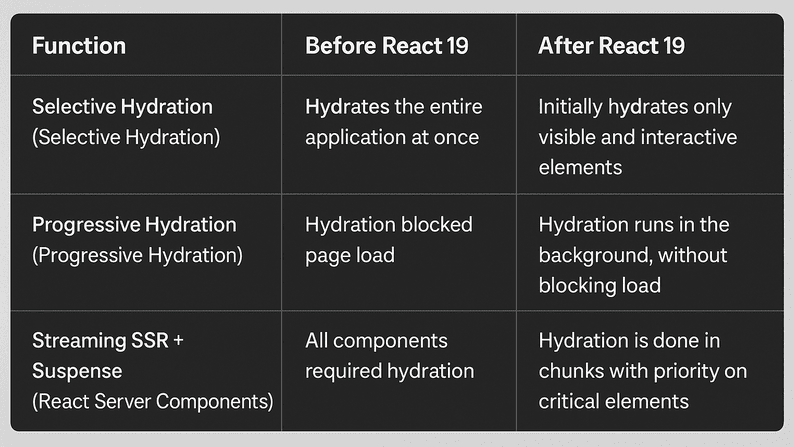

Hydration has always been a critical part of SSR (Server-Side Rendering) in React. But prior to React 19, it came with performance drawbacks—like blocking interactivity and redundant JavaScript execution. Fortunately, React 19 introduces a revamped hydration model with smarter strategies: selective, progressive, and streaming hydration, plus support for server components that eliminate hydration altogether.

In this guide, we’ll walk through how hydration works, what’s new, and how to avoid common mistakes—with all updated code examples and terminology.

## 🧠 Understanding Hydration in React

Hydration is the process of converting server-rendered HTML into a fully interactive React app in the browser. React attaches event listeners and restores client-side state without re-rendering everything.

### Why Hydration is Important

- Users see content faster (great for SEO)
- Interactive components become usable with less delay
- Hybrid rendering allows fast-first-paint and dynamic behavior

## 🔁 What's New in React 19 Hydration?

React 19 introduces several improvements:

- **Selective Hydration** – only visible, interactive components are hydrated first
- **Progressive Hydration** – defers less important parts
- **Streaming SSR** – renders and hydrates components in chunks
- **Server Components** – some parts of the UI don’t require any hydration

Let’s look at the comparison table:


## 🔧 How Hydration Happens

React hydration involves three stages:

1. **Render on the Server** - HTML is generated and sent to the browser.
2. **Hydrate in the Browser** - React uses JavaScript to attach interactivity without replacing the DOM.
3. **Activate React Lifecycle** - Once hydrated, the app resumes full functionality with state updates, events, and hooks.

## ⚙️ Selective Hydration in Action

With React 19, hydration prioritizes components that need to be interactive first.

```tsx 
import { Suspense } from "react";
import FeedbackInput from "@/components/FeedbackInput";
import DeferredTestimonials from "@/components/DeferredTestimonials";

export default function ProductOverview() {
  return (
    <main>
      <h2>Item Overview</h2>

      {/* Hydrate input field immediately */}
      <Suspense fallback={<div>Loading feedback...</div>}>
        <FeedbackInput />
      </Suspense>

      {/* Delay testimonials */}
      <Suspense fallback={<div>Loading testimonials...</div>}>
        <DeferredTestimonials />
      </Suspense>
    </main>
  );
}
```

## 🧭 Progressive Hydration

This method hydrates components gradually to reduce main-thread load.

```tsx 
import { lazy, Suspense } from "react";

const NavigationSidebar = lazy(() => import("@/components/NavigationSidebar"));

export default function AdminDashboard() {
  return (
    <div>
      <h1>Dashboard</h1>

      {/* Sidebar is loaded and hydrated later */}
      <Suspense fallback={<div>Sidebar loading...</div>}>
        <NavigationSidebar />
      </Suspense>
    </div>
  );
}
```

## 🌊 Streaming with Suspense

Streaming lets React send HTML to the browser in chunks and hydrate it as it loads.

```tsx 
import { Suspense } from "react";
import ItemSummary from "@/components/ItemSummary";
import CustomerFeedback from "@/components/CustomerFeedback";

export default function ItemPage() {
  return (
    <div>
      <h1>Product Info</h1>

      <Suspense fallback={<div>Fetching summary...</div>}>
        <ItemSummary />
      </Suspense>

      <Suspense fallback={<div>Loading feedback...</div>}>
        <CustomerFeedback />
      </Suspense>
    </div>
  );
}
```

## 🖥️ Server Components (No Hydration Needed)

Server Components are rendered entirely on the backend and transmitted as HTML—no JavaScript needed on the client.

```tsx 
// Server component — no "use client"
export default async function StaticDetails({ itemId }: { itemId: string }) {
  const data = await fetch(`https://api.store.com/items/${itemId}`)
    .then((res) => res.json());

  return (
    <section>
      <h3>{data.title}</h3>
      <p>{data.summary}</p>
    </section>
  );
}
```

## 🚫 Hydration Errors and Fixes

Hydration mismatches happen when the server-rendered HTML differs from the client’s virtual DOM expectations. Common causes include timestamps, randomness, or user data rendered too early.

See the translated issue summary below:

### ❌ Issue: Time Mismatch

Problem: `new Date()` renders differently on server vs. client.
Fix: Move the logic to a useEffect hook.

```tsx 
import { useState, useEffect } from "react";

export default function ClockDisplay() {
  const [currentTime, setCurrentTime] = useState("");

  useEffect(() => {
    setCurrentTime(new Date().toLocaleTimeString());
  }, []);

  return <span>{currentTime}</span>;
}
```

### ❌ Issue: Random Values Change

Problem: `Math.random()` differs between server and client.
Fix: Generate random values after hydration.

```tsx 
import { useEffect, useState } from "react";

export default function SessionCode() {
  const [code, setCode] = useState("");

  useEffect(() => {
    setCode(`CODE-${Math.floor(Math.random() * 9999)}`);
  }, []);

  return <div>Your code: {code}</div>;
}
```

### ❌ Issue: Dynamic User Data

Problem: SSR renders user data that may not be available or may change.
Fix: Fetch on the client after mount.

```tsx 
import { useEffect, useState } from "react";

export default function WelcomeBanner() {
  const [user, setUser] = useState<string | null>(null);

  useEffect(() => {
    fetch("/api/me")
      .then((res) => res.json())
      .then((data) => setUser(data.username));
  }, []);

  return <h2>Hello, {user || "stranger"}!</h2>;
}
```

## 🧪 Debugging Hydration

Use these techniques to catch and fix hydration issues:

1. **Inspect Console Warnings** - Look for "Hydration failed" or "Content mismatch".
2. **Profile Using React DevTools** - Identify unnecessary re-renders and hydration delays.
3. **Log Hydration Events**
  ```tsx
  useEffect(() => {
    console.log("Hydration complete for this component.");
  }, []);
  ```
4. **Minimize “use client”** - Only use it on components that require interactivity.

## ✅ Hydration Best Practices in React 19

- Prefer server components to avoid unnecessary hydration.
- Hydrate critical UI immediately (e.g., forms, inputs).
- Defer secondary UI like sidebars and graphs.
- Handle timestamps and randomness client-side only.
- Use `Suspense` and `lazy()` to chunk rendering and hydration.
- Monitor hydration performance with DevTools.

## 🏁 Final Thoughts

React 19’s hydration overhaul gives you precise control over when and how your app becomes interactive. You can now optimize performance without sacrificing developer experience or functionality.

Whether you're building eCommerce sites, dashboards, or content-heavy blogs, adopting selective and progressive hydration patterns will lead to smoother, faster applications.