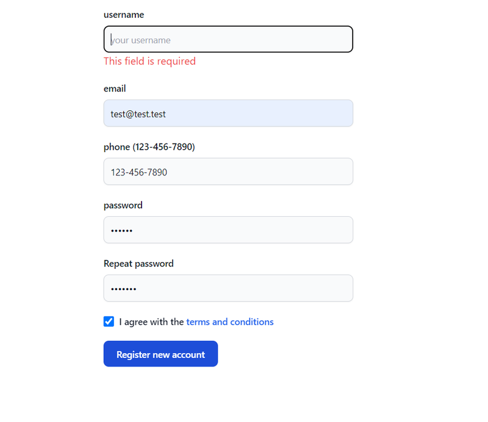

Form validation is a crucial aspect of building robust and user-friendly web applications. In this
guide, we'll explore how to integrate **React Hook Form** (a popular form library for React) with
**Yup** (a schema validation library) to perform efficient form validation in React applications.

## What is React Hook Form?

[React Hook Form](https://react-hook-form.com) is a lightweight and flexible library for managing
form state and performing form validation in React applications. It emphasizes simplicity,
performance, and flexibility, making it a popular choice among React developers. In this guide,
we'll explore the key features and usage of **React Hook Form** to build forms efficiently.

**React Hook Form** simplifies form management, while **Yup** allows for defining complex validation
rules with ease. By following the steps outlined in this tutorial, you can implement efficient and
robust form validation in your React projects, ensuring data integrity and a better user experience.
Feel free to customize the validation rules and form layout according to your specific requirements.

## What is Yup?

[Yup](https://www.npmjs.com/package/yup) is a JavaScript schema validation library that allows you
to define validation rules for your data schemas. It's commonly used for form validation in web
applications, including with libraries like React Hook Form. Yup provides a declarative way to
define validation schemas, making it easy to specify complex validation rules for your data objects.
Let's explore the key features and usage of Yup:

## Setup the application

### Step 1: Install Dependencies

First, make sure you have **React**, **React DOM**, **React Hook Form**, **Yup**, **TypeScript**,
and **TailwindCSS** installed in your project:

<span className='code-cmd'>
  npx create-react-app react-hook-form-yup --template typescript
</span>

then...

<span className='code-cmd'>
  cd react-hook-form-yup && npm install react-hook-form yup @hookform/resolvers
</span>

now let's add **TailwindCss** to our project

<span className='code-cmd'>
  npm install -D tailwindcss postcss autoprefixer
</span>

and

<span className='code-cmd'>npx tailwindcss init -p</span>

It will generate a "tailwind.config.js" and "postcss.config.js" files in the root folder. Rewrite
the tailwind.config.js with this code:

```js
/** @type {import('tailwindcss').Config} */
module.exports = {
  content: [
    './app/**/*.{js,ts,jsx,tsx,mdx}',
    './pages/**/*.{js,ts,jsx,tsx,mdx}',
    './components/**/*.{js,ts,jsx,tsx,mdx}',
    './**/*.{js,ts,jsx,tsx,mdx}',

    // Or if using `src` directory:
    './src/**/*.{js,ts,jsx,tsx,mdx}',
  ],
  theme: {
    extend: {},
  },
  plugins: [],
};
```

### Step 2: Create a Form Component

Create a new TypeScript file for your form component, for example **RegForm.tsx**:

```js
import { yupResolver } from '@hookform/resolvers/yup';
import { useForm } from 'react-hook-form';
import { IRegForm } from './RegForm.props';
import { userSchema } from './schema';

const RegForm = () => {
  const {
    register,
    handleSubmit,
    reset,
    formState: { errors },
  } = useForm <
  IRegForm >
  {
    resolver: yupResolver(userSchema),
  };
  const submitForm = (data: IRegForm) => {
    console.log({ data });
    reset();
  };
  console.log(errors);
  return (
    <form className='max-w-sm mx-auto' onSubmit={handleSubmit(submitForm)}>
      <div className='mb-5'>
        <label className='block mb-2 text-sm font-medium text-gray-900 dark:text-white'>
          username
        </label>
        <input
          {...register('username')}
          type='text'
          className='shadow-sm bg-gray-50 border border-gray-300 text-gray-900 text-sm rounded-lg focus:ring-blue-500 focus:border-blue-500 block w-full p-2.5 dark:bg-gray-700 dark:border-gray-600 dark:placeholder-gray-400 dark:text-white dark:focus:ring-blue-500 dark:focus:border-blue-500 dark:shadow-sm-light'
          placeholder='your username'
          required
        />
        {errors?.username && <span className='text-red-500'>This field is required</span>}
      </div>
      <div className='mb-5'>
        <label className='block mb-2 text-sm font-medium text-gray-900 dark:text-white'>
          email
        </label>
        <input
          {...register('email')}
          type='email'
          className='shadow-sm bg-gray-50 border border-gray-300 text-gray-900 text-sm rounded-lg focus:ring-blue-500 focus:border-blue-500 block w-full p-2.5 dark:bg-gray-700 dark:border-gray-600 dark:placeholder-gray-400 dark:text-white dark:focus:ring-blue-500 dark:focus:border-blue-500 dark:shadow-sm-light'
          placeholder='email'
          required
        />
        {errors?.email && <span className='text-red-500'>This field is required</span>}
      </div>
      <div className='mb-5'>
        <label className='block mb-2 text-sm font-medium text-gray-900 dark:text-white'>
          phone (123-456-7890)
        </label>
        <input
          {...register('phone')}
          type='tel'
          pattern='[0-9]{3}-[0-9]{3}-[0-9]{4}'
          name='phone'
          className='shadow-sm bg-gray-50 border border-gray-300 text-gray-900 text-sm rounded-lg focus:ring-blue-500 focus:border-blue-500 block w-full p-2.5 dark:bg-gray-700 dark:border-gray-600 dark:placeholder-gray-400 dark:text-white dark:focus:ring-blue-500 dark:focus:border-blue-500 dark:shadow-sm-light'
          placeholder=' '
          required
        />
        {errors?.phone && <span className='text-red-500'>This field is required</span>}
      </div>
      <div className='mb-5'>
        <label className='block mb-2 text-sm font-medium text-gray-900 dark:text-white'>
          password
        </label>
        <input
          type='password'
          {...register('password')}
          className='shadow-sm bg-gray-50 border border-gray-300 text-gray-900 text-sm rounded-lg focus:ring-blue-500 focus:border-blue-500 block w-full p-2.5 dark:bg-gray-700 dark:border-gray-600 dark:placeholder-gray-400 dark:text-white dark:focus:ring-blue-500 dark:focus:border-blue-500 dark:shadow-sm-light'
          required
        />
        {errors?.password && <span className='text-red-500'>This field is required</span>}
      </div>
      <div className='mb-5'>
        <label className='block mb-2 text-sm font-medium text-gray-900 dark:text-white'>
          Repeat password
        </label>
        <input
          type='password'
          className='shadow-sm bg-gray-50 border border-gray-300 text-gray-900 text-sm rounded-lg focus:ring-blue-500 focus:border-blue-500 block w-full p-2.5 dark:bg-gray-700 dark:border-gray-600 dark:placeholder-gray-400 dark:text-white dark:focus:ring-blue-500 dark:focus:border-blue-500 dark:shadow-sm-light'
          required
        />
      </div>
      <div className='flex items-start mb-5'>
        <div className='flex items-center h-5'>
          <input
            id='terms'
            type='checkbox'
            value=''
            className='w-4 h-4 border border-gray-300 rounded bg-gray-50 focus:ring-3 focus:ring-blue-300 dark:bg-gray-700 dark:border-gray-600 dark:focus:ring-blue-600 dark:ring-offset-gray-800 dark:focus:ring-offset-gray-800'
            required
          />
        </div>
        <label
          htmlFor='terms'
          className='ms-2 text-sm font-medium text-gray-900 dark:text-gray-300'
        >
          I agree with the{' '}
          <a href='!#' className='text-blue-600 hover:underline dark:text-blue-500'>
            terms and conditions
          </a>
        </label>
      </div>
      <button
        type='submit'
        className='text-white bg-blue-700 hover:bg-blue-800 focus:ring-4 focus:outline-none focus:ring-blue-300 font-medium rounded-lg text-sm px-5 py-2.5 text-center dark:bg-blue-600 dark:hover:bg-blue-700 dark:focus:ring-blue-800'
      >
        Register new account
      </button>
    </form>
  );
};
export default RegForm;
```

Now, you can use the RegForm component in your main App component or any other component in your
application:

```js
import RegForm from './components/reg-form/RegForm';

import RegForm from './components/reg-form/RegForm';

function App() {
  return (
    <div>
      <RegForm />
    </div>
  );
}

export default App;
```

### Step 3: Create a Props File for Form Component

RegForm.props.ts

```js
import { DetailedHTMLProps, FormHTMLAttributes } from 'react';

export interface IRegForm {
  username?: string;
  email?: string;
  phone?: string;
  password?: string;
}

export interface RegFormProps
  extends DetailedHTMLProps<FormHTMLAttributes<HTMLFormElement>, HTMLFormElement> {
  username: string;
  email: string;
  phone?: string;
  password: string;
}
```

### Step 4: Create a Schema

Create a new TypeScript file for schema, for example schema.ts:

```js
import { InferType, ObjectSchema, date, object, string } from 'yup';
import { IRegForm } from './RegForm.props';

const regexPhone: RegExp = new RegExp(/\(?([0-9]{3})\)?([ .-]?)([0-9]{3})\2([0-9]{4})/);

export const userSchema: ObjectSchema<IRegForm> = object({
  username: string().trim().required('Username is required'),
  email: string().email('Email is required'),
  password: string().min(6).max(11).required('Password is required'),
  phone: string().required().matches(regexPhone, 'Wrong phone number format'),
  createdOn: date().default(() => new Date()),
});

export type User = InferType<typeof userSchema>;
```

### Step 5: Running the Application

Ensure your TypeScript compiler is configured properly (e.g., tsconfig.json). Then, start your React
application:

<span className='code-cmd'>npm run start</span>

<div className='single-post__img-wrapper'>
  
  <span className='single-post__img-alt'>React Hook Form + Yup</span>
</div>

## Conclusion:

By combining React Hook Form, Yup, and TypeScript, you can create powerful and type-safe forms in
your React applications. React Hook Form simplifies form management, Yup provides robust validation
capabilities, and TypeScript ensures type safety throughout your application. This approach allows
you to build forms with confidence, knowing that your data is validated and your code is free of
type errors.
