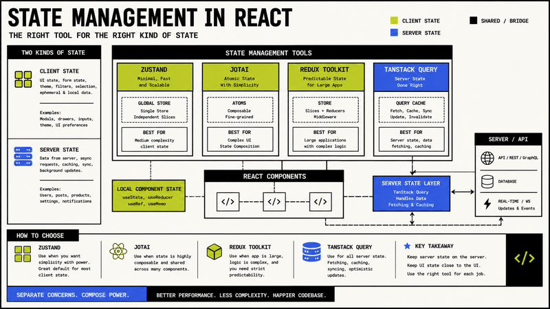
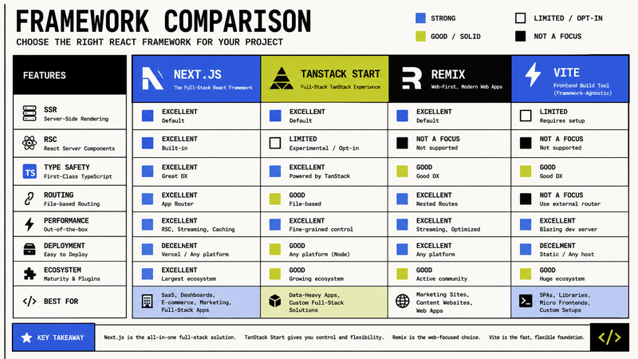

## The Modern React Stack Explained for 2026

The React ecosystem changes faster than almost any other frontend ecosystem.

A few years ago, most projects looked nearly identical:

- Create React App
- Redux
- Material UI
- Formik
- styled-components
- webpack

Today, very few new React applications are built that way.

Modern React development in 2026 is shaped by several major shifts:

- server-first rendering,
- TypeScript-first APIs,
- edge-ready runtimes,
- monorepo tooling,
- async React architecture,
- AI-assisted workflows,
- and significantly better developer experience.

Starting a new React project today can feel overwhelming because there are now dozens of excellent options in almost every category.

Should you use:

- [Next.js](https://nextjs.org/) or [TanStack Start](https://tanstack.com/start)?
- [Zustand](https://github.com/pmndrs/zustand) or [Jotai](https://github.com/pmndrs/jotai)?
- [React Hook Form](https://react-hook-form.com/) or [TanStack Form](https://tanstack.com/form)?
- [shadcn/ui](https://ui.shadcn.com/) or [Mantine](https://mantine.dev/)?
- [Tailwind CSS](https://tailwindcss.com/) or [Panda CSS](https://panda-css.com/)?
- [Vitest](https://vitest.dev/) or [Jest](https://jestjs.io/)?
- [Better Auth](https://better-auth.com/) or [Auth.js](https://authjs.dev/)?

The answer depends heavily on what kind of product you are building.

A SaaS dashboard has completely different requirements than:

- a marketing site,
- a collaborative editor,
- an e-commerce storefront,
- a browser-based design tool,
- or a real-time analytics application.

This guide breaks down the modern React stack category by category and explains:

- which tools became the new defaults,
- which libraries are losing momentum,
- which alternatives still make sense,
- and what tradeoffs come with every major decision.

The goal is not to create a universal ranking.

Instead, the goal is to help developers understand how the React ecosystem actually looks in 2026.

---

## React Ecosystem Trends in 2026

Before comparing libraries individually, it is important to understand the larger architectural trends shaping React development.

The React ecosystem in 2026 is no longer centered around building purely client-side applications.

Modern React applications increasingly focus on:

- server-first rendering,
- streaming interfaces,
- async workflows,
- edge execution,
- AI-assisted experiences,
- and shared type-safe contracts.

Several ecosystem-wide changes influenced nearly every major library:

| Trend | Impact on the Ecosystem |
|---|---|
| React Server Components | Reduced client bundle sizes and moved data fetching closer to the server |
| TypeScript Everywhere | Libraries increasingly design APIs around type inference |
| AI-Assisted Development | Tooling shifted toward faster iteration and code generation workflows |
| Edge Deployment | Frameworks optimized for distributed execution |
| Monorepo Growth | Shared packages and workspace tooling became standard |
| Utility-First Styling | Tailwind and token-based systems became dominant |
| Async UI Patterns | Streaming and optimistic interfaces became common |

These shifts explain why many older React patterns no longer feel modern.

For example:

- heavy Redux architectures became less common,
- large runtime CSS-in-JS systems lost momentum,
- and traditional REST-heavy frontend architectures increasingly moved toward server actions and typed APIs.

Understanding these broader shifts makes it much easier to choose tools intentionally instead of simply following trends.

---

### Visual Overview of a Modern React Stack

```txt
┌────────────────────────────────────────────┐
│                 Frontend                   │
├────────────────────────────────────────────┤
│ Next.js / TanStack Start / Remix           │
│ Tailwind CSS / shadcn/ui                   │
│ React Hook Form / TanStack Form            │
│ Zustand / Jotai                            │
│ TanStack Query                             │
└────────────────────────────────────────────┘
                    │
                    ▼
┌────────────────────────────────────────────┐
│              Shared Contracts              │
├────────────────────────────────────────────┤
│ TypeScript Types                           │
│ Zod Schemas                                │
│ API Contracts                              │
└────────────────────────────────────────────┘
                    │
                    ▼
┌────────────────────────────────────────────┐
│                 Backend                    │
├────────────────────────────────────────────┤
│ Node.js / NestJS / Hono                    │
│ Drizzle ORM / Prisma                       │
│ PostgreSQL                                 │
│ Better Auth                                │
└────────────────────────────────────────────┘
```

This architecture became extremely common because it balances:

- developer experience,
- scalability,
- maintainability,
- and type safety.

---

### Frameworks and Meta Frameworks

#### Next.js

Next.js is still the dominant React framework in 2026.

Its biggest advantage is ecosystem gravity.

You get:

- React Server Components,
- streaming,
- route handlers,
- server actions,
- edge support,
- image optimization,
- metadata handling,
- and deployment integration.

The App Router has matured significantly compared to the early React 18 transition period.

Modern Next.js applications usually combine:

- server components for data-heavy pages,
- client components only where interactivity is needed,
- and server actions for mutations.

A typical modern Next.js stack often includes:

```tsx
export default async function DashboardPage() {
  const projects = await getProjects();

  return (
    <DashboardLayout>
      <ProjectList projects={projects} />
    </DashboardLayout>
  );
}
```

Next.js is usually the safest choice for:

- SaaS products,
- content platforms,
- dashboards,
- e-commerce,
- and hybrid server/client applications.

---

### TanStack Start

TanStack Start became one of the most interesting alternatives to Next.js.

Instead of focusing heavily on conventions, it focuses on:

- type safety,
- route-based data loading,
- modern caching,
- and a highly composable architecture.

Developers who already use:

- TanStack Router,
- TanStack Query,
- TanStack Form,
- or TanStack Table

usually feel very comfortable inside the TanStack ecosystem.

TanStack Start especially shines in applications that require:

- advanced client-side routing,
- granular data fetching control,
- optimistic updates,
- and complex dashboard workflows.

---

### Remix

Remix still has one of the cleanest mental models for full-stack React.

Its nested routing and request/response architecture remain excellent.

However, the ecosystem momentum around Remix slowed after the rise of the App Router and TanStack Start.

Remix still works very well for:

- form-heavy applications,
- content-driven websites,
- and teams that prefer web standards over framework abstractions.

---

### Build Tools

#### Vite

Vite became the default build tool for modern frontend development.

Compared to older webpack-based setups, Vite provides:

- dramatically faster startup time,
- instant HMR,
- simpler configuration,
- and much better TypeScript ergonomics.

Most non-Next React applications today use Vite.

---

#### Turbopack

Turbopack continues evolving inside the Next.js ecosystem.

The main goals are:

- faster rebuilds,
- incremental compilation,
- and improved monorepo scaling.

While webpack still powers parts of the ecosystem, most developers starting greenfield projects are moving toward:

- Vite,
- Turbopack,
- or Rspack-based tooling.

---

## Choosing the Right Stack for Different Teams

One of the biggest mistakes developers make is assuming there is one perfect React stack for every product.

In reality, architecture depends heavily on:

- team size,
- product complexity,
- deployment model,
- performance requirements,
- and long-term maintenance.

### Small Teams and Solo Developers

Smaller teams usually benefit from:

- fewer abstractions,
- simpler deployment,
- and lower architectural complexity.

A very effective stack for solo developers often looks like this:

| Layer | Recommended Tool |
|---|---|
| Framework | Next.js |
| Styling | Tailwind CSS |
| UI | shadcn/ui |
| Database | PostgreSQL |
| ORM | Drizzle ORM |
| Auth | Better Auth |
| State | Zustand |
| Validation | Zod |
| Hosting | Vercel / Railway |

This stack is productive, modern, and relatively easy to maintain.

---

### Mid-Size SaaS Teams

As applications grow, teams usually need:

- stricter architecture,
- shared contracts,
- monorepo tooling,
- and more advanced testing.

Common additions include:

- Turborepo,
- Playwright,
- OpenTelemetry,
- CI/CD pipelines,
- and shared UI packages.

---

### Enterprise Teams

Enterprise applications often optimize for:

- stability,
- observability,
- long-term maintainability,
- and organizational consistency.

This is why older tools such as:

- Redux Toolkit,
- Material UI,
- and AG Grid

still remain extremely common in large organizations.

In many cases, predictability matters more than trendiness.

---

### State Management



#### Zustand

Zustand became one of the most popular lightweight state managers.

It is simple, TypeScript-friendly, and avoids most Redux boilerplate.

Example:

```ts
import { create } from "zustand";

interface CounterStore {
  count: number;
  increment: () => void;
}

export const useCounterStore = create<CounterStore>((set) => ({
  count: 0,
  increment: () => set((state) => ({ count: state.count + 1 })),
}));
```

Zustand works extremely well for:

- dashboards,
- UI state,
- modal systems,
- filters,
- and local application state.

---

### Jotai

Jotai became especially popular among developers who prefer atomic state architecture.

Instead of one global store, state is split into composable atoms.

This works very well in:

- complex editors,
- design tools,
- collaborative applications,
- and applications with highly dynamic dependency graphs.

---

### Redux Toolkit

Redux is no longer the default recommendation for most React projects.

However, Redux Toolkit remains extremely useful in:

- large enterprise systems,
- legacy migrations,
- highly structured teams,
- and applications requiring strict state predictability.

Redux today is less about trends and more about organizational consistency.

---

### Forms

#### React Hook Form

React Hook Form is still the dominant form library.

It provides:

- excellent performance,
- minimal rerenders,
- easy validation integration,
- and strong TypeScript support.

Combined with Zod, it creates a very productive workflow.

```tsx
const form = useForm<FormValues>({
  resolver: zodResolver(schema),
});
```

---

### TanStack Form

TanStack Form became a serious modern alternative.

It focuses heavily on:

- composability,
- type inference,
- async validation,
- and scalable form architecture.

Many developers building highly interactive SaaS products are moving toward it.

---

## Validation

### Zod

Zod effectively became the standard validation library in the TypeScript ecosystem.

The biggest reason is that one schema can power:

- frontend validation,
- backend validation,
- type inference,
- API contracts,
- and form validation.

Example:

```ts
const createProjectSchema = z.object({
  name: z.string().min(3),
  slug: z.string().min(3),
});
```

This dramatically reduces duplication.

---

### Styling

#### Tailwind CSS

Tailwind CSS remains the dominant styling solution.

The ecosystem around Tailwind exploded because it provides:

- predictable styling,
- excellent DX,
- fast iteration speed,
- and strong integration with component systems.

Tailwind v4 significantly improved configuration simplicity and performance.

Modern React teams increasingly combine:

- Tailwind,
- CSS variables,
- design tokens,
- and headless component systems.

---

### Panda CSS

Panda CSS became increasingly popular among teams wanting:

- type-safe styling,
- generated atomic CSS,
- and design-token-driven systems.

It occupies an interesting middle ground between Tailwind and CSS-in-JS.

---

### CSS-in-JS

Traditional runtime CSS-in-JS solutions such as styled-components lost momentum.

The main reasons include:

- runtime cost,
- hydration complexity,
- and weaker server rendering ergonomics.

Many teams migrated toward:

- Tailwind,
- vanilla-extract,
- Panda CSS,
- or CSS modules.

---

## UI Libraries

### shadcn/ui

shadcn/ui became one of the most influential frontend tools in the React ecosystem.

It is not a traditional component library.

Instead, it gives developers:

- copyable components,
- Tailwind integration,
- Radix primitives,
- and complete ownership of the code.

This solved one of the biggest frustrations with older UI systems:

> developers wanted customization without fighting a black-box component library.

---

### Mantine

Mantine remains an excellent choice for:

- internal dashboards,
- admin panels,
- and teams wanting many production-ready components immediately.

Its developer experience remains extremely strong.

---

### Material UI

Material UI is still heavily used, especially in enterprise environments.

However, many greenfield projects moved away from it because:

- heavy customization can become difficult,
- design systems increasingly prefer custom branding,
- and utility-first styling became more common.

---

### Data Fetching

#### TanStack Query

TanStack Query remains the default async state manager for React.

It solves:

- caching,
- retries,
- background synchronization,
- optimistic updates,
- pagination,
- and mutation workflows.

Even with server components becoming more common, client-side caching still matters heavily in interactive applications.

---

## Tables and Data Grids

### TanStack Table

TanStack Table became the default headless table solution.

It provides:

- sorting,
- filtering,
- virtualization,
- pagination,
- grouping,
- and complete rendering control.

Unlike older all-in-one table libraries, it focuses on flexibility.

---

### AG Grid

AG Grid remains unmatched for extremely large enterprise grids.

If your application requires:

- spreadsheet-like editing,
- massive datasets,
- Excel-style behavior,
- or advanced analytics tables,

AG Grid is still one of the strongest options available.

---

## Authentication

### Better Auth

Better Auth became one of the most discussed modern authentication solutions.

Developers increasingly prefer it because:

- it feels modern,
- TypeScript support is strong,
- and the API design is much cleaner than many older auth systems.

It integrates especially well with:

- Next.js,
- Drizzle,
- and modern monorepo setups.

---

### Auth.js

Auth.js remains widely used, especially because of its ecosystem maturity.

Many existing Next.js applications still rely on it.

---

## Editors

### TipTap

TipTap became the dominant rich-text editor framework in modern React applications.

Its extension system makes it extremely flexible.

It powers:

- documentation tools,
- collaborative editors,
- note-taking applications,
- and AI-assisted writing platforms.

---

### Lexical

Lexical continues gaining momentum because of:

- performance,
- modern architecture,
- and strong editor primitives.

It is especially attractive for highly customized editors.

---

## Animation

### Motion

Framer Motion evolved into Motion and remains one of the easiest ways to create advanced UI animations in React.

It dramatically simplifies:

- layout animations,
- gestures,
- transitions,
- and interactive microinteractions.

---

## Testing

### Vitest

Vitest largely replaced Jest in many modern Vite-based projects.

The biggest advantages are:

- much faster startup,
- native Vite integration,
- and better ESM support.

---

### Playwright

Playwright became the standard choice for end-to-end testing.

Compared to older testing tools, Playwright provides:

- reliable browser automation,
- excellent debugging,
- parallel execution,
- and cross-browser support.

---

## Monitoring and Observability

Modern React applications increasingly include:

- tracing,
- performance monitoring,
- session replay,
- and analytics.

Popular choices include:

- Sentry,
- PostHog,
- Grafana,
- and OpenTelemetry-based setups.

---

## AI Tooling in React Applications

AI integration became one of the biggest shifts in frontend architecture.

Modern React applications increasingly include:

- streaming AI responses,
- AI-assisted search,
- agent workflows,
- semantic retrieval,
- and multimodal interfaces.

Libraries such as the Vercel AI SDK significantly simplified streaming UI workflows.

Example:

```tsx
const { messages, input, handleInputChange, handleSubmit } = useChat();
```

AI tooling is rapidly becoming part of the default frontend stack.

---

## What the Modern React Stack Actually Looks Like

A typical modern React SaaS stack in 2026 often looks something like this:

- Next.js
- TypeScript
- Tailwind CSS
- shadcn/ui
- React Hook Form
- Zod
- TanStack Query
- Zustand
- Drizzle ORM
- Better Auth
- Playwright
- Vitest
- Turborepo

This combination provides:

- strong type safety,
- fast iteration speed,
- scalable architecture,
- and an excellent developer experience.

---

## Recommended React Stacks by Product Type

### SaaS Dashboard

A modern SaaS dashboard stack in 2026 often looks like this:

- Next.js
- TypeScript
- Tailwind CSS
- shadcn/ui
- TanStack Query
- React Hook Form
- Zod
- Zustand
- Drizzle ORM
- Better Auth
- Playwright

This combination gives teams:

- strong TypeScript support,
- fast iteration speed,
- scalable architecture,
- and excellent developer experience.

---

### Content Platform

For blogs, documentation sites, and content-heavy applications:

- Next.js
- MDX
- Content collections
- Tailwind CSS
- Motion
- Better Auth
- Vercel AI SDK

The biggest priority here is usually:

- SEO,
- rendering performance,
- content workflow,
- and publishing speed.

---

### Real-Time Collaborative Apps

Collaborative applications usually require a different stack entirely.

Popular choices include:

- TanStack Router
- Jotai
- TipTap or Lexical
- Yjs
- WebRTC
- WebSockets
- Zustand for UI state

These applications care far more about:

- synchronization,
- latency,
- optimistic updates,
- and conflict resolution.

---

### AI-First Applications

AI-first React applications increasingly combine:

- Next.js
- Vercel AI SDK
- streaming server actions
- vector databases
- RAG pipelines
- multimodal uploads
- agent orchestration

The biggest architectural shift in these applications is that frontend developers increasingly design:

- streaming experiences,
- conversational interfaces,
- long-running async workflows,
- and AI-assisted productivity systems.

---

## Common Mistakes in Modern React Projects

### Overengineering Too Early

One of the most common mistakes is introducing too many architectural layers before the product actually needs them.

Examples include:

- microfrontends for small teams,
- event-driven systems without scale requirements,
- excessive abstractions,
- or premature optimization.

Modern tooling is powerful, but complexity compounds quickly.

---

### Copying Enterprise Architecture Blindly

Many developers copy architecture patterns from:

- Netflix,
- Shopify,
- Vercel,
- or Meta

without considering whether their own product actually has similar constraints.

A small SaaS product usually does not need:

- 20 packages,
- custom rendering infrastructure,
- multiple API gateways,
- or deeply layered state systems.

---

### Mixing Too Many State Managers

Another common issue is combining:

- Redux,
- Zustand,
- Context,
- React Query,
- and local state

without clear boundaries.

Modern React architecture works best when every tool has a very specific responsibility.

For example:

- TanStack Query for server state,
- Zustand for UI state,
- React state for local component state.

---

### Ignoring Server Components

Many teams still use React Server Components incorrectly or avoid them entirely.

Server Components are not intended to replace all client-side interactivity.

Their real value comes from:

- reducing client bundle size,
- moving data fetching to the server,
- improving streaming,
- and simplifying backend integration.

---

## Comparison Tables

### React Framework Comparison

| Framework | Best For | Strengths | Weaknesses |
|---|---|---|---|
| Next.js | Full-stack React apps | Ecosystem, SSR, RSC, deployment | Complexity at scale |
| TanStack Start | Type-safe applications | Excellent data architecture | Smaller ecosystem |
| Remix | Web-standard apps | Nested routing, forms | Lower momentum |
| Vite + React | Pure client apps | Simplicity and speed | Requires manual architecture |



---

### State Management Comparison

| Tool | Best Use Case | Complexity | Popularity |
|---|---|---|---|
| Zustand | UI state | Low | Very high |
| Jotai | Atomic state systems | Medium | Growing |
| Redux Toolkit | Enterprise systems | High | Stable |
| Context API | Small local state | Low | Built-in |

---

### Form Libraries Comparison

| Library | Strengths | Weaknesses |
|---|---|---|
| React Hook Form | Performance, ecosystem | Slight learning curve |
| TanStack Form | Type safety, scalability | Younger ecosystem |
| Formik | Familiarity | Aging architecture |

---

### Styling Solutions Comparison

| Solution | Strengths | Weaknesses |
|---|---|---|
| Tailwind CSS | Speed, ecosystem | Verbose markup |
| Panda CSS | Type-safe tokens | Smaller ecosystem |
| CSS Modules | Simplicity | Less scalable for design systems |
| styled-components | Dynamic styling | Runtime overhead |

---

## Example Monorepo Structure

A typical modern React monorepo in 2026 often looks like this:

```txt
apps/
├── web
├── api
├── docs
└── worker

packages/
├── db
├── shared
├── auth
├── ui
└── config
```

This structure works especially well for:

- SaaS products,
- AI applications,
- dashboard systems,
- and collaborative tools.

The biggest advantage is shared architecture.

Frontend and backend can share:

- types,
- validation schemas,
- auth logic,
- constants,
- and contracts.

---

## Final Thoughts

The React ecosystem in 2026 is healthier than ever.

The tooling landscape matured significantly compared to the chaotic transition years around React 18.

The biggest shift is not a specific library.

The real shift is architectural.

Modern React development increasingly focuses on:

- server-first rendering,
- async workflows,
- type-safe APIs,
- composable systems,
- and shared contracts between frontend and backend.

Instead of searching for one universal “best stack,” developers should focus on:

- choosing tools that match product requirements,
- minimizing unnecessary complexity,
- and building systems that remain maintainable over time.

The best React stack in 2026 is not the trendiest one.

It is the stack your team can scale, maintain, understand, and evolve for years.