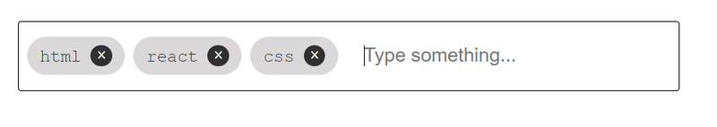

In this tutorial, we are going to create a tags input component with autocomplete using React JS
without using any external packages. This guide demonstrates how to manage state, dynamically filter
suggestions, and efficiently handle user interactions such as adding and removing tags. Perfect for
developers looking to implement tag inputs with minimal dependencies and flexible design.

## Project Setup

We will use [Vite](https://vitejs.dev) for a fast and simple project build. Vite offers instant
module hot reloading, improved performance, and quicker build times compared to traditional
bundlers.

<span className='code-cmd'>
  npm create vite@latest react-tags-autocomplete -- --template react-ts
</span>

then

<span className='code-cmd'>cd react-tags-autocomplete</span>

<span className='code-cmd'>npm install</span>

<span className='code-cmd'>npm run dev</span>

### Clear the application

Remove file **App.css**, clean **App.tsx** (remove everything).

**App.tsx**

```js
function App() {
  return <></>;
}

export default App;
```

Let's create components folder inside the src folder.

## Create a tags input component

Create a **TextInput.tsx** file in the components folder

```ts
import { ChangeEvent, useState } from 'react';

const TextInput = () => {
  const [tags, setTags] = useState<string[]>([]);
  const handleKeydown = (e: ChangeEvent<HTMLInputElement> & KeyboardEvent) => {
    if (e.key !== 'Enter') {
      return;
    }
    const value = e.target.value;
    if (!value.trim()) {
      return;
    }
    setTags([...tags, value]);
    e.target.value = '';
  };

  const removeTag = (idx) => {
    setTags(tags.filter((el, i) => i !== idx));
  };
  return (
    <div className='text-input-container'>
      {tags.map((tag, i) => {
        return (
          <div className='tag-item' key={tag + i}>
            <span className='text'>{tag}</span>
            <span className='close' onClick={() => removeTag(i)}>
              &times;
            </span>
          </div>
        );
      })}
      <input
        type='text'
        placeholder='Type something...'
        className='text-input'
        onKeyDown={handleKeydown}
      />
    </div>
  );
};
export default TextInput;
```

### Explanation

- The input field captures user text, filtering the predefined suggestions (suggestions array).
- The filtered suggestions are shown as a dropdown. Clicking on a suggestion or pressing Enter adds
  it to the list of tags.
- The added tags are displayed with an option to remove them.

### Styling the Component

Remove everything from **index.css** file, and put the next styles

```css
* {
  margin: 0;
  padding: 0;
}

html,
body {
  height: 100%;
  width: 100%;
}

body {
  display: flex;
  justify-content: center;
  align-items: center;
  font-family: 'Courier New', monospace;
}

label {
  margin-bottom: 4px;
  display: block;
  font-size: 1.125rem;
  line-height: 1.75rem;
}

#root {
  display: flex;
  flex-direction: column;
  justify-content: center;
  max-width: 540px;
  margin-left: auto;
  margin-right: auto;
  padding-left: 1rem;
  padding-right: 1rem;
  margin-top: calc(1.5rem);
  margin-bottom: calc(1.5rem);
  color: #333333;
}

.text-input__wrapper {
  border: 1px solid black;
  padding: 0.5rem;
  border-radius: 3px;
  width: min(80vw, 600px);
  margin-top: 1em;
  display: flex;
  align-items: center;
  flex-wrap: wrap;
  gap: 0.5em;
}
.tag-item {
  background-color: rgb(218, 216, 216);
  display: inline-block;
  padding: 0.5em 0.75em;
  border-radius: 20px;
}
.tag-item .close {
  width: 20px;
  height: 20px;
  background-color: rgb(48, 48, 48);
  color: #fff;
  border-radius: 50%;
  display: inline-flex;
  justify-content: center;
  align-items: center;
  margin-left: 0.5em;
  font-size: 18px;
}
.text-input {
  padding-left: 1rem;
  padding-right: 1rem;
  padding-top: 0.625rem;
  padding-bottom: 0.625rem;
  font-size: 1.125rem;
  line-height: 1.75rem;
  background-color: #ffffff;
  position: relative;
  flex-grow: 1;
  outline: none;
  border: none;
  outline: none;
}
```

Run

<span className='code-cmd'>npm run dev</span>



We got an almost finished component for adding tags, but it has one small bug. Right now, we can add
duplicate tags in the input. To fix this, we need to modify the **handleKeydown()** function.

```ts
const handleKeydown = (e: ChangeEvent<HTMLInputElement> & KeyboardEvent) => {
  if (e.key !== 'Enter') {
    return;
  }
  const value = e.target.value;
  if (!value.trim()) {
    return;
  }

  setTags((tags: string[]) => {
    if (tags.some(tag => tag.toLowerCase() === value.toLowerCase())) {
      return [...tags];
    } else {
      return [...tags, value];
    }
  });
  e.target.value = '';
};
```

Now only unique tags will be added.

## Create Autocomplete Component

Create **AutoComplete.tsx** file inside the components directory.

```ts
import React, { ChangeEvent, useState } from 'react';

type AutoCompleteProps = {
  possibleValues: string[];
  handleKeydown: () => void;
  setTags: (values: string[]) => void;
};

function Autocomplete({ possibleValues, handleKeydown, setTags }: AutoCompleteProps) {
  const [inputValue, setInputValue] = useState('');
  const [suggestions, setSuggestions] = useState<string[]>([]);

  const handleInputChange = (event: ChangeEvent<HTMLInputElement>) => {
    const value = event.target.value;

    setInputValue(value);

    if (value.length > 0) {
      const filteredSuggestions = possibleValues.filter((suggestion) =>
        suggestion.toLowerCase().includes(value.toLowerCase()),
      );
      setSuggestions(filteredSuggestions);
    } else {
      setSuggestions([]);
    }
  };

  const handleSuggestionClick = (value: string) => {
    setTags((tags: string[]) => {
      if (tags.some((tag) => tag.toLowerCase() === value.toLowerCase())) {
        return [...tags];
      } else {
        return [...tags, value];
      }
    });

    setSuggestions([]);
    setInputValue('');
  };

  const onKeyDown = (e: ChangeEvent<HTMLInputElement> & KeyboardEvent) => {
    handleKeydown(e);
    if (e.key === 'Enter') {
      setInputValue('');
      setSuggestions([]);
    }
  };

  return (
    <>
      <input
        type='text'
        value={inputValue}
        onChange={handleInputChange}
        aria-autocomplete='list'
        aria-controls='autocomplete-list'
        onKeyDown={onKeyDown}
        className='text-input'
        autoFocus
      />
      <div className='autocomplete-wrapper'>
        {suggestions.length > 0 && (
          <ul id='autocomplete-list' className='suggestions-list' role='listbox'>
            {suggestions.map((suggestion, index) => (
              <li key={index} onClick={() => handleSuggestionClick(suggestion)} role='option'>
                {suggestion}
              </li>
            ))}
          </ul>
        )}
      </div>
    </>
  );
}

export default Autocomplete;
```

### Key Features:

1. **Autocomplete Suggestions:**

- The component provides a list of suggestions based on the user's input. When the user types into
  the input field, it filters through possible values and displays matching suggestions.

2. **Duplicate Prevention:**

- The component ensures that duplicate tags are not added.

3. **Keyboard Navigation:**

- The **onKeyDown** function handles key events, particularly preventing unwanted behavior when the
  **Enter** key is pressed.

### Breakdown of the Code:

1. **State Management:**

- **inputValue**: Keeps track of what the user is typing in the input field.
- **suggestions**: An array of filtered possible values that match the user's input.

```ts
const [inputValue, setInputValue] = useState('');
const [suggestions, setSuggestions] = useState<string[]>([]);
```

2. **Handling Input Changes:**

- **handleInputChange**: Updates **inputValue** based on user input and generates suggestions by
  filtering possibleValues.
- **possibleValues** is an array of strings passed as props. The filter checks if the input matches
  any of the **possibleValues** (case-insensitive).

```ts
const handleInputChange = (event: ChangeEvent<HTMLInputElement>) => {
  const value = event.target.value;
  setInputValue(value);

  if (value.length > 0) {
    const filteredSuggestions = possibleValues.filter(suggestion =>
      suggestion.toLowerCase().includes(value.toLowerCase())
    );
    setSuggestions(filteredSuggestions);
  } else {
    setSuggestions([]);
  }
};
```

3. **Handling Suggestion Clicks:**

- When a user clicks on a suggestion, the **handleSuggestionClick** function is triggered.
- This function adds the selected suggestion to the **tags** (managed by the parent component via
  **setTags**) if it's not already present.
- After adding the tag, it clears the **suggestions** and resets **inputValue**.

```ts
const handleSuggestionClick = (value: string) => {
  setTags((tags: string[]) => {
    if (tags.some(tag => tag.toLowerCase() === value.toLowerCase())) {
      return [...tags]; // No duplicate tags
    } else {
      return [...tags, value]; // Add the new tag
    }
  });

  setSuggestions([]);
  setInputValue('');
};
```

4. **Handling Keyboard Input:**

- **onKeyDown**: Handles keyboard events, especially when the Enter key is pressed.
- It clears both the input and suggestions when **Enter** is pressed.
- It also invokes **handleKeydown** passed from the parent component for further customization or
  handling.

```ts
const onKeyDown = (e: ChangeEvent<HTMLInputElement> & KeyboardEvent) => {
  handleKeydown(e);
  if (e.key === 'Enter') {
    setInputValue('');
    setSuggestions([]);
  }
};
```

5. **Rendering:**

- The component consists of an input field and a suggestions list.
- The input field updates **inputValue** and triggers suggestions filtering, while the suggestions
  list shows filtered options.
- When there are matching suggestions, the component renders a list of options. Clicking an option
  adds it to the tags.

```js
return (
  <>
    <input
      type='text'
      value={inputValue}
      onChange={handleInputChange}
      aria-autocomplete='list'
      aria-controls='autocomplete-list'
      onKeyDown={onKeyDown}
      className='text-input'
      autoFocus
    />
    <div className='autocomplete-wrapper'>
      {suggestions.length > 0 && (
        <ul id='autocomplete-list' className='suggestions-list' role='listbox'>
          {suggestions.map((suggestion, index) => (
            <li
              key={index}
              onClick={() => handleSuggestionClick(suggestion)}
              role='option'
            >
              {suggestion}
            </li>
          ))}
        </ul>
      )}
    </div>
  </>
);
```

**Props:**

- **possibleValues**: Array of strings that act as potential autocomplete suggestions.
- **handleKeydown**: A function passed from the parent component to handle keyboard events.
- **setTags**: A function that updates the list of tags when a suggestion is selected.

We just need to replace the input with our custom **AutoComplete** component and pass all the
necessary props to it.

```js
<Autocomplete
  possibleValues={['css', 'html', 'react']}
  handleKeydown={handleKeydown}
  setTags={setTags}
/>
```

Add some styles to **index.css**

```css
.autocomplete-wrapper {
  width: 100%;
}

.suggestions-list {
  top: 100%;
  border: 1px solid #ccc;
  background: white;
  list-style: none;
  padding: 0;
  margin: 0;
  border-radius: 3px;
}

.suggestions-list li {
  padding: 8px;

  cursor: pointer;
}

.suggestions-list li:hover {
  background-color: #e9e9e9;
}
```

Now, let's test it:

<span className='code-cmd'>npm run dev</span>

There’s only one issue left: we lose focus after adding a tag through a suggestion. To fix this, we
need to pass a **ref** to the **input** and manually set the focus.

### Referencing Values with Refs

Define a ref at the top of **AutoComplete** complement:

```js
const inputRef = useRef(null);
```

then provide it to the input tag

```js
ref = { inputRef };
```

Now, at the very end of the **handleSuggestionClick()** and **onKeyDown()** functions (after all the
code has been executed), add the line:

```js
inputRef.current.focus();
```

## Conclusion:

This component allows users to type and select from filtered suggestions. It prevents duplicate
entries, handles keyboard events, and manages the internal state of user input and suggestions
efficiently.

You can also view it on GitHub Gist:
[AutoComplete.tsx](https://gist.github.com/jsdevspace/37634e7690e43e5af7d9862d20563ee7) |
[TextInput.tsx ](https://gist.github.com/jsdevspace/d4ddbe59c1db6f3a678de2469209cd8d)
